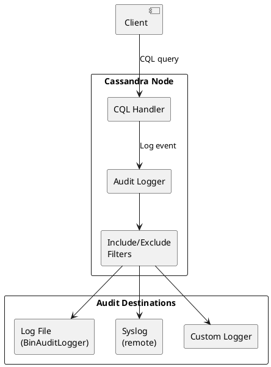

# Audit Logging

Audit logging provides a detailed record of database activity for security monitoring, compliance, and forensic analysis. Introduced in Cassandra 4.0, the audit logging feature captures authentication attempts, authorization decisions, and CQL operations.

---

## Overview

### Version Requirements

| Feature | Minimum Version |
|---------|-----------------|
| Basic audit logging | 4.0 |
| Full query logging (FQL) | 4.0 |
| Enhanced audit logging | 4.1+ |

!!! warning "Pre-4.0 Clusters"
    Cassandra versions prior to 4.0 do not have built-in audit logging. Third-party solutions or custom implementations using triggers/CDC are required for audit capabilities in older versions.

### What Gets Logged

Audit logging can capture:

| Category | Events | Use Case |
|----------|--------|----------|
| Authentication | Login attempts, failures | Security monitoring |
| Authorization | Permission checks, denials | Access control auditing |
| DCL | GRANT, REVOKE, role changes | Privilege management |
| DDL | CREATE, ALTER, DROP schema | Change management |
| DML | SELECT, INSERT, UPDATE, DELETE | Data access auditing |
| Query | All CQL statements | Compliance, debugging |

### Audit Flow Architecture



---

## Configuration

### Enabling Audit Logging

Configure audit logging in `cassandra.yaml`:

```yaml
# cassandra.yaml

# Enable audit logging
audit_logging_options:
    enabled: true
    logger:
      - class_name: BinAuditLogger

    # Categories to audit
    included_categories: AUTH,DCL,DDL,DML

    # Keyspaces to audit (empty = all)
    included_keyspaces:

    # Keyspaces to exclude from auditing
    excluded_keyspaces: system,system_schema,system_auth,system_distributed,system_traces,system_views

    # Users to audit (empty = all)
    included_users:

    # Users to exclude from auditing
    excluded_users:

    # Tables to audit (empty = all)
    included_tables:

    # Tables to exclude
    excluded_tables:
```

### Audit Categories

| Category | Description | Events Captured |
|----------|-------------|-----------------|
| `AUTH` | Authentication events | Login success/failure, authentication errors |
| `DCL` | Data Control Language | GRANT, REVOKE, CREATE/ALTER/DROP ROLE |
| `DDL` | Data Definition Language | CREATE/ALTER/DROP KEYSPACE/TABLE/INDEX/VIEW/TYPE/FUNCTION |
| `DML` | Data Manipulation Language | SELECT, INSERT, UPDATE, DELETE, BATCH |
| `QUERY` | All queries | Every CQL statement (high volume) |
| `PREPARE` | Prepared statements | PREPARE operations |
| `ERROR` | Query errors | Failed queries, syntax errors |

### Production Configuration Example

```yaml
audit_logging_options:
    enabled: true
    logger:
      - class_name: BinAuditLogger
        parameters:
          - log_dir: /var/log/cassandra/audit
          - roll_cycle: HOURLY
          - block: true
          - max_queue_weight: 268435456  # 256 MB
          - max_log_size: 17179869184    # 16 GB
          - archive_command: /usr/local/bin/archive-audit-logs.sh %path

    # Recommended: Don't log DML for high-throughput tables
    included_categories: AUTH,DCL,DDL

    # Exclude system keyspaces
    excluded_keyspaces: system,system_schema,system_auth,system_distributed,system_traces,system_views,system_virtual_schema

    # Exclude service accounts from routine logging
    excluded_users: monitoring_user,backup_user
```

---

## Audit Loggers

### BinAuditLogger (Default)

Binary format logger optimized for performance:

```yaml
audit_logging_options:
    enabled: true
    logger:
      - class_name: BinAuditLogger
        parameters:
          - log_dir: /var/log/cassandra/audit
          - roll_cycle: HOURLY
          - block: true
          - max_queue_weight: 268435456
          - max_log_size: 17179869184
```

**Parameters:**

| Parameter | Default | Description |
|-----------|---------|-------------|
| `log_dir` | `${CASSANDRA_LOG_DIR}/audit` | Directory for audit log files |
| `roll_cycle` | `HOURLY` | Log rotation: MINUTELY, HOURLY, DAILY |
| `block` | `true` | Block when queue full (vs drop events) |
| `max_queue_weight` | `256 MB` | Maximum memory for pending events |
| `max_log_size` | `16 GB` | Maximum total log size before archiving |
| `archive_command` | none | Command to run when rotating logs |

**Reading Binary Logs:**

```bash
# Use auditlogviewer tool to read binary logs
auditlogviewer /var/log/cassandra/audit/

# Filter by time range
auditlogviewer /var/log/cassandra/audit/ --from "2024-01-15 00:00:00" --to "2024-01-15 23:59:59"

# Output to file
auditlogviewer /var/log/cassandra/audit/ > audit_readable.log
```

### FileAuditLogger

Human-readable text format (higher overhead):

```yaml
audit_logging_options:
    enabled: true
    logger:
      - class_name: FileAuditLogger
```

Logs to standard Cassandra log file in readable format:

```
INFO  [Native-Transport-Requests-1] AuditLog.java:89 - user:alice|host:192.168.1.100:9042|source:192.168.1.50|port:52431|timestamp:1705315800000|type:SELECT|category:DML|keyspace:production|table:users|operation:SELECT * FROM production.users WHERE user_id = ?
```

### Custom Audit Logger

Implement custom logging for integration with external systems:

```java
public class SyslogAuditLogger implements IAuditLogger {

    @Override
    public void log(AuditLogEntry entry) {
        // Send to syslog, SIEM, or external system
        String message = formatEntry(entry);
        syslogClient.send(message);
    }

    @Override
    public void stop() {
        syslogClient.close();
    }

    @Override
    public boolean isEnabled() {
        return true;
    }
}
```

```yaml
audit_logging_options:
    enabled: true
    logger:
      - class_name: com.example.SyslogAuditLogger
        parameters:
          - syslog_host: syslog.example.com
          - syslog_port: 514
          - facility: LOCAL0
```

---

## Filtering

### Keyspace Filtering

```yaml
audit_logging_options:
    enabled: true

    # Only audit specific keyspaces
    included_keyspaces: production,sensitive_data

    # Or exclude specific keyspaces (if included_keyspaces is empty)
    excluded_keyspaces: system,system_schema,development,test
```

### User Filtering

```yaml
audit_logging_options:
    enabled: true

    # Only audit specific users
    included_users: admin_alice,admin_bob,app_production

    # Or exclude specific users (if included_users is empty)
    excluded_users: monitoring_service,healthcheck_user
```

### Table Filtering

```yaml
audit_logging_options:
    enabled: true

    # Only audit specific tables (keyspace.table format)
    included_tables: production.payments,production.users,sensitive.credentials

    # Or exclude specific tables
    excluded_tables: production.logs,production.metrics
```

### Category-Based Filtering

```yaml
audit_logging_options:
    enabled: true

    # Compliance minimum: Auth + privilege changes
    included_categories: AUTH,DCL

    # Security monitoring: Add schema changes
    included_categories: AUTH,DCL,DDL

    # Full audit (high volume)
    included_categories: AUTH,DCL,DDL,DML,QUERY
```

---

## Audit Log Format

### Log Entry Fields

Each audit log entry contains:

| Field | Description | Example |
|-------|-------------|---------|
| `user` | Authenticated user | `alice` |
| `host` | Coordinator node | `192.168.1.100:9042` |
| `source` | Client IP address | `192.168.1.50` |
| `port` | Client port | `52431` |
| `timestamp` | Event time (epoch ms) | `1705315800000` |
| `type` | Operation type | `SELECT`, `INSERT`, `CREATE_TABLE` |
| `category` | Event category | `DML`, `DDL`, `AUTH` |
| `keyspace` | Target keyspace | `production` |
| `table` | Target table (if applicable) | `users` |
| `operation` | Full CQL statement | `SELECT * FROM users WHERE id = ?` |
| `batch_id` | Batch identifier (if batch) | `abc123-def456` |

### Sample Log Entries

**Authentication Success:**
```
user:alice|host:192.168.1.100:9042|source:192.168.1.50|port:52431|timestamp:1705315800000|type:LOGIN_SUCCESS|category:AUTH
```

**Authentication Failure:**
```
user:unknown|host:192.168.1.100:9042|source:10.0.0.99|port:54321|timestamp:1705315801000|type:LOGIN_ERROR|category:AUTH|operation:Provided username unknown and/or password are incorrect
```

**DDL Operation:**
```
user:schema_admin|host:192.168.1.100:9042|source:192.168.1.60|port:52500|timestamp:1705315802000|type:CREATE_TABLE|category:DDL|keyspace:production|operation:CREATE TABLE production.new_table (id UUID PRIMARY KEY, data TEXT)
```

**DML Operation:**
```
user:app_service|host:192.168.1.100:9042|source:192.168.1.70|port:52600|timestamp:1705315803000|type:SELECT|category:DML|keyspace:production|table:users|operation:SELECT * FROM production.users WHERE user_id = ?
```

**Permission Change:**
```
user:security_admin|host:192.168.1.100:9042|source:192.168.1.80|port:52700|timestamp:1705315804000|type:GRANT|category:DCL|operation:GRANT SELECT ON KEYSPACE production TO analyst_role
```

---

## Full Query Logging (FQL)

Full Query Logging captures complete query details for debugging and replay:

### Enabling FQL

```bash
# Enable via nodetool
nodetool enablefullquerylog --path /var/log/cassandra/fql

# With options
nodetool enablefullquerylog \
    --path /var/log/cassandra/fql \
    --roll-cycle HOURLY \
    --max-log-size 1073741824 \
    --blocking true
```

### FQL vs Audit Logging

| Aspect | Audit Logging | Full Query Logging |
|--------|---------------|-------------------|
| Purpose | Security, compliance | Debugging, replay |
| Format | Structured events | Binary query log |
| Filtering | Category, user, keyspace | None (all queries) |
| Performance | Lower overhead | Higher overhead |
| Tooling | auditlogviewer | fqltool |
| Use case | Long-term retention | Short-term analysis |

### Reading FQL

```bash
# Dump FQL to readable format
fqltool dump /var/log/cassandra/fql/

# Replay queries against another cluster
fqltool replay \
    --keyspace production \
    --target 192.168.2.100 \
    /var/log/cassandra/fql/

# Compare query results between clusters
fqltool compare \
    --keyspace production \
    --target1 192.168.1.100 \
    --target2 192.168.2.100 \
    /var/log/cassandra/fql/
```

---

## Runtime Management

### Enable/Disable Audit Logging

```bash
# Enable audit logging at runtime
nodetool enableauditlog

# With specific categories
nodetool enableauditlog --included-categories AUTH,DCL,DDL

# With keyspace filter
nodetool enableauditlog --included-keyspaces production,sensitive

# Disable audit logging
nodetool disableauditlog
```

### Check Audit Logging Status

```bash
# View current audit logging status
nodetool getauditlog
```

### Rotate Logs

```bash
# Force log rotation (for custom archival)
nodetool resetfullquerylog
```

---

## SIEM Integration

### Custom Syslog Integration

```yaml
# cassandra.yaml - custom logger
audit_logging_options:
    enabled: true
    logger:
      - class_name: com.example.SyslogAuditLogger
        parameters:
          - syslog_host: siem.example.com
          - syslog_port: 514
          - syslog_protocol: TCP
          - syslog_facility: AUTH
```

---

## Compliance Considerations

### PCI DSS Requirements

| Requirement | Implementation |
|-------------|----------------|
| 10.1 | Enable audit logging for all authentication |
| 10.2.1 | Log all individual user access to cardholder data |
| 10.2.2 | Log all actions by anyone with admin privileges |
| 10.2.4 | Log invalid access attempts |
| 10.2.5 | Log changes to authentication mechanisms |
| 10.3 | Include user ID, event type, date/time, success/fail, origin, resource |
| 10.5 | Secure audit logs (separate storage, access controls) |
| 10.7 | Retain logs for at least one year |

### Recommended PCI DSS Configuration

```yaml
audit_logging_options:
    enabled: true
    logger:
      - class_name: BinAuditLogger
        parameters:
          - log_dir: /secure/audit/cassandra
          - roll_cycle: DAILY
          - max_log_size: 107374182400  # 100 GB
          - archive_command: /usr/local/bin/secure-archive.sh %path

    included_categories: AUTH,DCL,DDL,DML
    excluded_keyspaces: system,system_schema,system_distributed,system_traces
    # Log all users - don't exclude any for PCI
```

### SOC 2 Requirements

| Control | Implementation |
|---------|----------------|
| CC6.1 | Log all logical access |
| CC6.2 | Log authentication events |
| CC7.2 | Monitor for unauthorized access |
| CC7.3 | Log configuration changes |

### HIPAA Audit Controls

| Requirement | Implementation |
|-------------|----------------|
| Access logging | Enable DML auditing for PHI keyspaces |
| User identification | Log authenticated user for all queries |
| Integrity controls | Use secure log storage with checksums |
| Retention | Retain logs for 6 years minimum |

---

## Performance Impact

### Overhead Estimates

| Configuration | Performance Impact |
|---------------|-------------------|
| AUTH only | < 1% |
| AUTH + DCL + DDL | 1-2% |
| AUTH + DCL + DDL + DML | 5-15% |
| All categories (QUERY) | 15-30% |

### Minimizing Impact

1. **Filter aggressively**: Only audit what compliance requires
2. **Exclude high-volume tables**: Metrics, logs, time-series
3. **Exclude service accounts**: Monitoring, health checks
4. **Use async logging**: Set `block: false` (may lose events)
5. **Adequate disk I/O**: Use fast storage for audit logs
6. **Separate disk**: Don't compete with data I/O

```yaml
# High-performance configuration
audit_logging_options:
    enabled: true
    logger:
      - class_name: BinAuditLogger
        parameters:
          - log_dir: /fast-ssd/audit  # Dedicated fast storage
          - block: false              # Don't block on full queue
          - max_queue_weight: 536870912  # 512 MB queue

    included_categories: AUTH,DCL,DDL  # No DML
    excluded_keyspaces: system,system_schema,metrics,logs
    excluded_users: monitoring,healthcheck
```

---

## Log Management

### Retention Policy

```bash
#!/bin/bash
# /usr/local/bin/archive-audit-logs.sh

LOG_PATH=$1
ARCHIVE_DIR=/archive/cassandra-audit
RETENTION_DAYS=365

# Compress and archive
gzip -c "$LOG_PATH" > "$ARCHIVE_DIR/$(basename $LOG_PATH).gz"

# Remove original
rm "$LOG_PATH"

# Clean old archives
find "$ARCHIVE_DIR" -name "*.gz" -mtime +$RETENTION_DAYS -delete
```

### Log Rotation with logrotate

```
# /etc/logrotate.d/cassandra-audit
/var/log/cassandra/audit/*.log {
    daily
    rotate 30
    compress
    delaycompress
    missingok
    notifempty
    create 640 cassandra cassandra
    postrotate
        /usr/bin/nodetool resetfullquerylog 2>/dev/null || true
    endscript
}
```

---

## Troubleshooting

### Audit Logs Not Writing

```bash
# Check if audit logging is enabled
nodetool getauditlog

# Verify directory permissions
ls -la /var/log/cassandra/audit/

# Check for errors in system.log
grep -i audit /var/log/cassandra/system.log
```

### High Disk Usage

```bash
# Check audit log size
du -sh /var/log/cassandra/audit/

# Verify archive command is working
cat /var/log/cassandra/system.log | grep archive

# Force cleanup if needed
nodetool disableauditlog
rm -rf /var/log/cassandra/audit/*
nodetool enableauditlog
```

### Performance Degradation

```yaml
# Reduce audit scope
audit_logging_options:
    included_categories: AUTH,DCL  # Remove DDL, DML

    # Or exclude high-volume sources
    excluded_keyspaces: metrics,logs,events
    excluded_users: etl_service,batch_processor
```

---

## Related Documentation

- **[Authorization](../authorization/index.md)** - Role-based access control
- **[Authentication](../authentication/index.md)** - User authentication
- **[Security Overview](../index.md)** - Complete security guide
