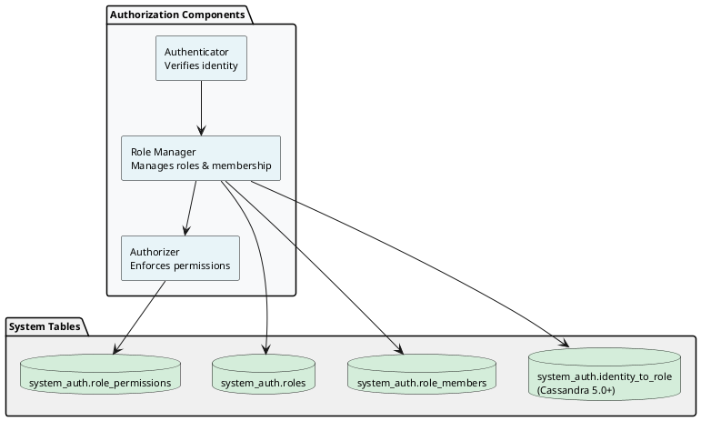
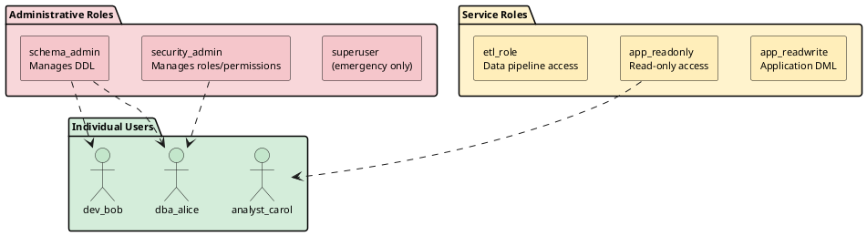
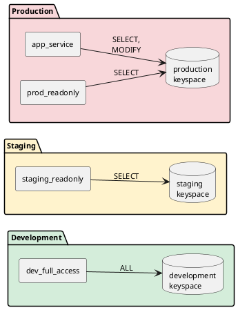

# Cassandra Authorization

Role-based access control (RBAC) in Cassandra enables fine-grained permission management across clusters. This guide covers practical strategies for designing role hierarchies, implementing separation of duties, and integrating with external credential management systems.

For CQL syntax reference, see **[Security Commands](../../cql/security/index.md)**.

---

## Authorization Architecture

Cassandra's authorization system consists of three components:



### Enabling Authorization

```yaml
# cassandra.yaml

# Enable internal authentication
authenticator: PasswordAuthenticator

# Enable role-based authorization
authorizer: CassandraAuthorizer

# Enable role management
role_manager: CassandraRoleManager

# Cache settings for performance
roles_validity_in_ms: 2000
permissions_validity_in_ms: 2000
credentials_validity_in_ms: 2000
```

!!! warning "Enable Authentication First"
    Authorization without authentication is ineffective. Always configure `authenticator` before `authorizer`. The default `AllowAllAuthenticator` bypasses all security.

### Permission Types

| Permission | Applies To | Operations Allowed |
|------------|------------|-------------------|
| `ALL` | Any resource | All operations |
| `ALTER` | Keyspace, Table, Role | Schema modifications |
| `AUTHORIZE` | Any resource | GRANT/REVOKE permissions |
| `CREATE` | Keyspace, Table, Index, Function, Role | Create new resources |
| `DESCRIBE` | Role | View role definitions |
| `DROP` | Keyspace, Table, Index, Function, Role | Remove resources |
| `EXECUTE` | Function, Aggregate | Execute UDFs/UDAs |
| `MODIFY` | Keyspace, Table | INSERT, UPDATE, DELETE |
| `SELECT` | Keyspace, Table, MBean | Read data |

### Resource Hierarchy

Permissions can be granted at different granularity levels:

```
ALL KEYSPACES
    └── KEYSPACE my_keyspace
            └── TABLE my_keyspace.my_table

ALL ROLES
    └── ROLE specific_role

ALL FUNCTIONS IN KEYSPACE my_keyspace
    └── FUNCTION my_keyspace.my_function(type1, type2)

ALL MBEANS
    └── MBEAN 'org.apache.cassandra.db:*'
```

---

## Identity Management (Cassandra 5.0+)

Identity management enables certificate-based authentication by mapping certificate identities to Cassandra roles. When using `MutualTlsAuthenticator`, the identity extracted from a client certificate must be associated with a role before authentication succeeds.

### Concepts

**Identity**: A unique string extracted from a client certificate by a certificate validator. The identity format depends on the validator implementation:

- **SpiffeCertificateValidator** (built-in): Extracts SPIFFE URIs from the Subject Alternative Name (SAN) extension
- **Custom validators**: Can extract identity from CN, organization, or any certificate fields by implementing the `MutualTlsCertificateValidator` interface

**Identity-to-Role Mapping**: A relationship stored in the `system_auth.identity_to_role` table that associates a certificate identity with a Cassandra role.

**Authentication Flow**:

1. Client presents certificate during TLS handshake
2. Certificate validator extracts identity from certificate
3. Cassandra looks up the identity in `system_auth.identity_to_role`
4. If a matching role exists and has `LOGIN = true`, authentication succeeds
5. The authenticated session operates with that role's permissions

### ADD IDENTITY

Associates a certificate identity with an existing role.

**Syntax:**

```
ADD IDENTITY [ IF NOT EXISTS ] '<identity>' TO ROLE '<role_name>'
```

**Examples:**

```sql
-- Create role for the service
CREATE ROLE payment_service WITH LOGIN = true;

-- Map certificate identity to role
ADD IDENTITY 'spiffe://testdomain.com/service/payment' TO ROLE 'payment_service';

-- Use IF NOT EXISTS to avoid errors when identity already exists
ADD IDENTITY IF NOT EXISTS 'spiffe://testdomain.com/service/payment' TO ROLE 'payment_service';
```

**Requirements:**

- The target role must exist
- The identity must not already be mapped to another role (unless using `IF NOT EXISTS`)
- The executing user must have privileges to manage roles

**Behavior:**

- Without `IF NOT EXISTS`, adding an identity that already exists raises an error
- With `IF NOT EXISTS`, the statement succeeds silently if the identity exists
- Each identity can map to only one role

### DROP IDENTITY

Removes an identity-to-role mapping.

**Syntax:**

```
DROP IDENTITY [ IF EXISTS ] '<identity>'
```

**Examples:**

```sql
-- Remove identity mapping
DROP IDENTITY 'spiffe://testdomain.com/service/payment';

-- Use IF EXISTS to avoid errors when identity does not exist
DROP IDENTITY IF EXISTS 'spiffe://testdomain.com/service/payment';
```

**Behavior:**

- Without `IF EXISTS`, dropping a non-existent identity raises an error
- With `IF EXISTS`, the statement succeeds silently if the identity does not exist
- Dropping an identity does not affect the associated role

### Querying Identities

```sql
-- View all identity mappings
SELECT * FROM system_auth.identity_to_role;

-- Find role for a specific identity
SELECT role FROM system_auth.identity_to_role
WHERE identity = 'spiffe://testdomain.com/service/payment';
```

### Multiple Identities per Role

A single role can have multiple identities mapped to it, enabling certificate rotation or allowing multiple services to share permissions:

```sql
-- Create shared service role
CREATE ROLE order_processing WITH LOGIN = true;
GRANT SELECT, MODIFY ON KEYSPACE orders TO order_processing;

-- Map multiple service identities to same role
ADD IDENTITY 'spiffe://testdomain.com/service/order-api' TO ROLE 'order_processing';
ADD IDENTITY 'spiffe://testdomain.com/service/order-worker' TO ROLE 'order_processing';
```

### Certificate Rotation

Identity mappings enable zero-downtime certificate rotation:

```sql
-- Add new certificate identity before rotation
ADD IDENTITY 'spiffe://testdomain.com/service/payment-2025' TO ROLE 'payment_service';

-- After rotation is complete, remove old identity
DROP IDENTITY 'spiffe://testdomain.com/service/payment-2024';
```

### Role Deletion

When a role is dropped, all associated identity mappings are automatically removed:

```sql
-- This removes the role AND all identity mappings to it
DROP ROLE payment_service;
```

### Related Configuration

Identity management requires `MutualTlsAuthenticator` to be configured. See **[Mutual TLS Authentication](../authentication/index.md#mutual-tls-authentication)** for setup details.

---

## Role Design Principles

### Separation of Duties

A well-designed role hierarchy separates concerns:



### Principle of Least Privilege

Grant only the minimum permissions required:

| Role Type | Should Have | Should NOT Have |
|-----------|-------------|-----------------|
| Application | SELECT, MODIFY on specific tables | ALTER, DROP, AUTHORIZE |
| Developer | SELECT on dev keyspaces | Access to production data |
| DBA | Schema management | AUTHORIZE (separate role) |
| Security Admin | AUTHORIZE, role management | Schema changes |
| Analyst | SELECT on analytics tables | MODIFY, production access |

---

## Role Implementation Examples

### 1. Superuser Role

The default `cassandra` superuser should be disabled after creating a replacement:

```sql
-- Step 1: Create new superuser with strong credentials
CREATE ROLE dba_superuser WITH PASSWORD = 'ComplexP@ssw0rd!2024'
    AND SUPERUSER = true
    AND LOGIN = true;

-- Step 2: Verify new superuser works
-- (Login as dba_superuser and test operations)

-- Step 3: Disable default cassandra user
ALTER ROLE cassandra WITH PASSWORD = 'RandomComplexString!@#$%'
    AND SUPERUSER = false
    AND LOGIN = false;
```

!!! danger "Superuser Best Practices"
    - Never use the default `cassandra/cassandra` credentials in production
    - Limit superuser access to emergency recovery scenarios
    - Store superuser credentials in a secure vault with break-glass procedures
    - Audit all superuser access
    - Consider disabling superuser login entirely after initial setup

### 2. Security Administration Role

Manages roles and permissions without data access:

```sql
-- Create security administration role
CREATE ROLE security_admin WITH PASSWORD = 'SecureP@ss!2024'
    AND LOGIN = true
    AND SUPERUSER = false;

-- Grant role management permissions
GRANT CREATE ON ALL ROLES TO security_admin;
GRANT ALTER ON ALL ROLES TO security_admin;
GRANT DROP ON ALL ROLES TO security_admin;
GRANT DESCRIBE ON ALL ROLES TO security_admin;
GRANT AUTHORIZE ON ALL KEYSPACES TO security_admin;
GRANT AUTHORIZE ON ALL ROLES TO security_admin;

-- Security admin can create and manage roles but cannot:
-- - Access any data (no SELECT/MODIFY)
-- - Change schemas (no ALTER on tables)
-- - Execute functions (no EXECUTE)
```

**Security admin responsibilities:**

- Creating and removing user accounts
- Assigning roles to users
- Granting and revoking permissions
- Auditing permission assignments
- Password resets

### 3. Schema Administration Role

Manages database schema without security or data access:

```sql
-- Create schema administration role
CREATE ROLE schema_admin WITH PASSWORD = 'SchemaP@ss!2024'
    AND LOGIN = true
    AND SUPERUSER = false;

-- Grant DDL permissions
GRANT CREATE ON ALL KEYSPACES TO schema_admin;
GRANT ALTER ON ALL KEYSPACES TO schema_admin;
GRANT DROP ON ALL KEYSPACES TO schema_admin;

-- Grant function management
GRANT CREATE ON ALL FUNCTIONS IN KEYSPACE production TO schema_admin;
GRANT ALTER ON ALL FUNCTIONS IN KEYSPACE production TO schema_admin;
GRANT DROP ON ALL FUNCTIONS IN KEYSPACE production TO schema_admin;
GRANT EXECUTE ON ALL FUNCTIONS IN KEYSPACE production TO schema_admin;

-- Schema admin can:
-- - Create/alter/drop keyspaces and tables
-- - Create/alter/drop indexes and materialized views
-- - Create/alter/drop UDTs, UDFs, and UDAs
--
-- Schema admin cannot:
-- - Read or write data
-- - Manage roles or permissions
-- - Grant permissions to others
```

**Schema admin responsibilities:**

- Deploying schema migrations
- Creating indexes and materialized views
- Managing user-defined types and functions
- Schema optimization and maintenance

### 4. Application Service Roles

Service accounts for applications with scoped access:

```sql
-- Create base application role (no login)
CREATE ROLE app_base WITH LOGIN = false;

-- Production read-write application role
CREATE ROLE app_production_rw WITH PASSWORD = 'AppProdRW!2024'
    AND LOGIN = true;
GRANT app_base TO app_production_rw;
GRANT SELECT ON KEYSPACE production TO app_production_rw;
GRANT MODIFY ON KEYSPACE production TO app_production_rw;

-- Production read-only role (for read replicas)
CREATE ROLE app_production_ro WITH PASSWORD = 'AppProdRO!2024'
    AND LOGIN = true;
GRANT app_base TO app_production_ro;
GRANT SELECT ON KEYSPACE production TO app_production_ro;

-- Restrict to specific tables if needed
CREATE ROLE payment_service WITH PASSWORD = 'PaymentSvc!2024'
    AND LOGIN = true;
GRANT SELECT ON TABLE production.payments TO payment_service;
GRANT MODIFY ON TABLE production.payments TO payment_service;
GRANT SELECT ON TABLE production.payment_methods TO payment_service;
-- No access to other tables like users, orders, etc.
```

**Application role best practices:**

- One role per service/application
- Scope permissions to required tables only
- Use read-only roles for analytics and reporting queries
- Rotate credentials regularly
- Never share credentials between applications

### 5. ETL and Data Pipeline Roles

Roles for batch processing and data synchronization:

```sql
-- ETL role with bulk load permissions
CREATE ROLE etl_pipeline WITH PASSWORD = 'ETLPipeline!2024'
    AND LOGIN = true;

-- Read from source keyspace
GRANT SELECT ON KEYSPACE raw_data TO etl_pipeline;

-- Write to destination keyspace
GRANT SELECT ON KEYSPACE processed_data TO etl_pipeline;
GRANT MODIFY ON KEYSPACE processed_data TO etl_pipeline;

-- Analytics export role
CREATE ROLE analytics_export WITH PASSWORD = 'AnalyticsExp!2024'
    AND LOGIN = true;
GRANT SELECT ON KEYSPACE production TO analytics_export;
GRANT SELECT ON KEYSPACE analytics TO analytics_export;
GRANT MODIFY ON KEYSPACE analytics TO analytics_export;

-- CDC consumer role
CREATE ROLE cdc_consumer WITH PASSWORD = 'CDCConsumer!2024'
    AND LOGIN = true;
GRANT SELECT ON KEYSPACE production TO cdc_consumer;
-- CDC typically only needs SELECT to read change data
```

### 6. Individual User Roles

Human users inherit from base roles:

```sql
-- Create base roles for inheritance
CREATE ROLE developer_base WITH LOGIN = false;
GRANT SELECT ON KEYSPACE development TO developer_base;
GRANT MODIFY ON KEYSPACE development TO developer_base;
GRANT SELECT ON KEYSPACE staging TO developer_base;

CREATE ROLE analyst_base WITH LOGIN = false;
GRANT SELECT ON KEYSPACE analytics TO analyst_base;
GRANT SELECT ON KEYSPACE reporting TO analyst_base;

CREATE ROLE dba_base WITH LOGIN = false;
GRANT schema_admin TO dba_base;
GRANT SELECT ON ALL KEYSPACES TO dba_base;

-- Individual developer accounts
CREATE ROLE dev_alice WITH PASSWORD = 'AliceTemp!2024'
    AND LOGIN = true;
GRANT developer_base TO dev_alice;

CREATE ROLE dev_bob WITH PASSWORD = 'BobTemp!2024'
    AND LOGIN = true;
GRANT developer_base TO dev_bob;
-- Bob also needs analytics access
GRANT analyst_base TO dev_bob;

-- DBA accounts
CREATE ROLE dba_charlie WITH PASSWORD = 'CharlieTemp!2024'
    AND LOGIN = true;
GRANT dba_base TO dba_charlie;

-- Analyst accounts
CREATE ROLE analyst_diana WITH PASSWORD = 'DianaTemp!2024'
    AND LOGIN = true;
GRANT analyst_base TO analyst_diana;
```

**Individual user best practices:**

- Named accounts for audit trails
- Inherit permissions from base roles
- Time-limited elevated access when needed
- Regular access reviews

---

## Environment Separation

### Multi-Environment Role Strategy



```sql
-- Development: Full access for developers
CREATE ROLE dev_full_access WITH LOGIN = false;
GRANT ALL ON KEYSPACE development TO dev_full_access;

-- Staging: Read-only for verification
CREATE ROLE staging_readonly WITH LOGIN = false;
GRANT SELECT ON KEYSPACE staging TO staging_readonly;

-- Production: Strict separation
CREATE ROLE prod_app_access WITH LOGIN = false;
GRANT SELECT ON KEYSPACE production TO prod_app_access;
GRANT MODIFY ON KEYSPACE production TO prod_app_access;

CREATE ROLE prod_readonly WITH LOGIN = false;
GRANT SELECT ON KEYSPACE production TO prod_readonly;

-- Developers get dev + staging read
GRANT dev_full_access TO developer_base;
GRANT staging_readonly TO developer_base;
-- No production access for developers!

-- Production access requires explicit approval
-- Only granted to service accounts and on-call DBAs
```

---

## Auditing and Compliance

### Permission Audit Queries

```sql
-- List all roles and their permissions
SELECT role, resource, permissions
FROM system_auth.role_permissions;

-- List all role memberships
SELECT role, member
FROM system_auth.role_members;

-- Check specific user's effective permissions
LIST ALL PERMISSIONS OF dev_alice;

-- Check who has access to sensitive keyspace
LIST ALL PERMISSIONS ON KEYSPACE production;

-- Find all superusers
SELECT role, is_superuser
FROM system_auth.roles
WHERE is_superuser = true ALLOW FILTERING;
```

### Regular Access Review Process

1. **Weekly**: Review new role assignments
2. **Monthly**: Audit service account permissions
3. **Quarterly**: Full permission review against requirements
4. **Annually**: Recertification of all access

### Compliance Considerations

| Requirement | Implementation |
|-------------|----------------|
| SOC 2 | Named accounts, audit logging, access reviews |
| PCI DSS | Least privilege, separation of duties, MFA for admin access |
| HIPAA | Minimum necessary access, audit trails |
| GDPR | Access controls on personal data, right to be forgotten |

---

## Troubleshooting

### Common Authorization Errors

**UnauthorizedException: User has no permission**

```sql
-- Check user's permissions
LIST ALL PERMISSIONS OF username;

-- Grant missing permission
GRANT SELECT ON KEYSPACE my_keyspace TO username;
```

**Role does not exist**

```sql
-- Verify role exists
SELECT * FROM system_auth.roles WHERE role = 'missing_role';

-- Create role if needed
CREATE ROLE missing_role WITH LOGIN = false;
```

**Cannot grant permission (insufficient privileges)**

```sql
-- Granting user needs AUTHORIZE permission
GRANT AUTHORIZE ON KEYSPACE my_keyspace TO granting_user;
```

### Permission Cache Issues

```yaml
# Reduce cache time during troubleshooting
permissions_validity_in_ms: 0
roles_validity_in_ms: 0

# Reset to production values after
permissions_validity_in_ms: 2000
roles_validity_in_ms: 2000
```

---

## Related Documentation

- **[Security Commands](../../cql/security/index.md)** - CQL syntax for GRANT, REVOKE, CREATE ROLE
- **[Authentication](../authentication/index.md)** - User authentication configuration
- **[Privileged Access Management](../privileged-access-management/index.md)** - HashiCorp Vault and CyberArk integration
- **[Encryption](../encryption/index.md)** - Data encryption (at rest and in transit)
- **[Security Overview](../index.md)** - Complete security guide
