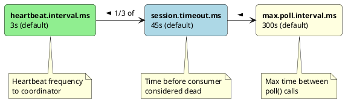

# Consumer Configuration

This guide provides a comprehensive reference for Kafka consumer configuration properties, organized by functional area with production recommendations.

---

## Configuration Categories

| Category | Purpose |
|----------|---------|
| **Connection** | Broker connectivity and identification |
| **Session Management** | Consumer group coordination and heartbeats |
| **Fetch** | Message retrieval behavior |
| **Offset** | Offset management and commit behavior |
| **Deserialization** | Message decoding |
| **Security** | Authentication and encryption |

---

## Connection Properties

### Required Properties

| Property | Description | Example |
|----------|-------------|---------|
| `bootstrap.servers` | Initial broker addresses | `kafka-1:9092,kafka-2:9092` |
| `key.deserializer` | Key deserializer class | `StringDeserializer` |
| `value.deserializer` | Value deserializer class | `StringDeserializer` |

### Identification

| Property | Default | Description |
|----------|---------|-------------|
| `group.id` | - | Consumer group identifier. Required for group consumption. |
| `client.id` | - | Logical identifier for monitoring and logging. |
| `group.instance.id` | - | Static membership identifier (Kafka 2.3+). Prevents rebalance on restart. |
| `client.rack` | - | Rack identifier for follower fetching. |

```properties
# Basic connection configuration
bootstrap.servers=kafka-1:9092,kafka-2:9092,kafka-3:9092
group.id=order-processors
client.id=order-consumer-1

# Static membership for stable deployments
group.instance.id=order-consumer-pod-1
```

---

## Session Management

Session management controls consumer liveness detection and rebalance behavior.

### Timing Properties

| Property | Default | Description |
|----------|---------|-------------|
| `session.timeout.ms` | 45000 | Time before consumer considered dead |
| `heartbeat.interval.ms` | 3000 | Frequency of heartbeat to coordinator |
| `max.poll.interval.ms` | 300000 | Maximum time between poll() calls |

### Timing Relationships



### Session Configuration Guidelines

```properties
# Standard configuration
session.timeout.ms=45000
heartbeat.interval.ms=3000

# Relationship requirements:
# heartbeat.interval.ms < session.timeout.ms / 3
# This allows 3 missed heartbeats before timeout
```

| Scenario | session.timeout.ms | heartbeat.interval.ms | max.poll.interval.ms |
|----------|-------------------|----------------------|---------------------|
| **Low latency** | 10000 | 3000 | 30000 |
| **Standard** | 45000 | 15000 | 300000 |
| **Slow processing** | 60000 | 15000 | 600000 |
| **Batch processing** | 120000 | 30000 | 1800000 |

!!! warning "Processing Time Considerations"
    If message processing takes longer than `max.poll.interval.ms`, the consumer is removed from the group. Either increase this timeout or process messages asynchronously.

---

## Fetch Configuration

Fetch configuration controls how the consumer retrieves messages from brokers.

### Fetch Size Properties

| Property | Default | Description |
|----------|---------|-------------|
| `fetch.min.bytes` | 1 | Minimum data per fetch response |
| `fetch.max.bytes` | 52428800 | Maximum data per fetch response |
| `max.partition.fetch.bytes` | 1048576 | Maximum data per partition per fetch |
| `fetch.max.wait.ms` | 500 | Maximum wait for fetch.min.bytes |

### Poll Behavior

| Property | Default | Description |
|----------|---------|-------------|
| `max.poll.records` | 500 | Maximum records per poll() call |

### Throughput vs Latency Trade-offs

```properties
# High throughput configuration
fetch.min.bytes=65536
fetch.max.wait.ms=1000
max.poll.records=1000
max.partition.fetch.bytes=4194304

# Low latency configuration
fetch.min.bytes=1
fetch.max.wait.ms=100
max.poll.records=100
max.partition.fetch.bytes=1048576
```

| Tuning Goal | fetch.min.bytes | fetch.max.wait.ms | max.poll.records |
|-------------|-----------------|-------------------|------------------|
| **Low latency** | 1 | 100 | 100 |
| **Balanced** | 1024 | 500 | 500 |
| **High throughput** | 65536 | 1000 | 1000 |

---

## Offset Configuration

Offset configuration controls how the consumer tracks and commits progress.

### Commit Behavior

| Property | Default | Description |
|----------|---------|-------------|
| `enable.auto.commit` | true | Automatically commit offsets |
| `auto.commit.interval.ms` | 5000 | Frequency of auto-commits |
| `auto.offset.reset` | latest | Behavior when no committed offset exists |

### Auto-Commit Configuration

```properties
# Auto-commit enabled (at-least-once by default)
enable.auto.commit=true
auto.commit.interval.ms=5000

# Manual commit for precise control
enable.auto.commit=false
```

### Offset Reset Behavior

| Value | Behavior | Use Case |
|-------|----------|----------|
| `earliest` | Start from oldest message | Reprocessing, new consumer groups |
| `latest` | Start from newest message | Real-time processing, skip history |
| `none` | Throw exception | Strict offset requirement |

```properties
# New consumer groups start from beginning
auto.offset.reset=earliest

# New consumer groups skip existing messages
auto.offset.reset=latest

# Fail if no offset exists
auto.offset.reset=none
```

---

## Partition Assignment

### Assignment Strategy

| Property | Default | Description |
|----------|---------|-------------|
| `partition.assignment.strategy` | RangeAssignor | Partition assignment algorithm |

### Available Strategies

| Strategy | Class | Description |
|----------|-------|-------------|
| **Range** | `RangeAssignor` | Consecutive partitions per topic |
| **RoundRobin** | `RoundRobinAssignor` | Even distribution across consumers |
| **Sticky** | `StickyAssignor` | Minimizes partition movement |
| **CooperativeSticky** | `CooperativeStickyAssignor` | Incremental rebalancing (recommended) |

```properties
# Production recommendation: Cooperative sticky assignment
partition.assignment.strategy=org.apache.kafka.clients.consumer.CooperativeStickyAssignor

# Multiple strategies (fallback)
partition.assignment.strategy=org.apache.kafka.clients.consumer.CooperativeStickyAssignor,org.apache.kafka.clients.consumer.RangeAssignor
```

---

## Isolation Level

For transactional producers, consumers must choose their isolation level.

| Property | Default | Description |
|----------|---------|-------------|
| `isolation.level` | read_uncommitted | Transaction visibility |

| Value | Behavior |
|-------|----------|
| `read_uncommitted` | Read all messages including uncommitted transactions |
| `read_committed` | Only read committed transaction messages |

```properties
# For exactly-once consumers
isolation.level=read_committed
```

---

## Network Configuration

| Property | Default | Description |
|----------|---------|-------------|
| `connections.max.idle.ms` | 540000 | Close idle connections after this time |
| `reconnect.backoff.ms` | 50 | Initial backoff for reconnection |
| `reconnect.backoff.max.ms` | 1000 | Maximum reconnection backoff |
| `request.timeout.ms` | 30000 | Timeout for network requests |
| `default.api.timeout.ms` | 60000 | Timeout for consumer API calls |
| `socket.receive.buffer.bytes` | 65536 | Socket receive buffer |

```properties
# Network tuning for high-latency environments
request.timeout.ms=60000
default.api.timeout.ms=120000
connections.max.idle.ms=300000
```

---

## Internal Topics

| Property | Default | Description |
|----------|---------|-------------|
| `exclude.internal.topics` | true | Exclude internal topics from subscription patterns |
| `allow.auto.create.topics` | true | Allow automatic topic creation |

---

## Interceptors

| Property | Default | Description |
|----------|---------|-------------|
| `interceptor.classes` | - | Consumer interceptor classes |

```java
// Custom interceptor for monitoring
public class MetricsInterceptor implements ConsumerInterceptor<String, String> {
    @Override
    public ConsumerRecords<String, String> onConsume(ConsumerRecords<String, String> records) {
        metrics.recordConsumed(records.count());
        return records;
    }

    @Override
    public void onCommit(Map<TopicPartition, OffsetAndMetadata> offsets) {
        metrics.recordCommit(offsets);
    }
}
```

```properties
interceptor.classes=com.example.MetricsInterceptor
```

---

## Security Configuration

### SASL Authentication

```properties
# SASL/PLAIN
security.protocol=SASL_SSL
sasl.mechanism=PLAIN
sasl.jaas.config=org.apache.kafka.common.security.plain.PlainLoginModule required \
    username="consumer" \
    password="secret";

# SASL/SCRAM
security.protocol=SASL_SSL
sasl.mechanism=SCRAM-SHA-256
sasl.jaas.config=org.apache.kafka.common.security.scram.ScramLoginModule required \
    username="consumer" \
    password="secret";
```

### SSL/TLS

```properties
security.protocol=SSL
ssl.truststore.location=/path/to/truststore.jks
ssl.truststore.password=truststore-password
ssl.keystore.location=/path/to/keystore.jks
ssl.keystore.password=keystore-password
ssl.key.password=key-password
```

---

## Production Configuration Templates

### Standard Consumer

```properties
# Connection
bootstrap.servers=kafka-1:9092,kafka-2:9092,kafka-3:9092
group.id=order-processors
client.id=order-consumer-1

# Session management
session.timeout.ms=45000
heartbeat.interval.ms=15000
max.poll.interval.ms=300000

# Fetch
fetch.min.bytes=1
fetch.max.wait.ms=500
max.poll.records=500

# Offset
enable.auto.commit=false
auto.offset.reset=earliest

# Assignment
partition.assignment.strategy=org.apache.kafka.clients.consumer.CooperativeStickyAssignor

# Deserialization
key.deserializer=org.apache.kafka.common.serialization.StringDeserializer
value.deserializer=org.apache.kafka.common.serialization.StringDeserializer
```

### High-Throughput Consumer

```properties
# Connection
bootstrap.servers=kafka-1:9092,kafka-2:9092,kafka-3:9092
group.id=high-throughput-processors

# Session - allow longer processing
session.timeout.ms=60000
heartbeat.interval.ms=15000
max.poll.interval.ms=600000

# Fetch - larger batches
fetch.min.bytes=65536
fetch.max.wait.ms=1000
fetch.max.bytes=104857600
max.partition.fetch.bytes=10485760
max.poll.records=2000

# Offset
enable.auto.commit=false
auto.offset.reset=earliest

# Assignment
partition.assignment.strategy=org.apache.kafka.clients.consumer.CooperativeStickyAssignor
```

### Low-Latency Consumer

```properties
# Connection
bootstrap.servers=kafka-1:9092,kafka-2:9092,kafka-3:9092
group.id=low-latency-processors

# Session - faster detection
session.timeout.ms=10000
heartbeat.interval.ms=3000
max.poll.interval.ms=30000

# Fetch - immediate delivery
fetch.min.bytes=1
fetch.max.wait.ms=100
max.poll.records=100

# Offset
enable.auto.commit=false

# Assignment
partition.assignment.strategy=org.apache.kafka.clients.consumer.CooperativeStickyAssignor
```

---

## Related Documentation

- [Consumer Guide](index.md) - Consumer patterns and usage
- [Consumer Groups](consumer-groups.md) - Group coordination details
- [Offset Management](offset-management.md) - Offset handling patterns
- [Error Handling](error-handling.md) - Error handling strategies
