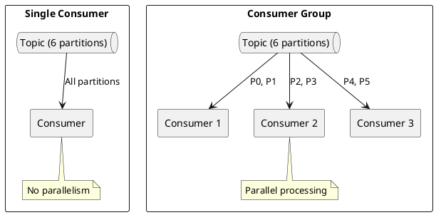
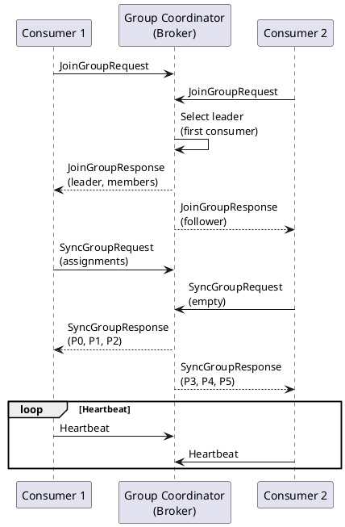
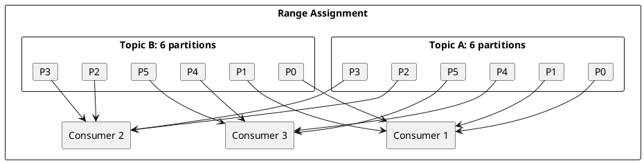
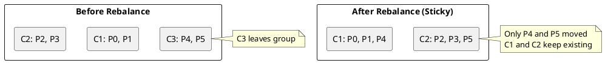
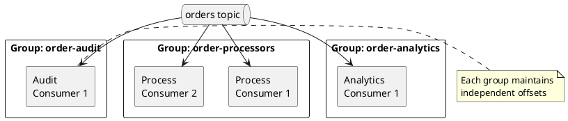

# Consumer Groups

Consumer groups enable parallel processing of Kafka topics with automatic load balancing and fault tolerance. This guide covers group coordination, partition assignment strategies, and operational management.

---

## Consumer Group Fundamentals

### Single Consumer vs Consumer Group



### Consumer Group Guarantees

| Guarantee | Description |
|-----------|-------------|
| **Exclusive assignment** | Each partition is assigned to exactly one consumer in a group |
| **Independent groups** | Different groups process messages independently |
| **Automatic rebalancing** | Partitions are redistributed when consumers join or leave |
| **Offset tracking** | Each group maintains its own offset position |

---

## Group Coordination

### Group Coordinator

Each consumer group has a coordinator broker responsible for:

- Managing group membership
- Coordinating rebalances
- Tracking committed offsets



### Coordinator Selection

The coordinator for a group is determined by:

```
coordinator_partition = hash(group.id) % __consumer_offsets_partitions
coordinator_broker = leader of coordinator_partition
```

---

## Partition Assignment Strategies

### Range Assignor

Assigns consecutive partitions per topic to each consumer.



**Characteristics:**

- Consecutive partition ranges per consumer
- Same consumer gets same partition numbers across topics
- Can cause imbalance with uneven partition counts

```properties
partition.assignment.strategy=org.apache.kafka.clients.consumer.RangeAssignor
```

### RoundRobin Assignor

Distributes partitions evenly across consumers.

| Consumer | Partitions |
|----------|------------|
| Consumer 1 | A-P0, A-P3, B-P0, B-P3 |
| Consumer 2 | A-P1, A-P4, B-P1, B-P4 |
| Consumer 3 | A-P2, A-P5, B-P2, B-P5 |

**Characteristics:**

- Even distribution across consumers
- Partitions from different topics interleaved
- All consumers should subscribe to the same set of topics

```properties
partition.assignment.strategy=org.apache.kafka.clients.consumer.RoundRobinAssignor
```

### Sticky Assignor

Minimizes partition movement during rebalances.



**Characteristics:**

- Retains as many assignments as possible
- Reduces rebalance overhead
- Enables stateful processing

```properties
partition.assignment.strategy=org.apache.kafka.clients.consumer.StickyAssignor
```

### CooperativeSticky Assignor (Recommended)

Combines sticky assignment with incremental cooperative rebalancing.

```properties
partition.assignment.strategy=org.apache.kafka.clients.consumer.CooperativeStickyAssignor
```

**Benefits:**

- Partitions not needed by new assignment continue processing
- Only revoked partitions pause processing
- Minimal disruption during rebalances

---

## Static Group Membership

Static membership (Kafka 2.3+) prevents rebalances when consumers restart with the same identity.

### Configuration

```properties
# Enable static membership
group.instance.id=consumer-instance-1
session.timeout.ms=300000
```

### Behavior Comparison

| Aspect | Dynamic Membership | Static Membership |
|--------|-------------------|-------------------|
| **Restart handling** | Triggers rebalance | No rebalance if within timeout |
| **Identity** | Assigned by coordinator | Configured `group.instance.id` |
| **Timeout behavior** | Removed after session timeout | Retains assignment until timeout |
| **Rolling restarts** | Multiple rebalances | Zero rebalances |

Static membership reduces rebalances; restarts within the session timeout avoid a rebalance when `group.instance.id` remains stable.

### Kubernetes Integration

```yaml
apiVersion: apps/v1
kind: StatefulSet
metadata:
  name: kafka-consumers
spec:
  replicas: 3
  template:
    spec:
      containers:
        - name: consumer
          env:
            - name: GROUP_INSTANCE_ID
              valueFrom:
                fieldRef:
                  fieldPath: metadata.name  # Uses pod name
```

```java
String instanceId = System.getenv("GROUP_INSTANCE_ID");
props.put("group.instance.id", instanceId);
```

---

## Consumer Group Operations

### Viewing Consumer Groups

```bash
# List all consumer groups
kafka-consumer-groups.sh --bootstrap-server localhost:9092 --list

# Describe a specific group
kafka-consumer-groups.sh --bootstrap-server localhost:9092 \
    --describe --group order-processors
```

Output:
```
GROUP           TOPIC      PARTITION  CURRENT-OFFSET  LOG-END-OFFSET  LAG    CONSUMER-ID                                HOST
order-processors orders    0          1000            1050            50     consumer-1-abc  /192.168.1.10
order-processors orders    1          2000            2000            0      consumer-1-abc  /192.168.1.10
order-processors orders    2          1500            1600            100    consumer-2-def  /192.168.1.11
```

### Group State Information

```bash
# Show group state and assignment
kafka-consumer-groups.sh --bootstrap-server localhost:9092 \
    --describe --group order-processors --state
```

| State | Description |
|-------|-------------|
| `Empty` | No active members |
| `Stable` | Active members, no rebalance |
| `PreparingRebalance` | Rebalance starting |
| `CompletingRebalance` | Waiting for assignments |
| `Dead` | Group has no members and no offsets |

### Resetting Offsets

```bash
# Reset to earliest
kafka-consumer-groups.sh --bootstrap-server localhost:9092 \
    --group order-processors --reset-offsets --to-earliest \
    --topic orders --execute

# Reset to specific offset
kafka-consumer-groups.sh --bootstrap-server localhost:9092 \
    --group order-processors --reset-offsets --to-offset 1000 \
    --topic orders:0 --execute

# Reset by timestamp
kafka-consumer-groups.sh --bootstrap-server localhost:9092 \
    --group order-processors --reset-offsets \
    --to-datetime 2024-01-01T00:00:00.000 \
    --topic orders --execute

# Shift by offset
kafka-consumer-groups.sh --bootstrap-server localhost:9092 \
    --group order-processors --reset-offsets --shift-by -100 \
    --topic orders --execute
```

### Deleting Consumer Groups

```bash
# Delete a consumer group (must be empty)
kafka-consumer-groups.sh --bootstrap-server localhost:9092 \
    --delete --group order-processors
```

---

## Multiple Consumer Groups

Multiple groups can consume the same topic independently:



### Use Cases

| Pattern | Description |
|---------|-------------|
| **Fan-out** | Multiple systems process same events |
| **Development** | Dev group doesn't affect production |
| **Replay** | New group processes historical data |
| **A/B testing** | Different processing logic per group |

---

## Consumer Group Protocols

### Classic Protocol (Current)

The current consumer group protocol uses a centralized coordinator:

1. Consumers send JoinGroup to coordinator
2. Coordinator selects a consumer as leader
3. Leader computes assignments
4. Coordinator distributes assignments

### New Consumer Group Protocol (KIP-848)

Kafka 3.7+ introduces a new protocol with:

- Server-side assignment computation
- Reduced rebalance latency
- No leader election needed

```properties
# Enable new protocol (Kafka 3.7+, preview)
group.protocol=consumer
```

Status: 3.7-3.8 early access; 4.0+ GA and recommended for new deployments.

---

## Best Practices

### Group Sizing

| Factor | Recommendation |
|--------|----------------|
| **Consumer count** | <= partition count |
| **Over-provisioning** | Consumers > partitions = idle consumers |
| **Scaling** | Add partitions before adding consumers |

### Naming Conventions

```
# Pattern: <service>-<function>-<environment>
order-service-processors-prod
payment-analytics-consumers-staging
inventory-sync-workers-dev
```

### Monitoring

| Metric | Alert Threshold |
|--------|-----------------|
| Consumer lag | > 10,000 messages |
| Rebalance frequency | > 1 per hour |
| Empty group | Unexpected empty state |
| Consumer count | Deviation from expected |

---

## Troubleshooting

### Frequent Rebalances

**Symptoms:** High rebalance rate, consumer thrashing

**Causes:**

- `session.timeout.ms` too low
- Processing exceeds `max.poll.interval.ms`
- Network instability

**Solutions:**

```properties
# Increase timeouts
session.timeout.ms=60000
max.poll.interval.ms=600000
heartbeat.interval.ms=15000
```

### Uneven Partition Assignment

**Symptoms:** Some consumers idle, others overloaded

**Causes:**

- More consumers than partitions
- Imbalanced partition counts across topics

**Solutions:**

- Ensure partitions >= consumers
- Use RoundRobin or CooperativeSticky assignor

### Stuck Consumer Group

**Symptoms:** Group in PreparingRebalance state

**Causes:**

- Consumer not responding
- Network partition

**Solutions:**

```bash
# Stop the stuck consumer, then restart it after the group stabilizes.
# If the group is empty, you can delete it:
kafka-consumer-groups.sh --bootstrap-server localhost:9092 \
    --delete --group order-processors
```

---

## Related Documentation

- [Consumer Guide](index.md) - Consumer patterns
- [Configuration](configuration.md) - Configuration reference
- [Rebalancing](rebalancing.md) - Rebalance handling
- [Offset Management](offset-management.md) - Offset handling
