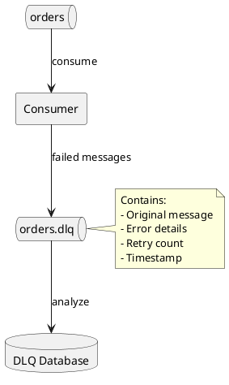
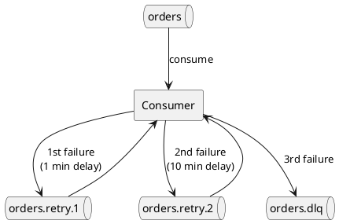

# Consumer Error Handling

Robust error handling ensures consumers can recover from failures without data loss or infinite retry loops. This guide covers error types, handling strategies, and resilience patterns.

---

## Error Categories

### Error Classification

| Category | Description | Examples |
|----------|-------------|----------|
| **Retriable** | Temporary failures | Network timeout, leader election |
| **Non-retriable** | Permanent failures | Authorization, unknown topic |
| **Poison pill** | Bad message data | Deserialization failure, schema mismatch |
| **Processing** | Application logic failure | Business rule violation, external service down |

### Error Handling Strategy

```plantuml
@startuml

skinparam backgroundColor transparent

start
:Receive message;

if (Deserialize) then (success)
    if (Process) then (success)
        :Commit offset;
        stop
    else (failure)
        if (Retriable?) then (yes)
            :Retry with backoff;
            if (Max retries?) then (no)
                backward:Process again;
            else (yes)
                :Send to DLQ;
            endif
        else (no)
            :Send to DLQ;
        endif
    endif
else (failure)
    :Log error;
    :Send to DLQ;
endif

:Commit offset;
stop

@enduml
```

---

## Deserialization Errors

### Problem

Invalid messages cause deserialization failures:

```java
// Without error handling, bad message crashes consumer
ConsumerRecords<String, Order> records = consumer.poll(Duration.ofMillis(100));
// Throws SerializationException on corrupt message
```

### ErrorHandlingDeserializer

Kafka provides a wrapper deserializer that captures errors:

```java
Properties props = new Properties();
props.put(ConsumerConfig.KEY_DESERIALIZER_CLASS_CONFIG, ErrorHandlingDeserializer.class);
props.put(ConsumerConfig.VALUE_DESERIALIZER_CLASS_CONFIG, ErrorHandlingDeserializer.class);
props.put(ErrorHandlingDeserializer.KEY_DESERIALIZER_CLASS, StringDeserializer.class);
props.put(ErrorHandlingDeserializer.VALUE_DESERIALIZER_CLASS, JsonDeserializer.class);
```

### Handling Poison Pills

```java
while (running) {
    ConsumerRecords<String, Order> records = consumer.poll(Duration.ofMillis(100));

    for (ConsumerRecord<String, Order> record : records) {
        // Check for deserialization failure
        if (record.value() == null) {
            byte[] rawValue = getRawValue(record);  // Access raw bytes if needed
            log.error("Deserialization failed at offset {}: {}",
                record.offset(), new String(rawValue));

            // Send to dead letter queue
            sendToDeadLetterQueue(record);
            continue;
        }

        // Process valid message
        processOrder(record.value());
    }

    consumer.commitSync();
}
```

### Custom Deserializer with Error Handling

```java
public class SafeJsonDeserializer<T> implements Deserializer<T> {
    private final ObjectMapper mapper = new ObjectMapper();
    private final Class<T> targetType;

    @Override
    public T deserialize(String topic, byte[] data) {
        if (data == null) return null;

        try {
            return mapper.readValue(data, targetType);
        } catch (IOException e) {
            // Return null instead of throwing
            log.error("Failed to deserialize message: {}", new String(data), e);
            return null;
        }
    }
}
```

---

## Dead Letter Queue

### DLQ Pattern

Route failed messages to a dedicated topic for later analysis:



### DLQ Implementation

```java
public class DeadLetterQueueHandler {
    private final Producer<String, byte[]> dlqProducer;
    private final String dlqTopicSuffix = ".dlq";

    public void sendToDeadLetterQueue(ConsumerRecord<?, ?> record, Exception error) {
        String dlqTopic = record.topic() + dlqTopicSuffix;

        ProducerRecord<String, byte[]> dlqRecord = new ProducerRecord<>(
            dlqTopic,
            record.key() != null ? record.key().toString() : null,
            serializeOriginalValue(record)
        );

        // Add metadata headers
        dlqRecord.headers()
            .add("dlq.original.topic", record.topic().getBytes())
            .add("dlq.original.partition", Integer.toString(record.partition()).getBytes())
            .add("dlq.original.offset", Long.toString(record.offset()).getBytes())
            .add("dlq.error.message", error.getMessage().getBytes())
            .add("dlq.error.class", error.getClass().getName().getBytes())
            .add("dlq.timestamp", Instant.now().toString().getBytes());

        dlqProducer.send(dlqRecord, (metadata, exception) -> {
            if (exception != null) {
                log.error("Failed to send to DLQ: {}", record, exception);
            }
        });
    }
}
```

### DLQ Topic Configuration

```properties
# Create DLQ topic with appropriate settings
cleanup.policy=delete
retention.ms=2592000000  # 30 days
```

---

## Retry Strategies

### In-Memory Retry

Simple retry with backoff:

```java
public class RetryingConsumer {
    private final int maxRetries = 3;
    private final long initialBackoffMs = 100;
    private final double backoffMultiplier = 2.0;

    public void processWithRetry(ConsumerRecord<String, String> record) {
        int attempt = 0;
        long backoff = initialBackoffMs;

        while (attempt < maxRetries) {
            try {
                process(record);
                return;  // Success
            } catch (RetriableException e) {
                attempt++;
                log.warn("Attempt {} failed for offset {}: {}",
                    attempt, record.offset(), e.getMessage());

                if (attempt < maxRetries) {
                    Thread.sleep(backoff);
                    backoff = (long) (backoff * backoffMultiplier);
                }
            }
        }

        // Max retries exceeded
        dlqHandler.sendToDeadLetterQueue(record, lastException);
    }
}
```

### Retry Topic Pattern

Use dedicated retry topics for delayed reprocessing:



### Implementation

```java
public class RetryTopicConsumer {
    private final Map<String, RetryConfig> retryConfigs = Map.of(
        "orders", new RetryConfig(3, List.of(
            new RetryLevel("orders.retry.1", Duration.ofMinutes(1)),
            new RetryLevel("orders.retry.2", Duration.ofMinutes(10)),
            new RetryLevel("orders.retry.3", Duration.ofMinutes(60))
        ))
    );

    @KafkaListener(topics = {"orders", "orders.retry.*"})
    public void consume(ConsumerRecord<String, String> record) {
        try {
            process(record);
        } catch (RetriableException e) {
            int currentRetry = getRetryLevel(record.topic());
            RetryConfig config = retryConfigs.get(getBaseTopic(record.topic()));

            if (currentRetry < config.maxRetries()) {
                RetryLevel nextLevel = config.levels().get(currentRetry);
                sendToRetryTopic(record, nextLevel.topic(), nextLevel.delay());
            } else {
                sendToDeadLetterQueue(record, e);
            }
        }
    }

    private void sendToRetryTopic(ConsumerRecord<String, String> record,
                                   String retryTopic, Duration delay) {
        ProducerRecord<String, String> retryRecord = new ProducerRecord<>(
            retryTopic,
            record.key(),
            record.value()
        );

        // Add retry metadata
        retryRecord.headers()
            .add("retry.original.topic", record.topic().getBytes())
            .add("retry.timestamp", Instant.now().toString().getBytes())
            .add("retry.delay.ms", Long.toString(delay.toMillis()).getBytes());

        // Delay can be implemented via:
        // 1. Topic-level delay (requires Kafka feature or custom implementation)
        // 2. Consumer-side delay before processing
        // 3. External scheduler
        producer.send(retryRecord);
    }
}
```

---

## Error Types and Handling

### Retriable Errors

| Error | Handling |
|-------|----------|
| `TimeoutException` | Retry with backoff |
| `NotLeaderOrFollowerException` | Automatic retry by client |
| `DisconnectException` | Reconnect and retry |
| `RetriableException` | Application-defined retry |

```java
try {
    process(record);
} catch (TimeoutException | RetriableException e) {
    // Retry with backoff
    retryWithBackoff(record, e);
} catch (NonRetriableException e) {
    // Send to DLQ immediately
    sendToDeadLetterQueue(record, e);
}
```

### Non-Retriable Errors

| Error | Handling |
|-------|----------|
| `AuthorizationException` | Alert and fail |
| `InvalidTopicException` | Configuration error, fix and restart |
| `SerializationException` | DLQ (poison pill) |
| `RecordTooLargeException` | DLQ or skip |

### Commit Errors

```java
try {
    consumer.commitSync();
} catch (CommitFailedException e) {
    // Partition was reassigned during processing
    // Work will be reprocessed by new owner
    log.warn("Commit failed, partition reassigned: {}", e.getMessage());
} catch (TimeoutException e) {
    // Retry commit
    retryCommit();
}
```

---

## Circuit Breaker Pattern

Prevent cascading failures when external dependencies are down:

```java
public class CircuitBreakerConsumer {
    private final CircuitBreaker circuitBreaker = CircuitBreaker.ofDefaults("external-service");

    public void process(ConsumerRecord<String, String> record) {
        Supplier<String> decoratedSupplier = CircuitBreaker
            .decorateSupplier(circuitBreaker, () -> callExternalService(record));

        Try.ofSupplier(decoratedSupplier)
            .recover(CallNotPermittedException.class, e -> {
                // Circuit is open - pause consumer
                pauseConsumer();
                scheduleResume();
                throw e;
            })
            .recover(throwable -> {
                // Other failures - retry or DLQ
                handleFailure(record, throwable);
                return null;
            });
    }

    private void pauseConsumer() {
        consumer.pause(consumer.assignment());
    }

    private void scheduleResume() {
        scheduler.schedule(() -> {
            consumer.resume(consumer.assignment());
        }, 30, TimeUnit.SECONDS);
    }
}
```

---

## Error Monitoring

### Metrics

```java
public class ConsumerMetrics {
    private final MeterRegistry registry;

    public void recordProcessingSuccess(String topic) {
        registry.counter("consumer.processing.success", "topic", topic).increment();
    }

    public void recordProcessingError(String topic, String errorType) {
        registry.counter("consumer.processing.error",
            "topic", topic,
            "error_type", errorType
        ).increment();
    }

    public void recordDlqSent(String topic) {
        registry.counter("consumer.dlq.sent", "topic", topic).increment();
    }

    public void recordRetry(String topic, int attemptNumber) {
        registry.counter("consumer.retry",
            "topic", topic,
            "attempt", String.valueOf(attemptNumber)
        ).increment();
    }
}
```

### Alerting

| Metric | Alert Condition |
|--------|-----------------|
| DLQ rate | > 1% of messages |
| Retry rate | > 5% of messages |
| Processing errors | > 10 per minute |
| Circuit breaker open | Any open circuit |

---

## Best Practices

### Error Handling Strategy

| Practice | Recommendation |
|----------|----------------|
| Classify errors | Distinguish retriable vs non-retriable |
| Implement DLQ | Never lose messages |
| Limit retries | Prevent infinite loops |
| Use backoff | Avoid overwhelming dependencies |

### Monitoring

| Practice | Recommendation |
|----------|----------------|
| Track error rates | Alert on anomalies |
| Log error details | Include offset, partition, error type |
| Monitor DLQ | Process DLQ messages regularly |
| Track retry rates | High retry rate indicates problems |

### Recovery

| Practice | Recommendation |
|----------|----------------|
| DLQ reprocessing | Build tooling to replay DLQ |
| Error analysis | Review DLQ patterns regularly |
| Automated recovery | Auto-retry DLQ on fixes |

---

## Common Patterns

### Skip and Log

For non-critical messages:

```java
try {
    process(record);
} catch (Exception e) {
    log.error("Skipping message at offset {}: {}", record.offset(), e.getMessage());
    // Continue processing - message is lost
}
```

### Fail Fast

For critical processing:

```java
try {
    process(record);
} catch (Exception e) {
    log.error("Critical error, stopping consumer: {}", e.getMessage());
    running.set(false);
    throw e;
}
```

### Graceful Degradation

For high-availability requirements:

```java
try {
    processWithFullEnrichment(record);
} catch (EnrichmentServiceException e) {
    // Fall back to basic processing
    processBasic(record);
}
```

---

## Related Documentation

- [Consumer Guide](index.md) - Consumer patterns
- [Offset Management](offset-management.md) - Commit handling
- [Anti-Patterns](../anti-patterns/index.md) - Common mistakes
- [Delivery Semantics](../../concepts/delivery-semantics/index.md) - Processing guarantees
