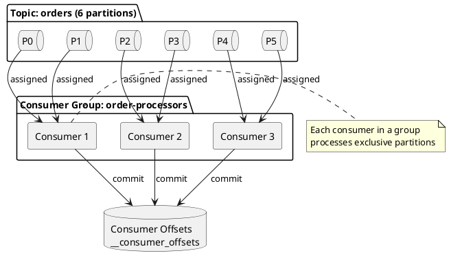
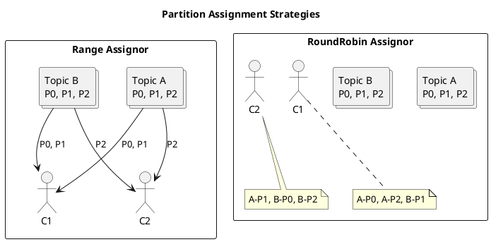
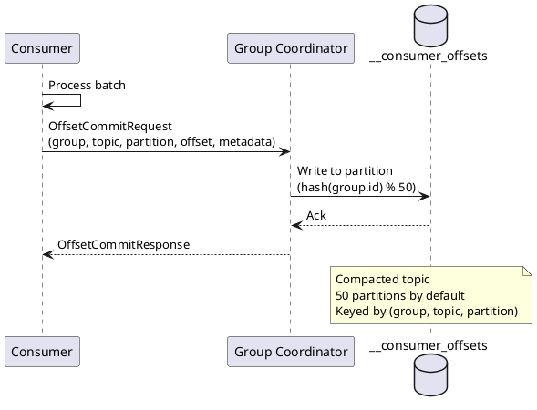
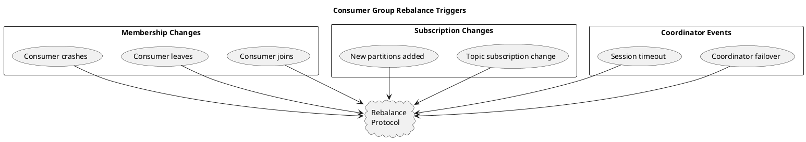
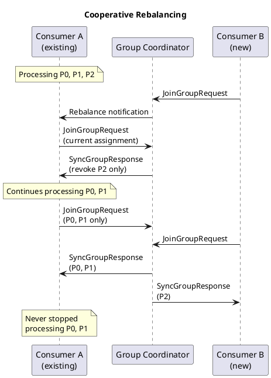

# Kafka Consumer Guide

Kafka consumers subscribe to topics and process messages from partitions. This guide covers consumer architecture, configuration, consumer groups, offset management, and consumption patterns for production deployments.

## Consumer Architecture Overview



---

## Consumer Groups

Consumer groups enable parallel processing and fault tolerance. Each consumer group maintains its own offset position for each partition.

### Consumer Group Semantics

| Behavior | Description |
|----------|-------------|
| **Partition Assignment** | Each partition is assigned to exactly one consumer within a group |
| **Parallel Processing** | Multiple consumers in a group process partitions concurrently |
| **Fault Tolerance** | If a consumer fails, its partitions are reassigned to remaining consumers |
| **Independent Groups** | Different consumer groups process the same data independently |

### Partition Assignment Strategies



| Strategy | Class | Behavior | Use Case |
|----------|-------|----------|----------|
| **Range** | `RangeAssignor` | Assigns consecutive partitions per topic | Co-located topic processing |
| **RoundRobin** | `RoundRobinAssignor` | Distributes partitions evenly across consumers | Balanced load distribution |
| **Sticky** | `StickyAssignor` | Minimizes partition movement during rebalance | Stateful processing |
| **CooperativeSticky** | `CooperativeStickyAssignor` | Incremental rebalancing with sticky assignment | Production recommended (Kafka 2.4+) |

!!! tip "Production Recommendation"
    In Kafka 2.4+, the `CooperativeStickyAssignor` should be used for production deployments as it enables incremental cooperative rebalancing, minimizing processing disruption during consumer group changes.

---

## Consumer Configuration

### Essential Consumer Properties

```properties
# Consumer identification
group.id=order-processors
client.id=order-consumer-1

# Broker connection
bootstrap.servers=kafka-1:9092,kafka-2:9092,kafka-3:9092

# Deserialization
key.deserializer=org.apache.kafka.common.serialization.StringDeserializer
value.deserializer=org.apache.kafka.common.serialization.StringDeserializer

# Consumer group coordination
session.timeout.ms=45000
heartbeat.interval.ms=15000
max.poll.interval.ms=300000

# Fetch configuration
fetch.min.bytes=1
fetch.max.bytes=52428800
fetch.max.wait.ms=500
max.partition.fetch.bytes=1048576
max.poll.records=500

# Offset management
enable.auto.commit=false
auto.offset.reset=earliest
```

### Configuration Categories

#### Connection and Identification

| Property | Default | Description |
|----------|---------|-------------|
| `bootstrap.servers` | - | Broker addresses for initial connection |
| `group.id` | - | Consumer group identifier (required for group consumption) |
| `client.id` | - | Logical identifier for logging and monitoring |
| `client.rack` | - | Rack identifier for rack-aware consumption |

#### Session Management

| Property | Default | Constraints | Description |
|----------|---------|-------------|-------------|
| `session.timeout.ms` | 45000 | Must be within broker's `group.min.session.timeout.ms` and `group.max.session.timeout.ms` | Time before consumer is considered dead |
| `heartbeat.interval.ms` | 3000 | Should be less than 1/3 of `session.timeout.ms` | Frequency of heartbeat signals |
| `max.poll.interval.ms` | 300000 | - | Maximum time between poll() calls |

!!! warning "Session Timeout Considerations"
    Setting `session.timeout.ms` too low results in frequent spurious rebalances. Setting it too high delays detection of failed consumers. A value between 30-60 seconds is recommended for most production deployments.

#### Fetch Behavior

| Property | Default | Description |
|----------|---------|-------------|
| `fetch.min.bytes` | 1 | Minimum data for fetch response |
| `fetch.max.bytes` | 52428800 | Maximum data per fetch response |
| `fetch.max.wait.ms` | 500 | Maximum wait for `fetch.min.bytes` |
| `max.partition.fetch.bytes` | 1048576 | Maximum data per partition per fetch |
| `max.poll.records` | 500 | Maximum records returned per poll() |

---

## Offset Management

Offsets track consumer progress through partitions. Proper offset management is critical for delivery semantics.

### Offset Storage



### Commit Strategies

#### Auto-Commit (At-Least-Once by Default)

```java
Properties props = new Properties();
props.put("enable.auto.commit", "true");
props.put("auto.commit.interval.ms", "5000");

// Offsets committed automatically every 5 seconds
// Risk: Messages processed but not yet committed may be reprocessed after failure
```

!!! danger "Auto-Commit Limitations"
    Auto-commit provides at-least-once semantics but may result in duplicate processing after consumer failures. For exactly-once or at-most-once semantics, manual offset management must be implemented.

#### Manual Synchronous Commit

```java
Properties props = new Properties();
props.put("enable.auto.commit", "false");

try (KafkaConsumer<String, String> consumer = new KafkaConsumer<>(props)) {
    consumer.subscribe(Arrays.asList("orders"));

    while (running) {
        ConsumerRecords<String, String> records = consumer.poll(Duration.ofMillis(100));

        for (ConsumerRecord<String, String> record : records) {
            processRecord(record);
        }

        // Synchronous commit - blocks until broker acknowledges
        consumer.commitSync();
    }
}
```

#### Manual Asynchronous Commit

```java
while (running) {
    ConsumerRecords<String, String> records = consumer.poll(Duration.ofMillis(100));

    for (ConsumerRecord<String, String> record : records) {
        processRecord(record);
    }

    // Asynchronous commit with callback
    consumer.commitAsync((offsets, exception) -> {
        if (exception != null) {
            log.error("Commit failed for offsets: {}", offsets, exception);
        }
    });
}
```

#### Per-Partition Commit

```java
while (running) {
    ConsumerRecords<String, String> records = consumer.poll(Duration.ofMillis(100));

    for (TopicPartition partition : records.partitions()) {
        List<ConsumerRecord<String, String>> partitionRecords = records.records(partition);

        for (ConsumerRecord<String, String> record : partitionRecords) {
            processRecord(record);
        }

        // Commit offset for this partition only
        long lastOffset = partitionRecords.get(partitionRecords.size() - 1).offset();
        consumer.commitSync(Collections.singletonMap(
            partition,
            new OffsetAndMetadata(lastOffset + 1)
        ));
    }
}
```

### Offset Reset Behavior

| `auto.offset.reset` | Behavior |
|---------------------|----------|
| `earliest` | Start from oldest available offset |
| `latest` | Start from newest offset (skip existing messages) |
| `none` | Throw exception if no committed offset exists |

---

## Rebalancing

Rebalancing redistributes partitions among consumers when group membership changes.

### Rebalance Triggers



### Rebalance Protocols

#### Eager Rebalancing (Legacy)

In eager rebalancing, all consumers must revoke all partitions before reassignment:

1. Consumer detects rebalance trigger
2. All consumers revoke all partitions
3. All consumers rejoin group
4. Leader assigns partitions
5. Consumers receive new assignments

!!! warning "Eager Rebalance Impact"
    Eager rebalancing causes a "stop-the-world" pause where no partitions are processed during the rebalance. This can significantly impact throughput for large consumer groups.

#### Incremental Cooperative Rebalancing (Kafka 2.4+)

Cooperative rebalancing minimizes disruption by only revoking partitions that must move:



To enable cooperative rebalancing:

```properties
partition.assignment.strategy=org.apache.kafka.clients.consumer.CooperativeStickyAssignor
```

### Rebalance Listeners

Implement `ConsumerRebalanceListener` for cleanup and state management:

```java
consumer.subscribe(Arrays.asList("orders"), new ConsumerRebalanceListener() {
    @Override
    public void onPartitionsRevoked(Collection<TopicPartition> partitions) {
        // Called before rebalance - commit pending offsets
        log.info("Partitions revoked: {}", partitions);
        consumer.commitSync(getCurrentOffsets());

        // Close any resources tied to these partitions
        for (TopicPartition partition : partitions) {
            closePartitionResources(partition);
        }
    }

    @Override
    public void onPartitionsAssigned(Collection<TopicPartition> partitions) {
        // Called after rebalance - initialize state
        log.info("Partitions assigned: {}", partitions);
        for (TopicPartition partition : partitions) {
            initializePartitionResources(partition);
        }
    }

    @Override
    public void onPartitionsLost(Collection<TopicPartition> partitions) {
        // Called when partitions lost without clean revocation (cooperative only)
        log.warn("Partitions lost: {}", partitions);
        // Do not commit offsets - may cause duplicate processing
    }
});
```

---

## Static Group Membership

Static membership (Kafka 2.3+) prevents rebalances when consumers restart with the same identity.

```properties
# Enable static membership
group.instance.id=order-consumer-instance-1
session.timeout.ms=300000
```

| Property | Purpose |
|----------|---------|
| `group.instance.id` | Unique identifier that persists across restarts |
| `session.timeout.ms` | Should be set higher to accommodate planned restarts |

!!! tip "Kubernetes Deployments"
    Static group membership is particularly valuable in Kubernetes environments where pod restarts should not trigger rebalances. Use the pod name or a stable identifier as `group.instance.id`.

---

## Consumption Patterns

### Poll Loop Pattern

```java
public class ConsumerLoop implements Runnable {
    private final AtomicBoolean running = new AtomicBoolean(true);
    private final KafkaConsumer<String, String> consumer;

    @Override
    public void run() {
        try {
            consumer.subscribe(Arrays.asList("orders"));

            while (running.get()) {
                ConsumerRecords<String, String> records = consumer.poll(Duration.ofMillis(100));

                for (ConsumerRecord<String, String> record : records) {
                    processRecord(record);
                }

                consumer.commitSync();
            }
        } catch (WakeupException e) {
            // Expected on shutdown
            if (running.get()) {
                throw e;
            }
        } finally {
            consumer.close();
        }
    }

    public void shutdown() {
        running.set(false);
        consumer.wakeup();
    }
}
```

### Pause and Resume

Control message flow for backpressure management:

```java
Set<TopicPartition> overloaded = new HashSet<>();

while (running) {
    ConsumerRecords<String, String> records = consumer.poll(Duration.ofMillis(100));

    for (TopicPartition partition : records.partitions()) {
        if (isBackpressured(partition)) {
            consumer.pause(Collections.singleton(partition));
            overloaded.add(partition);
        } else {
            processRecords(records.records(partition));
        }
    }

    // Check if paused partitions can resume
    for (TopicPartition partition : new ArrayList<>(overloaded)) {
        if (!isBackpressured(partition)) {
            consumer.resume(Collections.singleton(partition));
            overloaded.remove(partition);
        }
    }
}
```

### Seek Operations

Control read position explicitly:

```java
// Seek to beginning of all assigned partitions
consumer.seekToBeginning(consumer.assignment());

// Seek to end
consumer.seekToEnd(consumer.assignment());

// Seek to specific offset
consumer.seek(new TopicPartition("orders", 0), 1000L);

// Seek by timestamp (Kafka 0.10.1+)
Map<TopicPartition, Long> timestamps = new HashMap<>();
timestamps.put(new TopicPartition("orders", 0), System.currentTimeMillis() - 3600000);
Map<TopicPartition, OffsetAndTimestamp> offsets = consumer.offsetsForTimes(timestamps);

for (Map.Entry<TopicPartition, OffsetAndTimestamp> entry : offsets.entrySet()) {
    if (entry.getValue() != null) {
        consumer.seek(entry.getKey(), entry.getValue().offset());
    }
}
```

---

## Multi-Threaded Consumption

### One Consumer Per Thread

```java
public class MultiThreadedConsumer {
    private final int numConsumers;
    private final List<ConsumerLoop> consumers;
    private final ExecutorService executor;

    public MultiThreadedConsumer(int numConsumers, Properties props) {
        this.numConsumers = numConsumers;
        this.consumers = new ArrayList<>();
        this.executor = Executors.newFixedThreadPool(numConsumers);

        for (int i = 0; i < numConsumers; i++) {
            ConsumerLoop consumer = new ConsumerLoop(props);
            consumers.add(consumer);
            executor.submit(consumer);
        }
    }

    public void shutdown() {
        for (ConsumerLoop consumer : consumers) {
            consumer.shutdown();
        }
        executor.shutdown();
    }
}
```

### Single Consumer with Worker Pool

```java
public class ConsumerWithWorkerPool {
    private final KafkaConsumer<String, String> consumer;
    private final ExecutorService workerPool;

    public void consume() {
        while (running) {
            ConsumerRecords<String, String> records = consumer.poll(Duration.ofMillis(100));

            List<Future<?>> futures = new ArrayList<>();
            for (ConsumerRecord<String, String> record : records) {
                futures.add(workerPool.submit(() -> processRecord(record)));
            }

            // Wait for all processing to complete before committing
            for (Future<?> future : futures) {
                try {
                    future.get();
                } catch (Exception e) {
                    log.error("Processing failed", e);
                }
            }

            consumer.commitSync();
        }
    }
}
```

!!! warning "Thread Safety"
    `KafkaConsumer` is not thread-safe. Only the `wakeup()` method may be called from another thread. Each thread must have its own consumer instance, or external synchronization must be provided.

---

## Error Handling

### Deserialization Errors

```java
props.put("key.deserializer", ErrorHandlingDeserializer.class.getName());
props.put("value.deserializer", ErrorHandlingDeserializer.class.getName());
props.put(ErrorHandlingDeserializer.VALUE_DESERIALIZER_CLASS, JsonDeserializer.class.getName());

// Handle poison pills
while (running) {
    ConsumerRecords<String, String> records = consumer.poll(Duration.ofMillis(100));

    for (ConsumerRecord<String, String> record : records) {
        if (record.value() == null) {
            // Deserialization failed
            log.error("Failed to deserialize message at offset {}", record.offset());
            sendToDeadLetterQueue(record);
        } else {
            processRecord(record);
        }
    }
}
```

### Retriable vs Non-Retriable Errors

| Error Type | Example | Handling |
|------------|---------|----------|
| **Retriable** | Network timeout, leader election | Retry with backoff |
| **Non-Retriable** | Authorization failure, unknown topic | Fail fast, alert |
| **Poison Pill** | Corrupt message, schema mismatch | Dead letter queue |

---

## Monitoring Consumers

### Key Consumer Metrics

| Metric | Description | Alert Threshold |
|--------|-------------|-----------------|
| `records-consumed-rate` | Records consumed per second | Baseline deviation |
| `records-lag` | Offset lag behind producer | > 10,000 |
| `records-lag-max` | Maximum lag across partitions | > 100,000 |
| `fetch-latency-avg` | Average fetch request latency | > 500ms |
| `commit-latency-avg` | Average commit latency | > 1000ms |
| `rebalance-rate-and-time` | Rebalance frequency | > 1 per hour |
| `failed-rebalance-rate-and-time` | Failed rebalance rate | > 0 |

### Consumer Lag Monitoring

Consumer lag indicates how far behind real-time the consumer is processing:

```bash
# Check consumer group lag
kafka-consumer-groups.sh --bootstrap-server localhost:9092 \
    --describe --group order-processors
```

Output:
```
GROUP           TOPIC    PARTITION  CURRENT-OFFSET  LOG-END-OFFSET  LAG
order-processors orders  0          1000            1050            50
order-processors orders  1          2000            2000            0
order-processors orders  2          1500            1600            100
```

---

## Version Compatibility

| Feature | Minimum Version |
|---------|-----------------|
| Consumer Groups | 0.9.0 |
| Manual Partition Assignment | 0.9.0 |
| Offset Seek by Timestamp | 0.10.1 |
| Idempotent Consumer | 0.11.0 |
| Static Group Membership | 2.3.0 |
| Cooperative Rebalancing | 2.4.0 |
| Consumer Group Protocol (KIP-848) | 3.7.0 (Preview) |

---

## Related Resources

- [Producer Guide](../producers/index.md) - Message production
- [Delivery Semantics](../../concepts/delivery-semantics/index.md) - Processing guarantees
- [Kafka Streams](../kafka-streams/index.md) - Stream processing
- [Operations](../../operations/index.md) - Consumer monitoring and management
