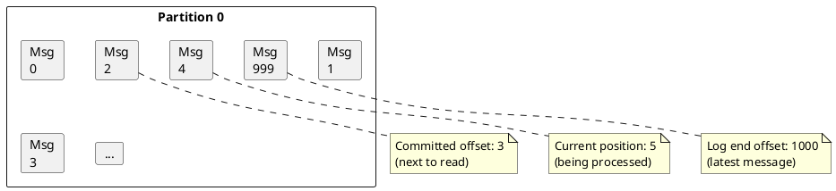
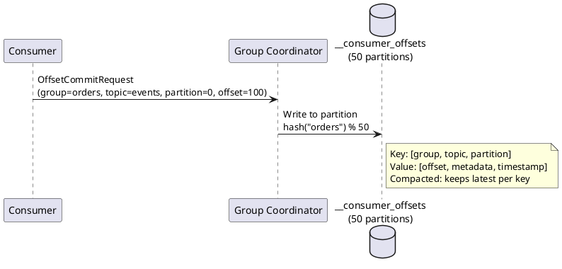

# Offset Management

Offsets track consumer progress through partitions. Proper offset management is essential for delivery semantics and reliable message processing.

---

## Offset Fundamentals

### What is an Offset?

An offset is a sequential identifier for messages within a partition:



### Offset Types

| Offset Type | Description |
|-------------|-------------|
| **Committed offset** | Last acknowledged position. Resume point after restart. |
| **Current position** | Where consumer is reading now |
| **Log end offset (LEO)** | Latest message in partition |
| **High watermark** | Latest replicated message (readable) |
| **Consumer lag** | LEO - Committed offset |

---

## Offset Storage

### __consumer_offsets Topic

Kafka stores committed offsets in an internal compacted topic:



### Offset Record Structure

```json
{
  "key": {
    "group": "order-processors",
    "topic": "orders",
    "partition": 0
  },
  "value": {
    "offset": 1000,
    "metadata": "batch-123",
    "commit_timestamp": 1704067200000,
    "expire_timestamp": -1
  }
}
```

### Offset Retention

| Property | Default | Description |
|----------|---------|-------------|
| `offsets.retention.minutes` | 10080 (7 days) | Broker-side offset retention |

!!! warning "Offset Expiration"
    If a consumer group is inactive longer than `offsets.retention.minutes`, committed offsets are deleted. On restart, `auto.offset.reset` determines behavior.

---

## Commit Strategies

### Auto-Commit

Offsets are committed automatically at regular intervals:

```java
Properties props = new Properties();
props.put("enable.auto.commit", "true");
props.put("auto.commit.interval.ms", "5000");

// Offsets committed automatically every 5 seconds
while (running) {
    ConsumerRecords<String, String> records = consumer.poll(Duration.ofMillis(100));
    for (ConsumerRecord<String, String> record : records) {
        process(record);  // May fail after auto-commit
    }
}
```

**Semantics:** At-least-once (duplicates possible on failure)

**Trade-offs:**

| Pros | Cons |
|------|------|
| Simple implementation | No control over commit timing |
| No commit code needed | Duplicates if crash after commit |
| Lower latency | May lose messages if crash before commit |

### Synchronous Manual Commit

```java
props.put("enable.auto.commit", "false");

while (running) {
    ConsumerRecords<String, String> records = consumer.poll(Duration.ofMillis(100));

    for (ConsumerRecord<String, String> record : records) {
        process(record);
    }

    // Blocks until broker acknowledges
    consumer.commitSync();
}
```

**Semantics:** At-least-once

**Trade-offs:**

| Pros | Cons |
|------|------|
| Guaranteed durability | Blocking reduces throughput |
| Precise commit timing | Higher latency |

### Asynchronous Manual Commit

```java
while (running) {
    ConsumerRecords<String, String> records = consumer.poll(Duration.ofMillis(100));

    for (ConsumerRecord<String, String> record : records) {
        process(record);
    }

    consumer.commitAsync((offsets, exception) -> {
        if (exception != null) {
            log.error("Commit failed: {}", offsets, exception);
            // Handle failure - may need to retry or alert
        }
    });
}
```

**Trade-offs:**

| Pros | Cons |
|------|------|
| Non-blocking | No immediate failure handling |
| Higher throughput | Commit ordering not guaranteed |

### Hybrid Approach

Combine async for throughput with sync on shutdown:

```java
try {
    while (running) {
        ConsumerRecords<String, String> records = consumer.poll(Duration.ofMillis(100));

        for (ConsumerRecord<String, String> record : records) {
            process(record);
        }

        // Async commit during normal operation
        consumer.commitAsync();
    }
} finally {
    // Sync commit on shutdown
    consumer.commitSync();
    consumer.close();
}
```

---

## Per-Partition Commit

Commit offsets for individual partitions:

```java
while (running) {
    ConsumerRecords<String, String> records = consumer.poll(Duration.ofMillis(100));

    for (TopicPartition partition : records.partitions()) {
        List<ConsumerRecord<String, String>> partitionRecords = records.records(partition);

        for (ConsumerRecord<String, String> record : partitionRecords) {
            process(record);
        }

        // Commit this partition only
        long lastOffset = partitionRecords.get(partitionRecords.size() - 1).offset();

        consumer.commitSync(Map.of(
            partition,
            new OffsetAndMetadata(lastOffset + 1, "processed")  // +1 = next to read
        ));
    }
}
```

### Offset Metadata

Include metadata with offset commits:

```java
OffsetAndMetadata offsetAndMetadata = new OffsetAndMetadata(
    offset + 1,
    "batch-id:abc123,timestamp:2024-01-01T00:00:00Z"
);

consumer.commitSync(Map.of(partition, offsetAndMetadata));
```

---

## Offset Reset

### Reset Behavior

When no committed offset exists:

```properties
# Start from oldest available message
auto.offset.reset=earliest

# Start from newest message (skip history)
auto.offset.reset=latest

# Throw exception
auto.offset.reset=none
```

### Programmatic Seek

```java
// Seek to beginning
consumer.seekToBeginning(consumer.assignment());

// Seek to end
consumer.seekToEnd(consumer.assignment());

// Seek to specific offset
consumer.seek(new TopicPartition("orders", 0), 1000L);
```

### Seek by Timestamp

```java
// Find offsets for a specific timestamp
Map<TopicPartition, Long> timestamps = new HashMap<>();
for (TopicPartition partition : consumer.assignment()) {
    timestamps.put(partition, Instant.now().minus(Duration.ofHours(1)).toEpochMilli());
}

Map<TopicPartition, OffsetAndTimestamp> offsets = consumer.offsetsForTimes(timestamps);

for (Map.Entry<TopicPartition, OffsetAndTimestamp> entry : offsets.entrySet()) {
    if (entry.getValue() != null) {
        consumer.seek(entry.getKey(), entry.getValue().offset());
    }
}
```

---

## External Offset Storage

For exactly-once semantics or custom requirements, store offsets externally:

### Database Storage Pattern

```java
@Transactional
public void processAndCommit(ConsumerRecords<String, String> records) {
    for (ConsumerRecord<String, String> record : records) {
        // Process message
        Order order = deserialize(record.value());
        orderRepository.save(order);

        // Store offset in same transaction
        offsetRepository.save(new ConsumedOffset(
            record.topic(),
            record.partition(),
            record.offset() + 1
        ));
    }
    // Commit database transaction - atomic with processing
}

// On startup, seek to stored offsets
public void initializeOffsets(KafkaConsumer<String, String> consumer) {
    for (TopicPartition partition : consumer.assignment()) {
        Optional<ConsumedOffset> offset = offsetRepository.find(
            partition.topic(),
            partition.partition()
        );

        offset.ifPresent(o -> consumer.seek(partition, o.getOffset()));
    }
}
```

### Schema for External Storage

```sql
CREATE TABLE consumed_offsets (
    topic VARCHAR(255) NOT NULL,
    partition INT NOT NULL,
    consumer_group VARCHAR(255) NOT NULL,
    offset_value BIGINT NOT NULL,
    updated_at TIMESTAMP DEFAULT CURRENT_TIMESTAMP,
    PRIMARY KEY (topic, partition, consumer_group)
);
```

---

## Delivery Semantics

### At-Most-Once

Commit before processing:

```java
// DANGER: Messages may be lost
while (running) {
    ConsumerRecords<String, String> records = consumer.poll(Duration.ofMillis(100));
    consumer.commitSync();  // Commit first

    for (ConsumerRecord<String, String> record : records) {
        process(record);  // Crash here = message lost
    }
}
```

### At-Least-Once

Commit after processing (default pattern):

```java
while (running) {
    ConsumerRecords<String, String> records = consumer.poll(Duration.ofMillis(100));

    for (ConsumerRecord<String, String> record : records) {
        process(record);  // Process first
    }

    consumer.commitSync();  // Commit after - duplicates if crash between
}
```

### Exactly-Once

Use transactions or idempotent processing:

```java
// Option 1: Kafka transactions (for Kafka-to-Kafka)
props.put("isolation.level", "read_committed");
props.put("enable.auto.commit", "false");

producer.initTransactions();

while (running) {
    ConsumerRecords<String, String> records = consumer.poll(Duration.ofMillis(100));

    producer.beginTransaction();
    try {
        for (ConsumerRecord<String, String> record : records) {
            ProducerRecord<String, String> output = process(record);
            producer.send(output);
        }

        // Commit offsets as part of transaction
        producer.sendOffsetsToTransaction(
            getOffsets(records),
            consumer.groupMetadata()
        );

        producer.commitTransaction();
    } catch (Exception e) {
        producer.abortTransaction();
    }
}

// Option 2: Idempotent external processing
while (running) {
    ConsumerRecords<String, String> records = consumer.poll(Duration.ofMillis(100));

    for (ConsumerRecord<String, String> record : records) {
        String idempotencyKey = record.topic() + "-" + record.partition() + "-" + record.offset();

        if (!isProcessed(idempotencyKey)) {
            process(record);
            markProcessed(idempotencyKey);
        }
    }

    consumer.commitSync();
}
```

---

## Rebalance and Offset Safety

Handle offsets during rebalances:

```java
consumer.subscribe(List.of("orders"), new ConsumerRebalanceListener() {
    private Map<TopicPartition, OffsetAndMetadata> currentOffsets = new HashMap<>();

    @Override
    public void onPartitionsRevoked(Collection<TopicPartition> partitions) {
        // Commit current progress before losing partitions
        log.info("Committing offsets before revoke: {}", currentOffsets);
        consumer.commitSync(currentOffsets);
        currentOffsets.clear();
    }

    @Override
    public void onPartitionsAssigned(Collection<TopicPartition> partitions) {
        // Initialize tracking for new partitions
        log.info("Assigned partitions: {}", partitions);
    }
});

// Track offsets during processing
while (running) {
    ConsumerRecords<String, String> records = consumer.poll(Duration.ofMillis(100));

    for (ConsumerRecord<String, String> record : records) {
        process(record);

        currentOffsets.put(
            new TopicPartition(record.topic(), record.partition()),
            new OffsetAndMetadata(record.offset() + 1)
        );
    }

    consumer.commitAsync();
}
```

---

## Monitoring Offsets

### Consumer Lag

```bash
kafka-consumer-groups.sh --bootstrap-server localhost:9092 \
    --describe --group order-processors
```

### JMX Metrics

| Metric | Description |
|--------|-------------|
| `records-lag` | Current lag per partition |
| `records-lag-max` | Maximum lag across partitions |
| `records-lag-avg` | Average lag |
| `commit-latency-avg` | Average commit latency |
| `commit-latency-max` | Maximum commit latency |
| `commit-rate` | Commits per second |

---

## Best Practices

### Commit Frequency

| Scenario | Recommendation |
|----------|----------------|
| High throughput | Commit every N records or time interval |
| Low volume | Commit after each batch |
| Critical data | Sync commit after each message |

### Offset Storage

| Scenario | Storage |
|----------|---------|
| Standard Kafka | `__consumer_offsets` (default) |
| Exactly-once to database | Store with data in transaction |
| Cross-datacenter | External storage with replication |

### Error Handling

```java
while (running) {
    try {
        ConsumerRecords<String, String> records = consumer.poll(Duration.ofMillis(100));
        process(records);
        consumer.commitSync();
    } catch (CommitFailedException e) {
        // Lost partition during rebalance
        log.warn("Commit failed, partition reassigned: {}", e.getMessage());
        // Processing will be repeated by new owner
    } catch (WakeupException e) {
        // Shutdown signal
        if (running) throw e;
    }
}
```

---

## Related Documentation

- [Consumer Guide](index.md) - Consumer patterns
- [Consumer Groups](consumer-groups.md) - Group coordination
- [Rebalancing](rebalancing.md) - Rebalance handling
- [Delivery Semantics](../../concepts/delivery-semantics/index.md) - Processing guarantees
