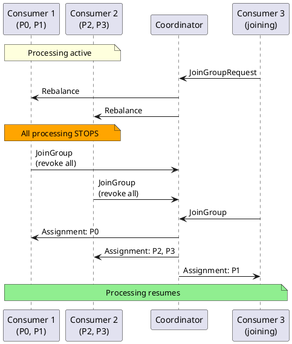
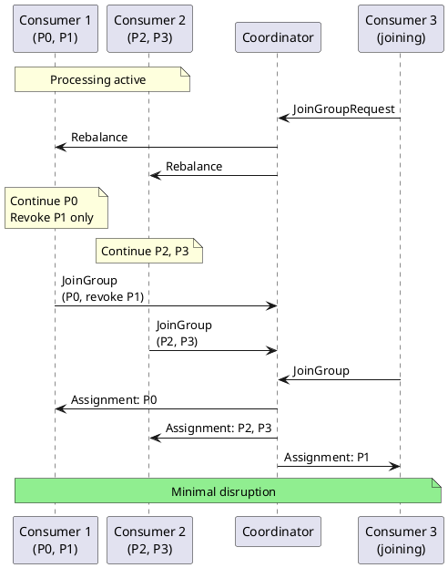
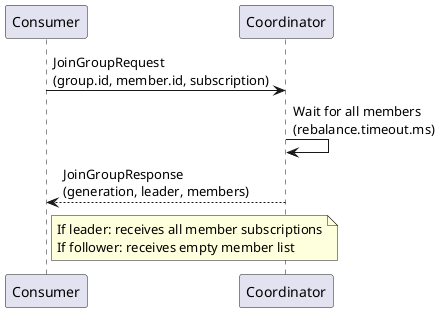
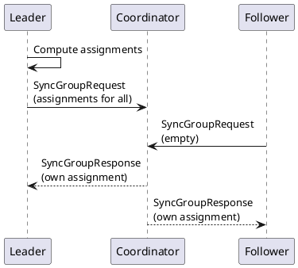

# Consumer Rebalancing

Rebalancing redistributes topic partitions among consumers when group membership or subscriptions change. Understanding rebalance behavior is critical for building resilient consumers.

---

## Rebalance Triggers

### Membership Changes

| Trigger | Description |
|---------|-------------|
| **Consumer joins** | New consumer added to group |
| **Consumer leaves** | Consumer calls `close()` |
| **Consumer crashes** | Consumer stops heartbeating |
| **Session timeout** | No heartbeat within `session.timeout.ms` |
| **Poll timeout** | No `poll()` within `max.poll.interval.ms` |

### Subscription Changes

| Trigger | Description |
|---------|-------------|
| **Topic subscription change** | Consumer changes subscribed topics |
| **New partitions added** | Topic partition count increases |
| **Topic deletion** | Subscribed topic is deleted |

### Coordinator Events

| Trigger | Description |
|---------|-------------|
| **Coordinator failover** | Group coordinator broker changes |
| **Coordinator restart** | Coordinator broker restarts |

---

## Rebalance Protocols

### Eager Protocol (Legacy)

All consumers stop processing during rebalance:



**Characteristics:**

- Stop-the-world: All partitions revoked
- Maximum disruption during rebalance
- Simple protocol logic

### Cooperative Protocol (Kafka 2.4+)

Only affected partitions pause:



**Characteristics:**

- Incremental: Only moved partitions revoked
- Minimal disruption to processing
- Two-phase rebalance (may take longer)

### Enabling Cooperative Rebalancing

```properties
partition.assignment.strategy=org.apache.kafka.clients.consumer.CooperativeStickyAssignor
```

!!! warning "Migration Required"
    Switching from eager to cooperative requires a rolling restart strategy. Consumers cannot mix protocols within a group.

#### Migration Steps

1. Configure both strategies (cooperative first):
   ```properties
   partition.assignment.strategy=org.apache.kafka.clients.consumer.CooperativeStickyAssignor,org.apache.kafka.clients.consumer.RangeAssignor
   ```

2. Rolling restart all consumers

3. Remove legacy strategy:
   ```properties
   partition.assignment.strategy=org.apache.kafka.clients.consumer.CooperativeStickyAssignor
   ```

4. Rolling restart again

---

## Rebalance Phases

### Join Phase



### Sync Phase



---

## Rebalance Listener

Handle partition changes with `ConsumerRebalanceListener`:

```java
public class MyRebalanceListener implements ConsumerRebalanceListener {
    private final KafkaConsumer<String, String> consumer;
    private final Map<TopicPartition, OffsetAndMetadata> pendingOffsets;

    @Override
    public void onPartitionsRevoked(Collection<TopicPartition> partitions) {
        // Called BEFORE partitions are revoked
        log.info("Partitions revoked: {}", partitions);

        // Commit pending work
        if (!pendingOffsets.isEmpty()) {
            consumer.commitSync(pendingOffsets);
            pendingOffsets.clear();
        }

        // Flush any buffers
        flushBuffers(partitions);

        // Close partition-specific resources
        for (TopicPartition partition : partitions) {
            closePartitionState(partition);
        }
    }

    @Override
    public void onPartitionsAssigned(Collection<TopicPartition> partitions) {
        // Called AFTER partitions are assigned
        log.info("Partitions assigned: {}", partitions);

        // Initialize state for new partitions
        for (TopicPartition partition : partitions) {
            initializePartitionState(partition);
        }

        // Optionally seek to specific positions
        // consumer.seek(partition, savedOffset);
    }

    @Override
    public void onPartitionsLost(Collection<TopicPartition> partitions) {
        // Cooperative only: partitions lost without clean revocation
        log.warn("Partitions lost: {}", partitions);

        // DO NOT commit - offsets may be stale
        // Just clean up resources
        for (TopicPartition partition : partitions) {
            closePartitionState(partition);
        }
    }
}
```

### Usage

```java
consumer.subscribe(List.of("orders"), new MyRebalanceListener(consumer, pendingOffsets));
```

---

## Rebalance Timing

### Configuration

| Property | Default | Description |
|----------|---------|-------------|
| `session.timeout.ms` | 45000 | Time before consumer considered dead |
| `heartbeat.interval.ms` | 3000 | Heartbeat frequency |
| `max.poll.interval.ms` | 300000 | Maximum time between polls |
| `rebalance.timeout.ms` | `max.poll.interval.ms` | Time allowed for rebalance |

### Rebalance Timeout

Consumers must complete rebalance within `rebalance.timeout.ms`:

```
rebalance.timeout.ms = max.poll.interval.ms (by default)
```

If a consumer doesn't respond within this time, it's removed from the group.

---

## Minimizing Rebalance Impact

### Static Membership

Prevent rebalances on planned restarts:

```properties
group.instance.id=consumer-instance-1
session.timeout.ms=300000
```

### Sticky Assignment

Retain partition assignments across rebalances:

```properties
partition.assignment.strategy=org.apache.kafka.clients.consumer.StickyAssignor
```

### Cooperative Rebalancing

Only revoke partitions that must move:

```properties
partition.assignment.strategy=org.apache.kafka.clients.consumer.CooperativeStickyAssignor
```

### Optimized Processing

Reduce processing time to avoid poll timeouts:

```java
// Process asynchronously to avoid max.poll.interval.ms timeout
ExecutorService executor = Executors.newFixedThreadPool(10);

while (running) {
    ConsumerRecords<String, String> records = consumer.poll(Duration.ofMillis(100));

    if (!records.isEmpty()) {
        // Pause partitions during async processing
        consumer.pause(consumer.assignment());

        CompletableFuture<Void> processing = CompletableFuture.runAsync(
            () -> processRecords(records),
            executor
        );

        // Keep heartbeating while processing
        while (!processing.isDone()) {
            consumer.poll(Duration.ZERO);  // Heartbeat only
            Thread.sleep(100);
        }

        consumer.commitSync();
        consumer.resume(consumer.assignment());
    }
}
```

---

## Rebalance Monitoring

### Metrics

| Metric | Description |
|--------|-------------|
| `rebalance-latency-avg` | Average rebalance duration |
| `rebalance-latency-max` | Maximum rebalance duration |
| `rebalance-total` | Total rebalances |
| `rebalance-rate-per-hour` | Rebalances per hour |
| `failed-rebalance-total` | Failed rebalances |
| `last-rebalance-seconds-ago` | Time since last rebalance |

### JMX Access

```java
// Access via JMX
ObjectName name = new ObjectName(
    "kafka.consumer:type=consumer-coordinator-metrics,client-id=my-consumer"
);
Double rebalanceRate = (Double) mbs.getAttribute(name, "rebalance-rate-per-hour");
```

### Alerting

| Condition | Action |
|-----------|--------|
| Rebalance rate > 1/hour | Investigate cause |
| Failed rebalances > 0 | Check consumer health |
| Rebalance duration > 60s | Optimize consumer |

---

## Troubleshooting

### Frequent Rebalances

**Symptoms:**

- High `rebalance-rate-per-hour`
- Consumer lag increases during rebalances
- Processing gaps in metrics

**Common Causes:**

| Cause | Solution |
|-------|----------|
| Processing too slow | Increase `max.poll.interval.ms` or process async |
| Network instability | Increase `session.timeout.ms` |
| GC pauses | Tune JVM, increase `session.timeout.ms` |
| Consumer crashes | Fix application bugs |

**Diagnostic Steps:**

```bash
# Check consumer group state
kafka-consumer-groups.sh --bootstrap-server localhost:9092 \
    --describe --group order-processors --state

# Monitor rebalance events in logs
grep -i "rebalance\|revoked\|assigned" consumer.log
```

### Stuck Rebalance

**Symptoms:**

- Group in `PreparingRebalance` state
- No progress in offset commits
- Consumers not receiving messages

**Solutions:**

1. Check for unresponsive consumers
2. Verify network connectivity
3. Force remove stuck consumer:

```bash
# Remove member from group (broker-side)
kafka-consumer-groups.sh --bootstrap-server localhost:9092 \
    --group order-processors --delete-members \
    --member consumer-1-abc123
```

### Rebalance Storm

**Symptoms:**

- Cascading rebalances
- Multiple rebalances in quick succession

**Prevention:**

```properties
# Longer timeouts
session.timeout.ms=60000
max.poll.interval.ms=600000

# Static membership
group.instance.id=${POD_NAME}

# Cooperative rebalancing
partition.assignment.strategy=org.apache.kafka.clients.consumer.CooperativeStickyAssignor
```

---

## Best Practices

### Configuration

| Practice | Recommendation |
|----------|----------------|
| Use cooperative rebalancing | `CooperativeStickyAssignor` for Kafka 2.4+ |
| Use static membership | Stable deployments (Kubernetes) |
| Tune timeouts | Based on processing time and network |

### Implementation

| Practice | Recommendation |
|----------|----------------|
| Handle rebalance events | Implement `ConsumerRebalanceListener` |
| Commit before revoke | Ensure progress is saved |
| Clean up resources | Close partition-specific state |

### Operations

| Practice | Recommendation |
|----------|----------------|
| Monitor rebalance rate | Alert on unexpected increases |
| Rolling deployments | Deploy one consumer at a time |
| Test rebalance handling | Verify behavior under rebalance |

---

## Related Documentation

- [Consumer Guide](index.md) - Consumer patterns
- [Consumer Groups](consumer-groups.md) - Group coordination
- [Offset Management](offset-management.md) - Offset handling
- [Configuration](configuration.md) - Configuration reference
