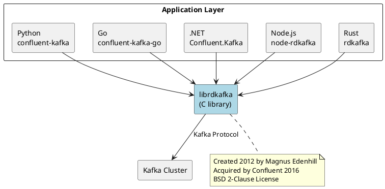

# Kafka Client Drivers

Kafka clients are available for all major programming languages. This section provides language-specific guides covering installation, configuration, producer/consumer patterns, and best practices.

---

## Official and Confluent-Maintained Clients

### Apache Kafka Java Client

| | |
|---|---|
| **Library** | `org.apache.kafka:kafka-clients` |
| **Repository** | [github.com/apache/kafka](https://github.com/apache/kafka) |
| **Documentation** | [kafka.apache.org/documentation](https://kafka.apache.org/documentation/) |
| **Package** | [Maven Central](https://central.sonatype.com/artifact/org.apache.kafka/kafka-clients) |
| **Current Version** | 4.1.x (as of 2025) |
| **Maintainer** | Apache Software Foundation |
| **License** | Apache License 2.0 |

The Java client is the reference implementation, developed as part of the core Apache Kafka project. First released with Kafka 0.8.0 in 2013, it replaced the older Scala-based client. The Java client is the most feature-complete, supporting Kafka Streams, exactly-once semantics, and all protocol features immediately upon Kafka release.

---

### librdkafka (C/C++)

| | |
|---|---|
| **Library** | `librdkafka` |
| **Repository** | [github.com/confluentinc/librdkafka](https://github.com/confluentinc/librdkafka) |
| **Documentation** | [docs.confluent.io/platform/current/clients/librdkafka](https://docs.confluent.io/platform/current/clients/librdkafka/html/index.html) |
| **Current Version** | 2.12.x (as of 2025) |
| **Maintainer** | Confluent, originally Magnus Edenhill |
| **License** | BSD 2-Clause |

librdkafka is a high-performance C library created by Magnus Edenhill in 2012, predating the official Java client redesign. Confluent acquired the project in 2016. It serves as the foundation for most non-Java Kafka clients, providing consistent behavior and configuration across Python, Go, .NET, Node.js, Ruby, PHP, and Rust.

---

### confluent-kafka-python

| | |
|---|---|
| **Library** | `confluent-kafka` |
| **Repository** | [github.com/confluentinc/confluent-kafka-python](https://github.com/confluentinc/confluent-kafka-python) |
| **Documentation** | [docs.confluent.io/platform/current/clients/confluent-kafka-python](https://docs.confluent.io/platform/current/clients/confluent-kafka-python/html/index.html) |
| **Package** | [PyPI](https://pypi.org/project/confluent-kafka/) |
| **Current Version** | 2.12.x (as of 2025) |
| **Maintainer** | Confluent |
| **License** | Apache License 2.0 |
| **Base** | librdkafka |

The official Python client wrapping librdkafka via C extensions. First released in 2016, it provides significantly higher performance than pure-Python alternatives. Supports Schema Registry integration with Avro, Protobuf, and JSON Schema serializers.

---

### kafka-python (Pure Python)

| | |
|---|---|
| **Library** | `kafka-python` |
| **Repository** | [github.com/dpkp/kafka-python](https://github.com/dpkp/kafka-python) |
| **Documentation** | [kafka-python.readthedocs.io](https://kafka-python.readthedocs.io/) |
| **Package** | [PyPI](https://pypi.org/project/kafka-python/) |
| **Current Version** | 2.2.x (as of 2025) |
| **Maintainer** | Dana Powers (dpkp) |
| **License** | Apache License 2.0 |

A pure Python implementation with no native dependencies. Mirrors the Java client API with Pythonic features like consumer iterators. Supports transactions, all compression types, and consumer groups. With 5.9k GitHub stars and 35,000+ dependent projects, it's ideal for serverless and environments where native compilation is problematic.

---

### confluent-kafka-go

| | |
|---|---|
| **Library** | `github.com/confluentinc/confluent-kafka-go` |
| **Repository** | [github.com/confluentinc/confluent-kafka-go](https://github.com/confluentinc/confluent-kafka-go) |
| **Documentation** | [docs.confluent.io/platform/current/clients/confluent-kafka-go](https://docs.confluent.io/platform/current/clients/confluent-kafka-go/index.html) |
| **Package** | [pkg.go.dev](https://pkg.go.dev/github.com/confluentinc/confluent-kafka-go/v2/kafka) |
| **Current Version** | v2.12.x (as of 2025) |
| **Maintainer** | Confluent |
| **License** | Apache License 2.0 |
| **Base** | librdkafka |

The official Go client using cgo bindings to librdkafka. First released in 2017 as v0.9.x, the v2.x series (2023) introduced Go modules support and improved APIs. Requires librdkafka to be installed or uses a pre-built static library.

---

### confluent-kafka-dotnet

| | |
|---|---|
| **Library** | `Confluent.Kafka` |
| **Repository** | [github.com/confluentinc/confluent-kafka-dotnet](https://github.com/confluentinc/confluent-kafka-dotnet) |
| **Documentation** | [docs.confluent.io/platform/current/clients/confluent-kafka-dotnet](https://docs.confluent.io/platform/current/clients/confluent-kafka-dotnet/_site/api/Confluent.Kafka.html) |
| **Package** | [NuGet](https://www.nuget.org/packages/Confluent.Kafka/) |
| **Current Version** | 2.12.x (as of 2025) |
| **Maintainer** | Confluent |
| **License** | Apache License 2.0 |
| **Base** | librdkafka |

The official .NET client providing P/Invoke bindings to librdkafka. First released in 2016 as RdKafka, rebranded to Confluent.Kafka in 2017. Supports .NET Standard 2.0+, .NET Framework 4.6.2+, and .NET Core 2.0+.

---

## Community-Maintained Clients

### KafkaJS (Node.js)

| | |
|---|---|
| **Library** | `kafkajs` |
| **Repository** | [github.com/tulios/kafkajs](https://github.com/tulios/kafkajs) |
| **Documentation** | [kafka.js.org](https://kafka.js.org/) |
| **Package** | [npm](https://www.npmjs.com/package/kafkajs) |
| **Current Version** | 2.2.x (as of 2025) |
| **Maintainer** | Tulio Ornelas and community |
| **License** | MIT |
| **Base** | Pure JavaScript (no native dependencies) |

A pure JavaScript implementation requiring no native compilation. Created by Tulio Ornelas in 2018, it gained popularity for its easy installation and modern async/await API. No librdkafka dependency makes it ideal for serverless and containerized environments where native compilation is problematic.

---

### node-rdkafka (Node.js)

| | |
|---|---|
| **Library** | `node-rdkafka` |
| **Repository** | [github.com/Blizzard/node-rdkafka](https://github.com/Blizzard/node-rdkafka) |
| **Documentation** | [blizzard.github.io/node-rdkafka](https://blizzard.github.io/node-rdkafka/current/) |
| **Package** | [npm](https://www.npmjs.com/package/node-rdkafka) |
| **Current Version** | 3.6.x (as of 2025) |
| **Maintainer** | Blizzard Entertainment |
| **License** | MIT |
| **Base** | librdkafka |

Native Node.js bindings to librdkafka, developed by Blizzard Entertainment. Offers higher performance than KafkaJS at the cost of native compilation requirements. First released in 2016.

---

### rust-rdkafka (Rust)

| | |
|---|---|
| **Library** | `rdkafka` |
| **Repository** | [github.com/fede1024/rust-rdkafka](https://github.com/fede1024/rust-rdkafka) |
| **Documentation** | [docs.rs/rdkafka](https://docs.rs/rdkafka/latest/rdkafka/) |
| **Package** | [crates.io](https://crates.io/crates/rdkafka) |
| **Current Version** | 0.38.x (as of 2025) |
| **Maintainer** | Federico Giraud and community |
| **License** | MIT |
| **Base** | librdkafka |

Rust bindings to librdkafka with idiomatic Rust API. Created by Federico Giraud in 2016. Supports async/await via Tokio runtime. The library remains at 0.x version indicating ongoing API evolution.

---

### Pure Go Clients

For Go developers who need to avoid cgo dependencies (cross-compilation, Alpine Linux, serverless), two popular pure Go implementations exist:

| Library | Repository | Version | Features |
|---------|------------|---------|----------|
| **franz-go** | [github.com/twmb/franz-go](https://github.com/twmb/franz-go) | v1.20.x | Full EOS, transactions, all SASL |
| **kafka-go** | [github.com/segmentio/kafka-go](https://github.com/segmentio/kafka-go) | v0.4.x | Simple API, Go stdlib style |

**franz-go** is the most feature-complete pure Go client, supporting transactions and exactly-once semantics. Created by Travis Bischel, it's used in production by Redpanda, Mux, and others.

**kafka-go** by Segment provides a simpler API modeled after Go's standard library. It lacks transaction support but is well-suited for straightforward producer/consumer use cases.

---

### Other Language Clients

| Language | Library | Repository | Maintainer | Base |
|----------|---------|------------|------------|------|
| **Ruby** | rdkafka-ruby | [github.com/appsignal/rdkafka-ruby](https://github.com/appsignal/rdkafka-ruby) | AppSignal | librdkafka |
| **PHP** | php-rdkafka | [github.com/arnaud-lb/php-rdkafka](https://github.com/arnaud-lb/php-rdkafka) | Arnaud Le Blanc | librdkafka |
| **Erlang** | brod | [github.com/kafka4beam/brod](https://github.com/kafka4beam/brod) | Klarna | Native |
| **Elixir** | broadway_kafka | [github.com/dashbitco/broadway_kafka](https://github.com/dashbitco/broadway_kafka) | Dashbit | librdkafka |
| **Scala** | fs2-kafka | [github.com/fd4s/fs2-kafka](https://github.com/fd4s/fs2-kafka) | Community | Java client |

---

## librdkafka Ecosystem

Most non-Java clients are built on **librdkafka**, a high-performance C library:



### librdkafka Benefits

| Benefit | Description |
|---------|-------------|
| **Performance** | Highly optimized C implementation |
| **Feature parity** | All clients support same Kafka features |
| **Consistent behavior** | Same configuration options across languages |
| **Battle-tested** | Powers production systems at massive scale |

### librdkafka Configuration

librdkafka-based clients share a common configuration namespace documented at [github.com/confluentinc/librdkafka/blob/master/CONFIGURATION.md](https://github.com/confluentinc/librdkafka/blob/master/CONFIGURATION.md):

```properties
# Common librdkafka configuration
bootstrap.servers=kafka:9092
client.id=my-application
acks=all
enable.idempotence=true
compression.type=lz4
```

---

## Version Compatibility

### Kafka Protocol Compatibility

| Client | Minimum Kafka | Recommended Kafka |
|--------|---------------|-------------------|
| Java 4.1.x | 0.10.0+ | 3.0+ |
| librdkafka 2.12.x | 0.8.0+ | 2.0+ |
| KafkaJS 2.2.x | 0.10.0+ | 2.0+ |

### Feature Availability by Version

| Feature | Java | librdkafka | KafkaJS |
|---------|------|------------|---------|
| Idempotent producer | 0.11.0+ | 0.11.4+ | 2.0.0+ |
| Transactions | 0.11.0+ | 0.11.4+ | 2.0.0+ |
| Headers | 0.11.0+ | 0.11.4+ | 1.4.0+ |
| Cooperative rebalancing | 2.4.0+ | 1.4.0+ | Not supported |
| Static membership | 2.3.0+ | 1.4.0+ | 2.0.0+ |

---

## Choosing a Client

### Decision Factors

| Factor | Consideration |
|--------|---------------|
| **Language ecosystem** | Match application's primary language |
| **Performance requirements** | librdkafka-based clients offer highest throughput |
| **Deployment constraints** | Pure-language clients avoid native dependencies |
| **Feature requirements** | Check client support for transactions, exactly-once |
| **Community support** | Consider maintenance activity and documentation |

### Feature Comparison

| Feature | Java | Python | Go | Node.js (KafkaJS) | .NET | Rust |
|---------|:----:|:------:|:--:|:-----------------:|:----:|:----:|
| Producer | ✅ | ✅ | ✅ | ✅ | ✅ | ✅ |
| Consumer | ✅ | ✅ | ✅ | ✅ | ✅ | ✅ |
| Transactions | ✅ | ✅ | ✅ | ✅ | ✅ | ✅ |
| Idempotence | ✅ | ✅ | ✅ | ✅ | ✅ | ✅ |
| Admin API | ✅ | ✅ | ✅ | ✅ | ✅ | ✅ |
| Schema Registry | ✅ | ✅ | ✅ | ✅ | ✅ | ⚠️ |
| SASL/SSL | ✅ | ✅ | ✅ | ✅ | ✅ | ✅ |
| Kafka Streams | ✅ | ❌ | ❌ | ❌ | ❌ | ❌ |

✅ Full support | ⚠️ Partial/community support | ❌ Not available

### Performance Comparison

General throughput characteristics (actual results vary by workload):

| Client | Relative Throughput | Notes |
|--------|--------------------:|-------|
| Java | 100% | Reference implementation |
| librdkafka (C) | 95-105% | Sometimes faster than Java |
| Python (confluent-kafka) | 90-95% | librdkafka overhead minimal |
| Go (confluent-kafka-go) | 90-95% | cgo overhead minimal |
| .NET (Confluent.Kafka) | 85-95% | P/Invoke overhead |
| KafkaJS | 50-70% | Pure JS, no native code |

---

## Common Patterns

### Producer Pattern

All clients follow a similar producer pattern:

1. Create configuration
2. Instantiate producer
3. Send messages (async with callback or sync)
4. Handle delivery reports
5. Flush and close

### Consumer Pattern

All clients follow a similar consumer pattern:

1. Create configuration with group.id
2. Instantiate consumer
3. Subscribe to topics
4. Poll for messages in loop
5. Process messages
6. Commit offsets
7. Close on shutdown

---

## Security Configuration

### SASL/PLAIN

```properties
security.protocol=SASL_SSL
sasl.mechanism=PLAIN
sasl.username=user
sasl.password=password
```

### SASL/SCRAM

```properties
security.protocol=SASL_SSL
sasl.mechanism=SCRAM-SHA-256
sasl.username=user
sasl.password=password
```

### mTLS

```properties
security.protocol=SSL
ssl.ca.location=/path/to/ca.crt
ssl.certificate.location=/path/to/client.crt
ssl.key.location=/path/to/client.key
```

---

## Language-Specific Guides

- **[Java](java.md)** - Native Apache Kafka client
- **[Python](python.md)** - confluent-kafka-python with librdkafka
- **[Go](go.md)** - confluent-kafka-go with librdkafka
- **[Node.js](nodejs.md)** - KafkaJS (pure JS) and node-rdkafka
- **[.NET](dotnet.md)** - confluent-kafka-dotnet with librdkafka
- **[Rust](rust.md)** - rdkafka with librdkafka

---

## External Resources

### Official Documentation

- [Apache Kafka Documentation](https://kafka.apache.org/documentation/)
- [Confluent Developer](https://developer.confluent.io/)
- [librdkafka Configuration Reference](https://github.com/confluentinc/librdkafka/blob/master/CONFIGURATION.md)

### Community Resources

- [Kafka Users Mailing List](https://kafka.apache.org/contact)
- [Confluent Community Slack](https://launchpass.com/confluentcommunity)
- [Stack Overflow - apache-kafka tag](https://stackoverflow.com/questions/tagged/apache-kafka)

---

## Related Documentation

- [Producer Development](../producers/index.md) - Producer patterns and configuration
- [Consumer Development](../consumers/index.md) - Consumer patterns and configuration
- [Client Connections](../../architecture/client-connections/index.md) - Protocol and connection architecture
