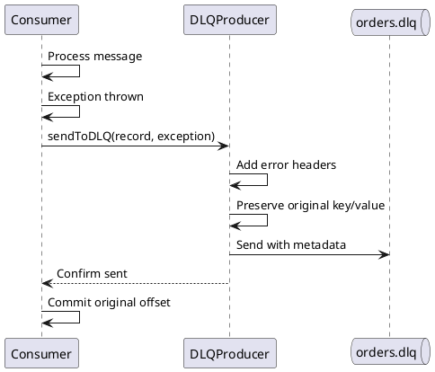
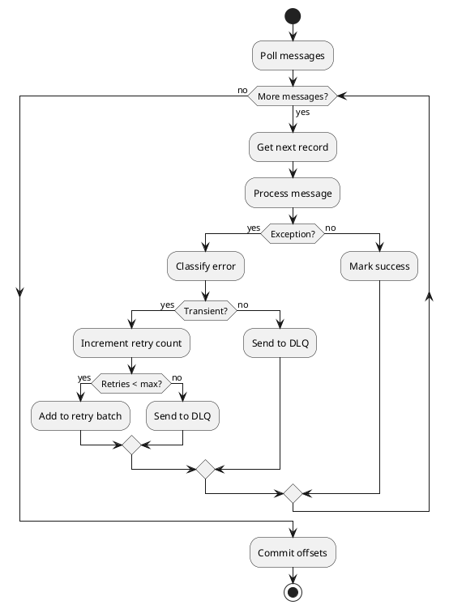
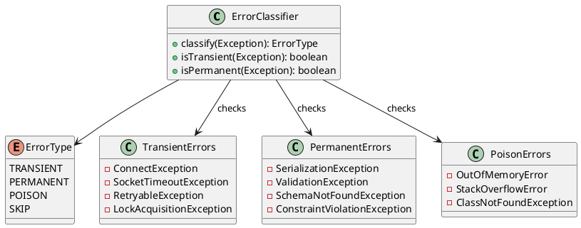
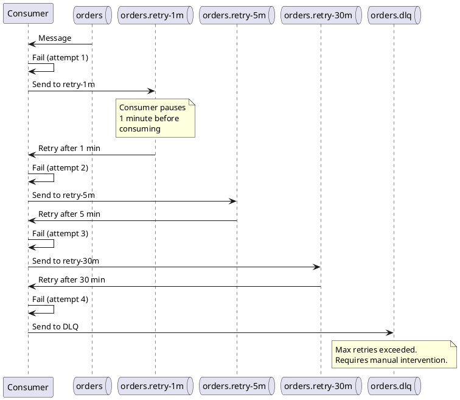
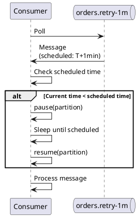
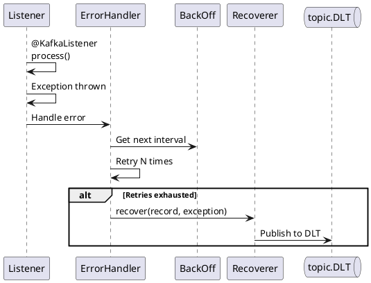
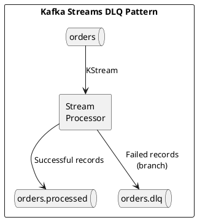
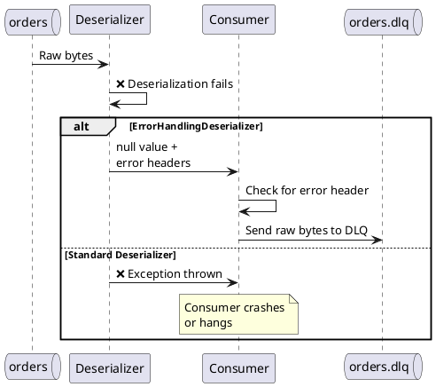

# Implementing Dead Letter Queues

This guide covers implementation patterns for Dead Letter Queues in Kafka applications. For conceptual background, see [Dead Letter Queue Concepts](../../concepts/dead-letter-queues/index.md).

---

## Basic DLQ Producer

A DLQ producer wraps the error handling logic and sends failed messages to a dead letter topic.



### Java Implementation

```java
public class DLQProducer {

    private final KafkaProducer<byte[], byte[]> producer;
    private final String dlqTopicSuffix;

    public DLQProducer(Properties props, String dlqTopicSuffix) {
        // Use byte[] serializers to preserve original payload
        props.put(ProducerConfig.KEY_SERIALIZER_CLASS_CONFIG,
            ByteArraySerializer.class.getName());
        props.put(ProducerConfig.VALUE_SERIALIZER_CLASS_CONFIG,
            ByteArraySerializer.class.getName());

        this.producer = new KafkaProducer<>(props);
        this.dlqTopicSuffix = dlqTopicSuffix;
    }

    public void sendToDLQ(ConsumerRecord<byte[], byte[]> original,
                          Exception error,
                          int retryCount) {

        String dlqTopic = original.topic() + dlqTopicSuffix;

        // Build headers with error metadata
        List<Header> headers = new ArrayList<>(original.headers().toArray().length + 10);

        // Preserve original headers
        for (Header h : original.headers()) {
            headers.add(h);
        }

        // Add DLQ metadata
        headers.add(header("dlq.original.topic", original.topic()));
        headers.add(header("dlq.original.partition", original.partition()));
        headers.add(header("dlq.original.offset", original.offset()));
        headers.add(header("dlq.original.timestamp", original.timestamp()));
        headers.add(header("dlq.error.class", error.getClass().getName()));
        headers.add(header("dlq.error.message", error.getMessage()));
        headers.add(header("dlq.retry.count", retryCount));
        headers.add(header("dlq.failed.timestamp", System.currentTimeMillis()));

        ProducerRecord<byte[], byte[]> dlqRecord = new ProducerRecord<>(
            dlqTopic,
            null,  // Let Kafka assign partition
            original.key(),
            original.value(),
            headers
        );

        producer.send(dlqRecord, (metadata, ex) -> {
            if (ex != null) {
                // DLQ send failed - log and alert
                log.error("Failed to send to DLQ: topic={}, offset={}",
                    original.topic(), original.offset(), ex);
            }
        });
    }

    private RecordHeader header(String key, Object value) {
        return new RecordHeader(key, String.valueOf(value).getBytes(UTF_8));
    }
}
```

---

## Consumer with DLQ Integration

### Basic Pattern



### Implementation

```java
public class DLQConsumer {

    private final KafkaConsumer<byte[], byte[]> consumer;
    private final DLQProducer dlqProducer;
    private final MessageProcessor processor;
    private final int maxRetries;
    private final Map<TopicPartitionOffset, Integer> retryCount = new HashMap<>();

    public void consume() {
        while (running) {
            ConsumerRecords<byte[], byte[]> records = consumer.poll(Duration.ofMillis(100));

            for (ConsumerRecord<byte[], byte[]> record : records) {
                processWithDLQ(record);
            }

            consumer.commitSync();
        }
    }

    private void processWithDLQ(ConsumerRecord<byte[], byte[]> record) {
        TopicPartitionOffset tpo = new TopicPartitionOffset(
            record.topic(), record.partition(), record.offset());

        int attempts = retryCount.getOrDefault(tpo, 0);

        try {
            processor.process(record);
            retryCount.remove(tpo);  // Success - clear retry count

        } catch (TransientException e) {
            // Transient error - retry or DLQ
            if (attempts < maxRetries) {
                retryCount.put(tpo, attempts + 1);
                throw e;  // Will be retried on next poll
            } else {
                dlqProducer.sendToDLQ(record, e, attempts);
                retryCount.remove(tpo);
            }

        } catch (PermanentException e) {
            // Permanent error - straight to DLQ
            dlqProducer.sendToDLQ(record, e, attempts);
            retryCount.remove(tpo);

        } catch (Exception e) {
            // Unknown error - treat as permanent
            dlqProducer.sendToDLQ(record, e, attempts);
            retryCount.remove(tpo);
        }
    }
}
```

---

## Error Classification

Proper error classification determines whether to retry or send to DLQ immediately.



### Implementation

```java
public class ErrorClassifier {

    private static final Set<Class<? extends Exception>> TRANSIENT_ERRORS = Set.of(
        ConnectException.class,
        SocketTimeoutException.class,
        RetryableException.class,
        SQLTransientException.class,
        OptimisticLockException.class
    );

    private static final Set<Class<? extends Exception>> PERMANENT_ERRORS = Set.of(
        SerializationException.class,
        JsonParseException.class,
        ValidationException.class,
        ConstraintViolationException.class,
        IllegalArgumentException.class
    );

    public ErrorType classify(Exception e) {
        // Check for poison messages (errors that might crash the JVM)
        if (e instanceof OutOfMemoryError ||
            e instanceof StackOverflowError) {
            return ErrorType.POISON;
        }

        // Check exception hierarchy
        for (Class<? extends Exception> transient : TRANSIENT_ERRORS) {
            if (transient.isAssignableFrom(e.getClass())) {
                return ErrorType.TRANSIENT;
            }
        }

        for (Class<? extends Exception> permanent : PERMANENT_ERRORS) {
            if (permanent.isAssignableFrom(e.getClass())) {
                return ErrorType.PERMANENT;
            }
        }

        // Check cause chain
        Throwable cause = e.getCause();
        if (cause != null && cause != e) {
            return classify((Exception) cause);
        }

        // Default to permanent (fail safe)
        return ErrorType.PERMANENT;
    }

    public boolean isTransient(Exception e) {
        return classify(e) == ErrorType.TRANSIENT;
    }
}
```

---

## Retry with Backoff

### Exponential Backoff Pattern



### Implementation with Retry Topics

```java
public class RetryableConsumer {

    private final KafkaConsumer<byte[], byte[]> consumer;
    private final KafkaProducer<byte[], byte[]> producer;
    private final String baseTopic;
    private final List<RetryTier> retryTiers;
    private final String dlqTopic;

    record RetryTier(String topic, Duration delay, int maxAttempts) {}

    public RetryableConsumer(String baseTopic) {
        this.baseTopic = baseTopic;
        this.dlqTopic = baseTopic + ".dlq";
        this.retryTiers = List.of(
            new RetryTier(baseTopic + ".retry-1m", Duration.ofMinutes(1), 3),
            new RetryTier(baseTopic + ".retry-5m", Duration.ofMinutes(5), 2),
            new RetryTier(baseTopic + ".retry-30m", Duration.ofMinutes(30), 1)
        );

        // Subscribe to main topic and all retry topics
        List<String> topics = new ArrayList<>();
        topics.add(baseTopic);
        retryTiers.forEach(t -> topics.add(t.topic()));
        consumer.subscribe(topics);
    }

    public void processWithRetry(ConsumerRecord<byte[], byte[]> record) {
        int attempt = getAttemptNumber(record);
        String sourceTopic = getOriginalTopic(record);

        try {
            process(record);
        } catch (Exception e) {
            if (!errorClassifier.isTransient(e)) {
                sendToDLQ(record, e, attempt);
                return;
            }

            // Find next retry tier
            Optional<RetryTier> nextTier = findNextTier(record.topic(), attempt);

            if (nextTier.isPresent()) {
                sendToRetry(record, nextTier.get(), attempt + 1);
            } else {
                sendToDLQ(record, e, attempt);
            }
        }
    }

    private void sendToRetry(ConsumerRecord<byte[], byte[]> record,
                             RetryTier tier,
                             int attempt) {
        List<Header> headers = new ArrayList<>();
        copyHeaders(record.headers(), headers);

        headers.add(header("retry.attempt", attempt));
        headers.add(header("retry.original.topic", getOriginalTopic(record)));
        headers.add(header("retry.scheduled.time",
            System.currentTimeMillis() + tier.delay().toMillis()));

        ProducerRecord<byte[], byte[]> retryRecord = new ProducerRecord<>(
            tier.topic(), null, record.key(), record.value(), headers);

        producer.send(retryRecord);
    }

    private int getAttemptNumber(ConsumerRecord<byte[], byte[]> record) {
        Header h = record.headers().lastHeader("retry.attempt");
        return h != null ? Integer.parseInt(new String(h.value())) : 1;
    }

    private String getOriginalTopic(ConsumerRecord<byte[], byte[]> record) {
        Header h = record.headers().lastHeader("retry.original.topic");
        return h != null ? new String(h.value()) : record.topic();
    }
}
```

---

## Delayed Consumption for Retry Topics

Retry topics need delayed consumption. Two approaches:

### Approach 1: Consumer Pause/Resume



```java
public class DelayedRetryConsumer {

    public void consumeWithDelay() {
        while (running) {
            ConsumerRecords<byte[], byte[]> records = consumer.poll(Duration.ofMillis(100));

            for (ConsumerRecord<byte[], byte[]> record : records) {
                long scheduledTime = getScheduledTime(record);
                long now = System.currentTimeMillis();

                if (scheduledTime > now) {
                    // Pause partition and wait
                    TopicPartition tp = new TopicPartition(
                        record.topic(), record.partition());

                    consumer.pause(List.of(tp));

                    try {
                        Thread.sleep(scheduledTime - now);
                    } finally {
                        consumer.resume(List.of(tp));
                    }
                }

                processWithRetry(record);
            }

            consumer.commitSync();
        }
    }

    private long getScheduledTime(ConsumerRecord<byte[], byte[]> record) {
        Header h = record.headers().lastHeader("retry.scheduled.time");
        return h != null ? Long.parseLong(new String(h.value())) : 0;
    }
}
```

### Approach 2: Timestamp-Based Partitioning

```java
// Use message timestamp + delay as the retry time
// Consumer only processes messages where timestamp + delay <= now

public class TimestampBasedRetryConsumer {

    private final Duration retryDelay;

    public void consume() {
        while (running) {
            ConsumerRecords<byte[], byte[]> records = consumer.poll(Duration.ofMillis(100));

            List<ConsumerRecord<byte[], byte[]>> ready = new ArrayList<>();
            List<ConsumerRecord<byte[], byte[]>> notReady = new ArrayList<>();

            long now = System.currentTimeMillis();

            for (ConsumerRecord<byte[], byte[]> record : records) {
                if (record.timestamp() + retryDelay.toMillis() <= now) {
                    ready.add(record);
                } else {
                    notReady.add(record);
                }
            }

            // Process ready messages
            for (ConsumerRecord<byte[], byte[]> record : ready) {
                processWithRetry(record);
            }

            // Pause partitions with not-ready messages
            if (!notReady.isEmpty()) {
                // Seek back and pause - will retry on next poll
                // when delay has elapsed
            }
        }
    }
}
```

---

## Spring Kafka Integration

Spring Kafka provides built-in DLQ support through `DefaultErrorHandler` and `DeadLetterPublishingRecoverer`.



### Configuration

```java
@Configuration
public class KafkaConfig {

    @Bean
    public DefaultErrorHandler errorHandler(
            KafkaTemplate<Object, Object> kafkaTemplate) {

        // DLQ recoverer - sends to {topic}.DLT
        DeadLetterPublishingRecoverer recoverer =
            new DeadLetterPublishingRecoverer(kafkaTemplate,
                (record, ex) -> new TopicPartition(
                    record.topic() + ".DLT", record.partition()));

        // Backoff: 1s, 2s, 4s, then DLQ
        ExponentialBackOff backOff = new ExponentialBackOff(1000L, 2.0);
        backOff.setMaxElapsedTime(10000L);

        DefaultErrorHandler handler = new DefaultErrorHandler(recoverer, backOff);

        // Don't retry these exceptions
        handler.addNotRetryableExceptions(
            SerializationException.class,
            DeserializationException.class,
            ValidationException.class
        );

        return handler;
    }

    @Bean
    public ConcurrentKafkaListenerContainerFactory<String, String>
            kafkaListenerContainerFactory(
                ConsumerFactory<String, String> consumerFactory,
                DefaultErrorHandler errorHandler) {

        ConcurrentKafkaListenerContainerFactory<String, String> factory =
            new ConcurrentKafkaListenerContainerFactory<>();

        factory.setConsumerFactory(consumerFactory);
        factory.setCommonErrorHandler(errorHandler);

        return factory;
    }
}
```

### Listener

```java
@Service
public class OrderConsumer {

    @KafkaListener(topics = "orders")
    public void consume(ConsumerRecord<String, Order> record) {
        // Exceptions thrown here trigger the error handler
        Order order = record.value();
        validateOrder(order);
        processOrder(order);
    }

    @KafkaListener(topics = "orders.DLT")  // DLQ listener
    public void consumeDLQ(ConsumerRecord<String, Order> record) {
        log.error("DLQ message: topic={}, partition={}, offset={}, error={}",
            record.topic(),
            record.partition(),
            record.offset(),
            new String(record.headers()
                .lastHeader(KafkaHeaders.DLT_EXCEPTION_MESSAGE).value()));

        // Alert, store for review, etc.
        alertService.sendDLQAlert(record);
    }
}
```

---

## Kafka Streams DLQ

Kafka Streams requires custom handling since there's no built-in DLQ.



### Implementation

```java
public class StreamsWithDLQ {

    public Topology buildTopology() {
        StreamsBuilder builder = new StreamsBuilder();

        KStream<String, byte[]> orders = builder.stream("orders");

        // Branch into success and failure streams
        Map<String, KStream<String, byte[]>> branches = orders
            .split(Named.as("process-"))
            .branch((key, value) -> tryProcess(key, value),
                    Branched.as("success"))
            .defaultBranch(Branched.as("failure"));

        // Success stream to output topic
        branches.get("process-success")
            .to("orders.processed");

        // Failure stream to DLQ with error headers
        branches.get("process-failure")
            .transformValues(DLQTransformer::new)
            .to("orders.dlq");

        return builder.build();
    }

    private boolean tryProcess(String key, byte[] value) {
        try {
            // Attempt processing
            processOrder(key, value);
            return true;
        } catch (Exception e) {
            // Store error for DLQ transformer
            errorContext.set(e);
            return false;
        }
    }

    static class DLQTransformer implements ValueTransformer<byte[], byte[]> {
        private ProcessorContext context;

        @Override
        public void init(ProcessorContext context) {
            this.context = context;
        }

        @Override
        public byte[] transform(byte[] value) {
            Exception error = errorContext.get();

            // Add error headers
            context.headers().add("dlq.error.class",
                error.getClass().getName().getBytes());
            context.headers().add("dlq.error.message",
                error.getMessage().getBytes());
            context.headers().add("dlq.failed.timestamp",
                String.valueOf(System.currentTimeMillis()).getBytes());

            return value;
        }

        @Override
        public void close() {}
    }
}
```

---

## Deserialization Error DLQ

Handle deserialization errors before they reach the consumer.



### ErrorHandlingDeserializer Configuration

```java
Properties props = new Properties();
props.put(ConsumerConfig.KEY_DESERIALIZER_CLASS_CONFIG,
    ErrorHandlingDeserializer.class.getName());
props.put(ConsumerConfig.VALUE_DESERIALIZER_CLASS_CONFIG,
    ErrorHandlingDeserializer.class.getName());

// Delegate deserializers
props.put(ErrorHandlingDeserializer.KEY_DESERIALIZER_CLASS,
    StringDeserializer.class.getName());
props.put(ErrorHandlingDeserializer.VALUE_DESERIALIZER_CLASS,
    JsonDeserializer.class.getName());

// Consumer receives null + headers on deser failure
```

### Handling Deserialization Failures

```java
@KafkaListener(topics = "orders")
public void consume(ConsumerRecord<String, Order> record,
                    @Header(name = KafkaHeaders.DLT_EXCEPTION_MESSAGE,
                            required = false) byte[] errorMessage) {

    if (errorMessage != null) {
        // Deserialization failed - send raw bytes to DLQ
        dlqProducer.sendDeserializationError(record, new String(errorMessage));
        return;
    }

    // Normal processing
    processOrder(record.value());
}
```

---

## Testing DLQ Implementation

```java
@EmbeddedKafka(partitions = 1,
    topics = {"orders", "orders.dlq"})
class DLQConsumerTest {

    @Autowired
    private EmbeddedKafkaBroker embeddedKafka;

    @Autowired
    private KafkaTemplate<String, String> kafkaTemplate;

    @Test
    void shouldSendPoisonMessageToDLQ() throws Exception {
        // Send poison message (invalid JSON)
        kafkaTemplate.send("orders", "order-1", "{invalid json}");

        // Wait for DLQ
        Consumer<String, String> dlqConsumer = createConsumer("orders.dlq");
        ConsumerRecords<String, String> dlqRecords =
            KafkaTestUtils.getRecords(dlqConsumer, Duration.ofSeconds(10));

        assertThat(dlqRecords.count()).isEqualTo(1);

        ConsumerRecord<String, String> dlqRecord = dlqRecords.iterator().next();
        assertThat(dlqRecord.value()).isEqualTo("{invalid json}");
        assertThat(dlqRecord.headers().lastHeader("dlq.error.class"))
            .isNotNull();
    }

    @Test
    void shouldRetryTransientErrorsBeforeDLQ() throws Exception {
        // Configure mock to fail 2 times then succeed
        doThrow(new ConnectException("timeout"))
            .doThrow(new ConnectException("timeout"))
            .doNothing()
            .when(mockProcessor).process(any());

        kafkaTemplate.send("orders", "order-1", "{\"id\": 1}");

        // Verify no DLQ (succeeded after retry)
        Consumer<String, String> dlqConsumer = createConsumer("orders.dlq");
        ConsumerRecords<String, String> dlqRecords =
            KafkaTestUtils.getRecords(dlqConsumer, Duration.ofSeconds(5));

        assertThat(dlqRecords.count()).isEqualTo(0);

        // Verify processing happened 3 times
        verify(mockProcessor, times(3)).process(any());
    }
}
```

---

## Related Documentation

- [Dead Letter Queue Concepts](../../concepts/dead-letter-queues/index.md) - Conceptual overview
- [DLQ Operations](../../operations/troubleshooting/dead-letter-queues.md) - Monitoring and reprocessing
- [Consumer Development](../consumers/index.md) - Consumer patterns
- [Error Handling Overview](index.md) - General error handling
