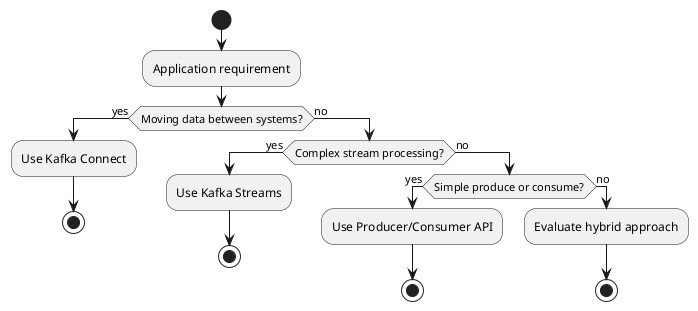
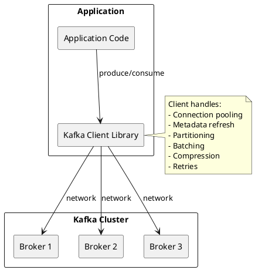
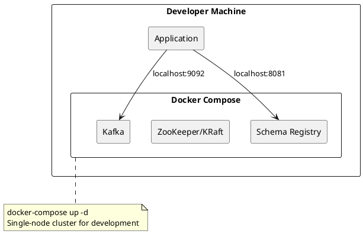

# Kafka Application Development

This section covers application development with Apache Kafka—from basic producer and consumer patterns to advanced error handling and production best practices.

---

## Development Approaches

Kafka provides multiple approaches for application development, each suited to different use cases:

| Approach | Use Case | Complexity |
|----------|----------|------------|
| **Producer/Consumer APIs** | Direct Kafka integration | Low |
| **Kafka Streams** | Stream processing within applications | Medium |
| **Kafka Connect** | Data integration without code | Low |
| **Schema Registry** | Schema-governed messaging | Medium |

### Choosing an Approach



---

## Client Libraries

Kafka clients are available for all major programming languages:

| Language | Client | Maintainer |
|----------|--------|------------|
| **Java** | kafka-clients | Apache Kafka |
| **Python** | confluent-kafka-python | Confluent |
| **Go** | confluent-kafka-go | Confluent |
| **Node.js** | kafkajs | Community |
| **.NET** | confluent-kafka-dotnet | Confluent |
| **C/C++** | librdkafka | Confluent |
| **Rust** | rdkafka | Community |

Most non-Java clients are built on **librdkafka**, a high-performance C library that provides consistent behavior across languages.

### Client Architecture



---

## Core Concepts for Developers

### Producer Fundamentals

Producers write records to Kafka topics. Key concepts:

| Concept | Description |
|---------|-------------|
| **Record** | Key-value pair with optional headers and timestamp |
| **Partitioning** | Records are assigned to partitions by key hash or explicit assignment |
| **Batching** | Records are batched for efficiency before sending |
| **Acknowledgments** | Configurable durability guarantees (acks=0, 1, all) |
| **Idempotence** | Exactly-once producer semantics (enable.idempotence=true) |

```java
// Basic producer example
Properties props = new Properties();
props.put("bootstrap.servers", "kafka:9092");
props.put("key.serializer", "org.apache.kafka.common.serialization.StringSerializer");
props.put("value.serializer", "org.apache.kafka.common.serialization.StringSerializer");

Producer<String, String> producer = new KafkaProducer<>(props);

ProducerRecord<String, String> record = new ProducerRecord<>("topic", "key", "value");
producer.send(record, (metadata, exception) -> {
    if (exception != null) {
        // Handle error
    } else {
        // Success: metadata.partition(), metadata.offset()
    }
});
```

### Consumer Fundamentals

Consumers read records from Kafka topics. Key concepts:

| Concept | Description |
|---------|-------------|
| **Consumer Group** | Consumers with same group.id share partitions |
| **Partition Assignment** | Each partition assigned to one consumer in group |
| **Offset** | Position in partition; consumer tracks progress |
| **Commit** | Persist offset to mark records as processed |
| **Rebalance** | Partition reassignment when consumers join/leave |

```java
// Basic consumer example
Properties props = new Properties();
props.put("bootstrap.servers", "kafka:9092");
props.put("group.id", "my-consumer-group");
props.put("key.deserializer", "org.apache.kafka.common.serialization.StringDeserializer");
props.put("value.deserializer", "org.apache.kafka.common.serialization.StringDeserializer");

Consumer<String, String> consumer = new KafkaConsumer<>(props);
consumer.subscribe(Arrays.asList("topic"));

while (true) {
    ConsumerRecords<String, String> records = consumer.poll(Duration.ofMillis(100));
    for (ConsumerRecord<String, String> record : records) {
        // Process record
        process(record.key(), record.value());
    }
    consumer.commitSync();
}
```

---

## Development Workflow

### Local Development



**docker-compose.yml for development:**

```yaml
version: '3'
services:
  kafka:
    image: confluentinc/cp-kafka:7.5.0
    ports:
      - "9092:9092"
    environment:
      KAFKA_NODE_ID: 1
      KAFKA_PROCESS_ROLES: broker,controller
      KAFKA_LISTENERS: PLAINTEXT://0.0.0.0:9092,CONTROLLER://0.0.0.0:9093
      KAFKA_ADVERTISED_LISTENERS: PLAINTEXT://localhost:9092
      KAFKA_CONTROLLER_QUORUM_VOTERS: 1@localhost:9093
      KAFKA_CONTROLLER_LISTENER_NAMES: CONTROLLER
      CLUSTER_ID: 'MkU3OEVBNTcwNTJENDM2Qk'

  schema-registry:
    image: confluentinc/cp-schema-registry:7.5.0
    ports:
      - "8081:8081"
    environment:
      SCHEMA_REGISTRY_HOST_NAME: schema-registry
      SCHEMA_REGISTRY_KAFKASTORE_BOOTSTRAP_SERVERS: kafka:9092
    depends_on:
      - kafka
```

### Testing Strategies

| Level | Approach | Tools |
|-------|----------|-------|
| **Unit** | Mock Kafka clients | Mockito, embedded Kafka |
| **Integration** | Testcontainers | testcontainers-kafka |
| **End-to-end** | Real cluster | Staging environment |

**Testcontainers example:**

```java
@Testcontainers
class KafkaIntegrationTest {
    @Container
    static KafkaContainer kafka = new KafkaContainer(
        DockerImageName.parse("confluentinc/cp-kafka:7.5.0")
    );

    @Test
    void shouldProduceAndConsume() {
        Properties props = new Properties();
        props.put("bootstrap.servers", kafka.getBootstrapServers());
        // ... test implementation
    }
}
```

---

## Configuration Best Practices

### Producer Configuration

| Setting | Development | Production |
|---------|-------------|------------|
| `acks` | `1` | `all` |
| `retries` | `0` | `2147483647` |
| `enable.idempotence` | `false` | `true` |
| `linger.ms` | `0` | `5-100` |
| `batch.size` | `16384` | `65536-131072` |
| `compression.type` | `none` | `lz4` or `zstd` |

### Consumer Configuration

| Setting | Development | Production |
|---------|-------------|------------|
| `auto.offset.reset` | `earliest` | `earliest` or `latest` |
| `enable.auto.commit` | `true` | `false` (manual commit) |
| `max.poll.records` | `500` | Tune based on processing time |
| `session.timeout.ms` | `45000` | `45000` |
| `heartbeat.interval.ms` | `3000` | `3000` |

---

## Common Pitfalls

| Pitfall | Problem | Solution |
|---------|---------|----------|
| **Not closing producers** | Resource leaks, message loss | Always call `producer.close()` |
| **Blocking in poll loop** | Rebalance timeouts | Process quickly or use separate threads |
| **Ignoring errors** | Silent data loss | Implement error handlers, use callbacks |
| **Auto-commit with at-least-once** | Message loss on crash | Use manual commit after processing |
| **Single consumer for high volume** | Backpressure | Scale consumers to partition count |
| **No idempotence** | Duplicates on retry | Enable `enable.idempotence=true` |

---

## Section Contents

### [Producer Development](producers/index.md)

Complete guide to building Kafka producers:

- Client configuration and tuning
- Serialization strategies
- Partitioning and key design
- Batching and compression
- Error handling and retries
- Transactions and exactly-once

### [Consumer Development](consumers/index.md)

Complete guide to building Kafka consumers:

- Consumer groups and partition assignment
- Offset management strategies
- Rebalance handling
- Concurrent processing patterns
- Error handling and dead letter queues
- Graceful shutdown

### [Kafka Streams](kafka-streams/index.md)

Stream processing library for building event-driven applications:

- DSL for stream transformations
- Stateful processing and state stores
- Windowing and aggregations
- Joins between streams and tables
- Exactly-once semantics

---

## Related Documentation

- [Schema Registry](../schema-registry/index.md) - Schema management
- [Kafka Connect](../kafka-connect/index.md) - Data integration
- [Client Drivers](../getting-started/drivers/index.md) - Language-specific guides
- [Delivery Semantics](../concepts/delivery-semantics/index.md) - Processing guarantees