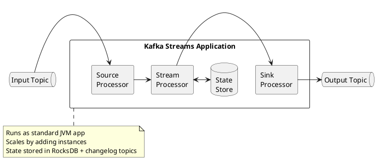
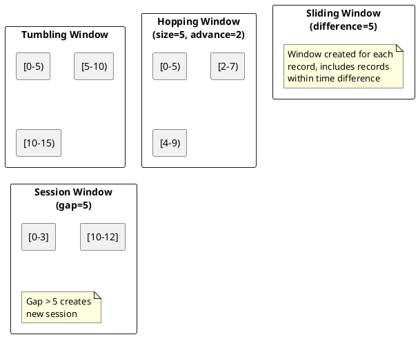
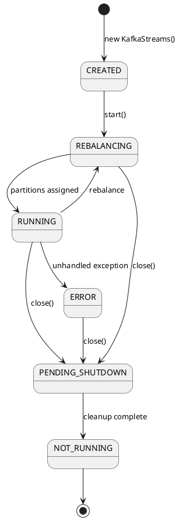

# Kafka Streams

Kafka Streams is a client library for building stream processing applications that transform, aggregate, and analyze data stored in Kafka topics.

---

## What is Stream Processing?

Stream processing is the continuous processing of data as it arrives, rather than collecting data into batches for periodic processing.

| Aspect | Batch Processing | Stream Processing |
|--------|------------------|-------------------|
| **Data model** | Finite dataset processed as a whole | Unbounded sequence of events processed incrementally |
| **Latency** | Minutes to hours (wait for batch to complete) | Milliseconds to seconds (process on arrival) |
| **Processing trigger** | Schedule (hourly, daily) or manual | Each record arrival or micro-batch |
| **State** | Recomputed from scratch each run | Maintained incrementally across records |
| **Results** | Complete after batch finishes | Continuously updated |

### Stream Processing Benefits

Traditional batch architectures introduce inherent latency—data must accumulate before processing begins, and results are only available after the batch completes. For many applications, this delay is unacceptable:

| Domain | Stream Processing Application |
|--------|-------------------------------|
| **Fraud detection** | Score transactions in real-time before authorization |
| **Monitoring** | Detect anomalies and alert within seconds of occurrence |
| **Personalization** | Update recommendations based on current session behavior |
| **IoT** | React to sensor readings as they arrive |
| **Financial markets** | Process market data with minimal latency |

Stream processing enables applications to react to events as they happen rather than discovering them hours or days later.

### Stream Processing Challenges

Processing unbounded data streams introduces challenges that batch systems avoid:

| Challenge | Description |
|-----------|-------------|
| **Unbounded data** | No defined end; must process incrementally |
| **Out-of-order events** | Network delays cause events to arrive out of sequence |
| **Late arrivals** | Events may arrive after their time window has closed |
| **State management** | Aggregations require persistent, fault-tolerant state |
| **Exactly-once semantics** | Failures must not cause duplicates or data loss |
| **Backpressure** | Must handle bursts without losing data |

Kafka Streams addresses these challenges with built-in primitives for windowing, state management, and exactly-once processing.

---

## Why Kafka Streams Exists

Raw Kafka consumers and producers provide low-level access to topics but require manual implementation of common stream processing concerns:

| Concern | Raw Consumer/Producer | Kafka Streams |
|---------|----------------------|---------------|
| **Stateful processing** | Manual state management, external storage | Built-in state stores with automatic persistence |
| **Fault tolerance** | Application must handle failures, replay | Automatic state recovery from changelog topics |
| **Exactly-once semantics** | Complex transaction coordination | Single configuration option |
| **Windowed aggregations** | Manual time tracking, expiration logic | Declarative window definitions |
| **Stream-table joins** | Custom implementation, consistency challenges | Native join operations with co-partitioning |
| **Scaling** | Manual partition assignment coordination | Automatic partition rebalancing |

Kafka Streams solves these problems by providing a high-level abstraction over the consumer/producer APIs while maintaining Kafka's scalability and fault-tolerance guarantees.

---

## Design Philosophy

Kafka Streams is designed around several core principles that distinguish it from other stream processing systems:

### Library, Not Framework

Kafka Streams is a library that runs within a standard Java application—not a framework requiring a dedicated cluster.

| Aspect | Cluster-Based Systems | Kafka Streams |
|--------|----------------------|---------------|
| **Deployment** | Dedicated cluster (YARN, Kubernetes, Mesos) | Standard application deployment |
| **Resource management** | Cluster manager allocates resources | Application controls its own resources |
| **Operational complexity** | Separate system to monitor and maintain | Same as any JVM application |
| **Scaling** | Cluster-level configuration | Add/remove application instances |
| **Dependencies** | Requires cluster infrastructure | Requires only Kafka brokers |

This design means Kafka Streams applications can be packaged as microservices, deployed in containers, or embedded within existing applications without infrastructure changes.

### Kafka as the Only Dependency

Kafka Streams requires no external systems beyond Kafka itself:

- **State storage**: Uses RocksDB locally, backed by Kafka changelog topics
- **Coordination**: Uses Kafka consumer group protocol for partition assignment
- **Checkpointing**: Commits offsets to Kafka's `__consumer_offsets` topic
- **Fault tolerance**: Replays from Kafka topics to recover state

This architecture eliminates the operational burden of managing separate storage or coordination systems (ZooKeeper, HDFS, external databases) that other stream processors require.

### Elastic Scaling via Partitions

Kafka Streams parallelism is determined by input topic partitions:

```
max_parallelism = max(partitions across all input topics)
```

Each stream task processes one partition from each input topic. Scaling works by:

1. Adding application instances—partitions automatically rebalance
2. Removing instances—remaining instances absorb partitions
3. No manual partition assignment required

| Input Partitions | Application Instances | Tasks per Instance |
|:----------------:|:---------------------:|:------------------:|
| 6 | 1 | 6 |
| 6 | 2 | 3 |
| 6 | 3 | 2 |
| 6 | 6 | 1 |
| 6 | 12 | 0-1 (6 idle) |

!!! warning "Partition Count Limit"
    Running more instances than input partitions results in idle instances. The partition count must be chosen to accommodate expected maximum parallelism.

---

## When to Use Kafka Streams

### Appropriate Use Cases

| Use Case | Why Kafka Streams |
|----------|-------------------|
| **Event enrichment** | Join streams with reference data tables |
| **Real-time aggregations** | Windowed counts, sums, averages with exactly-once |
| **Stream-table joins** | Enrich events with current entity state |
| **Microservice event processing** | Embedded library, no external cluster |
| **Stateful transformations** | Deduplication, sessionization, pattern detection |
| **CDC processing** | Process database change streams |

### When Alternatives May Be Better

| Scenario | Consideration |
|----------|---------------|
| **Sub-millisecond latency** | Kafka Streams adds overhead; consider direct consumer |
| **Non-JVM languages** | Limited to Java/Scala; use native consumers or alternative systems |
| **Complex event processing (CEP)** | Pattern matching across streams may require specialized CEP engines |
| **Batch processing** | Kafka Streams is designed for continuous streaming, not batch windows |
| **Multi-cluster topologies** | Kafka Streams operates within a single cluster |

---

## Processing Guarantees

Kafka Streams provides configurable processing semantics:

| Guarantee | Configuration | Behavior |
|-----------|---------------|----------|
| **At-least-once** | `AT_LEAST_ONCE` | Records may be reprocessed on failure; duplicates possible |
| **Exactly-once** | `EXACTLY_ONCE_V2` | Each record processed exactly once; no duplicates |

Exactly-once processing (Kafka 2.5+) coordinates:

- Consumer offset commits
- State store updates
- Producer writes to output topics

All three operations succeed or fail atomically via Kafka transactions.

!!! note "Exactly-Once Requirements"
    Exactly-once semantics require:

    - All input and output topics on the same Kafka cluster
    - Kafka broker version 2.5+ for `EXACTLY_ONCE_V2`
    - `processing.guarantee` set to `EXACTLY_ONCE_V2`

---

## Architecture Overview



### Key Characteristics

| Feature | Description |
|---------|-------------|
| **Library, not framework** | Embed in any Java/Scala application |
| **No cluster required** | No separate processing cluster needed |
| **Exactly-once** | Full EOS support |
| **Scalable** | Elastic scaling via partitions |
| **Fault-tolerant** | Automatic state recovery |

---

## Core Abstractions

### KStream

Unbounded stream of records (event stream).

```java
StreamsBuilder builder = new StreamsBuilder();
KStream<String, String> events = builder.stream("events");

events
    .filter((key, value) -> value.contains("important"))
    .mapValues(value -> value.toUpperCase())
    .to("filtered-events");
```

### KTable

Changelog stream representing current state (table semantics).

```java
KTable<String, Long> counts = builder.table("user-counts");

// Updates replace previous values for same key
// null value = tombstone (delete)
```

### GlobalKTable

Fully replicated table for broadcast joins.

```java
GlobalKTable<String, String> config = builder.globalTable("config");

// Every instance has complete copy
// Useful for reference data
```

---

## Stateless Operations

Operations that process records independently.

| Operation | Description | Example |
|-----------|-------------|---------|
| `filter` | Keep matching records | `stream.filter((k, v) -> v > 0)` |
| `map` | Transform key and value | `stream.map((k, v) -> KeyValue.pair(k, v * 2))` |
| `mapValues` | Transform value only | `stream.mapValues(v -> v.toUpperCase())` |
| `flatMap` | One-to-many transformation | `stream.flatMap((k, v) -> splitToMultiple(v))` |
| `branch` | Split stream by condition | `stream.branch(isA, isB, other)` |
| `merge` | Combine streams | `stream1.merge(stream2)` |

### Example: Filtering and Transformation

```java
KStream<String, Event> events = builder.stream("raw-events");

events
    .filter((key, event) -> event.getType().equals("click"))
    .mapValues(event -> new ClickEvent(event))
    .to("click-events");
```

---

## Stateful Operations

Operations that maintain state across records.

### Aggregations

```java
KStream<String, Purchase> purchases = builder.stream("purchases");

KTable<String, Long> purchaseCounts = purchases
    .groupBy((key, purchase) -> purchase.getCustomerId())
    .count();

KTable<String, Double> purchaseTotals = purchases
    .groupBy((key, purchase) -> purchase.getCustomerId())
    .aggregate(
        () -> 0.0,
        (key, purchase, total) -> total + purchase.getAmount(),
        Materialized.with(Serdes.String(), Serdes.Double())
    );
```

### Joins

| Join Type | Left | Right | Output |
|-----------|------|-------|--------|
| **Inner** | KStream | KStream | Matches only |
| **Left** | KStream | KStream | All left + matches |
| **Outer** | KStream | KStream | All records |
| **KStream-KTable** | KStream | KTable | Enrich stream |
| **KStream-GlobalKTable** | KStream | GlobalKTable | Broadcast join |

```java
KStream<String, Order> orders = builder.stream("orders");
KTable<String, Customer> customers = builder.table("customers");

KStream<String, EnrichedOrder> enriched = orders.join(
    customers,
    (order, customer) -> new EnrichedOrder(order, customer),
    Joined.with(Serdes.String(), orderSerde, customerSerde)
);
```

---

## Windowing

Group records by time windows for temporal aggregations.

### Window Types



### Tumbling Windows

Fixed-size, non-overlapping windows.

```java
KStream<String, Click> clicks = builder.stream("clicks");

KTable<Windowed<String>, Long> clicksPerMinute = clicks
    .groupBy((key, click) -> click.getPageId())
    .windowedBy(TimeWindows.ofSizeWithNoGrace(Duration.ofMinutes(1)))
    .count();
```

### Hopping Windows

Fixed-size, overlapping windows.

```java
KTable<Windowed<String>, Long> clicksHopping = clicks
    .groupBy((key, click) -> click.getPageId())
    .windowedBy(TimeWindows.ofSizeAndGrace(
        Duration.ofMinutes(5),
        Duration.ofMinutes(1)
    ).advanceBy(Duration.ofMinutes(1)))
    .count();
```

### Session Windows

Dynamic windows based on activity gaps.

```java
KTable<Windowed<String>, Long> sessions = clicks
    .groupBy((key, click) -> click.getUserId())
    .windowedBy(SessionWindows.ofInactivityGapWithNoGrace(Duration.ofMinutes(30)))
    .count();
```

---

## State Stores

### Local State

```java
StoreBuilder<KeyValueStore<String, Long>> storeBuilder =
    Stores.keyValueStoreBuilder(
        Stores.persistentKeyValueStore("my-store"),
        Serdes.String(),
        Serdes.Long()
    );

builder.addStateStore(storeBuilder);
```

### Interactive Queries

Query state stores from external applications.

```java
ReadOnlyKeyValueStore<String, Long> store =
    streams.store(
        StoreQueryParameters.fromNameAndType(
            "my-store",
            QueryableStoreTypes.keyValueStore()
        )
    );

Long value = store.get("key");
```

---

## Configuration

### Essential Settings

```java
Properties props = new Properties();
props.put(StreamsConfig.APPLICATION_ID_CONFIG, "my-streams-app");
props.put(StreamsConfig.BOOTSTRAP_SERVERS_CONFIG, "kafka:9092");
props.put(StreamsConfig.DEFAULT_KEY_SERDE_CLASS_CONFIG,
    Serdes.String().getClass());
props.put(StreamsConfig.DEFAULT_VALUE_SERDE_CLASS_CONFIG,
    Serdes.String().getClass());

// State directory
props.put(StreamsConfig.STATE_DIR_CONFIG, "/var/kafka-streams");

// Exactly-once
props.put(StreamsConfig.PROCESSING_GUARANTEE_CONFIG,
    StreamsConfig.EXACTLY_ONCE_V2);

// Commit interval
props.put(StreamsConfig.COMMIT_INTERVAL_MS_CONFIG, 100);
```

### Performance Tuning

```java
// Threading
props.put(StreamsConfig.NUM_STREAM_THREADS_CONFIG, 4);

// Buffering
props.put(StreamsConfig.CACHE_MAX_BYTES_BUFFERING_CONFIG, 10 * 1024 * 1024);

// Commit frequency
props.put(StreamsConfig.COMMIT_INTERVAL_MS_CONFIG, 1000);
```

---

## Application Lifecycle

```java
StreamsBuilder builder = new StreamsBuilder();
// ... define topology ...

KafkaStreams streams = new KafkaStreams(builder.build(), props);

// Handle shutdown gracefully
Runtime.getRuntime().addShutdownHook(new Thread(streams::close));

// Start processing
streams.start();
```

### State Transitions



---

## Out-of-Order Data Handling

Out-of-order records are common in distributed systems due to network delays, partition lag, or event-time vs ingestion-time differences.

### Causes of Out-of-Order Data

| Cause | Description |
|-------|-------------|
| **Within partition** | Records with larger timestamps may have smaller offsets |
| **Across partitions** | Different partitions have different processing progress |
| **Late arrivals** | Records arrive after their time window has passed |

### Handling by Operation Type

| Operation | Out-of-Order Handling |
|-----------|----------------------|
| **Stateless** | No impact—each record processed independently |
| **Windowed aggregations** | Configure grace period to wait for late arrivals |
| **Stream-Stream joins** | All types (inner, outer, left) handle correctly |
| **Stream-Table joins** | Default: not handled; With versioned stores: timestamp-based lookup |
| **Table-Table joins** | Default: not handled; With versioned stores: timestamp-based semantics |

### Grace Period Configuration

Control how long to wait for out-of-order records:

```java
// Tumbling window with 5-minute grace period
TimeWindows.ofSizeAndGrace(
    Duration.ofMinutes(10),  // window size
    Duration.ofMinutes(5)    // grace period
)

// Session window with grace period
SessionWindows.ofInactivityGapAndGrace(
    Duration.ofMinutes(30),  // inactivity gap
    Duration.ofMinutes(5)    // grace period
)
```

Records arriving after the grace period are discarded.

### Versioned State Stores

For handling out-of-order data in joins, use versioned state stores (Kafka Streams 3.5+):

```java
// Create versioned store
StoreBuilder<VersionedKeyValueStore<String, String>> storeBuilder =
    Stores.versionedKeyValueStoreBuilder(
        Stores.persistentVersionedKeyValueStore("my-store", Duration.ofDays(1)),
        Serdes.String(),
        Serdes.String()
    );
```

Versioned stores enable timestamp-based lookups instead of offset-based, properly handling out-of-order data in stream-table and table-table joins.

---

## Timestamp Assignment

### Output Record Timestamps

| Context | Timestamp Assignment |
|---------|---------------------|
| **Processing input record** | Inherits input record timestamp |
| **Punctuator callback** | Current stream time of the task |
| **Aggregations** | Maximum timestamp of contributing records |
| **Joins (stream-stream, table-table)** | `max(left.ts, right.ts)` |
| **Stream-table joins** | Stream record timestamp |
| **Stateless operations (map, filter)** | Input record timestamp passed through |
| **flatMap and siblings** | All output records inherit input timestamp |

### Custom Timestamp Extraction

Implement `TimestampExtractor` for custom timestamp logic:

```java
public class EventTimeExtractor implements TimestampExtractor {
    @Override
    public long extract(ConsumerRecord<Object, Object> record, long partitionTime) {
        // Extract timestamp from record value
        Event event = (Event) record.value();
        return event.getTimestamp();
    }
}

// Use in configuration
props.put(StreamsConfig.DEFAULT_TIMESTAMP_EXTRACTOR_CLASS_CONFIG,
    EventTimeExtractor.class);
```

---

## Graceful Shutdown

### Shutdown Hook

```java
KafkaStreams streams = new KafkaStreams(topology, props);

// Register shutdown hook
Runtime.getRuntime().addShutdownHook(new Thread(() -> {
    streams.close(Duration.ofSeconds(30));
}));

streams.start();
```

### State Listener

Monitor application state transitions:

```java
streams.setStateListener((newState, oldState) -> {
    if (newState == KafkaStreams.State.ERROR) {
        // Handle error state
        log.error("Streams entered ERROR state");
    }
});
```

### Uncaught Exception Handler

Handle unrecoverable errors:

```java
streams.setUncaughtExceptionHandler(exception -> {
    log.error("Uncaught exception in streams", exception);
    // Return action: SHUTDOWN_CLIENT, REPLACE_THREAD, or SHUTDOWN_APPLICATION
    return StreamsUncaughtExceptionHandler.StreamThreadExceptionResponse.SHUTDOWN_CLIENT;
});
```

---

## Processor API

The Processor API provides low-level control for custom stream processing logic.

### Define a Processor

```java
public class WordCountProcessor implements Processor<String, String, String, Long> {
    private KeyValueStore<String, Long> kvStore;
    private ProcessorContext<String, Long> context;

    @Override
    public void init(ProcessorContext<String, Long> context) {
        this.context = context;
        this.kvStore = context.getStateStore("counts");

        // Schedule punctuation (periodic callback)
        context.schedule(
            Duration.ofSeconds(10),
            PunctuationType.STREAM_TIME,
            this::forwardCounts
        );
    }

    @Override
    public void process(Record<String, String> record) {
        String[] words = record.value().toLowerCase().split("\\W+");
        for (String word : words) {
            Long count = kvStore.get(word);
            kvStore.put(word, (count == null) ? 1L : count + 1);
        }
    }

    private void forwardCounts(long timestamp) {
        try (KeyValueIterator<String, Long> iter = kvStore.all()) {
            while (iter.hasNext()) {
                KeyValue<String, Long> entry = iter.next();
                context.forward(new Record<>(entry.key, entry.value, timestamp));
            }
        }
    }

    @Override
    public void close() {
        // Clean up resources (but not state stores)
    }
}
```

### Punctuation Types

| Type | Trigger | Use Case |
|------|---------|----------|
| `STREAM_TIME` | Event timestamps advance | Emit results based on event progress |
| `WALL_CLOCK_TIME` | Real clock time | Periodic actions regardless of data flow |

### Build Topology with Processor API

```java
Topology topology = new Topology();

topology.addSource("source", "input-topic");
topology.addProcessor("processor", WordCountProcessor::new, "source");

StoreBuilder<KeyValueStore<String, Long>> storeBuilder =
    Stores.keyValueStoreBuilder(
        Stores.persistentKeyValueStore("counts"),
        Serdes.String(),
        Serdes.Long()
    );
topology.addStateStore(storeBuilder, "processor");
topology.addSink("sink", "output-topic", "processor");
```

### Combine DSL and Processor API

```java
StreamsBuilder builder = new StreamsBuilder();
KStream<String, String> stream = builder.stream("input");

// Inject custom processor into DSL topology
stream.process(WordCountProcessor::new, Named.as("word-count"), "counts-store");
```

---

## SerDes Reference

Kafka Streams requires serializers/deserializers (SerDes) for keys and values.

### Built-in SerDes

| Data Type | SerDe |
|-----------|-------|
| `byte[]` | `Serdes.ByteArray()` |
| `ByteBuffer` | `Serdes.ByteBuffer()` |
| `String` | `Serdes.String()` |
| `Integer` | `Serdes.Integer()` |
| `Long` | `Serdes.Long()` |
| `Double` | `Serdes.Double()` |
| `Boolean` | `Serdes.Boolean()` |
| `UUID` | `Serdes.UUID()` |
| `Void` | `Serdes.Void()` |
| `List<T>` | `Serdes.ListSerde()` |

### Override SerDes Per Operation

```java
// Explicit SerDes for to()
stream.to("output", Produced.with(Serdes.String(), Serdes.Long()));

// Explicit SerDes for groupBy
stream.groupBy(
    (key, value) -> value.getCategory(),
    Grouped.with(Serdes.String(), orderSerde)
);
```

### Window SerDes

```java
// Time-windowed SerDe
WindowedSerdes.TimeWindowedSerde<String> timeWindowedSerde =
    new WindowedSerdes.TimeWindowedSerde<>(Serdes.String());

// Session-windowed SerDe
WindowedSerdes.SessionWindowedSerde<String> sessionWindowedSerde =
    new WindowedSerdes.SessionWindowedSerde<>(Serdes.String());
```

---

## Topology Naming

Explicit naming prevents topology incompatibilities during application upgrades.

### Why Naming Matters

Without explicit names, changes to the topology can generate different internal names for:
- Repartition topics
- Changelog topics
- State stores
- Processor nodes

This causes incompatible state stores, new repartition topics, and potential data loss during upgrades.

### Name Operations Explicitly

```java
StreamsBuilder builder = new StreamsBuilder();

// Name the source
KStream<String, String> stream = builder.stream(
    "input",
    Consumed.as("input-source")
);

// Name transformations
KStream<String, String> filtered = stream.filter(
    (k, v) -> v != null,
    Named.as("null-filter")
);

// Name repartition
KStream<String, Long> repartitioned = stream.selectKey(
    (k, v) -> v.getUserId(),
    Named.as("rekey-by-user")
).repartition(Repartitioned.as("user-repartition"));

// Name aggregation (state store)
KTable<String, Long> counts = stream
    .groupByKey(Grouped.as("group-by-key"))
    .count(Named.as("count-op"), Materialized.as("counts-store"));

// Name output
counts.toStream().to("output", Produced.as("output-sink"));
```

---

## Related Documentation

- [DSL Reference](dsl/index.md) - Complete DSL operations
- [Delivery Semantics](../../concepts/delivery-semantics/index.md) - Processing guarantees
- [Architecture Patterns](../../concepts/architecture-patterns/index.md) - Stream processing patterns
- [Schema Registry](../../schema-registry/index.md) - Schema management
