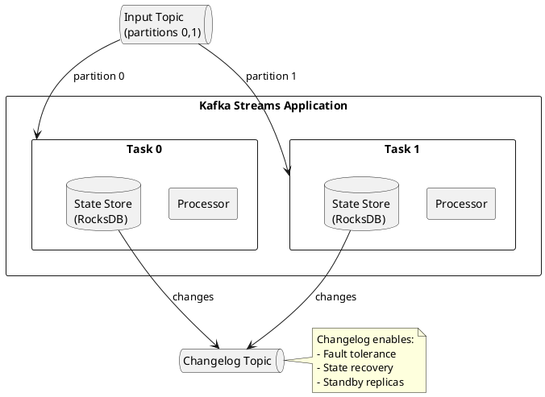
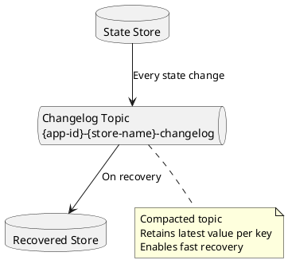
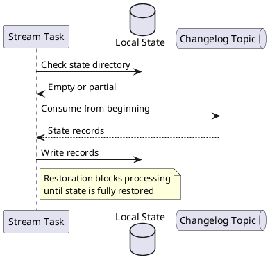

# State Stores

State stores enable stateful processing in Kafka Streams by maintaining data across records. This guide covers store types, configuration, and state management patterns.

---

## State Store Architecture



---

## Store Types

### Key-Value Store

```java
StoreBuilder<KeyValueStore<String, Long>> countStoreBuilder =
    Stores.keyValueStoreBuilder(
        Stores.persistentKeyValueStore("counts"),
        Serdes.String(),
        Serdes.Long()
    );

builder.addStateStore(countStoreBuilder);

// Access in processor
stream.process(() -> new Processor<String, String, String, Long>() {
    private KeyValueStore<String, Long> store;

    @Override
    public void init(ProcessorContext<String, Long> context) {
        store = context.getStateStore("counts");
    }

    @Override
    public void process(Record<String, String> record) {
        Long count = store.get(record.key());
        count = (count == null) ? 1L : count + 1;
        store.put(record.key(), count);
        context.forward(record.withValue(count));
    }
});
```

### Windowed Store

```java
StoreBuilder<WindowStore<String, Long>> windowStoreBuilder =
    Stores.windowStoreBuilder(
        Stores.persistentWindowStore(
            "windowed-counts",
            Duration.ofHours(1),      // Retention
            Duration.ofMinutes(5),    // Window size
            false                     // Retain duplicates
        ),
        Serdes.String(),
        Serdes.Long()
    );
```

### Session Store

```java
StoreBuilder<SessionStore<String, Long>> sessionStoreBuilder =
    Stores.sessionStoreBuilder(
        Stores.persistentSessionStore(
            "session-counts",
            Duration.ofMinutes(30)    // Inactivity gap
        ),
        Serdes.String(),
        Serdes.Long()
    );
```

---

## Storage Backends

### RocksDB (Default)

Persistent, disk-backed storage for large state:

```java
// Default - uses RocksDB
Stores.persistentKeyValueStore("my-store");

// With custom RocksDB config
Properties props = new Properties();
props.put(StreamsConfig.ROCKSDB_CONFIG_SETTER_CLASS_CONFIG, MyRocksDBConfig.class);

public class MyRocksDBConfig implements RocksDBConfigSetter {
    @Override
    public void setConfig(String storeName, Options options, Map<String, Object> configs) {
        // Set block cache size
        BlockBasedTableConfig tableConfig = (BlockBasedTableConfig) options.tableFormatConfig();
        tableConfig.setBlockCache(new LRUCache(50 * 1024 * 1024L));  // 50MB

        // Set write buffer
        options.setWriteBufferSize(16 * 1024 * 1024L);  // 16MB

        // Set compression
        options.setCompressionType(CompressionType.LZ4_COMPRESSION);
    }
}
```

### In-Memory Store

For smaller state or when persistence is not required:

```java
// In-memory key-value store
Stores.inMemoryKeyValueStore("memory-store");

// In-memory window store
Stores.inMemoryWindowStore(
    "memory-window-store",
    Duration.ofHours(1),
    Duration.ofMinutes(5),
    false
);
```

| Backend | Persistence | Size Limit | Use Case |
|---------|-------------|------------|----------|
| RocksDB | Yes | Disk-limited | Large state, production |
| In-Memory | No | Heap-limited | Small state, testing |

---

## Changelog Topics

State stores are backed by changelog topics for fault tolerance:



### Changelog Configuration

```java
StoreBuilder<KeyValueStore<String, Long>> storeBuilder =
    Stores.keyValueStoreBuilder(
        Stores.persistentKeyValueStore("counts"),
        Serdes.String(),
        Serdes.Long()
    )
    .withLoggingEnabled(Map.of(
        "cleanup.policy", "compact",
        "retention.ms", "604800000",      // 7 days
        "segment.bytes", "1073741824",    // 1GB
        "min.cleanable.dirty.ratio", "0.5"
    ));

// Disable changelog (not recommended for production)
storeBuilder.withLoggingDisabled();
```

---

## State Store Access

### In DSL Operations

```java
// Aggregation creates state store automatically
KTable<String, Long> counts = stream
    .groupByKey()
    .count(
        Materialized.<String, Long, KeyValueStore<Bytes, byte[]>>as("counts-store")
            .withKeySerde(Serdes.String())
            .withValueSerde(Serdes.Long())
    );
```

### In Processor API

```java
public class StatefulProcessor implements Processor<String, Event, String, ProcessedEvent> {
    private ProcessorContext<String, ProcessedEvent> context;
    private KeyValueStore<String, AggregatedState> stateStore;

    @Override
    public void init(ProcessorContext<String, ProcessedEvent> context) {
        this.context = context;
        this.stateStore = context.getStateStore("aggregated-state");

        // Schedule periodic punctuation
        context.schedule(
            Duration.ofSeconds(30),
            PunctuationType.WALL_CLOCK_TIME,
            this::punctuate
        );
    }

    @Override
    public void process(Record<String, Event> record) {
        // Read current state
        AggregatedState state = stateStore.get(record.key());
        if (state == null) {
            state = new AggregatedState();
        }

        // Update state
        state.update(record.value());
        stateStore.put(record.key(), state);

        // Emit result
        context.forward(record.withValue(state.toProcessedEvent()));
    }

    private void punctuate(long timestamp) {
        // Periodic cleanup or emission
        try (KeyValueIterator<String, AggregatedState> iter = stateStore.all()) {
            while (iter.hasNext()) {
                KeyValue<String, AggregatedState> kv = iter.next();
                if (kv.value.isExpired(timestamp)) {
                    stateStore.delete(kv.key);
                }
            }
        }
    }
}
```

---

## Interactive Queries

Query state stores from outside the stream processing topology:

```java
// Get read-only store
ReadOnlyKeyValueStore<String, Long> store =
    streams.store(
        StoreQueryParameters.fromNameAndType(
            "counts-store",
            QueryableStoreTypes.keyValueStore()
        )
    );

// Point query
Long count = store.get("key");

// Range query
try (KeyValueIterator<String, Long> range = store.range("a", "z")) {
    while (range.hasNext()) {
        KeyValue<String, Long> kv = range.next();
        System.out.println(kv.key + ": " + kv.value);
    }
}

// All entries
try (KeyValueIterator<String, Long> all = store.all()) {
    // Iterate all entries
}

// Approximate count
long approxCount = store.approximateNumEntries();
```

### REST API for Interactive Queries

```java
@RestController
@RequestMapping("/api/state")
public class StateQueryController {

    private final KafkaStreams streams;

    @GetMapping("/counts/{key}")
    public ResponseEntity<Long> getCount(@PathVariable String key) {
        ReadOnlyKeyValueStore<String, Long> store = streams.store(
            StoreQueryParameters.fromNameAndType("counts-store", QueryableStoreTypes.keyValueStore())
        );

        Long count = store.get(key);
        if (count == null) {
            return ResponseEntity.notFound().build();
        }
        return ResponseEntity.ok(count);
    }

    @GetMapping("/counts")
    public Map<String, Long> getAllCounts() {
        ReadOnlyKeyValueStore<String, Long> store = streams.store(
            StoreQueryParameters.fromNameAndType("counts-store", QueryableStoreTypes.keyValueStore())
        );

        Map<String, Long> result = new HashMap<>();
        try (KeyValueIterator<String, Long> iter = store.all()) {
            iter.forEachRemaining(kv -> result.put(kv.key, kv.value));
        }
        return result;
    }
}
```

### Querying Remote Instances

For distributed queries across multiple application instances:

```java
// Configure RPC endpoint
props.put(StreamsConfig.APPLICATION_SERVER_CONFIG, "localhost:8080");

// Find host for a key
KeyQueryMetadata metadata = streams.queryMetadataForKey(
    "counts-store",
    "key",
    Serdes.String().serializer()
);

if (metadata.equals(KeyQueryMetadata.NOT_AVAILABLE)) {
    throw new IllegalStateException("Store not available");
}

HostInfo hostInfo = metadata.activeHost();

if (hostInfo.equals(thisHost)) {
    // Query locally
    return localStore.get("key");
} else {
    // Query remote instance
    return restClient.get(hostInfo, "/api/state/counts/key");
}
```

---

## State Restoration

### Restoration Process



### Standby Replicas

Maintain backup state stores for faster failover:

```java
// Configure standby replicas
props.put(StreamsConfig.NUM_STANDBY_REPLICAS_CONFIG, 1);
```

### Restoration Listener

```java
streams.setGlobalStateRestoreListener(new StateRestoreListener() {
    @Override
    public void onRestoreStart(TopicPartition topicPartition, String storeName,
                               long startingOffset, long endingOffset) {
        log.info("Starting restoration of {} from offset {} to {}",
            storeName, startingOffset, endingOffset);
    }

    @Override
    public void onBatchRestored(TopicPartition topicPartition, String storeName,
                                long batchEndOffset, long numRestored) {
        log.debug("Restored {} records to {}", numRestored, storeName);
    }

    @Override
    public void onRestoreEnd(TopicPartition topicPartition, String storeName,
                             long totalRestored) {
        log.info("Finished restoration of {} ({} records)", storeName, totalRestored);
    }
});
```

---

## Custom State Stores

### Implementing a Custom Store

```java
public class CustomStore implements StateStore, KeyValueStore<String, String> {
    private final String name;
    private Map<String, String> data = new ConcurrentHashMap<>();
    private boolean open = false;

    @Override
    public String name() {
        return name;
    }

    @Override
    public void init(ProcessorContext context, StateStore root) {
        // Register store
        context.register(root, (key, value) -> {
            // Changelog restoration callback
            if (value == null) {
                data.remove(new String(key));
            } else {
                data.put(new String(key), new String(value));
            }
        });
        open = true;
    }

    @Override
    public void put(String key, String value) {
        data.put(key, value);
    }

    @Override
    public String get(String key) {
        return data.get(key);
    }

    @Override
    public void flush() {
        // Flush to persistent storage if applicable
    }

    @Override
    public void close() {
        open = false;
        data.clear();
    }

    @Override
    public boolean persistent() {
        return false;
    }

    @Override
    public boolean isOpen() {
        return open;
    }
}
```

---

## Best Practices

### Store Configuration

| Practice | Recommendation |
|----------|----------------|
| Size appropriately | Monitor state store size |
| Enable standby replicas | For faster failover |
| Configure RocksDB | Tune for workload |
| Use caching | Enable cache for read-heavy workloads |

### Performance

| Practice | Recommendation |
|----------|----------------|
| Limit state size | Archive old data |
| Use range queries wisely | Avoid full scans |
| Batch writes | Use `putAll` when possible |
| Monitor restoration time | Plan for recovery |

---

## Related Documentation

- [Kafka Streams Overview](index.md) - Stream processing concepts
- [DSL Reference](dsl/index.md) - Stream operations
- [Windowing](windowing.md) - Time-based processing
- [Error Handling](error-handling.md) - Exception handling
