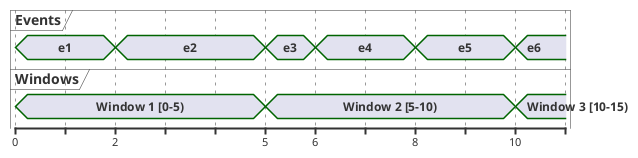
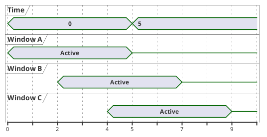
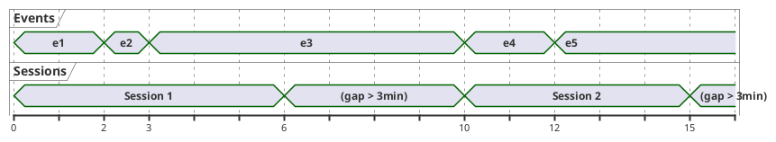
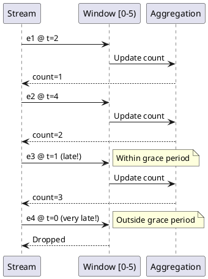

# Windowing

Windowing groups records into finite sets based on time, enabling time-bounded aggregations and joins. This guide covers window types, time semantics, and late arrival handling.

---

## Time Concepts

### Time Types

| Time Type | Description | Use Case |
|-----------|-------------|----------|
| **Event time** | Timestamp embedded in record | Business logic, reprocessing |
| **Processing time** | Wall-clock time when processed | Simple cases, debugging |
| **Ingestion time** | Time when record enters Kafka | Proxy for event time |

### Configuring Time

```java
// Extract event time from record
Consumed<String, Event> consumed = Consumed.with(Serdes.String(), eventSerde)
    .withTimestampExtractor(new TimestampExtractor() {
        @Override
        public long extract(ConsumerRecord<Object, Object> record, long partitionTime) {
            Event event = (Event) record.value();
            return event.getTimestamp();
        }
    });

KStream<String, Event> stream = builder.stream("events", consumed);
```

---

## Window Types

### Tumbling Windows

Fixed-size, non-overlapping windows:



```java
// 5-minute tumbling windows
KTable<Windowed<String>, Long> tumblingCounts = stream
    .groupByKey()
    .windowedBy(TimeWindows.ofSizeWithNoGrace(Duration.ofMinutes(5)))
    .count();

// With grace period for late arrivals
KTable<Windowed<String>, Long> tumblingWithGrace = stream
    .groupByKey()
    .windowedBy(TimeWindows.ofSizeAndGrace(
        Duration.ofMinutes(5),
        Duration.ofMinutes(1)  // Accept late records up to 1 minute
    ))
    .count();
```

### Hopping Windows

Fixed-size, overlapping windows:



```java
// 5-minute windows, advancing every 2 minutes
KTable<Windowed<String>, Long> hoppingCounts = stream
    .groupByKey()
    .windowedBy(TimeWindows.ofSizeAndGrace(Duration.ofMinutes(5), Duration.ofMinutes(1))
        .advanceBy(Duration.ofMinutes(2)))
    .count();
```

### Sliding Windows

Window around each record, used for joins:

```java
// Join events within 5 minutes of each other
KStream<String, EnrichedOrder> joined = orders.join(
    payments,
    (order, payment) -> new EnrichedOrder(order, payment),
    JoinWindows.ofTimeDifferenceWithNoGrace(Duration.ofMinutes(5)),
    StreamJoined.with(Serdes.String(), orderSerde, paymentSerde)
);

// Sliding windows for aggregations (Kafka 2.7+)
KTable<Windowed<String>, Long> slidingCounts = stream
    .groupByKey()
    .windowedBy(SlidingWindows.ofTimeDifferenceAndGrace(
        Duration.ofMinutes(5),
        Duration.ofMinutes(1)
    ))
    .count();
```

### Session Windows

Dynamic windows based on activity gaps:



```java
// Session windows with 5-minute inactivity gap
KTable<Windowed<String>, Long> sessionCounts = stream
    .groupByKey()
    .windowedBy(SessionWindows.ofInactivityGapAndGrace(
        Duration.ofMinutes(5),
        Duration.ofMinutes(1)
    ))
    .count();
```

---

## Window Comparison

| Window Type | Size | Overlap | Use Case |
|-------------|------|---------|----------|
| **Tumbling** | Fixed | None | Periodic reports |
| **Hopping** | Fixed | Yes | Smoothed metrics |
| **Sliding** | Fixed | Yes | Correlation analysis |
| **Session** | Variable | None | User sessions |

---

## Late Arrivals

### Grace Period

Configure how long to accept late records:

```java
// Accept records up to 1 minute late
TimeWindows.ofSizeAndGrace(
    Duration.ofMinutes(5),
    Duration.ofMinutes(1)
);

// No grace - reject all late records (default)
TimeWindows.ofSizeWithNoGrace(Duration.ofMinutes(5));
```

### Handling Late Records



### Suppression

Control when windowed results are emitted:

```java
// Emit only final results
KTable<Windowed<String>, Long> finalCounts = stream
    .groupByKey()
    .windowedBy(TimeWindows.ofSizeAndGrace(Duration.ofMinutes(5), Duration.ofMinutes(1)))
    .count()
    .suppress(Suppressed.untilWindowCloses(BufferConfig.unbounded()));

// Emit final results with bounded buffer
KTable<Windowed<String>, Long> boundedFinal = stream
    .groupByKey()
    .windowedBy(TimeWindows.ofSizeAndGrace(Duration.ofMinutes(5), Duration.ofMinutes(1)))
    .count()
    .suppress(Suppressed.untilWindowCloses(
        BufferConfig.maxBytes(1_000_000L)  // 1MB buffer
            .shutDownWhenFull()
    ));

// Emit intermediate results with rate limiting
KTable<Windowed<String>, Long> rateLimited = stream
    .groupByKey()
    .windowedBy(TimeWindows.ofSizeAndGrace(Duration.ofMinutes(5), Duration.ofMinutes(1)))
    .count()
    .suppress(Suppressed.untilTimeLimit(
        Duration.ofSeconds(30),
        BufferConfig.unbounded()
    ));
```

---

## Windowed Aggregations

### Count

```java
KTable<Windowed<String>, Long> windowedCounts = stream
    .groupByKey()
    .windowedBy(TimeWindows.ofSizeAndGrace(Duration.ofMinutes(5), Duration.ofMinutes(1)))
    .count(
        Materialized.<String, Long, WindowStore<Bytes, byte[]>>as("windowed-counts")
            .withRetention(Duration.ofHours(1))
    );
```

### Reduce

```java
KTable<Windowed<String>, Double> maxValues = stream
    .groupByKey()
    .windowedBy(TimeWindows.ofSizeAndGrace(Duration.ofMinutes(5), Duration.ofMinutes(1)))
    .reduce(
        (v1, v2) -> Math.max(v1, v2),
        Materialized.with(Serdes.String(), Serdes.Double())
    );
```

### Aggregate

```java
KTable<Windowed<String>, Statistics> stats = stream
    .groupByKey()
    .windowedBy(TimeWindows.ofSizeAndGrace(Duration.ofMinutes(5), Duration.ofMinutes(1)))
    .aggregate(
        Statistics::new,
        (key, value, stats) -> stats.add(value),
        Materialized.<String, Statistics, WindowStore<Bytes, byte[]>>as("stats-store")
            .withValueSerde(statisticsSerde)
    );
```

---

## Windowed Keys

### Working with Windowed Keys

```java
KTable<Windowed<String>, Long> windowedCounts = /* ... */;

// Convert to stream for further processing
KStream<Windowed<String>, Long> countsStream = windowedCounts.toStream();

// Extract window information
countsStream.foreach((windowedKey, count) -> {
    String key = windowedKey.key();
    Window window = windowedKey.window();
    long start = window.start();
    long end = window.end();

    System.out.printf("Key: %s, Window: [%d, %d), Count: %d%n",
        key, start, end, count);
});

// Change key to include window info
KStream<String, Long> flatCounts = countsStream.map((windowedKey, count) -> {
    String newKey = windowedKey.key() + "-" + windowedKey.window().start();
    return KeyValue.pair(newKey, count);
});
```

### Windowed Key Serialization

```java
// For output topics
countsStream.to(
    "windowed-counts",
    Produced.with(
        WindowedSerdes.timeWindowedSerdeFrom(String.class, Duration.ofMinutes(5).toMillis()),
        Serdes.Long()
    )
);

// Custom windowed key serde
Serde<Windowed<String>> windowedSerde = new WindowedSerdes.TimeWindowedSerde<>(
    Serdes.String(),
    Duration.ofMinutes(5).toMillis()
);
```

---

## Retention Configuration

### Store Retention

```java
// Materialized store with retention
Materialized.<String, Long, WindowStore<Bytes, byte[]>>as("windowed-store")
    .withRetention(Duration.ofHours(24));  // Keep windows for 24 hours

// Retention must be >= window size + grace period
// retention >= size + grace
```

### Changelog Retention

```java
// Configure changelog topic retention
props.put(StreamsConfig.topicPrefix("windowstore.changelog") + "retention.ms",
    String.valueOf(Duration.ofHours(24).toMillis()));
```

---

## Querying Windowed Stores

### Point Query

```java
ReadOnlyWindowStore<String, Long> store = streams.store(
    StoreQueryParameters.fromNameAndType(
        "windowed-counts",
        QueryableStoreTypes.windowStore()
    )
);

// Fetch for specific window
Instant windowStart = Instant.now().minus(Duration.ofMinutes(5));
Long count = store.fetch("key", windowStart.toEpochMilli());
```

### Range Query

```java
// Fetch all windows in time range
Instant from = Instant.now().minus(Duration.ofHours(1));
Instant to = Instant.now();

try (WindowStoreIterator<Long> iter = store.fetch("key", from, to)) {
    while (iter.hasNext()) {
        KeyValue<Long, Long> kv = iter.next();
        long windowStart = kv.key;
        long count = kv.value;
        System.out.printf("Window starting %d: count=%d%n", windowStart, count);
    }
}

// Fetch all keys in time range
try (KeyValueIterator<Windowed<String>, Long> iter = store.fetchAll(from, to)) {
    while (iter.hasNext()) {
        KeyValue<Windowed<String>, Long> kv = iter.next();
        // Process each windowed key-value
    }
}
```

---

## Best Practices

### Window Size Selection

| Consideration | Guidance |
|---------------|----------|
| Latency requirements | Smaller windows = faster results |
| Data volume | Larger windows = fewer outputs |
| Late arrivals | Grace period adds latency |
| Memory usage | More windows = more memory |

### Performance Optimization

| Practice | Recommendation |
|----------|----------------|
| Limit retention | Keep only necessary history |
| Use suppression | Reduce output volume |
| Appropriate grace | Balance completeness vs latency |
| Monitor state size | Alert on excessive growth |

### Common Patterns

```java
// Metrics per minute with 1-hour retention
TimeWindows.ofSizeAndGrace(Duration.ofMinutes(1), Duration.ofSeconds(30))
    // Materialized with 1-hour retention

// User sessions with 30-minute timeout
SessionWindows.ofInactivityGapAndGrace(Duration.ofMinutes(30), Duration.ofMinutes(5))

// Sliding average over 5-minute window
SlidingWindows.ofTimeDifferenceAndGrace(Duration.ofMinutes(5), Duration.ofMinutes(1))
```

---

## Related Documentation

- [Kafka Streams Overview](index.md) - Stream processing concepts
- [DSL Reference](dsl/index.md) - Stream operations
- [State Stores](state-stores.md) - State management
- [Error Handling](error-handling.md) - Exception handling
