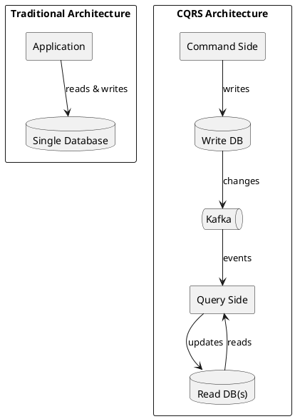
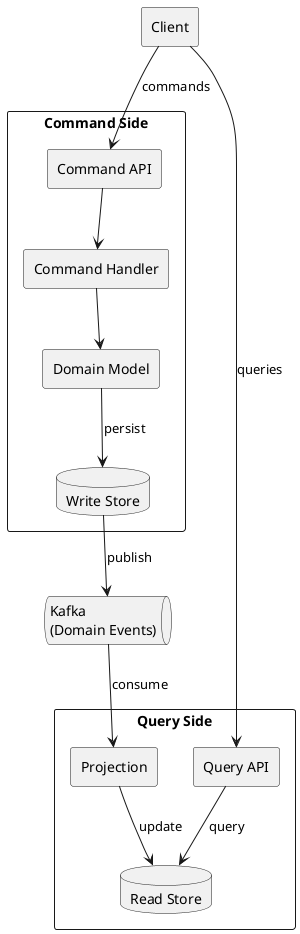
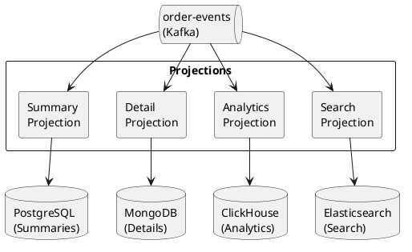
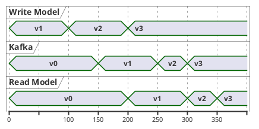

# CQRS with Kafka

Command Query Responsibility Segregation (CQRS) separates read and write operations into distinct models. Kafka serves as the transport layer between command and query sides, enabling independent scaling and optimization.

---

## Core Concepts

### Traditional vs CQRS Architecture



### Key Principles

| Principle | Description |
|-----------|-------------|
| **Separate models** | Write model optimized for commands, read model for queries |
| **Eventual consistency** | Read model lags behind write model |
| **Independent scaling** | Scale read and write sides independently |
| **Optimized storage** | Different storage technologies for each side |

---

## Architecture

### Component Overview



### Data Flow

1. **Command flow**: Client → Command API → Handler → Domain → Write Store → Kafka
2. **Query flow**: Kafka → Projection → Read Store → Query API → Client

---

## Command Side

### Command Definition

```java
public sealed interface OrderCommand {
    record CreateOrder(
        String orderId,
        String customerId,
        List<OrderItem> items
    ) implements OrderCommand {}

    record AddItem(
        String orderId,
        String productId,
        int quantity
    ) implements OrderCommand {}

    record SubmitOrder(
        String orderId
    ) implements OrderCommand {}

    record CancelOrder(
        String orderId,
        String reason
    ) implements OrderCommand {}
}
```

### Command Handler

```java
@Service
public class OrderCommandHandler {
    private final OrderRepository repository;
    private final EventPublisher eventPublisher;

    @Transactional
    public void handle(CreateOrder command) {
        // Validate
        if (repository.exists(command.orderId())) {
            throw new OrderAlreadyExistsException(command.orderId());
        }

        // Create aggregate
        Order order = Order.create(
            command.orderId(),
            command.customerId(),
            command.items()
        );

        // Persist
        repository.save(order);

        // Publish events
        eventPublisher.publish(new OrderCreated(
            order.getId(),
            order.getCustomerId(),
            order.getItems(),
            order.getCreatedAt()
        ));
    }

    @Transactional
    public void handle(SubmitOrder command) {
        Order order = repository.findById(command.orderId())
            .orElseThrow(() -> new OrderNotFoundException(command.orderId()));

        order.submit();
        repository.save(order);

        eventPublisher.publish(new OrderSubmitted(
            order.getId(),
            order.getTotal(),
            Instant.now()
        ));
    }
}
```

### Event Publisher with Outbox

```java
@Service
public class TransactionalEventPublisher implements EventPublisher {
    private final OutboxRepository outboxRepository;

    @Override
    public void publish(DomainEvent event) {
        // Write to outbox table within same transaction
        OutboxEntry entry = new OutboxEntry(
            UUID.randomUUID().toString(),
            event.getAggregateId(),
            event.getClass().getSimpleName(),
            serialize(event),
            Instant.now()
        );

        outboxRepository.save(entry);
        // Outbox publisher will send to Kafka asynchronously
    }
}
```

---

## Query Side

### Read Model Design

Design read models for specific query needs:

```java
// Optimized for order list queries
@Table("order_summaries")
public class OrderSummaryReadModel {
    private String orderId;
    private String customerId;
    private String customerName;  // Denormalized
    private String status;
    private BigDecimal total;
    private int itemCount;
    private Instant createdAt;
    private Instant updatedAt;
}

// Optimized for order detail queries
@Table("order_details")
public class OrderDetailReadModel {
    private String orderId;
    private String customerId;
    private CustomerInfo customer;  // Embedded
    private String status;
    private List<LineItem> items;   // Embedded
    private ShippingInfo shipping;  // Embedded
    private PaymentInfo payment;    // Embedded
    private List<StatusChange> history;
}

// Optimized for analytics
@Table("daily_order_stats")
public class DailyOrderStatsReadModel {
    private LocalDate date;
    private long orderCount;
    private BigDecimal totalRevenue;
    private BigDecimal averageOrderValue;
    private Map<String, Long> ordersByStatus;
}
```

### Projection Implementation

```java
@Component
public class OrderProjection {
    private final OrderSummaryRepository summaryRepo;
    private final OrderDetailRepository detailRepo;
    private final DailyStatsRepository statsRepo;

    @KafkaListener(topics = "order-events", groupId = "order-projection")
    public void project(ConsumerRecord<String, OrderEvent> record) {
        OrderEvent event = record.value();
        String orderId = record.key();

        switch (event) {
            case OrderCreated e -> handleOrderCreated(e);
            case OrderSubmitted e -> handleOrderSubmitted(e);
            case OrderShipped e -> handleOrderShipped(e);
            case OrderCancelled e -> handleOrderCancelled(e);
        }
    }

    private void handleOrderCreated(OrderCreated event) {
        // Create summary
        OrderSummaryReadModel summary = new OrderSummaryReadModel();
        summary.setOrderId(event.orderId());
        summary.setCustomerId(event.customerId());
        summary.setStatus("CREATED");
        summary.setItemCount(event.items().size());
        summary.setTotal(calculateTotal(event.items()));
        summary.setCreatedAt(event.timestamp());
        summaryRepo.save(summary);

        // Create detail
        OrderDetailReadModel detail = new OrderDetailReadModel();
        detail.setOrderId(event.orderId());
        detail.setItems(toLineItems(event.items()));
        // ... populate other fields
        detailRepo.save(detail);
    }

    private void handleOrderSubmitted(OrderSubmitted event) {
        // Update summary
        summaryRepo.updateStatus(event.orderId(), "SUBMITTED", Instant.now());

        // Update detail
        detailRepo.addStatusChange(event.orderId(),
            new StatusChange("SUBMITTED", event.timestamp()));

        // Update daily stats
        statsRepo.incrementOrderCount(LocalDate.now());
        statsRepo.addRevenue(LocalDate.now(), event.total());
    }
}
```

### Query Service

```java
@Service
public class OrderQueryService {
    private final OrderSummaryRepository summaryRepo;
    private final OrderDetailRepository detailRepo;

    public Page<OrderSummaryReadModel> findOrders(OrderSearchCriteria criteria, Pageable pageable) {
        // Query optimized read model
        return summaryRepo.findByCriteria(criteria, pageable);
    }

    public Optional<OrderDetailReadModel> findOrderDetail(String orderId) {
        return detailRepo.findById(orderId);
    }

    public List<OrderSummaryReadModel> findCustomerOrders(String customerId) {
        return summaryRepo.findByCustomerId(customerId);
    }
}
```

---

## Multiple Read Models

Different query requirements can have different read models:



### Technology Selection

| Read Model | Technology | Reason |
|------------|------------|--------|
| Order summaries | PostgreSQL | Relational queries, pagination |
| Order details | MongoDB | Flexible schema, embedded documents |
| Analytics | ClickHouse | Columnar storage, aggregations |
| Full-text search | Elasticsearch | Text search, faceting |

---

## Consistency Handling

### Eventual Consistency

The read model lags behind the write model:



### Read-Your-Writes Consistency

For scenarios requiring immediate consistency after writes:

```java
@Service
public class ConsistentOrderService {
    private final OrderCommandHandler commandHandler;
    private final OrderQueryService queryService;
    private final VersionTracker versionTracker;

    public OrderDetailReadModel createAndRead(CreateOrder command) {
        // Execute command
        long version = commandHandler.handle(command);

        // Wait for projection to catch up
        versionTracker.waitForVersion(command.orderId(), version, Duration.ofSeconds(5));

        // Read from query side
        return queryService.findOrderDetail(command.orderId())
            .orElseThrow();
    }
}

@Component
public class VersionTracker {
    private final Map<String, Long> versions = new ConcurrentHashMap<>();

    public void updateVersion(String aggregateId, long version) {
        versions.put(aggregateId, version);
    }

    public void waitForVersion(String aggregateId, long version, Duration timeout) {
        Instant deadline = Instant.now().plus(timeout);

        while (Instant.now().isBefore(deadline)) {
            Long current = versions.get(aggregateId);
            if (current != null && current >= version) {
                return;
            }
            Thread.sleep(50);
        }

        throw new ConsistencyTimeoutException(aggregateId, version);
    }
}
```

### Stale Read Indicators

Include version information in read responses:

```java
public class OrderDetailResponse {
    private OrderDetailReadModel order;
    private long version;
    private Instant lastUpdated;
    private boolean stale;  // True if known to be behind
}
```

---

## Idempotent Projections

Handle duplicate events gracefully:

```java
@Component
public class IdempotentOrderProjection {
    private final ProjectionOffsetStore offsetStore;

    @KafkaListener(topics = "order-events")
    public void project(ConsumerRecord<String, OrderEvent> record) {
        String projectionId = "order-projection";
        String partitionKey = record.topic() + "-" + record.partition();
        long offset = record.offset();

        // Check if already processed
        if (offsetStore.isProcessed(projectionId, partitionKey, offset)) {
            return;  // Skip duplicate
        }

        // Process event
        doProject(record.value());

        // Mark as processed
        offsetStore.markProcessed(projectionId, partitionKey, offset);
    }
}
```

---

## Rebuilding Projections

Projections can be rebuilt from the event stream:

```java
@Component
public class ProjectionRebuilder {
    private final Consumer<String, OrderEvent> consumer;
    private final OrderProjection projection;

    public void rebuild(String projectionName) {
        // Clear existing read model
        projection.clear();

        // Reset to beginning of topic
        consumer.seekToBeginning(consumer.assignment());

        // Replay all events
        while (true) {
            ConsumerRecords<String, OrderEvent> records = consumer.poll(Duration.ofSeconds(1));

            if (records.isEmpty()) {
                break;  // Caught up
            }

            for (ConsumerRecord<String, OrderEvent> record : records) {
                projection.project(record);
            }
        }

        log.info("Projection {} rebuilt", projectionName);
    }
}
```

---

## API Design

### Command API

```java
@RestController
@RequestMapping("/orders")
public class OrderCommandController {
    private final OrderCommandHandler handler;

    @PostMapping
    @ResponseStatus(HttpStatus.ACCEPTED)  // Async processing
    public CreateOrderResponse create(@RequestBody CreateOrderRequest request) {
        String orderId = UUID.randomUUID().toString();
        handler.handle(new CreateOrder(orderId, request.customerId(), request.items()));
        return new CreateOrderResponse(orderId);
    }

    @PostMapping("/{orderId}/submit")
    @ResponseStatus(HttpStatus.ACCEPTED)
    public void submit(@PathVariable String orderId) {
        handler.handle(new SubmitOrder(orderId));
    }
}
```

### Query API

```java
@RestController
@RequestMapping("/orders")
public class OrderQueryController {
    private final OrderQueryService queryService;

    @GetMapping
    public Page<OrderSummaryReadModel> list(
            @RequestParam(required = false) String customerId,
            @RequestParam(required = false) String status,
            Pageable pageable) {
        return queryService.findOrders(
            new OrderSearchCriteria(customerId, status),
            pageable
        );
    }

    @GetMapping("/{orderId}")
    public OrderDetailReadModel get(@PathVariable String orderId) {
        return queryService.findOrderDetail(orderId)
            .orElseThrow(() -> new OrderNotFoundException(orderId));
    }
}
```

---

## Best Practices

### Command Side

| Practice | Description |
|----------|-------------|
| **Single responsibility** | Each command handler does one thing |
| **Validation first** | Validate before modifying state |
| **Idempotent commands** | Support safe retries |
| **Return minimal data** | Commands return ID only, use queries for data |

### Query Side

| Practice | Description |
|----------|-------------|
| **Design for queries** | Structure read models for specific use cases |
| **Denormalize freely** | Duplicate data for query performance |
| **Handle missing data** | Projections may not have all data yet |
| **Version read models** | Support schema evolution |

### General

| Practice | Description |
|----------|-------------|
| **Separate deployments** | Command and query services can deploy independently |
| **Monitor lag** | Track projection lag behind event stream |
| **Test projections** | Verify projections against expected read models |
| **Plan for rebuilds** | Design projections to support full rebuilds |

---

## Anti-Patterns

!!! danger "Avoid These Mistakes"

    **Queries in command handlers**
    : Don't query read models from command side. Use write model for validation.

    **Synchronous projections**
    : Don't update read models synchronously in command handlers.

    **Shared database**
    : Keep write and read databases separate for true independence.

    **Over-normalization of read models**
    : Read models should be denormalized and query-optimized.

    **Ignoring eventual consistency**
    : Design UX and APIs to handle lag between write and read.

---

## Related Documentation

- [Event Sourcing](event-sourcing.md) - Often combined with CQRS
- [Outbox Pattern](outbox.md) - Reliable event publishing
- [Consumer Development](../consumers/index.md) - Projection implementation
- [Anti-Patterns](../anti-patterns/index.md) - Common mistakes