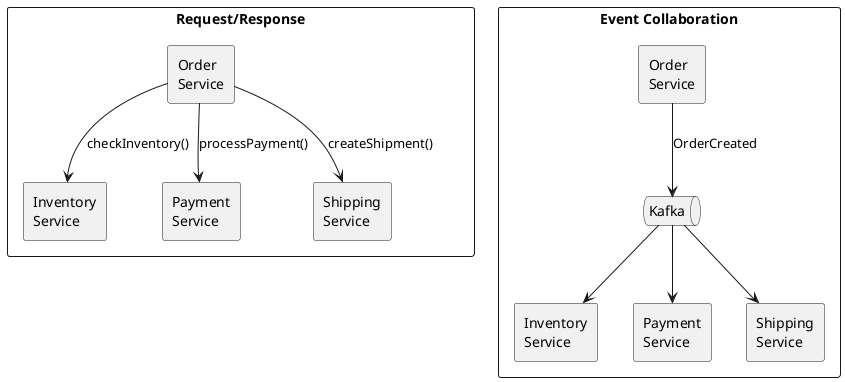
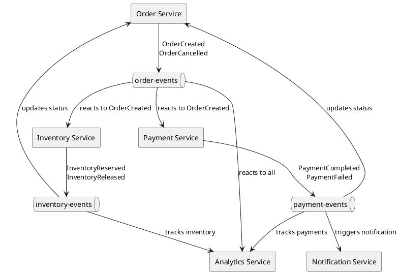

# Event Collaboration Pattern

Event collaboration (also called choreography) enables services to coordinate through domain events without direct coupling. Services react to events independently, enabling loose coupling and autonomous evolution.

---

## Core Concepts

### Request/Response vs Event Collaboration



### Key Characteristics

| Aspect | Request/Response | Event Collaboration |
|--------|------------------|---------------------|
| **Coupling** | Tight - caller knows callees | Loose - publisher doesn't know subscribers |
| **Availability** | Dependent on all services | Services operate independently |
| **Scalability** | Limited by synchronous calls | Independent scaling |
| **Evolution** | Changes affect callers | Add subscribers without changes |
| **Debugging** | Direct call stack | Distributed tracing required |

---

## Architecture

### Event-Driven Communication



### Event Types

| Type | Description | Example |
|------|-------------|---------|
| **Domain events** | Business-meaningful occurrences | `OrderPlaced`, `PaymentReceived` |
| **Integration events** | Cross-service communication | `CustomerCreated`, `PriceChanged` |
| **Notification events** | Trigger notifications | `OrderShipped`, `RefundProcessed` |

---

## Implementation

### Domain Event Definition

```java
public interface DomainEvent {
    String getEventId();
    String getAggregateId();
    Instant getOccurredAt();
}

public record OrderCreated(
    String eventId,
    String orderId,
    String customerId,
    List<OrderItem> items,
    BigDecimal total,
    Instant occurredAt
) implements DomainEvent {

    @Override
    public String getAggregateId() {
        return orderId;
    }
}

public record OrderCancelled(
    String eventId,
    String orderId,
    String reason,
    String cancelledBy,
    Instant occurredAt
) implements DomainEvent {

    @Override
    public String getAggregateId() {
        return orderId;
    }
}
```

### Event Publisher

```java
@Service
public class OrderService {
    private final OrderRepository repository;
    private final DomainEventPublisher eventPublisher;

    @Transactional
    public Order createOrder(CreateOrderRequest request) {
        Order order = new Order(request);
        order = repository.save(order);

        // Publish domain event
        eventPublisher.publish(new OrderCreated(
            UUID.randomUUID().toString(),
            order.getId(),
            order.getCustomerId(),
            order.getItems(),
            order.getTotal(),
            Instant.now()
        ));

        return order;
    }
}

@Component
public class KafkaDomainEventPublisher implements DomainEventPublisher {
    private final KafkaTemplate<String, DomainEvent> kafka;

    @Override
    public void publish(DomainEvent event) {
        String topic = topicFor(event);
        String key = event.getAggregateId();

        kafka.send(topic, key, event);
    }

    private String topicFor(DomainEvent event) {
        // Route by event type
        return switch (event) {
            case OrderCreated e -> "order-events";
            case OrderCancelled e -> "order-events";
            case PaymentCompleted e -> "payment-events";
            default -> "domain-events";
        };
    }
}
```

### Event Consumers

```java
// Inventory Service - reacts to orders
@Component
public class OrderEventHandler {
    private final InventoryService inventoryService;

    @KafkaListener(topics = "order-events", groupId = "inventory-service")
    public void onOrderEvent(DomainEvent event) {
        switch (event) {
            case OrderCreated created ->
                inventoryService.reserveItems(created.orderId(), created.items());

            case OrderCancelled cancelled ->
                inventoryService.releaseReservation(cancelled.orderId());

            default ->
                log.debug("Ignoring event: {}", event.getClass().getSimpleName());
        }
    }
}

// Payment Service - reacts to orders
@Component
public class PaymentOrderHandler {
    private final PaymentService paymentService;

    @KafkaListener(topics = "order-events", groupId = "payment-service")
    public void onOrderEvent(DomainEvent event) {
        if (event instanceof OrderCreated created) {
            paymentService.processPayment(
                created.orderId(),
                created.customerId(),
                created.total()
            );
        }
    }
}

// Analytics Service - observes all events
@Component
public class AnalyticsEventCollector {
    private final AnalyticsRepository repository;

    @KafkaListener(
        topicPattern = ".*-events",
        groupId = "analytics-service"
    )
    public void onAnyEvent(ConsumerRecord<String, DomainEvent> record) {
        repository.store(new AnalyticsEvent(
            record.topic(),
            record.value().getClass().getSimpleName(),
            record.value(),
            Instant.now()
        ));
    }
}
```

---

## Event Design

### Event Granularity

```java
// Fine-grained events - more flexibility, more events
OrderLineItemAdded
OrderLineItemRemoved
OrderLineItemQuantityChanged
OrderShippingAddressSet
OrderBillingAddressSet
OrderPaymentMethodSet

// Coarse-grained events - simpler, less flexibility
OrderUpdated  // Contains all changes
```

| Granularity | Pros | Cons |
|-------------|------|------|
| **Fine-grained** | Precise reactions, better auditing | More events to handle, ordering complexity |
| **Coarse-grained** | Simpler handling, fewer events | Less precise reactions, may miss changes |

### Event Content

```java
// Notification style - minimal data, requires lookups
public record OrderCreated(
    String orderId,
    Instant occurredAt
) {}

// Event-carried state transfer - self-contained
public record OrderCreated(
    String orderId,
    String customerId,
    String customerEmail,      // Denormalized
    String customerName,       // Denormalized
    List<OrderItem> items,
    BigDecimal subtotal,
    BigDecimal tax,
    BigDecimal total,
    Address shippingAddress,
    Address billingAddress,
    Instant occurredAt
) {}
```

| Style | Pros | Cons |
|-------|------|------|
| **Notification** | Small events, always current data | Requires service calls, coupling |
| **State transfer** | Self-contained, no lookups | Larger events, potentially stale data |

**Recommendation:** Prefer event-carried state transfer for loose coupling.

---

## Handling Reactions

### Idempotent Handlers

```java
@Component
public class IdempotentInventoryHandler {
    private final InventoryRepository inventoryRepo;
    private final ProcessedEventRepository processedRepo;

    @KafkaListener(topics = "order-events")
    @Transactional
    public void onOrderCreated(OrderCreated event) {
        // Check idempotency
        if (processedRepo.existsByEventId(event.eventId())) {
            return;
        }

        // Process event
        for (OrderItem item : event.items()) {
            inventoryRepo.reserve(item.productId(), item.quantity(), event.orderId());
        }

        // Mark as processed
        processedRepo.save(new ProcessedEvent(event.eventId(), Instant.now()));
    }
}
```

### Reaction Events

Services publish their own events in response:

```java
@Component
public class InventoryOrderHandler {
    private final InventoryService inventoryService;
    private final DomainEventPublisher eventPublisher;

    @KafkaListener(topics = "order-events")
    public void onOrderCreated(OrderCreated event) {
        try {
            inventoryService.reserveItems(event.orderId(), event.items());

            // Publish success event
            eventPublisher.publish(new InventoryReserved(
                UUID.randomUUID().toString(),
                event.orderId(),
                event.items(),
                Instant.now()
            ));

        } catch (InsufficientInventoryException e) {
            // Publish failure event
            eventPublisher.publish(new InventoryReservationFailed(
                UUID.randomUUID().toString(),
                event.orderId(),
                e.getProductId(),
                e.getMessage(),
                Instant.now()
            ));
        }
    }
}
```

---

## Consumer Groups

### Independent Processing

Each service has its own consumer group:

```
order-events topic:
├── inventory-service group   → reserves inventory
├── payment-service group     → processes payment
├── notification-service group → sends confirmation
└── analytics-service group   → tracks metrics
```

### Consumer Group Configuration

```java
@Configuration
public class KafkaConsumerConfig {

    @Bean
    public ConsumerFactory<String, DomainEvent> consumerFactory() {
        Map<String, Object> props = new HashMap<>();
        props.put(ConsumerConfig.BOOTSTRAP_SERVERS_CONFIG, "kafka:9092");
        props.put(ConsumerConfig.GROUP_ID_CONFIG, "inventory-service");
        props.put(ConsumerConfig.AUTO_OFFSET_RESET_CONFIG, "earliest");
        props.put(ConsumerConfig.ENABLE_AUTO_COMMIT_CONFIG, false);
        return new DefaultKafkaConsumerFactory<>(props);
    }
}
```

---

## Error Handling

### Dead Letter Topics

```java
@Component
public class OrderEventHandler {
    private final KafkaTemplate<String, DomainEvent> kafka;

    @KafkaListener(topics = "order-events")
    public void onOrderEvent(ConsumerRecord<String, DomainEvent> record) {
        try {
            processEvent(record.value());
        } catch (RetryableException e) {
            throw e;  // Let retry mechanism handle
        } catch (Exception e) {
            // Send to dead letter topic
            kafka.send(
                record.topic() + ".dlq",
                record.key(),
                record.value()
            );
            log.error("Sent to DLQ: {}", record.value(), e);
        }
    }
}
```

### Retry Configuration

```java
@Bean
public ConcurrentKafkaListenerContainerFactory<String, DomainEvent>
        kafkaListenerContainerFactory() {

    ConcurrentKafkaListenerContainerFactory<String, DomainEvent> factory =
        new ConcurrentKafkaListenerContainerFactory<>();

    factory.setConsumerFactory(consumerFactory());

    // Retry configuration
    factory.setCommonErrorHandler(new DefaultErrorHandler(
        new DeadLetterPublishingRecoverer(kafkaTemplate),
        new FixedBackOff(1000L, 3)  // 3 retries, 1 second apart
    ));

    return factory;
}
```

---

## Event Versioning

### Schema Evolution

```java
// Version 1
public record OrderCreatedV1(
    String orderId,
    String customerId,
    BigDecimal total
) {}

// Version 2 - added fields
public record OrderCreatedV2(
    String orderId,
    String customerId,
    BigDecimal total,
    String currency,           // New field
    List<OrderItem> items      // New field
) {}
```

### Handling Multiple Versions

```java
@Component
public class VersionAwareOrderHandler {

    @KafkaListener(topics = "order-events")
    public void onOrderEvent(ConsumerRecord<String, JsonNode> record) {
        JsonNode event = record.value();
        int version = event.path("version").asInt(1);

        switch (version) {
            case 1 -> handleV1(parseV1(event));
            case 2 -> handleV2(parseV2(event));
            default -> log.warn("Unknown version: {}", version);
        }
    }

    private void handleV1(OrderCreatedV1 event) {
        // Handle with defaults for missing fields
        handleOrder(event.orderId(), event.customerId(),
            event.total(), "USD", List.of());
    }

    private void handleV2(OrderCreatedV2 event) {
        handleOrder(event.orderId(), event.customerId(),
            event.total(), event.currency(), event.items());
    }
}
```

---

## Observability

### Correlation IDs

```java
public record DomainEventHeaders {
    String eventId;
    String correlationId;
    String causationId;
    String source;
    Instant timestamp;
}

@Component
public class CorrelatedEventPublisher {

    public void publish(DomainEvent event, String correlationId, String causationId) {
        ProducerRecord<String, DomainEvent> record = new ProducerRecord<>(
            topicFor(event),
            event.getAggregateId(),
            event
        );

        record.headers()
            .add("correlation-id", correlationId.getBytes())
            .add("causation-id", causationId.getBytes())
            .add("source", "order-service".getBytes());

        kafka.send(record);
    }
}

@Component
public class CorrelatedEventHandler {
    private final DomainEventPublisher publisher;

    @KafkaListener(topics = "order-events")
    public void onOrderCreated(ConsumerRecord<String, OrderCreated> record) {
        String correlationId = header(record, "correlation-id");
        String causationId = record.value().eventId();  // This event caused next

        // Process and publish reaction with correlation
        InventoryReserved reaction = processAndReact(record.value());
        publisher.publish(reaction, correlationId, causationId);
    }
}
```

### Distributed Tracing

```java
@Component
public class TracedEventHandler {
    private final Tracer tracer;

    @KafkaListener(topics = "order-events")
    public void onOrderEvent(ConsumerRecord<String, DomainEvent> record) {
        // Extract trace context from headers
        SpanContext parentContext = tracer.extract(
            Format.Builtin.TEXT_MAP,
            new KafkaHeadersExtractor(record.headers())
        );

        // Create child span
        Span span = tracer.buildSpan("process-order-event")
            .asChildOf(parentContext)
            .withTag("event.type", record.value().getClass().getSimpleName())
            .withTag("event.id", record.value().getEventId())
            .start();

        try (Scope scope = tracer.scopeManager().activate(span)) {
            processEvent(record.value());
        } finally {
            span.finish();
        }
    }
}
```

---

## Anti-Patterns

!!! danger "Avoid These Mistakes"

    **Event chains as workflow**
    : Long event chains are hard to understand and debug. Use saga orchestration for complex workflows.

    **Request/response over events**
    : Don't use events for synchronous request/response. Use direct calls or dedicated request/reply topics.

    **Missing events**
    : Consumers shouldn't assume all events arrive. Design for missing or out-of-order events.

    **Tight event coupling**
    : Don't design events around consumer needs. Events should represent domain facts.

    **Ignoring idempotency**
    : Events may be delivered multiple times. All handlers must be idempotent.

---

## Best Practices

### Event Design

| Practice | Description |
|----------|-------------|
| **Past tense naming** | Events describe what happened: `OrderCreated`, not `CreateOrder` |
| **Self-contained** | Include all data consumers need |
| **Versioned** | Include version for schema evolution |
| **Immutable** | Events represent facts, never change them |

### Consumer Design

| Practice | Description |
|----------|-------------|
| **Independent groups** | Each service has its own consumer group |
| **Idempotent handling** | Handle duplicates gracefully |
| **Selective consumption** | Only process relevant event types |
| **Error isolation** | One consumer failure shouldn't affect others |

### Operations

| Practice | Description |
|----------|-------------|
| **Correlation IDs** | Track event chains across services |
| **Dead letter topics** | Capture failed events for analysis |
| **Monitoring** | Track consumer lag and processing times |
| **Replay capability** | Design for event replay scenarios |

---

## Related Documentation

- [Saga Pattern](saga.md) - Orchestrated distributed transactions
- [Outbox Pattern](outbox.md) - Reliable event publishing
- [Consumer Development](../consumers/index.md) - Consumer implementation
- [Delivery Semantics](../../concepts/delivery-semantics/index.md) - Message delivery guarantees
