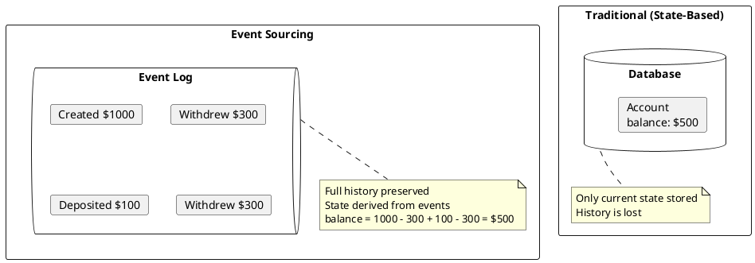
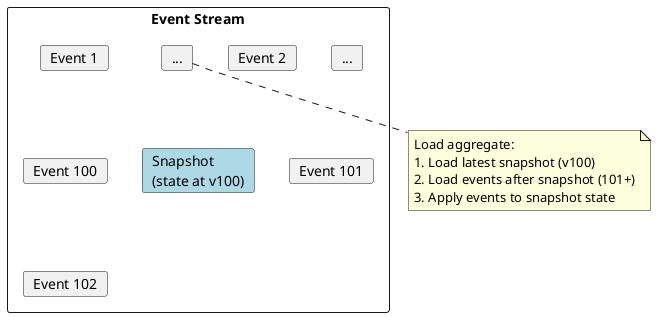

# Event Sourcing with Kafka

Event sourcing stores application state as a sequence of immutable events rather than current state snapshots. Kafka serves as a durable, ordered event log suitable for event sourcing implementations.

---

## Core Concepts

### Traditional State vs Event Sourcing



### Key Principles

| Principle | Description |
|-----------|-------------|
| **Immutability** | Events are never modified or deleted |
| **Append-only** | New events are only appended to the log |
| **Derived state** | Current state is computed from event sequence |
| **Single source of truth** | Event log is the authoritative record |

---

## Kafka as Event Store

### Topic Design

```
# One topic per aggregate type
orders-events
accounts-events
inventory-events

# Partition by aggregate ID for ordering
partition_key = aggregate_id
```

### Topic Configuration

```properties
# Event sourcing topic configuration
cleanup.policy=delete
retention.ms=-1                    # Infinite retention (or set appropriate value)
retention.bytes=-1                 # No size limit
min.insync.replicas=2
replication.factor=3

# Disable compaction - all events must be preserved
cleanup.policy=delete

# For snapshot topics (optional)
# cleanup.policy=compact
```

---

## Event Structure

### Event Schema

```json
{
  "eventId": "evt-123e4567-e89b",
  "aggregateId": "account-001",
  "aggregateType": "Account",
  "eventType": "MoneyWithdrawn",
  "version": 5,
  "timestamp": "2024-01-15T10:30:00Z",
  "payload": {
    "amount": 100.00,
    "currency": "USD"
  },
  "metadata": {
    "correlationId": "corr-789",
    "causationId": "cmd-456",
    "userId": "user-123"
  }
}
```

### Event Types

Define explicit event types for each domain action:

```java
// Account aggregate events
public sealed interface AccountEvent {
    record AccountCreated(String accountId, String owner, BigDecimal initialBalance)
        implements AccountEvent {}

    record MoneyDeposited(String accountId, BigDecimal amount, String reference)
        implements AccountEvent {}

    record MoneyWithdrawn(String accountId, BigDecimal amount, String reference)
        implements AccountEvent {}

    record AccountClosed(String accountId, String reason)
        implements AccountEvent {}
}
```

---

## Implementation

### Event Store Interface

```java
public interface EventStore {
    /**
     * Append events to the store.
     * @param aggregateId Aggregate identifier
     * @param events Events to append
     * @param expectedVersion Expected current version for optimistic locking
     * @throws ConcurrencyException if version mismatch
     */
    void append(String aggregateId, List<Event> events, long expectedVersion);

    /**
     * Load all events for an aggregate.
     */
    List<Event> loadEvents(String aggregateId);

    /**
     * Load events from a specific version.
     */
    List<Event> loadEvents(String aggregateId, long fromVersion);
}
```

### Kafka Event Store Implementation

```java
public class KafkaEventStore implements EventStore {
    private final Producer<String, Event> producer;
    private final String topic;
    private final EventCache cache;

    @Override
    public void append(String aggregateId, List<Event> events, long expectedVersion) {
        // Verify expected version
        long currentVersion = getCurrentVersion(aggregateId);
        if (currentVersion != expectedVersion) {
            throw new ConcurrencyException(
                "Expected version " + expectedVersion + ", found " + currentVersion
            );
        }

        // Assign versions and publish
        long version = expectedVersion;
        for (Event event : events) {
            event.setVersion(++version);

            ProducerRecord<String, Event> record = new ProducerRecord<>(
                topic,
                aggregateId,  // Key ensures ordering per aggregate
                event
            );

            // Add headers for metadata
            record.headers()
                .add("eventType", event.getType().getBytes())
                .add("version", Long.toString(version).getBytes());

            producer.send(record).get();  // Synchronous for ordering guarantee
        }
    }

    @Override
    public List<Event> loadEvents(String aggregateId) {
        // Load from cache or consume from Kafka
        return loadEvents(aggregateId, 0);
    }

    @Override
    public List<Event> loadEvents(String aggregateId, long fromVersion) {
        List<Event> events = new ArrayList<>();

        // Create consumer for specific aggregate
        try (Consumer<String, Event> consumer = createConsumer()) {
            // Assign partition based on aggregate ID
            int partition = partitionFor(aggregateId);
            TopicPartition tp = new TopicPartition(topic, partition);
            consumer.assign(List.of(tp));

            // Seek to beginning and filter
            consumer.seekToBeginning(List.of(tp));

            while (true) {
                ConsumerRecords<String, Event> records = consumer.poll(Duration.ofMillis(100));
                if (records.isEmpty()) break;

                for (ConsumerRecord<String, Event> record : records) {
                    if (record.key().equals(aggregateId)) {
                        Event event = record.value();
                        if (event.getVersion() > fromVersion) {
                            events.add(event);
                        }
                    }
                }
            }
        }

        return events;
    }
}
```

### Aggregate Root

```java
public abstract class AggregateRoot<E> {
    protected String id;
    protected long version = 0;
    private final List<E> uncommittedEvents = new ArrayList<>();

    /**
     * Apply an event to update state and track for persistence.
     */
    protected void apply(E event) {
        applyEvent(event);
        uncommittedEvents.add(event);
    }

    /**
     * Reconstitute aggregate from event history.
     */
    public void loadFromHistory(List<E> events) {
        for (E event : events) {
            applyEvent(event);
            version++;
        }
    }

    /**
     * Apply event to update internal state.
     * Must be implemented by concrete aggregates.
     */
    protected abstract void applyEvent(E event);

    public List<E> getUncommittedEvents() {
        return Collections.unmodifiableList(uncommittedEvents);
    }

    public void markCommitted() {
        version += uncommittedEvents.size();
        uncommittedEvents.clear();
    }
}
```

### Account Aggregate Example

```java
public class Account extends AggregateRoot<AccountEvent> {
    private String owner;
    private BigDecimal balance;
    private boolean closed;

    // Command handlers
    public void create(String owner, BigDecimal initialBalance) {
        if (this.id != null) {
            throw new IllegalStateException("Account already exists");
        }
        apply(new AccountCreated(UUID.randomUUID().toString(), owner, initialBalance));
    }

    public void deposit(BigDecimal amount, String reference) {
        validateOpen();
        if (amount.compareTo(BigDecimal.ZERO) <= 0) {
            throw new IllegalArgumentException("Amount must be positive");
        }
        apply(new MoneyDeposited(id, amount, reference));
    }

    public void withdraw(BigDecimal amount, String reference) {
        validateOpen();
        if (amount.compareTo(balance) > 0) {
            throw new InsufficientFundsException(id, amount, balance);
        }
        apply(new MoneyWithdrawn(id, amount, reference));
    }

    // Event handlers
    @Override
    protected void applyEvent(AccountEvent event) {
        switch (event) {
            case AccountCreated e -> {
                this.id = e.accountId();
                this.owner = e.owner();
                this.balance = e.initialBalance();
                this.closed = false;
            }
            case MoneyDeposited e -> {
                this.balance = this.balance.add(e.amount());
            }
            case MoneyWithdrawn e -> {
                this.balance = this.balance.subtract(e.amount());
            }
            case AccountClosed e -> {
                this.closed = true;
            }
        }
    }

    private void validateOpen() {
        if (closed) {
            throw new AccountClosedException(id);
        }
    }
}
```

---

## Snapshots

For aggregates with many events, snapshots improve load performance:

### Snapshot Strategy



### Snapshot Implementation

```java
public class SnapshotStore {
    private final Producer<String, Snapshot> producer;
    private final String snapshotTopic;

    public void saveSnapshot(String aggregateId, Object state, long version) {
        Snapshot snapshot = new Snapshot(aggregateId, version, serialize(state));

        ProducerRecord<String, Snapshot> record = new ProducerRecord<>(
            snapshotTopic,
            aggregateId,
            snapshot
        );

        producer.send(record);
    }

    public Optional<Snapshot> loadLatestSnapshot(String aggregateId) {
        // Use compacted topic - only latest value per key retained
        // Consumer reads latest snapshot for aggregate
    }
}

// Modified aggregate loading
public Account loadAccount(String accountId) {
    Account account = new Account();

    // Try to load from snapshot first
    Optional<Snapshot> snapshot = snapshotStore.loadLatestSnapshot(accountId);

    long fromVersion = 0;
    if (snapshot.isPresent()) {
        account.restoreFromSnapshot(snapshot.get());
        fromVersion = snapshot.get().getVersion();
    }

    // Load events after snapshot
    List<AccountEvent> events = eventStore.loadEvents(accountId, fromVersion);
    account.loadFromHistory(events);

    // Create new snapshot if needed
    if (events.size() > SNAPSHOT_THRESHOLD) {
        snapshotStore.saveSnapshot(accountId, account.getState(), account.getVersion());
    }

    return account;
}
```

---

## Projections

Build read models by consuming the event stream:

```java
public class AccountBalanceProjection {
    private final Map<String, BigDecimal> balances = new ConcurrentHashMap<>();

    @KafkaListener(topics = "accounts-events")
    public void onEvent(ConsumerRecord<String, AccountEvent> record) {
        AccountEvent event = record.value();

        switch (event) {
            case AccountCreated e ->
                balances.put(e.accountId(), e.initialBalance());

            case MoneyDeposited e ->
                balances.compute(e.accountId(), (k, v) -> v.add(e.amount()));

            case MoneyWithdrawn e ->
                balances.compute(e.accountId(), (k, v) -> v.subtract(e.amount()));

            case AccountClosed e ->
                balances.remove(e.accountId());
        }
    }

    public BigDecimal getBalance(String accountId) {
        return balances.get(accountId);
    }
}
```

---

## Temporal Queries

Event sourcing enables point-in-time state reconstruction:

```java
public Account getAccountAtTime(String accountId, Instant pointInTime) {
    Account account = new Account();

    List<AccountEvent> events = eventStore.loadEvents(accountId);

    // Apply only events up to the specified time
    List<AccountEvent> historicalEvents = events.stream()
        .filter(e -> e.getTimestamp().isBefore(pointInTime))
        .toList();

    account.loadFromHistory(historicalEvents);
    return account;
}
```

---

## Error Handling

### Compensating Events

Events are immutable. Errors are corrected by publishing compensating events:

```java
// Original erroneous event
MoneyWithdrawn(accountId="acc-001", amount=1000.00, reference="TXN-001")

// Compensating event to correct error
MoneyDeposited(accountId="acc-001", amount=1000.00, reference="CORRECTION-TXN-001")

// Correct event
MoneyWithdrawn(accountId="acc-001", amount=100.00, reference="TXN-001-CORRECTED")
```

### Idempotent Event Handling

```java
public class IdempotentEventHandler {
    private final Set<String> processedEventIds;

    public void handle(Event event) {
        // Check if already processed
        if (processedEventIds.contains(event.getEventId())) {
            return;  // Skip duplicate
        }

        // Process event
        processEvent(event);

        // Mark as processed
        processedEventIds.add(event.getEventId());
    }
}
```

---

## Best Practices

### Event Design

| Practice | Description |
|----------|-------------|
| **Past tense naming** | `OrderPlaced`, `PaymentReceived`, not `PlaceOrder` |
| **Include all data** | Events should be self-contained |
| **Avoid references** | Include denormalized data, not IDs only |
| **Version events** | Support schema evolution |
| **Business language** | Use domain terminology |

### Performance

| Practice | Description |
|----------|-------------|
| **Snapshot regularly** | Every N events or time interval |
| **Partition by aggregate** | Ensures ordering, enables parallelism |
| **Cache recent aggregates** | Reduce event store reads |
| **Use appropriate retention** | Balance storage vs replay needs |

### Schema Evolution

| Strategy | Use Case |
|----------|----------|
| **Upcasting** | Transform old events to new format on read |
| **Versioned events** | Include version in event type |
| **Weak schema** | Optional fields with defaults |

---

## Anti-Patterns

!!! danger "Avoid These Mistakes"

    **Mutable events**
    : Never update or delete events. Publish compensating events instead.

    **Large aggregates**
    : Keep aggregates small. Large aggregates require many events and slow loading.

    **Missing event data**
    : Events should contain all information needed. Avoid requiring external lookups.

    **Synchronous projections**
    : Projections should be asynchronous. Don't block command processing.

    **Global event ordering**
    : Only order within aggregates. Global ordering doesn't scale.

---

## Related Documentation

- [CQRS](cqrs.md) - Often combined with event sourcing
- [Outbox Pattern](outbox.md) - Reliable event publishing
- [Delivery Semantics](../../concepts/delivery-semantics/index.md) - Exactly-once guarantees
- [Schema Registry](../../schema-registry/index.md) - Event schema management
