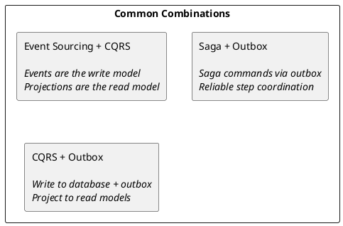

# Kafka Design Patterns

This section covers architectural patterns commonly implemented with Kafka for building event-driven systems. These patterns address challenges in distributed systems including data consistency, service coordination, and system evolution.

---

## Pattern Overview

| Pattern | Purpose | Complexity | Use Case |
|---------|---------|------------|----------|
| **[Event Sourcing](event-sourcing.md)** | Store state as event sequence | High | Audit trails, temporal queries |
| **[CQRS](cqrs.md)** | Separate read/write models | Medium | Read-heavy workloads, complex queries |
| **[Saga](saga.md)** | Distributed transactions | High | Multi-service workflows |
| **[Outbox](outbox.md)** | Reliable event publishing | Medium | Database + event consistency |
| **[Event Collaboration](event-collaboration.md)** | Service choreography | Low | Loosely coupled services |
| **[Microservices](microservices.md)** | Kafka architecture for microservices | Medium | Topic ownership, tracing, deployment |
| **[Shock Absorber](shock-absorber.md)** | Load leveling and buffering | Low | Traffic spikes, legacy protection |

---

## Pattern Selection

### When to Use Event Sourcing

Event sourcing is appropriate when:

- Complete audit history is required
- Temporal queries ("what was the state at time T?") are needed
- Event replay for debugging or recovery is valuable
- Domain events are natural to the business model

Event sourcing adds complexity and should be avoided for simple CRUD applications.

### When to Use CQRS

CQRS is appropriate when:

- Read and write workloads have different scaling requirements
- Read models require denormalized views optimized for queries
- Multiple read representations of the same data are needed
- Write operations are complex but queries are simple (or vice versa)

CQRS adds operational complexity through eventual consistency.

### When to Use Saga

Saga is appropriate when:

- Business processes span multiple services
- Distributed transactions (2PC) are not feasible
- Compensating actions can undo partial failures
- Long-running processes need coordination

Sagas require careful design of compensation logic.

### When to Use Outbox

Outbox is appropriate when:

- Database changes and event publishing must be atomic
- Exactly-once event publishing semantics are required
- Dual-write problems must be avoided
- Reliable event delivery without distributed transactions is needed

Outbox adds database polling or CDC infrastructure.

---

## Pattern Combinations

These patterns are often used together:

### Event Sourcing + CQRS

The most common combination. Events serve as the write model while projections serve as read models:

- **Write side**: Append events to event store (Kafka topic with compaction disabled)
- **Read side**: Consume events and build optimized query models

### Saga + Outbox

Ensures reliable saga step execution:

- Saga state changes written to database with outbox entries
- Outbox publisher sends saga commands to Kafka
- Guarantees saga progression even after failures

### CQRS + Outbox

Combines database writes with reliable event publishing:

- Write operations update database and outbox atomically
- Outbox publisher sends change events to Kafka
- Consumers build read models from events

---

## Implementation Considerations

### Idempotency

All patterns require idempotent message handling:

| Pattern | Idempotency Mechanism |
|---------|----------------------|
| Event Sourcing | Event sequence numbers, deduplication by event ID |
| CQRS | Projection offsets, idempotent projections |
| Saga | Saga instance ID + step tracking |
| Outbox | Outbox entry ID, consumer deduplication |

### Ordering Guarantees

Kafka provides ordering within partitions:

- Use consistent partition keys for related events
- Event sourcing: partition by aggregate ID
- Saga: partition by saga instance ID
- CQRS: partition by entity ID for ordered projections

### Error Handling

Each pattern has specific error handling requirements:

| Pattern | Error Strategy |
|---------|---------------|
| Event Sourcing | Events are immutable; publish compensating events |
| CQRS | Retry projection; rebuild from events if corrupted |
| Saga | Execute compensation steps; track failed state |
| Outbox | Retry publishing; dead letter for persistent failures |

---

## Technology Stack

### Event Store Options

| Option | Description | Trade-offs |
|--------|-------------|------------|
| Kafka (raw) | Events in Kafka topics | Simple, requires careful retention config |
| Kafka + compaction | Latest state per key | Good for CQRS, loses event history |
| Kafka + database | Events in both | Flexible querying, operational overhead |
| EventStoreDB | Purpose-built event store | Rich features, additional infrastructure |

### Outbox Implementation Options

| Option | Description | Trade-offs |
|--------|-------------|------------|
| Polling publisher | Poll database for outbox entries | Simple, adds latency |
| CDC (Debezium) | Stream database changes | Lower latency, more infrastructure |
| Transactional outbox | Database triggers | Database-specific, tight coupling |

---

## Pattern Documentation

- **[Event Sourcing](event-sourcing.md)** - Storing state as a sequence of events
- **[CQRS](cqrs.md)** - Command Query Responsibility Segregation
- **[Saga](saga.md)** - Distributed transaction coordination
- **[Outbox](outbox.md)** - Reliable event publishing with transactional outbox
- **[Event Collaboration](event-collaboration.md)** - Service choreography through events
- **[Microservices](microservices.md)** - Kafka architecture patterns for microservices
- **[Shock Absorber](shock-absorber.md)** - Load leveling and traffic spike absorption

---

## Related Documentation

- [Producer Development](../producers/index.md) - Reliable event publishing
- [Consumer Development](../consumers/index.md) - Event processing patterns
- [Delivery Semantics](../../concepts/delivery-semantics/index.md) - Exactly-once processing
- [Anti-Patterns](../anti-patterns/index.md) - Common mistakes to avoid