# Microservices with Kafka

Kafka serves as the messaging backbone for many microservices architectures, providing asynchronous communication, event-driven integration, and data streaming between services. This document covers Kafka-specific architectural decisions and patterns for microservices environments.

---

## Topic Ownership Models

How topics are owned and managed significantly impacts team autonomy, data governance, and operational complexity.

### Per-Service Topics (Recommended)

Each service owns its output topics. Services publish events about their domain; other services subscribe as needed.

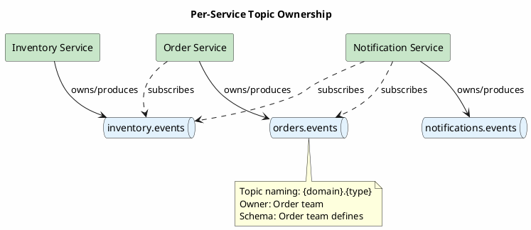

**Benefits:**

- Clear ownership and accountability
- Teams control their own schemas
- Independent deployment and scaling
- Natural bounded context alignment

**Topic naming conventions:**

```
{service}.{entity}.{event-type}

Examples:
orders.order.created
orders.order.shipped
inventory.stock.reserved
inventory.stock.depleted
payments.payment.completed
```

### Shared Domain Topics

Multiple services collaborate on shared domain topics. Useful for cross-cutting concerns.

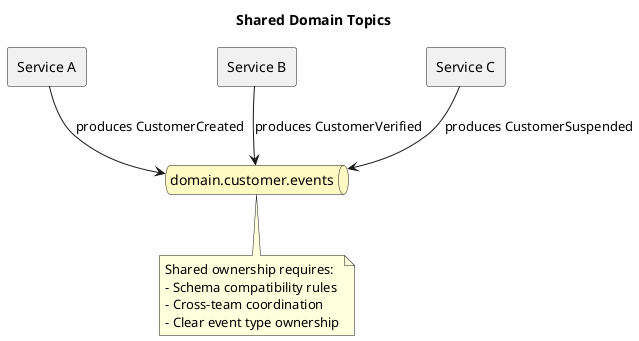

**When to use:**

- Aggregate events from multiple sources
- Cross-cutting audit/compliance streams
- Shared reference data

**Governance requirements:**

- Central schema registry with compatibility enforcement
- Clear documentation of which service owns which event types
- Breaking change coordination process

---

## Consumer Group Strategies

Consumer group design affects scaling, fault isolation, and message ordering guarantees.

### One Consumer Group Per Service

Each service instance joins the same consumer group, sharing partition load.

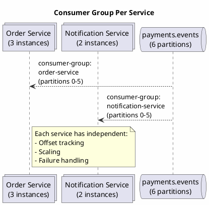

**Configuration:**

```properties
# Order Service
group.id=order-service
client.id=order-service-${HOSTNAME}

# Notification Service
group.id=notification-service
client.id=notification-service-${HOSTNAME}
```

### Multiple Consumer Groups Within a Service

A service may need multiple consumption patterns for the same topic.

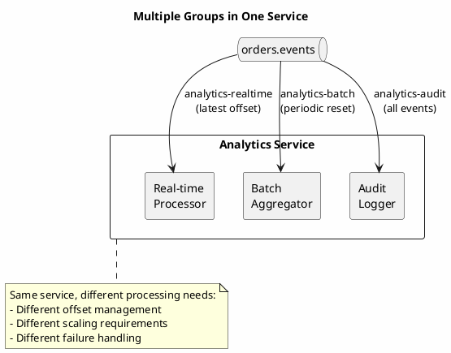

**Use cases:**

- Real-time vs batch processing
- Primary processing vs audit logging
- Different retention/replay requirements

---

## Schema Governance

Schema management becomes critical when multiple teams produce and consume events.

### Schema Registry Integration

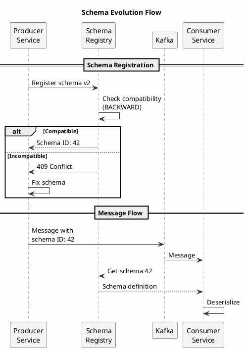

### Compatibility Strategies Per Topic

| Strategy | Producer Changes | Consumer Changes | Use Case |
|----------|------------------|------------------|----------|
| BACKWARD | Add optional fields, remove fields | Must handle missing fields | Default for events |
| FORWARD | Remove fields, add required fields | Must ignore unknown fields | API responses |
| FULL | Only optional field additions | Handle missing + ignore unknown | Strict contracts |
| NONE | Any change allowed | Must coordinate | Development only |

**Recommended approach:**

```
# Production topics
orders.events: BACKWARD_TRANSITIVE
payments.events: BACKWARD_TRANSITIVE

# Internal/development
orders.internal.debug: NONE
```

### Cross-Team Schema Contracts

```java
// Shared schema module published as library
// teams depend on specific versions

// build.gradle
dependencies {
    implementation 'com.company:order-events-schema:2.3.0'
    implementation 'com.company:payment-events-schema:1.5.0'
}
```

**Schema ownership rules:**

1. Producing service owns the schema
2. Schema changes require PR review from known consumers
3. Breaking changes require deprecation period
4. Schema modules versioned with semantic versioning

---

## Distributed Tracing

Correlation across service boundaries is essential for debugging and monitoring.

### Trace Context Propagation

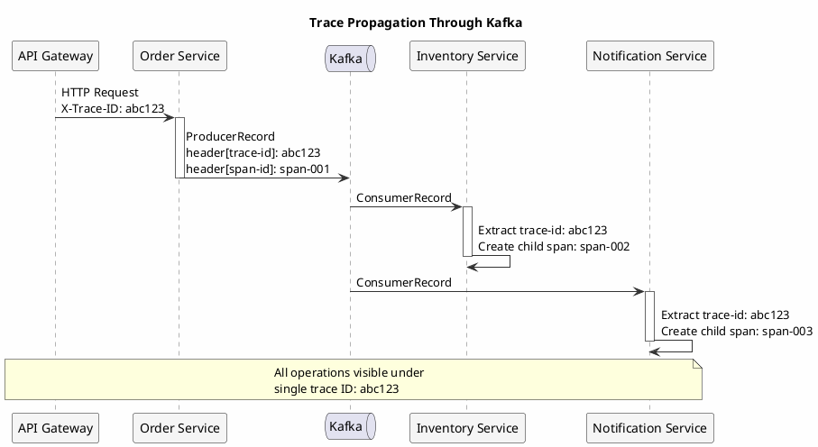

### Implementation Pattern

```java
public class TracingProducerInterceptor implements ProducerInterceptor<String, Object> {

    @Override
    public ProducerRecord<String, Object> onSend(ProducerRecord<String, Object> record) {
        Span currentSpan = Tracer.currentSpan();
        if (currentSpan != null) {
            record.headers().add("trace-id",
                currentSpan.context().traceId().getBytes());
            record.headers().add("span-id",
                currentSpan.context().spanId().getBytes());
            record.headers().add("parent-span-id",
                currentSpan.context().parentSpanId().getBytes());
        }
        return record;
    }
}

public class TracingConsumerInterceptor implements ConsumerInterceptor<String, Object> {

    @Override
    public ConsumerRecords<String, Object> onConsume(ConsumerRecords<String, Object> records) {
        for (ConsumerRecord<String, Object> record : records) {
            String traceId = extractHeader(record, "trace-id");
            String parentSpanId = extractHeader(record, "span-id");

            // Create child span linked to producer
            Span span = Tracer.newChildSpan(traceId, parentSpanId)
                .name("kafka.consume")
                .tag("topic", record.topic())
                .tag("partition", record.partition())
                .start();

            // Store in thread-local for downstream use
            Tracer.setCurrentSpan(span);
        }
        return records;
    }
}
```

### Standard Headers for Tracing

| Header | Purpose | Example |
|--------|---------|---------|
| `trace-id` | Unique ID for entire request flow | `abc123def456` |
| `span-id` | ID for this specific operation | `span-001` |
| `parent-span-id` | ID of calling operation | `span-000` |
| `correlation-id` | Business correlation (order ID, etc.) | `order-789` |
| `causation-id` | ID of event that caused this event | `event-456` |

---

## Deployment Patterns

Kafka consumers require special consideration during deployments to avoid message loss or duplication.

### Rolling Deployment

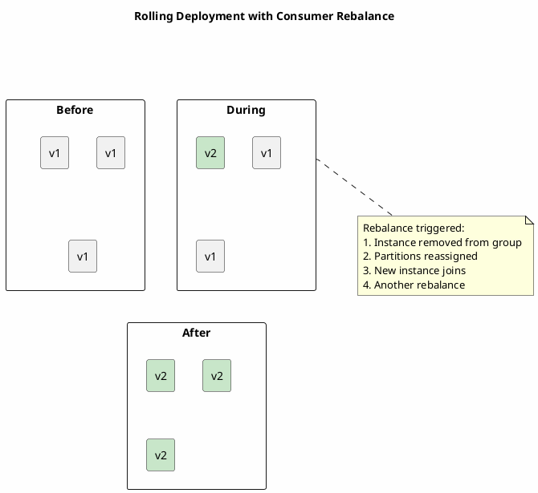

**Configuration for smooth rolling deploys:**

```properties
# Reduce rebalance disruption
session.timeout.ms=30000
heartbeat.interval.ms=10000
max.poll.interval.ms=300000

# Cooperative rebalancing (Kafka 2.4+)
partition.assignment.strategy=org.apache.kafka.clients.consumer.CooperativeStickyAssignor
```

### Blue/Green Deployment

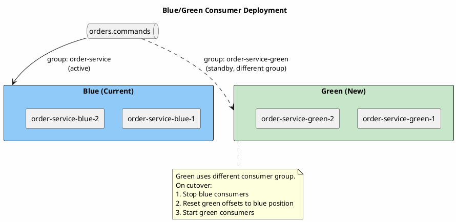

**Cutover procedure:**

```bash
# 1. Record blue's current offsets
kafka-consumer-groups.sh --describe --group order-service

# 2. Stop blue deployment
kubectl scale deployment order-service-blue --replicas=0

# 3. Reset green to blue's offsets
kafka-consumer-groups.sh --group order-service-green \
    --reset-offsets --to-current --execute

# 4. Rename green's group (or reconfigure)
# Application config: group.id=order-service

# 5. Start green
kubectl scale deployment order-service-green --replicas=3
```

### Canary Deployment

Route percentage of partitions to canary instances.

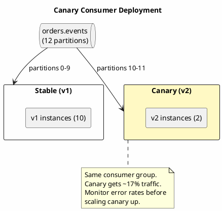

---

## Service Communication Patterns

### Request-Reply Over Kafka

For cases requiring synchronous-style responses over async infrastructure.

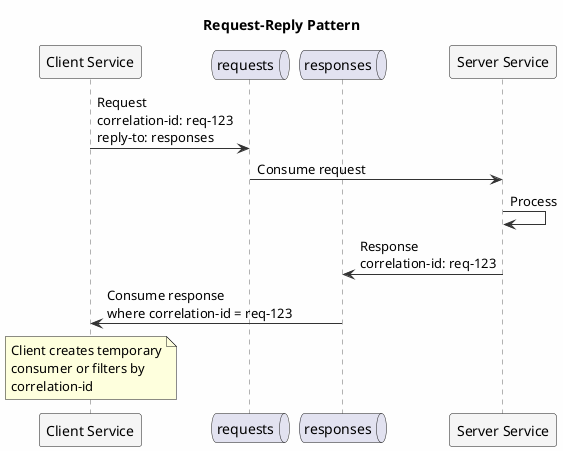

**Implementation considerations:**

```java
public class KafkaRequestReply {

    private final Map<String, CompletableFuture<Response>> pending =
        new ConcurrentHashMap<>();

    public CompletableFuture<Response> request(Request request, Duration timeout) {
        String correlationId = UUID.randomUUID().toString();
        CompletableFuture<Response> future = new CompletableFuture<>();

        pending.put(correlationId, future);

        // Send request
        ProducerRecord<String, Request> record =
            new ProducerRecord<>("requests", request);
        record.headers().add("correlation-id", correlationId.getBytes());
        record.headers().add("reply-to", "responses".getBytes());

        producer.send(record);

        // Timeout handling
        future.orTimeout(timeout.toMillis(), TimeUnit.MILLISECONDS)
            .whenComplete((r, ex) -> pending.remove(correlationId));

        return future;
    }

    // Response consumer
    @KafkaListener(topics = "responses")
    public void handleResponse(ConsumerRecord<String, Response> record) {
        String correlationId = extractHeader(record, "correlation-id");
        CompletableFuture<Response> future = pending.remove(correlationId);
        if (future != null) {
            future.complete(record.value());
        }
    }
}
```

!!! warning "Anti-Pattern Alert"
    Request-reply over Kafka adds significant latency compared to direct HTTP/gRPC.
    Use only when:

    - Decoupling is more important than latency
    - Request must be durable (survives client restart)
    - Load leveling is required

### Event Notification vs Event-Carried State Transfer

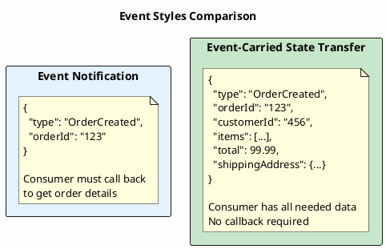

| Aspect | Event Notification | Event-Carried State |
|--------|-------------------|---------------------|
| Message size | Small | Large |
| Coupling | Higher (callback needed) | Lower (self-contained) |
| Freshness | Always current | Point-in-time snapshot |
| Consumer complexity | Higher | Lower |
| Producer complexity | Lower | Higher |

**Recommendation:** Prefer event-carried state transfer for microservices to reduce runtime coupling.

---

## Anti-Patterns

### Kafka as Synchronous RPC

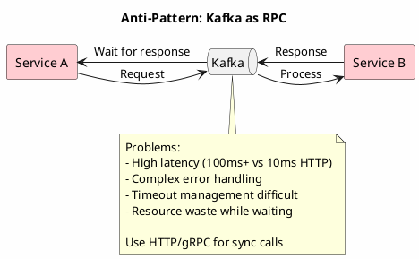

### Topic Proliferation

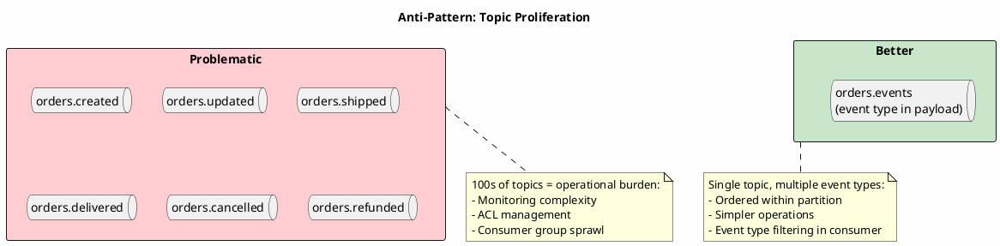

### Distributed Monolith

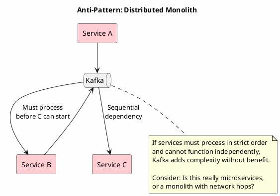

---

## Operational Considerations

### Consumer Lag Monitoring Per Service

```yaml
# Prometheus alerts per service
groups:
  - name: kafka-consumer-lag
    rules:
      - alert: OrderServiceConsumerLag
        expr: kafka_consumer_group_lag{group="order-service"} > 10000
        for: 5m
        labels:
          service: order-service
          severity: warning

      - alert: NotificationServiceConsumerLag
        expr: kafka_consumer_group_lag{group="notification-service"} > 50000
        for: 10m
        labels:
          service: notification-service
          severity: warning
```

### Service-Level Topic ACLs

```bash
# Order service can produce to its own topics
kafka-acls.sh --add --allow-principal User:order-service \
    --producer --topic 'orders.*'

# Order service can consume from payment events
kafka-acls.sh --add --allow-principal User:order-service \
    --consumer --topic 'payments.events' --group 'order-service'

# Deny order service access to other service topics
kafka-acls.sh --add --deny-principal User:order-service \
    --producer --topic 'inventory.*'
```

### Circuit Breaker for Kafka Consumers

```java
@Component
public class ResilientKafkaConsumer {

    private final CircuitBreaker circuitBreaker = CircuitBreaker.ofDefaults("kafka-consumer");

    @KafkaListener(topics = "orders.events")
    public void consume(ConsumerRecord<String, OrderEvent> record) {
        circuitBreaker.executeRunnable(() -> {
            processEvent(record.value());
        });
    }

    private void processEvent(OrderEvent event) {
        // Call downstream service
        // If downstream fails repeatedly, circuit opens
        // Consumer pauses processing (backpressure)
    }
}
```

---

## Summary

| Concern | Recommendation |
|---------|----------------|
| Topic ownership | Per-service topics with clear naming conventions |
| Consumer groups | One group per service; multiple groups for different processing needs |
| Schema governance | Schema registry with BACKWARD compatibility; producing service owns schema |
| Tracing | Propagate trace context via headers; use standard correlation IDs |
| Deployment | Cooperative rebalancing; blue/green for zero-downtime |
| Communication | Event-carried state transfer; avoid Kafka for sync RPC |

---

## Related Documentation

- [Event Collaboration](event-collaboration.md) - Inter-service event patterns
- [Saga Pattern](saga.md) - Distributed transactions
- [Outbox Pattern](outbox.md) - Reliable event publishing
- [CQRS](cqrs.md) - Separating read and write models