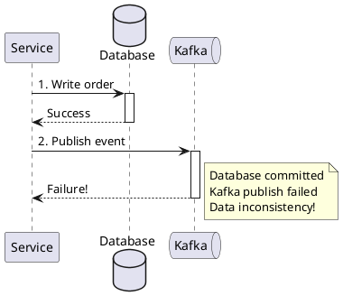
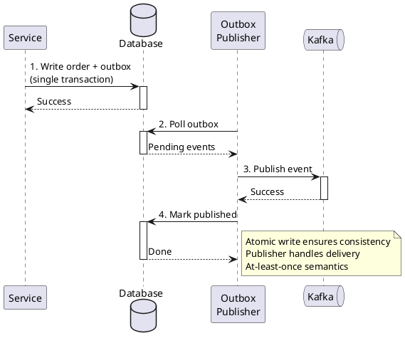
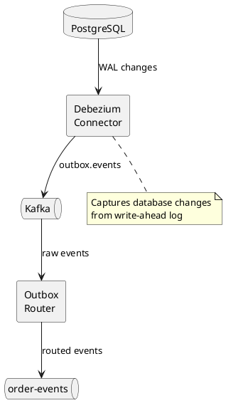

# Outbox Pattern with Kafka

The transactional outbox pattern ensures reliable event publishing by writing events to a database table within the same transaction as business data changes. A separate process reads the outbox and publishes events to Kafka.

---

## The Problem

### Dual-Write Problem



**Failure scenarios:**

| Scenario | Result |
|----------|--------|
| Database write succeeds, Kafka fails | Data saved, event lost |
| Kafka succeeds, database fails | Event published, no data |
| Service crashes between operations | Partial state |

---

## The Solution

### Outbox Pattern



---

## Database Schema

### Outbox Table

```sql
CREATE TABLE outbox (
    id              UUID PRIMARY KEY DEFAULT gen_random_uuid(),
    aggregate_type  VARCHAR(255) NOT NULL,
    aggregate_id    VARCHAR(255) NOT NULL,
    event_type      VARCHAR(255) NOT NULL,
    payload         JSONB NOT NULL,
    created_at      TIMESTAMP NOT NULL DEFAULT NOW(),
    published_at    TIMESTAMP NULL,

    -- For ordering within aggregate
    sequence_num    BIGSERIAL,

    -- For publisher tracking
    partition_key   VARCHAR(255),
    topic           VARCHAR(255)
);

-- Index for polling
CREATE INDEX idx_outbox_unpublished
ON outbox (created_at)
WHERE published_at IS NULL;

-- Index for cleanup
CREATE INDEX idx_outbox_published
ON outbox (published_at)
WHERE published_at IS NOT NULL;
```

### Alternative: Separate Outbox Per Aggregate

```sql
CREATE TABLE order_outbox (
    id              UUID PRIMARY KEY DEFAULT gen_random_uuid(),
    order_id        VARCHAR(255) NOT NULL,
    event_type      VARCHAR(255) NOT NULL,
    payload         JSONB NOT NULL,
    created_at      TIMESTAMP NOT NULL DEFAULT NOW(),
    published_at    TIMESTAMP NULL
);

CREATE TABLE payment_outbox (
    id              UUID PRIMARY KEY DEFAULT gen_random_uuid(),
    payment_id      VARCHAR(255) NOT NULL,
    event_type      VARCHAR(255) NOT NULL,
    payload         JSONB NOT NULL,
    created_at      TIMESTAMP NOT NULL DEFAULT NOW(),
    published_at    TIMESTAMP NULL
);
```

---

## Implementation

### Writing to Outbox

```java
@Service
public class OrderService {
    private final OrderRepository orderRepository;
    private final OutboxRepository outboxRepository;

    @Transactional
    public Order createOrder(CreateOrderRequest request) {
        // Create and save order
        Order order = new Order(request);
        order = orderRepository.save(order);

        // Write to outbox in same transaction
        OutboxEntry entry = OutboxEntry.builder()
            .aggregateType("Order")
            .aggregateId(order.getId())
            .eventType("OrderCreated")
            .payload(toJson(new OrderCreated(
                order.getId(),
                order.getCustomerId(),
                order.getItems(),
                order.getTotal()
            )))
            .partitionKey(order.getId())
            .topic("order-events")
            .build();

        outboxRepository.save(entry);

        return order;
    }

    @Transactional
    public void cancelOrder(String orderId, String reason) {
        Order order = orderRepository.findById(orderId)
            .orElseThrow(() -> new OrderNotFoundException(orderId));

        order.cancel(reason);
        orderRepository.save(order);

        // Outbox entry for cancellation
        outboxRepository.save(OutboxEntry.builder()
            .aggregateType("Order")
            .aggregateId(orderId)
            .eventType("OrderCancelled")
            .payload(toJson(new OrderCancelled(orderId, reason)))
            .partitionKey(orderId)
            .topic("order-events")
            .build());
    }
}
```

### Outbox Entity

```java
@Entity
@Table(name = "outbox")
public class OutboxEntry {
    @Id
    @GeneratedValue(strategy = GenerationType.UUID)
    private UUID id;

    @Column(name = "aggregate_type", nullable = false)
    private String aggregateType;

    @Column(name = "aggregate_id", nullable = false)
    private String aggregateId;

    @Column(name = "event_type", nullable = false)
    private String eventType;

    @Column(name = "payload", columnDefinition = "jsonb", nullable = false)
    private String payload;

    @Column(name = "partition_key")
    private String partitionKey;

    @Column(name = "topic")
    private String topic;

    @Column(name = "created_at", nullable = false)
    private Instant createdAt;

    @Column(name = "published_at")
    private Instant publishedAt;

    @PrePersist
    public void prePersist() {
        this.createdAt = Instant.now();
    }
}
```

---

## Publishing Approaches

### Polling Publisher

```java
@Component
public class OutboxPollingPublisher {
    private final OutboxRepository outboxRepository;
    private final KafkaTemplate<String, String> kafkaTemplate;

    @Scheduled(fixedDelay = 100)  // Poll every 100ms
    @Transactional
    public void publishPendingEvents() {
        // Fetch batch of unpublished entries
        List<OutboxEntry> entries = outboxRepository
            .findTop100ByPublishedAtIsNullOrderByCreatedAt();

        for (OutboxEntry entry : entries) {
            try {
                // Publish to Kafka
                kafkaTemplate.send(
                    entry.getTopic(),
                    entry.getPartitionKey(),
                    entry.getPayload()
                ).get();  // Wait for acknowledgment

                // Mark as published
                entry.setPublishedAt(Instant.now());
                outboxRepository.save(entry);

            } catch (Exception e) {
                log.error("Failed to publish outbox entry {}: {}",
                    entry.getId(), e.getMessage());
                // Will retry on next poll
                break;  // Stop batch to preserve ordering
            }
        }
    }
}
```

### Polling with Batching

```java
@Component
public class BatchingOutboxPublisher {
    private final OutboxRepository outboxRepository;
    private final KafkaTemplate<String, String> kafkaTemplate;

    @Scheduled(fixedDelay = 500)
    @Transactional
    public void publishBatch() {
        List<OutboxEntry> entries = outboxRepository
            .findTop1000ByPublishedAtIsNullOrderByCreatedAt();

        if (entries.isEmpty()) {
            return;
        }

        // Group by topic for efficient publishing
        Map<String, List<OutboxEntry>> byTopic = entries.stream()
            .collect(Collectors.groupingBy(OutboxEntry::getTopic));

        List<CompletableFuture<SendResult<String, String>>> futures = new ArrayList<>();

        for (Map.Entry<String, List<OutboxEntry>> topicEntries : byTopic.entrySet()) {
            for (OutboxEntry entry : topicEntries.getValue()) {
                CompletableFuture<SendResult<String, String>> future =
                    kafkaTemplate.send(
                        entry.getTopic(),
                        entry.getPartitionKey(),
                        entry.getPayload()
                    );
                futures.add(future);
            }
        }

        // Wait for all sends
        try {
            CompletableFuture.allOf(futures.toArray(new CompletableFuture[0]))
                .get(30, TimeUnit.SECONDS);

            // Mark all as published
            Instant now = Instant.now();
            entries.forEach(e -> e.setPublishedAt(now));
            outboxRepository.saveAll(entries);

        } catch (Exception e) {
            log.error("Batch publish failed: {}", e.getMessage());
            // Individual retry logic needed
        }
    }
}
```

### CDC with Debezium

Change Data Capture provides lower latency and no polling overhead:



#### Debezium Connector Configuration

```json
{
  "name": "outbox-connector",
  "config": {
    "connector.class": "io.debezium.connector.postgresql.PostgresConnector",
    "database.hostname": "postgres",
    "database.port": "5432",
    "database.user": "debezium",
    "database.password": "secret",
    "database.dbname": "orders",
    "table.include.list": "public.outbox",

    "transforms": "outbox",
    "transforms.outbox.type": "io.debezium.transforms.outbox.EventRouter",
    "transforms.outbox.table.field.event.id": "id",
    "transforms.outbox.table.field.event.key": "aggregate_id",
    "transforms.outbox.table.field.event.type": "event_type",
    "transforms.outbox.table.field.event.payload": "payload",
    "transforms.outbox.route.topic.replacement": "${routedByValue}",
    "transforms.outbox.table.fields.additional.placement": "aggregate_type:header:aggregateType",

    "tombstones.on.delete": "false",
    "key.converter": "org.apache.kafka.connect.storage.StringConverter",
    "value.converter": "org.apache.kafka.connect.json.JsonConverter"
  }
}
```

#### Outbox Event Router

Debezium's outbox event router:

- Routes events to topics based on aggregate type
- Extracts event key from aggregate ID
- Removes CDC envelope, publishes clean payload
- Optionally deletes outbox entries after capture

---

## Ordering Guarantees

### Per-Aggregate Ordering

```java
@Transactional
public void processOrder(String orderId) {
    // All events for same aggregate use same partition key
    // This ensures ordering within aggregate

    outboxRepository.save(OutboxEntry.builder()
        .aggregateId(orderId)
        .partitionKey(orderId)  // Same key = same partition
        .eventType("OrderCreated")
        .payload(...)
        .build());

    outboxRepository.save(OutboxEntry.builder()
        .aggregateId(orderId)
        .partitionKey(orderId)  // Same key = same partition
        .eventType("OrderUpdated")
        .payload(...)
        .build());
}
```

### Preserving Order in Publisher

```java
@Scheduled(fixedDelay = 100)
@Transactional
public void publishWithOrdering() {
    // Fetch ordered by aggregate and sequence
    List<OutboxEntry> entries = outboxRepository
        .findPendingOrderedByAggregateAndSequence(100);

    String currentAggregate = null;

    for (OutboxEntry entry : entries) {
        // If new aggregate and previous had failures, skip
        if (!entry.getAggregateId().equals(currentAggregate)) {
            currentAggregate = entry.getAggregateId();
        }

        try {
            kafkaTemplate.send(
                entry.getTopic(),
                entry.getPartitionKey(),
                entry.getPayload()
            ).get();

            entry.setPublishedAt(Instant.now());
            outboxRepository.save(entry);

        } catch (Exception e) {
            log.error("Failed to publish {}", entry.getId());
            // Stop processing this aggregate to preserve order
            // Continue with next aggregate
        }
    }
}
```

---

## Cleanup

### Outbox Cleanup Job

```java
@Scheduled(cron = "0 0 * * * *")  // Hourly
@Transactional
public void cleanupOutbox() {
    Instant cutoff = Instant.now().minus(Duration.ofDays(7));

    int deleted = outboxRepository.deleteByPublishedAtBefore(cutoff);

    log.info("Cleaned up {} published outbox entries", deleted);
}
```

### Partitioned Table Cleanup (PostgreSQL)

```sql
-- Create partitioned outbox table
CREATE TABLE outbox (
    id              UUID NOT NULL,
    aggregate_type  VARCHAR(255) NOT NULL,
    aggregate_id    VARCHAR(255) NOT NULL,
    event_type      VARCHAR(255) NOT NULL,
    payload         JSONB NOT NULL,
    created_at      DATE NOT NULL,
    published_at    TIMESTAMP NULL,
    PRIMARY KEY (id, created_at)
) PARTITION BY RANGE (created_at);

-- Create partitions
CREATE TABLE outbox_2024_01 PARTITION OF outbox
    FOR VALUES FROM ('2024-01-01') TO ('2024-02-01');

-- Drop old partitions for cleanup
DROP TABLE outbox_2023_12;
```

---

## Idempotency

### Consumer Idempotency

Consumers must handle duplicate events:

```java
@KafkaListener(topics = "order-events")
public void onOrderEvent(ConsumerRecord<String, OrderEvent> record) {
    String eventId = extractEventId(record);

    // Check if already processed
    if (processedEventRepository.exists(eventId)) {
        log.debug("Skipping duplicate event {}", eventId);
        return;
    }

    // Process event
    processEvent(record.value());

    // Mark as processed
    processedEventRepository.save(new ProcessedEvent(eventId, Instant.now()));
}
```

### Deduplication with Headers

Include event ID in Kafka headers:

```java
// Publisher
ProducerRecord<String, String> record = new ProducerRecord<>(
    entry.getTopic(),
    entry.getPartitionKey(),
    entry.getPayload()
);
record.headers().add("event-id", entry.getId().toString().getBytes());
kafkaTemplate.send(record);

// Consumer
String eventId = new String(record.headers().lastHeader("event-id").value());
```

---

## Monitoring

### Outbox Metrics

```java
@Component
public class OutboxMetrics {
    private final MeterRegistry registry;
    private final OutboxRepository outboxRepository;

    @Scheduled(fixedRate = 10000)
    public void recordMetrics() {
        // Pending count
        long pending = outboxRepository.countByPublishedAtIsNull();
        registry.gauge("outbox.pending.count", pending);

        // Oldest pending age
        Optional<OutboxEntry> oldest = outboxRepository
            .findFirstByPublishedAtIsNullOrderByCreatedAt();
        oldest.ifPresent(entry -> {
            long ageSeconds = Duration.between(entry.getCreatedAt(), Instant.now())
                .getSeconds();
            registry.gauge("outbox.pending.oldest.seconds", ageSeconds);
        });
    }

    public void recordPublished(String aggregateType, String eventType) {
        registry.counter("outbox.published",
            "aggregate_type", aggregateType,
            "event_type", eventType
        ).increment();
    }

    public void recordPublishError(String aggregateType, String eventType, String error) {
        registry.counter("outbox.publish.errors",
            "aggregate_type", aggregateType,
            "event_type", eventType,
            "error", error
        ).increment();
    }
}
```

### Alerting Queries

```sql
-- Alert if outbox is backing up
SELECT COUNT(*) as pending_count,
       MIN(created_at) as oldest_pending
FROM outbox
WHERE published_at IS NULL;

-- Alert threshold: pending_count > 1000 OR oldest_pending < NOW() - INTERVAL '5 minutes'

-- Publish rate
SELECT DATE_TRUNC('minute', published_at) as minute,
       COUNT(*) as published_count
FROM outbox
WHERE published_at > NOW() - INTERVAL '1 hour'
GROUP BY 1
ORDER BY 1;
```

---

## Comparison

### Polling vs CDC

| Aspect | Polling | CDC (Debezium) |
|--------|---------|----------------|
| **Latency** | 100ms+ (poll interval) | ~10ms |
| **Database load** | Query every interval | WAL streaming |
| **Complexity** | Simple | More infrastructure |
| **Ordering** | Easy to control | Requires configuration |
| **Recovery** | Simple retry | Connector state management |
| **Scaling** | Multiple pollers need coordination | Single connector per database |

### When to Use Each

**Use Polling when:**

- Simple setup is preferred
- Latency requirements are relaxed (>100ms)
- Low event volume
- Team is not familiar with CDC

**Use CDC when:**

- Low latency is required (<50ms)
- High event volume
- Database query load is a concern
- Already using Debezium/Kafka Connect

---

## Best Practices

### General Guidelines

| Practice | Description |
|----------|-------------|
| **Single transaction** | Always write outbox entry in same transaction as data |
| **Immutable entries** | Never update outbox entries, only mark published |
| **Include all data** | Event payload should be self-contained |
| **Partition key** | Include partition key for Kafka ordering |
| **Monitor lag** | Alert on outbox backup |

### Schema Design

| Practice | Description |
|----------|-------------|
| **JSON payload** | Flexible schema evolution |
| **Event type column** | Enables filtering and routing |
| **Indexes** | Index unpublished entries for polling |
| **Partitioning** | Partition by date for efficient cleanup |

---

## Anti-Patterns

!!! danger "Avoid These Mistakes"

    **Publishing before commit**
    : Never publish to Kafka before database commit. Transaction might rollback.

    **Updating outbox entries**
    : Outbox entries should be immutable except for published_at.

    **Missing cleanup**
    : Outbox table grows unbounded without cleanup.

    **Global ordering**
    : Don't try to globally order all events. Order within aggregates only.

    **Large payloads**
    : Keep payloads small. Large events impact database and Kafka performance.

---

## Related Documentation

- [Event Sourcing](event-sourcing.md) - Event-based persistence
- [CQRS](cqrs.md) - Often combined with outbox
- [Saga Pattern](saga.md) - Uses outbox for reliable saga commands
- [Producer Development](../producers/index.md) - Kafka producer patterns
