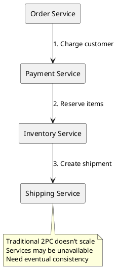
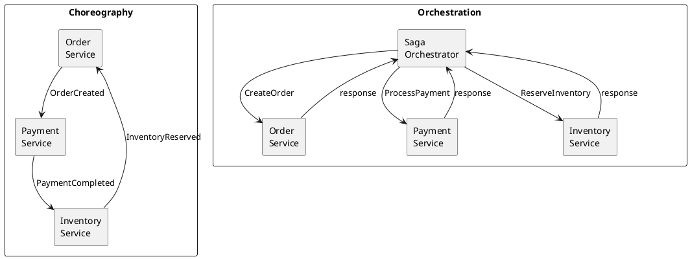
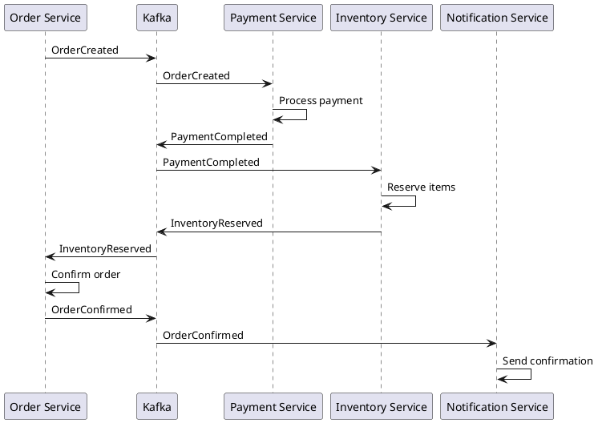
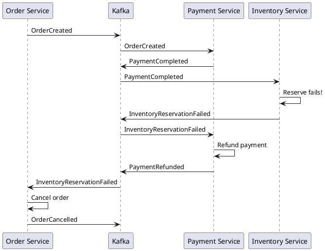

# Saga Pattern with Kafka

The saga pattern manages distributed transactions across multiple services without distributed locks. Each service performs its local transaction and publishes events, with compensating transactions handling failures.

---

## Core Concepts

### Distributed Transaction Challenge



### Saga Definition

A saga is a sequence of local transactions where:

- Each step has a compensating action
- Failure triggers compensations in reverse order
- Overall consistency is eventually achieved

| Concept | Description |
|---------|-------------|
| **Local transaction** | Single service operation |
| **Compensating transaction** | Undo action for a step |
| **Saga coordinator** | Manages saga execution (orchestration) |
| **Saga log** | Tracks saga state and progress |

---

## Saga Approaches

### Choreography vs Orchestration



| Aspect | Choreography | Orchestration |
|--------|--------------|---------------|
| **Coordination** | Decentralized | Centralized |
| **Coupling** | Loose | Tighter |
| **Visibility** | Distributed | Single point |
| **Complexity** | Grows with services | Contained in orchestrator |
| **Failure handling** | Each service | Orchestrator |

---

## Choreography Implementation

### Event Flow



### Service Implementation

```java
// Order Service
@Service
public class OrderService {
    private final OrderRepository repository;
    private final KafkaTemplate<String, OrderEvent> kafka;

    @Transactional
    public Order createOrder(CreateOrderRequest request) {
        Order order = new Order(request);
        order.setStatus(OrderStatus.PENDING);
        repository.save(order);

        kafka.send("order-events", order.getId(),
            new OrderCreated(order.getId(), order.getCustomerId(), order.getItems()));

        return order;
    }

    @KafkaListener(topics = "inventory-events")
    public void onInventoryEvent(InventoryEvent event) {
        if (event instanceof InventoryReserved reserved) {
            Order order = repository.findById(reserved.orderId()).orElseThrow();
            order.setStatus(OrderStatus.CONFIRMED);
            repository.save(order);

            kafka.send("order-events", order.getId(),
                new OrderConfirmed(order.getId()));
        } else if (event instanceof InventoryReservationFailed failed) {
            // Trigger compensation
            Order order = repository.findById(failed.orderId()).orElseThrow();
            order.setStatus(OrderStatus.FAILED);
            repository.save(order);

            kafka.send("order-events", order.getId(),
                new OrderCancelled(order.getId(), failed.reason()));
        }
    }
}

// Payment Service
@Service
public class PaymentService {
    private final PaymentRepository repository;
    private final PaymentGateway gateway;
    private final KafkaTemplate<String, PaymentEvent> kafka;

    @KafkaListener(topics = "order-events")
    public void onOrderEvent(OrderEvent event) {
        if (event instanceof OrderCreated created) {
            processPayment(created);
        } else if (event instanceof OrderCancelled cancelled) {
            refundPayment(cancelled.orderId());
        }
    }

    private void processPayment(OrderCreated event) {
        try {
            PaymentResult result = gateway.charge(event.customerId(), event.total());

            Payment payment = new Payment(event.orderId(), result);
            repository.save(payment);

            kafka.send("payment-events", event.orderId(),
                new PaymentCompleted(event.orderId(), result.transactionId()));

        } catch (PaymentException e) {
            kafka.send("payment-events", event.orderId(),
                new PaymentFailed(event.orderId(), e.getMessage()));
        }
    }

    private void refundPayment(String orderId) {
        Payment payment = repository.findByOrderId(orderId).orElse(null);
        if (payment != null && payment.getStatus() == PaymentStatus.COMPLETED) {
            gateway.refund(payment.getTransactionId());
            payment.setStatus(PaymentStatus.REFUNDED);
            repository.save(payment);

            kafka.send("payment-events", orderId,
                new PaymentRefunded(orderId, payment.getTransactionId()));
        }
    }
}

// Inventory Service
@Service
public class InventoryService {
    private final InventoryRepository repository;
    private final KafkaTemplate<String, InventoryEvent> kafka;

    @KafkaListener(topics = "payment-events")
    public void onPaymentEvent(PaymentEvent event) {
        if (event instanceof PaymentCompleted completed) {
            reserveInventory(completed.orderId());
        }
    }

    @KafkaListener(topics = "order-events")
    public void onOrderEvent(OrderEvent event) {
        if (event instanceof OrderCancelled cancelled) {
            releaseInventory(cancelled.orderId());
        }
    }

    @Transactional
    private void reserveInventory(String orderId) {
        // Get order items (from event or query)
        List<OrderItem> items = getOrderItems(orderId);

        try {
            for (OrderItem item : items) {
                Inventory inv = repository.findByProductId(item.productId())
                    .orElseThrow(() -> new ProductNotFoundException(item.productId()));

                if (inv.getAvailable() < item.quantity()) {
                    throw new InsufficientInventoryException(item.productId());
                }

                inv.reserve(item.quantity(), orderId);
                repository.save(inv);
            }

            kafka.send("inventory-events", orderId,
                new InventoryReserved(orderId, items));

        } catch (Exception e) {
            kafka.send("inventory-events", orderId,
                new InventoryReservationFailed(orderId, e.getMessage()));
        }
    }
}
```

### Compensation Flow



---

## Orchestration Implementation

### Saga Orchestrator

```java
@Service
public class OrderSagaOrchestrator {
    private final SagaRepository sagaRepository;
    private final KafkaTemplate<String, SagaCommand> kafka;

    public void startSaga(String orderId, CreateOrderRequest request) {
        // Create saga instance
        OrderSaga saga = new OrderSaga(orderId);
        saga.setStep(SagaStep.CREATE_ORDER);
        saga.setData(request);
        sagaRepository.save(saga);

        // Send first command
        kafka.send("order-commands", orderId,
            new CreateOrderCommand(orderId, request));
    }

    @KafkaListener(topics = "saga-replies")
    public void onSagaReply(SagaReply reply) {
        OrderSaga saga = sagaRepository.findById(reply.sagaId())
            .orElseThrow();

        if (reply.isSuccess()) {
            advanceSaga(saga, reply);
        } else {
            compensateSaga(saga, reply);
        }
    }

    private void advanceSaga(OrderSaga saga, SagaReply reply) {
        switch (saga.getStep()) {
            case CREATE_ORDER -> {
                saga.setStep(SagaStep.PROCESS_PAYMENT);
                sagaRepository.save(saga);
                kafka.send("payment-commands", saga.getId(),
                    new ProcessPaymentCommand(saga.getId(), saga.getData().total()));
            }
            case PROCESS_PAYMENT -> {
                saga.setPaymentId(reply.getData().get("transactionId"));
                saga.setStep(SagaStep.RESERVE_INVENTORY);
                sagaRepository.save(saga);
                kafka.send("inventory-commands", saga.getId(),
                    new ReserveInventoryCommand(saga.getId(), saga.getData().items()));
            }
            case RESERVE_INVENTORY -> {
                saga.setStep(SagaStep.CONFIRM_ORDER);
                sagaRepository.save(saga);
                kafka.send("order-commands", saga.getId(),
                    new ConfirmOrderCommand(saga.getId()));
            }
            case CONFIRM_ORDER -> {
                saga.setStatus(SagaStatus.COMPLETED);
                sagaRepository.save(saga);
            }
        }
    }

    private void compensateSaga(OrderSaga saga, SagaReply reply) {
        saga.setStatus(SagaStatus.COMPENSATING);
        saga.setFailureReason(reply.getError());
        sagaRepository.save(saga);

        // Compensate in reverse order
        switch (saga.getStep()) {
            case RESERVE_INVENTORY -> {
                // Payment was successful, need to refund
                kafka.send("payment-commands", saga.getId(),
                    new RefundPaymentCommand(saga.getId(), saga.getPaymentId()));
            }
            case PROCESS_PAYMENT -> {
                // Only order was created, cancel it
                kafka.send("order-commands", saga.getId(),
                    new CancelOrderCommand(saga.getId(), reply.getError()));
            }
            case CREATE_ORDER -> {
                // Nothing to compensate
                saga.setStatus(SagaStatus.FAILED);
                sagaRepository.save(saga);
            }
        }
    }

    @KafkaListener(topics = "compensation-replies")
    public void onCompensationReply(CompensationReply reply) {
        OrderSaga saga = sagaRepository.findById(reply.sagaId())
            .orElseThrow();

        // Continue compensation chain
        switch (saga.getStep()) {
            case RESERVE_INVENTORY -> {
                saga.setStep(SagaStep.PROCESS_PAYMENT);
                sagaRepository.save(saga);
                kafka.send("order-commands", saga.getId(),
                    new CancelOrderCommand(saga.getId(), saga.getFailureReason()));
            }
            case PROCESS_PAYMENT -> {
                saga.setStatus(SagaStatus.COMPENSATED);
                sagaRepository.save(saga);
            }
        }
    }
}
```

### Saga State

```java
@Entity
@Table(name = "order_sagas")
public class OrderSaga {
    @Id
    private String id;

    @Enumerated(EnumType.STRING)
    private SagaStep step;

    @Enumerated(EnumType.STRING)
    private SagaStatus status;

    @Type(JsonType.class)
    private CreateOrderRequest data;

    private String paymentId;
    private String failureReason;

    private Instant createdAt;
    private Instant updatedAt;
}

public enum SagaStep {
    CREATE_ORDER,
    PROCESS_PAYMENT,
    RESERVE_INVENTORY,
    CONFIRM_ORDER
}

public enum SagaStatus {
    RUNNING,
    COMPENSATING,
    COMPLETED,
    COMPENSATED,
    FAILED
}
```

### Service Participant

```java
@Service
public class PaymentSagaParticipant {
    private final PaymentGateway gateway;
    private final PaymentRepository repository;
    private final KafkaTemplate<String, SagaReply> kafka;

    @KafkaListener(topics = "payment-commands")
    public void onCommand(SagaCommand command) {
        if (command instanceof ProcessPaymentCommand process) {
            handleProcessPayment(process);
        } else if (command instanceof RefundPaymentCommand refund) {
            handleRefund(refund);
        }
    }

    private void handleProcessPayment(ProcessPaymentCommand command) {
        try {
            PaymentResult result = gateway.charge(command.customerId(), command.amount());

            Payment payment = new Payment(command.sagaId(), result);
            repository.save(payment);

            kafka.send("saga-replies", command.sagaId(),
                SagaReply.success(command.sagaId(),
                    Map.of("transactionId", result.transactionId())));

        } catch (PaymentException e) {
            kafka.send("saga-replies", command.sagaId(),
                SagaReply.failure(command.sagaId(), e.getMessage()));
        }
    }

    private void handleRefund(RefundPaymentCommand command) {
        Payment payment = repository.findByOrderId(command.sagaId())
            .orElse(null);

        if (payment != null) {
            gateway.refund(payment.getTransactionId());
            payment.setStatus(PaymentStatus.REFUNDED);
            repository.save(payment);
        }

        kafka.send("compensation-replies", command.sagaId(),
            CompensationReply.success(command.sagaId()));
    }
}
```

---

## Kafka Topics Design

### Topic Structure

```
# Command topics (orchestration)
order-commands
payment-commands
inventory-commands
shipping-commands

# Reply topics (orchestration)
saga-replies
compensation-replies

# Event topics (choreography)
order-events
payment-events
inventory-events
shipping-events

# Saga state topic (optional - for saga log)
saga-state
```

### Topic Configuration

```properties
# Command/Reply topics - short retention
retention.ms=604800000      # 7 days
cleanup.policy=delete

# Event topics - longer retention for replay
retention.ms=2592000000     # 30 days
cleanup.policy=delete

# Saga state - compacted for current state
cleanup.policy=compact
```

---

## Idempotency

### Idempotent Saga Steps

```java
@Service
public class IdempotentPaymentParticipant {
    private final ProcessedCommandRepository processedRepo;

    @KafkaListener(topics = "payment-commands")
    @Transactional
    public void onCommand(ConsumerRecord<String, SagaCommand> record) {
        String commandId = getCommandId(record);

        // Check if already processed
        if (processedRepo.exists(commandId)) {
            // Resend previous reply
            SagaReply previousReply = processedRepo.getReply(commandId);
            kafka.send("saga-replies", record.key(), previousReply);
            return;
        }

        // Process command
        SagaReply reply = processCommand(record.value());

        // Store processed state
        processedRepo.save(new ProcessedCommand(commandId, reply));

        // Send reply
        kafka.send("saga-replies", record.key(), reply);
    }

    private String getCommandId(ConsumerRecord<String, SagaCommand> record) {
        // Use saga ID + step + version for uniqueness
        SagaCommand cmd = record.value();
        return cmd.sagaId() + "-" + cmd.step() + "-" + cmd.version();
    }
}
```

### Idempotent Compensation

```java
public void compensate(String sagaId, SagaStep step) {
    String compensationKey = sagaId + "-compensation-" + step;

    // Check if already compensated
    if (compensationLog.exists(compensationKey)) {
        return;
    }

    // Execute compensation
    executeCompensation(sagaId, step);

    // Log compensation
    compensationLog.save(compensationKey);
}
```

---

## Timeout Handling

### Saga Timeout

```java
@Scheduled(fixedRate = 60000)  // Every minute
public void checkTimeouts() {
    Instant timeout = Instant.now().minus(Duration.ofMinutes(5));

    List<OrderSaga> stuckSagas = sagaRepository
        .findByStatusAndUpdatedAtBefore(SagaStatus.RUNNING, timeout);

    for (OrderSaga saga : stuckSagas) {
        log.warn("Saga {} stuck at step {}, initiating compensation",
            saga.getId(), saga.getStep());

        saga.setStatus(SagaStatus.COMPENSATING);
        saga.setFailureReason("Timeout");
        sagaRepository.save(saga);

        compensateSaga(saga, null);
    }
}
```

### Step Timeout with Retry

```java
@KafkaListener(topics = "saga-replies")
public void onSagaReply(SagaReply reply) {
    OrderSaga saga = sagaRepository.findById(reply.sagaId())
        .orElseThrow();

    // Cancel timeout
    timeoutScheduler.cancel(saga.getId());

    // Process reply
    if (reply.isSuccess()) {
        advanceSaga(saga, reply);
        // Schedule timeout for next step
        scheduleTimeout(saga);
    } else {
        compensateSaga(saga, reply);
    }
}

private void scheduleTimeout(OrderSaga saga) {
    timeoutScheduler.schedule(
        saga.getId(),
        Duration.ofMinutes(2),
        () -> handleTimeout(saga.getId())
    );
}

private void handleTimeout(String sagaId) {
    OrderSaga saga = sagaRepository.findById(sagaId).orElseThrow();

    if (saga.getRetryCount() < MAX_RETRIES) {
        // Retry current step
        saga.incrementRetryCount();
        sagaRepository.save(saga);
        retryCurrentStep(saga);
    } else {
        // Max retries exceeded, compensate
        compensateSaga(saga,
            SagaReply.failure(sagaId, "Max retries exceeded"));
    }
}
```

---

## Monitoring

### Saga Metrics

```java
@Component
public class SagaMetrics {
    private final MeterRegistry registry;

    public void recordSagaStarted(String sagaType) {
        registry.counter("saga.started", "type", sagaType).increment();
    }

    public void recordSagaCompleted(String sagaType, Duration duration) {
        registry.counter("saga.completed", "type", sagaType).increment();
        registry.timer("saga.duration", "type", sagaType).record(duration);
    }

    public void recordSagaCompensated(String sagaType, String reason) {
        registry.counter("saga.compensated", "type", sagaType, "reason", reason).increment();
    }

    public void recordStepDuration(String sagaType, String step, Duration duration) {
        registry.timer("saga.step.duration", "type", sagaType, "step", step)
            .record(duration);
    }
}
```

### Saga Dashboard Queries

```sql
-- Active sagas by status
SELECT status, COUNT(*)
FROM order_sagas
WHERE created_at > NOW() - INTERVAL '1 day'
GROUP BY status;

-- Average saga duration by step
SELECT step, AVG(EXTRACT(EPOCH FROM (updated_at - created_at))) as avg_seconds
FROM saga_step_log
GROUP BY step;

-- Failure reasons
SELECT failure_reason, COUNT(*)
FROM order_sagas
WHERE status IN ('COMPENSATED', 'FAILED')
AND created_at > NOW() - INTERVAL '1 day'
GROUP BY failure_reason;
```

---

## Best Practices

### Design Guidelines

| Practice | Description |
|----------|-------------|
| **Idempotent operations** | All saga steps must be idempotent |
| **Compensatable actions** | Design every step with compensation in mind |
| **Minimal saga scope** | Keep sagas focused on single business process |
| **Explicit timeouts** | Set timeouts for every step |
| **Saga logging** | Log all saga state transitions |

### Compensation Design

| Practice | Description |
|----------|-------------|
| **Semantic compensation** | Undo business effect, not necessarily data |
| **Compensation ordering** | Compensate in reverse order |
| **Partial compensation** | Handle partially completed steps |
| **Compensation idempotency** | Compensations must be idempotent too |

---

## Anti-Patterns

!!! danger "Avoid These Mistakes"

    **Non-idempotent steps**
    : Steps will be retried. Non-idempotent operations cause data corruption.

    **Missing compensations**
    : Every forward step needs a compensation. Missing compensations leave inconsistent state.

    **Long-running sagas**
    : Sagas holding resources for extended periods cause contention. Keep sagas short.

    **Nested sagas**
    : Sagas calling other sagas create complex failure scenarios. Flatten into single saga.

    **Synchronous compensation**
    : Don't wait for compensation to complete. Use async compensation with proper tracking.

---

## Related Documentation

- [Outbox Pattern](outbox.md) - Reliable command/event publishing
- [Event Sourcing](event-sourcing.md) - Event-based state management
- [Delivery Semantics](../../concepts/delivery-semantics/index.md) - Exactly-once processing
- [Consumer Development](../consumers/index.md) - Reliable event consumption
