# Shock Absorber Pattern

The shock absorber pattern uses Kafka as a buffer between systems with different throughput capacities. Kafka absorbs traffic spikes, allowing downstream systems to process at their own sustainable rate without being overwhelmed.

---

## Key Benefit: Right-Sized Infrastructure

**Backend systems—databases, mainframes, third-party APIs—do not need to be provisioned for peak capacity.** They only need to handle the average throughput, with Kafka absorbing the difference during spikes.

| Component | Without Kafka | With Kafka |
|-----------|---------------|------------|
| **Database** | Provisioned for peak load | Provisioned for average load |
| **Application servers** | Auto-scale to handle spikes | Fixed pool at steady capacity |
| **Downstream APIs** | Rate limiting / request rejection | Steady, predictable load |

This translates directly to:

- **Lower infrastructure costs** — Smaller database instances, fewer application servers
- **Predictable performance** — No degradation during traffic spikes
- **Simplified capacity planning** — Plan for average, not peak
- **Reduced operational complexity** — No auto-scaling policies to tune

## Trade-offs and Suitability

The shock absorber pattern introduces latency between when data is produced and when it reaches the backend system. During traffic spikes, this delay can grow significantly as the buffer fills.

### Spike Duration Matters

The pattern works best for **short-lived spikes** where the buffer can drain during quieter periods:

| Spike Pattern | Suitability | Reason |
|---------------|-------------|--------|
| Flash sales (minutes to hours) | Excellent | Buffer drains overnight |
| Daily peaks (predictable hours) | Excellent | Off-peak hours allow catch-up |
| Sustained high load (days/weeks) | Poor | Buffer never drains, lag grows indefinitely |
| Gradual permanent increase | Poor | Requires capacity increase, not buffering |

Before adopting this pattern, assess whether traffic spikes are temporary or represent a sustained increase in load. If the latter, the solution is to scale the backend, not buffer indefinitely.

### Suitable Use Cases

Systems where delayed updates are acceptable:

- Analytics and reporting pipelines
- Search index updates
- Data warehouse loading
- Notification delivery
- Audit log processing
- Cache warming

### Not Suitable For

- Real-time transaction processing requiring immediate confirmation
- Systems where users expect instant visibility of changes
- Low-latency trading or bidding systems
- Sustained load increases (requires actual scaling)

---

## The Analogy

### Mechanical: Spring and Damper

A car's suspension system provides the perfect analogy. When the wheel hits a pothole (traffic spike), the spring compresses (Kafka buffers messages) and the damper controls the release rate (consumer processes at steady pace). The car body (backend system) experiences a smooth ride regardless of road conditions.

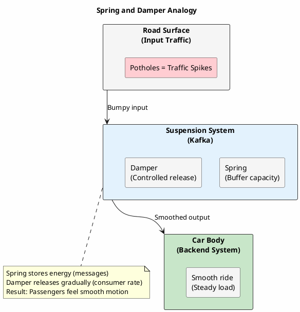

### Signal Processing: Low-Pass Filter

In signal processing terms, Kafka acts as a low-pass filter (or IIR filter). High-frequency spikes in the input signal are attenuated, while the underlying trend passes through smoothly to the output.

**Input Signal (Producer Traffic):**


**Output Signal (Consumer Traffic) - After Kafka:**


Kafka filters out high-frequency variations. The consumer sees a steady, predictable load while spikes are absorbed into the buffer (consumer lag).

### Throughput Over Time

The following chart illustrates the smoothing effect in practice:


| Time | Producer Rate | Consumer Rate | Lag Trend | Backend Load |
|------|---------------|---------------|-----------|--------------|
| 00:00 | 1,000/s | 1,000/s | — | 1,000/s |
| 06:00 | 2,000/s | 2,000/s | — | 2,000/s |
| **12:00** | **12,000/s** | 2,000/s | ↑↑ Peak | 2,000/s |
| 18:00 | 3,000/s | 2,000/s | ↓ Draining | 2,000/s |
| 24:00 | 1,000/s | 1,000/s | — Empty | 1,000/s |

**Key insight:** The area between producer and consumer rates represents buffered messages (consumer lag). This lag grows during spikes and drains during quiet periods. The backend database experiences a constant, manageable load while Kafka absorbs all variability.

---

## The Problem

Systems rarely produce and consume data at identical rates:

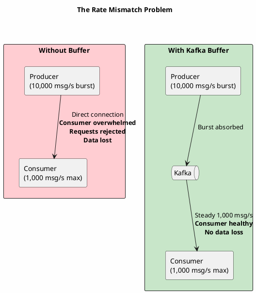

**Common scenarios:**

| Scenario | Producer Rate | Consumer Capacity | Problem |
|----------|---------------|-------------------|---------|
| Flash sales | 100x normal | Fixed database IOPS | Database saturation |
| Log ingestion | Varies with traffic | Fixed Elasticsearch cluster | Index rejections |
| IoT telemetry | Sensor bursts | Limited analytics pipeline | Processing delays |
| Batch jobs | Bulk exports | Rate-limited APIs | API throttling |
| Event-driven | Cascading events | Legacy system limits | System crashes |

---

## How Kafka Absorbs Shocks

Kafka's architecture naturally supports load leveling:

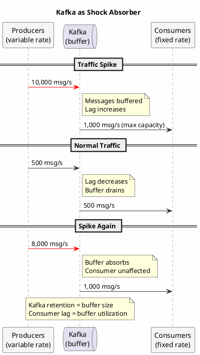

**Key properties:**

1. **Durable buffer** - Messages persist until consumed (or retention expires)
2. **Decoupled rates** - Producers and consumers operate independently
3. **Horizontal scaling** - Add partitions for higher throughput
4. **Configurable retention** - Buffer size measured in time or bytes

---

## Architecture Patterns

### Pattern 1: Protecting Legacy Systems

Legacy systems (mainframes, older databases) often cannot scale elastically. Kafka shields them from modern traffic patterns.

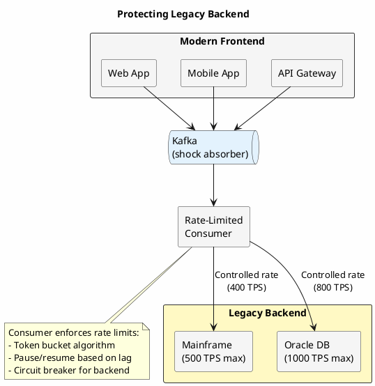

**Implementation:**

```java
public class RateLimitedConsumer {

    private final RateLimiter rateLimiter;
    private final LegacyClient legacyClient;
    private final Consumer<String, Event> consumer;

    public RateLimitedConsumer(int maxTps) {
        this.rateLimiter = RateLimiter.create(maxTps);
    }

    public void consume() {
        while (running) {
            ConsumerRecords<String, Event> records = consumer.poll(Duration.ofMillis(100));

            for (ConsumerRecord<String, Event> record : records) {
                // Block until rate limit allows
                rateLimiter.acquire();

                try {
                    legacyClient.process(record.value());
                } catch (RateLimitException e) {
                    // Backend is struggling - pause consumption
                    consumer.pause(consumer.assignment());
                    Thread.sleep(backoffMs);
                    consumer.resume(consumer.assignment());
                }
            }

            consumer.commitSync();
        }
    }
}
```

### Pattern 2: Batch Aggregation

Collect events during high-traffic periods, process in efficient batches during low-traffic periods.

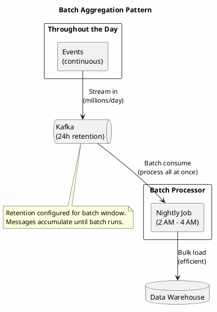

**Configuration:**

```properties
# Topic retention sized for batch window
log.retention.hours=48
log.retention.bytes=-1

# Consumer for batch processing
max.poll.records=10000
fetch.max.bytes=52428800
enable.auto.commit=false
```

### Pattern 3: Multi-Speed Consumers

Different consumers process the same events at different rates based on their capabilities.

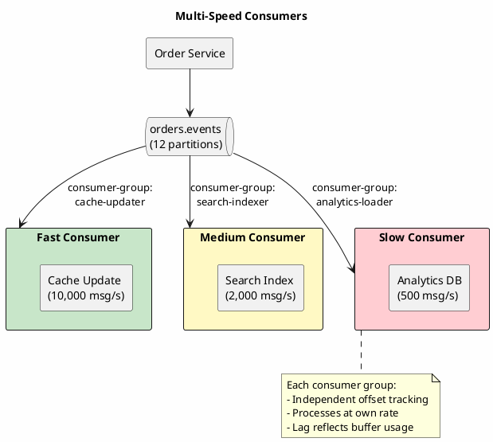

---

## Consumer Lag as a Feature

In the shock absorber pattern, consumer lag is not a problem—it's the buffer working as intended.

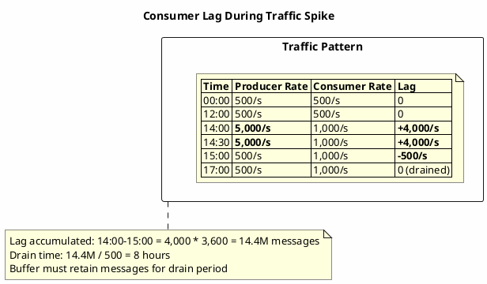

### Sizing the Buffer

Calculate required retention based on expected spike patterns:

```
Buffer Size = (Peak Rate - Consumer Rate) × Spike Duration

Example:
- Peak rate: 10,000 msg/s
- Consumer rate: 2,000 msg/s
- Spike duration: 2 hours

Buffer = (10,000 - 2,000) × 7,200 seconds = 57.6 million messages

With 1KB average message size:
Storage needed = 57.6M × 1KB = ~58 GB per partition
```

**Retention configuration:**

```properties
# Time-based retention (for predictable spike patterns)
log.retention.hours=72

# Size-based retention (for storage constraints)
log.retention.bytes=107374182400  # 100 GB per partition

# Combined (whichever triggers first)
log.retention.hours=72
log.retention.bytes=107374182400
```

### Lag Alerting Strategy

```yaml
# Prometheus alerting rules for shock absorber pattern

groups:
  - name: kafka-shock-absorber
    rules:
      # Alert on lag growth rate, not absolute lag
      - alert: ConsumerLagGrowingTooFast
        expr: |
          rate(kafka_consumer_group_lag[5m]) > 1000
        for: 15m
        labels:
          severity: warning
        annotations:
          summary: "Consumer lag growing rapidly"
          description: "Lag increasing by {{ $value }}/s - verify this is expected"

      # Alert if lag approaches retention limit
      - alert: ConsumerLagApproachingRetention
        expr: |
          kafka_consumer_group_lag / kafka_topic_partition_current_offset
          > 0.8
        for: 30m
        labels:
          severity: critical
        annotations:
          summary: "Consumer may lose messages"
          description: "Lag at 80% of available buffer - messages at risk"

      # Alert if lag not draining during off-peak
      - alert: ConsumerLagNotDraining
        expr: |
          kafka_consumer_group_lag > 1000000
          and hour() >= 2 and hour() <= 6
        for: 2h
        labels:
          severity: warning
        annotations:
          summary: "Lag not draining during off-peak"
          description: "Expected lag to decrease overnight"
```

---

## Backpressure Strategies

When consumers cannot keep up even during normal periods, implement backpressure.

### Strategy 1: Pause/Resume

```java
public class BackpressureConsumer {

    private static final long LAG_THRESHOLD = 1_000_000;
    private static final long RESUME_THRESHOLD = 100_000;

    private final AdminClient adminClient;
    private boolean paused = false;

    public void consumeWithBackpressure() {
        while (running) {
            long currentLag = getCurrentLag();

            if (!paused && currentLag > LAG_THRESHOLD) {
                // Too far behind - pause to let downstream recover
                consumer.pause(consumer.assignment());
                paused = true;
                notifyUpstream("SLOW_DOWN");
                log.warn("Paused consumption - lag {} exceeds threshold", currentLag);
            }

            if (paused && currentLag < RESUME_THRESHOLD) {
                // Caught up enough to resume
                consumer.resume(consumer.assignment());
                paused = false;
                notifyUpstream("READY");
                log.info("Resumed consumption - lag {} below threshold", currentLag);
            }

            if (!paused) {
                ConsumerRecords<String, Event> records = consumer.poll(Duration.ofMillis(100));
                processRecords(records);
            } else {
                // Still paused - sleep to avoid busy loop
                Thread.sleep(1000);
            }
        }
    }
}
```

### Strategy 2: Adaptive Batch Sizing

```java
public class AdaptiveBatchConsumer {

    private int currentBatchSize = 1000;
    private static final int MIN_BATCH = 100;
    private static final int MAX_BATCH = 10000;

    public void consumeAdaptively() {
        while (running) {
            ConsumerRecords<String, Event> records = consumer.poll(Duration.ofMillis(100));

            long startTime = System.currentTimeMillis();
            int processed = processBatch(records, currentBatchSize);
            long duration = System.currentTimeMillis() - startTime;

            // Adjust batch size based on processing time
            if (duration < 100 && currentBatchSize < MAX_BATCH) {
                // Processing fast - increase batch size
                currentBatchSize = Math.min(currentBatchSize * 2, MAX_BATCH);
            } else if (duration > 1000 && currentBatchSize > MIN_BATCH) {
                // Processing slow - decrease batch size
                currentBatchSize = Math.max(currentBatchSize / 2, MIN_BATCH);
            }

            consumer.commitSync();
        }
    }
}
```

### Strategy 3: Priority Lanes

Route high-priority messages to a fast lane that's always processed, while low-priority messages buffer.

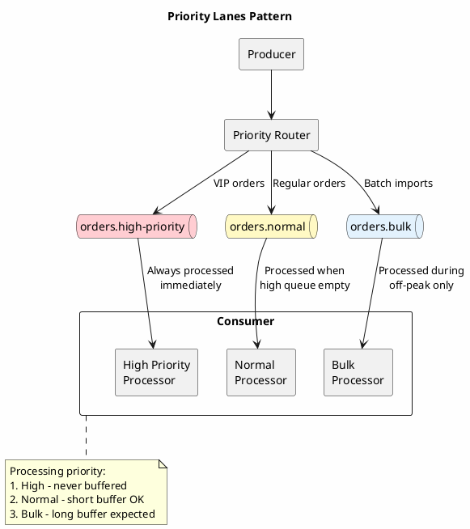

---

## Cost Optimization

The shock absorber pattern enables significant cost savings by smoothing resource usage.

### Without Kafka (Auto-Scaling)

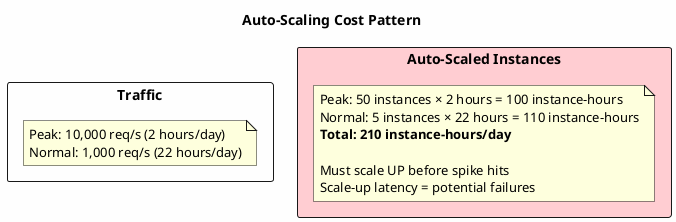

### With Kafka (Steady Consumers)

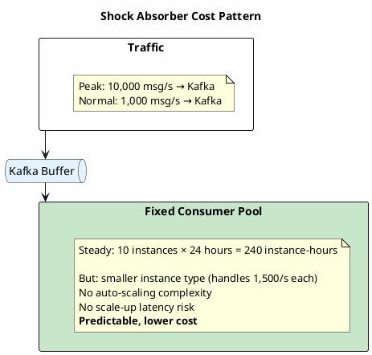

**Cost comparison:**

| Approach | Compute Cost | Operational Complexity | Risk |
|----------|--------------|------------------------|------|
| Auto-scaling | Higher (peak capacity) | High (scaling policies) | Scale-up latency |
| Shock absorber | Lower (steady capacity) | Low (fixed pool) | Must size buffer |

---


## Anti-Patterns

### Undersized Buffer

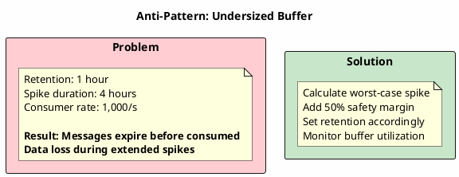

### Ignoring Consumer Health

```java
// WRONG: Assuming consumer keeps up
@KafkaListener(topics = "events")
public void consume(Event event) {
    // No rate limiting
    // No health checks
    // No backpressure
    database.insert(event);  // What if DB is slow?
}

// RIGHT: Health-aware consumption
@KafkaListener(topics = "events")
public void consume(Event event, Acknowledgment ack) {
    if (!healthChecker.isDownstreamHealthy()) {
        // Don't ack - message will be redelivered
        throw new RetryableException("Downstream unhealthy");
    }

    rateLimiter.acquire();

    try {
        database.insert(event);
        ack.acknowledge();
    } catch (Exception e) {
        // Let Kafka retry
        throw new RetryableException(e);
    }
}
```

### No Drain Strategy

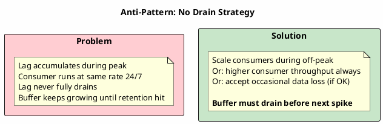

---

## Summary

| Aspect | Recommendation |
|--------|----------------|
| Buffer sizing | Peak rate × spike duration × safety margin |
| Retention | Time or size based on drain requirements |
| Consumer rate | Must exceed average producer rate |
| Lag alerting | Alert on growth rate, not absolute value |
| Backpressure | Pause/resume, adaptive batching, or priority lanes |
| Monitoring | Buffer utilization, drain time, rate delta |

The shock absorber pattern transforms unpredictable traffic into predictable processing load, enabling cost optimization, protecting legacy systems, and improving overall system resilience.

---

## Related Documentation

- [Microservices](microservices.md) - Consumer group strategies
- [Producer Development](../producers/index.md) - Batching and throughput
- [Consumer Development](../consumers/index.md) - Offset management
- [Operations](../../operations/index.md) - Retention configuration
