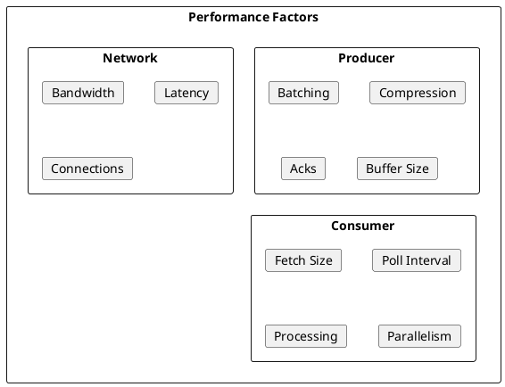
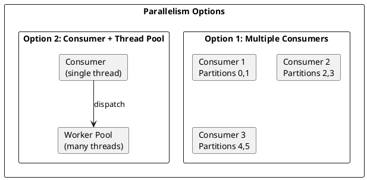

# Performance Tuning

This guide covers performance optimization for Kafka producers and consumers, including configuration tuning, batching strategies, compression, and monitoring recommendations.

---

## Performance Factors



| Factor | Impact | Optimization Goal |
|--------|--------|-------------------|
| **Batching** | Throughput | Larger batches = higher throughput |
| **Compression** | Network, storage | Reduce data size |
| **Acknowledgments** | Durability vs latency | Balance requirements |
| **Parallelism** | Throughput | Match partitions to consumers |

---

## Producer Performance

### Key Configuration

| Property | Default | Throughput | Latency |
|----------|---------|------------|---------|
| `batch.size` | 16384 | Increase | Increase |
| `linger.ms` | 0 | Increase | Increase |
| `buffer.memory` | 33554432 | Increase | - |
| `compression.type` | none | Improves | Increases CPU |
| `acks` | all | Decrease | Increases |
| `max.in.flight.requests.per.connection` | 5 | Increase | - |

### High Throughput Configuration

```properties
# Batching - larger batches
batch.size=131072                # 128KB
linger.ms=20                     # Wait up to 20ms for batch
buffer.memory=134217728          # 128MB total buffer

# Compression
compression.type=lz4             # Fast compression

# Parallel requests
max.in.flight.requests.per.connection=5

# Retries
retries=2147483647
delivery.timeout.ms=120000

# If durability allows
acks=1                           # Only leader acknowledgment
```

### Low Latency Configuration

```properties
# Minimal batching
batch.size=16384                 # 16KB
linger.ms=0                      # Send immediately

# No compression
compression.type=none

# Quick timeout
request.timeout.ms=10000

# Fast acknowledgment
acks=1
```

### Batching Impact

| batch.size | linger.ms | Throughput | Latency |
|------------|-----------|------------|---------|
| 16KB | 0 | Low | Lowest |
| 16KB | 5 | Medium | Low |
| 64KB | 10 | High | Medium |
| 128KB | 20 | Highest | Higher |

```java
// Monitor batch efficiency
producer.metrics().get("batch-size-avg");
producer.metrics().get("records-per-request-avg");
producer.metrics().get("record-queue-time-avg");
```

---

## Compression

### Compression Comparison

| Codec | Compression Ratio | CPU | Speed |
|-------|-------------------|-----|-------|
| `none` | 1:1 | None | Fastest |
| `lz4` | ~2:1 | Low | Fast |
| `snappy` | ~2:1 | Low | Fast |
| `zstd` | ~3:1 | Medium | Medium |
| `gzip` | ~3:1 | High | Slow |

### Compression Configuration

```properties
# Recommended for most workloads
compression.type=lz4

# For maximum compression (CPU available)
compression.type=zstd

# Producer-side compression level (zstd)
compression.zstd.level=3
```

### When to Use Each

| Scenario | Recommended |
|----------|-------------|
| High throughput, balanced | lz4 |
| Network constrained | zstd |
| CPU constrained | none or snappy |
| Storage optimization | zstd |
| Legacy compatibility | gzip |

---

## Consumer Performance

### Key Configuration

| Property | Default | Impact |
|----------|---------|--------|
| `fetch.min.bytes` | 1 | Wait for data to accumulate |
| `fetch.max.bytes` | 52428800 | Maximum per fetch |
| `max.partition.fetch.bytes` | 1048576 | Maximum per partition |
| `fetch.max.wait.ms` | 500 | Maximum wait for min.bytes |
| `max.poll.records` | 500 | Records per poll |

### High Throughput Configuration

```properties
# Larger fetches
fetch.min.bytes=65536            # 64KB minimum
fetch.max.bytes=104857600        # 100MB maximum
max.partition.fetch.bytes=10485760  # 10MB per partition
fetch.max.wait.ms=1000           # Wait longer for batches

# More records per poll
max.poll.records=1000

# Longer processing time
max.poll.interval.ms=600000      # 10 minutes
```

### Low Latency Configuration

```properties
# Immediate fetch
fetch.min.bytes=1
fetch.max.wait.ms=100

# Smaller batches
max.poll.records=100
```

### Consumer Parallelism



**Multiple Consumers:**
```java
// One consumer per thread
int numConsumers = Math.min(partitionCount, availableCores);
ExecutorService executor = Executors.newFixedThreadPool(numConsumers);

for (int i = 0; i < numConsumers; i++) {
    executor.submit(new ConsumerRunnable(createConsumer()));
}
```

**Consumer with Worker Pool:**
```java
// Single consumer with async processing
ExecutorService workers = Executors.newFixedThreadPool(10);

while (running) {
    ConsumerRecords<String, String> records = consumer.poll(Duration.ofMillis(100));

    List<CompletableFuture<Void>> futures = new ArrayList<>();
    for (ConsumerRecord<String, String> record : records) {
        futures.add(CompletableFuture.runAsync(() -> process(record), workers));
    }

    CompletableFuture.allOf(futures.toArray(new CompletableFuture[0])).join();
    consumer.commitSync();
}
```

---

## Network Optimization

### Socket Configuration

```properties
# Producer
socket.send.buffer.bytes=131072      # 128KB
send.buffer.bytes=131072

# Consumer
socket.receive.buffer.bytes=131072   # 128KB
receive.buffer.bytes=131072
```

### Connection Management

```properties
# Connection limits
connections.max.idle.ms=540000       # 9 minutes
reconnect.backoff.ms=50
reconnect.backoff.max.ms=1000

# Request timeouts
request.timeout.ms=30000
```

---

## Memory Management

### Producer Memory

```properties
# Total buffer memory
buffer.memory=134217728              # 128MB

# Block if buffer full
max.block.ms=60000                   # Wait up to 60s
```

### Consumer Memory

Memory consumption per consumer:
- Fetch buffer: `fetch.max.bytes` × assigned partitions
- Record buffer: Records in `poll()` result
- Deserialization overhead

```java
// Monitor consumer memory
consumer.metrics().get("fetch-size-avg");
consumer.metrics().get("records-consumed-rate");
```

### Kafka Streams Memory

```properties
# Cache for reducing writes to state stores
cache.max.bytes.buffering=10485760   # 10MB per thread

# RocksDB memory
rocksdb.config.setter=com.example.CustomRocksDBConfig
```

---

## Monitoring Metrics

### Producer Metrics

| Metric | Description | Target |
|--------|-------------|--------|
| `record-send-rate` | Records sent per second | As high as needed |
| `record-retry-rate` | Retries per second | < 1% of send rate |
| `batch-size-avg` | Average batch size | Close to batch.size |
| `records-per-request-avg` | Records per request | Higher = better batching |
| `request-latency-avg` | Request latency | < 100ms |
| `outgoing-byte-rate` | Network throughput | Network capacity |
| `buffer-available-bytes` | Available buffer | > 0 |
| `buffer-exhausted-rate` | Buffer full events | 0 |

### Consumer Metrics

| Metric | Description | Target |
|--------|-------------|--------|
| `records-consumed-rate` | Records consumed per second | Match production rate |
| `records-lag` | Offset lag | As low as acceptable |
| `records-lag-max` | Maximum lag | Alert threshold |
| `fetch-latency-avg` | Fetch latency | < 500ms |
| `fetch-rate` | Fetches per second | Stable |
| `commit-latency-avg` | Commit latency | < 1000ms |

### JMX Monitoring

```java
// Access metrics programmatically
Map<MetricName, ? extends Metric> metrics = producer.metrics();

for (Map.Entry<MetricName, ? extends Metric> entry : metrics.entrySet()) {
    MetricName name = entry.getKey();
    Metric metric = entry.getValue();

    if (name.name().equals("record-send-rate")) {
        log.info("Send rate: {}", metric.metricValue());
    }
}
```

---

## Benchmarking

### Producer Benchmark

```bash
# Kafka performance test tool
kafka-producer-perf-test.sh \
    --topic benchmark \
    --num-records 1000000 \
    --record-size 1024 \
    --throughput -1 \
    --producer-props \
        bootstrap.servers=kafka:9092 \
        batch.size=131072 \
        linger.ms=20 \
        compression.type=lz4
```

### Consumer Benchmark

```bash
kafka-consumer-perf-test.sh \
    --bootstrap-server kafka:9092 \
    --topic benchmark \
    --messages 1000000 \
    --threads 3
```

### Custom Benchmark

```java
public class ProducerBenchmark {
    public static void main(String[] args) {
        Properties props = loadConfig();
        Producer<String, byte[]> producer = new KafkaProducer<>(props);

        int numRecords = 1_000_000;
        int recordSize = 1024;
        byte[] payload = new byte[recordSize];

        long start = System.currentTimeMillis();
        CountDownLatch latch = new CountDownLatch(numRecords);

        for (int i = 0; i < numRecords; i++) {
            producer.send(
                new ProducerRecord<>("benchmark", Integer.toString(i), payload),
                (metadata, exception) -> latch.countDown()
            );
        }

        latch.await();
        long elapsed = System.currentTimeMillis() - start;

        System.out.printf("Sent %d records in %d ms%n", numRecords, elapsed);
        System.out.printf("Throughput: %.2f records/sec%n", numRecords * 1000.0 / elapsed);
        System.out.printf("Throughput: %.2f MB/sec%n",
            numRecords * recordSize / 1024.0 / 1024.0 * 1000.0 / elapsed);

        producer.close();
    }
}
```

---

## Configuration Templates

### High Throughput Producer

```properties
bootstrap.servers=kafka-1:9092,kafka-2:9092,kafka-3:9092

# Large batches
batch.size=131072
linger.ms=20
buffer.memory=134217728

# Compression
compression.type=lz4

# Parallel requests
max.in.flight.requests.per.connection=5

# Retries
retries=2147483647
delivery.timeout.ms=120000

# Acknowledgments (if durability allows)
acks=1

# Network
send.buffer.bytes=131072
```

### High Throughput Consumer

```properties
bootstrap.servers=kafka-1:9092,kafka-2:9092,kafka-3:9092
group.id=high-throughput-consumers

# Large fetches
fetch.min.bytes=65536
fetch.max.bytes=104857600
max.partition.fetch.bytes=10485760
fetch.max.wait.ms=1000

# More records
max.poll.records=1000

# Processing time
max.poll.interval.ms=600000
session.timeout.ms=60000
heartbeat.interval.ms=15000

# Manual commit
enable.auto.commit=false

# Assignment
partition.assignment.strategy=org.apache.kafka.clients.consumer.CooperativeStickyAssignor
```

### Balanced (Throughput + Latency)

```properties
# Producer
batch.size=32768
linger.ms=5
compression.type=lz4
acks=all

# Consumer
fetch.min.bytes=1024
fetch.max.wait.ms=500
max.poll.records=500
```

---

## Troubleshooting

### Low Throughput

| Symptom | Cause | Solution |
|---------|-------|----------|
| Small batches | linger.ms=0 | Increase linger.ms |
| High latency | acks=all | Consider acks=1 if safe |
| CPU bound | Compression | Use faster codec |
| Network bound | No compression | Enable compression |

### High Latency

| Symptom | Cause | Solution |
|---------|-------|----------|
| Long queue time | Large batches | Reduce batch.size, linger.ms |
| Slow acks | acks=all, slow replicas | Check replica health |
| Network delay | High latency network | Increase timeouts |

### Consumer Lag

| Symptom | Cause | Solution |
|---------|-------|----------|
| Growing lag | Slow processing | Increase parallelism |
| Frequent rebalances | Long processing | Increase max.poll.interval.ms |
| Small fetches | fetch.min.bytes | Increase fetch size |

---

## Best Practices

### General

| Practice | Recommendation |
|----------|----------------|
| Measure first | Benchmark before tuning |
| Change one thing | Isolate variable impact |
| Monitor continuously | Track performance metrics |
| Test in production-like | Use realistic data and load |

### Producer

| Practice | Recommendation |
|----------|----------------|
| Use compression | LZ4 for most workloads |
| Tune batching | Balance throughput and latency |
| Handle backpressure | Monitor buffer.memory usage |
| Use callbacks | Handle delivery results |

### Consumer

| Practice | Recommendation |
|----------|----------------|
| Match partitions | Consumers <= Partitions |
| Process async | For CPU-intensive work |
| Commit carefully | After processing, not before |
| Monitor lag | Alert on threshold breach |

---

## Related Documentation

- [Producer Development](../producers/index.md) - Producer patterns
- [Consumer Development](../consumers/index.md) - Consumer patterns
- [Operations](../../operations/index.md) - Cluster operations
- [Monitoring](../../operations/monitoring/index.md) - Metrics and alerting
