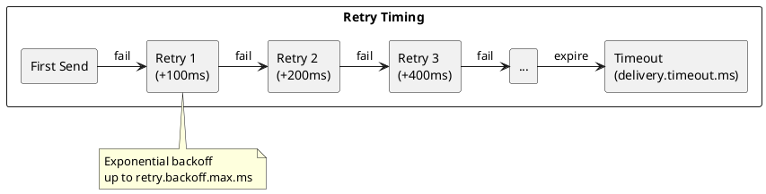
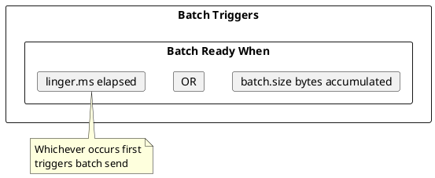
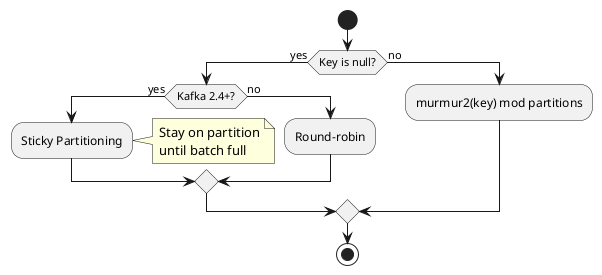

# Kafka Producer Configuration

This document provides a comprehensive reference for all Kafka producer configuration options, organized by functional area.

---

## Required Configuration

These settings must be specified for every producer.

| Configuration | Type | Description |
|---------------|------|-------------|
| `bootstrap.servers` | list | Comma-separated list of host:port pairs for initial connection |
| `key.serializer` | class | Serializer class for record keys |
| `value.serializer` | class | Serializer class for record values |

```properties
bootstrap.servers=kafka1:9092,kafka2:9092,kafka3:9092
key.serializer=org.apache.kafka.common.serialization.StringSerializer
value.serializer=org.apache.kafka.common.serialization.StringSerializer
```

---

## Reliability Configuration

Settings that control delivery guarantees and durability.

### Acknowledgments

| Configuration | Default | Range | Description |
|---------------|:-------:|-------|-------------|
| `acks` | all | 0, 1, all | Number of acknowledgments required |

| Value | Behavior |
|-------|----------|
| `0` | Producer does not wait for acknowledgment |
| `1` | Leader writes to local log before acknowledging |
| `all` / `-1` | Leader waits for full ISR acknowledgment |

### Retries

| Configuration | Default | Range | Description |
|---------------|:-------:|-------|-------------|
| `retries` | 2147483647 | ≥ 0 | Number of retry attempts for failed sends |
| `retry.backoff.ms` | 100 | ≥ 0 | Time between retry attempts |
| `retry.backoff.max.ms` | 1000 | ≥ 0 | Maximum retry backoff |
| `delivery.timeout.ms` | 120000 | ≥ 0 | Upper bound on time to report success/failure |



### Idempotence and Transactions

| Configuration | Default | Description |
|---------------|:-------:|-------------|
| `enable.idempotence` | true (3.0+) | Enable idempotent producer |
| `transactional.id` | null | Unique identifier for transactional producer |
| `transaction.timeout.ms` | 60000 | Transaction timeout |

!!! note "Idempotence Requirements"
    When `enable.idempotence=true`:
    - `acks` must be `all`
    - `retries` must be > 0
    - `max.in.flight.requests.per.connection` must be ≤ 5

---

## Performance Configuration

Settings that affect throughput and latency.

### Batching

| Configuration | Default | Range | Description |
|---------------|:-------:|-------|-------------|
| `batch.size` | 16384 | ≥ 0 | Maximum batch size in bytes |
| `linger.ms` | 0 | ≥ 0 | Time to wait for batch to fill |
| `buffer.memory` | 33554432 | ≥ 0 | Total memory for buffering |
| `max.block.ms` | 60000 | ≥ 0 | Time to block when buffer full |



### Request Handling

| Configuration | Default | Range | Description |
|---------------|:-------:|-------|-------------|
| `max.in.flight.requests.per.connection` | 5 | ≥ 1 | Max unacknowledged requests per connection |
| `max.request.size` | 1048576 | ≥ 0 | Maximum size of a request |
| `request.timeout.ms` | 30000 | ≥ 0 | Time to wait for request response |

### Network

| Configuration | Default | Range | Description |
|---------------|:-------:|-------|-------------|
| `send.buffer.bytes` | 131072 | ≥ -1 | TCP send buffer size (-1 = OS default) |
| `receive.buffer.bytes` | 32768 | ≥ -1 | TCP receive buffer size (-1 = OS default) |
| `connections.max.idle.ms` | 540000 | ≥ 0 | Close idle connections after this time |
| `reconnect.backoff.ms` | 50 | ≥ 0 | Initial reconnection backoff |
| `reconnect.backoff.max.ms` | 1000 | ≥ 0 | Maximum reconnection backoff |

---

## Compression Configuration

| Configuration | Default | Options | Description |
|---------------|:-------:|---------|-------------|
| `compression.type` | none | none, gzip, snappy, lz4, zstd | Compression codec |

### Compression Trade-offs

| Type | Compression Ratio | CPU Usage | Latency Impact |
|------|:-----------------:|:---------:|:--------------:|
| `none` | 1.0x | None | None |
| `gzip` | ~0.3-0.5x | High | Moderate |
| `snappy` | ~0.5-0.7x | Low | Low |
| `lz4` | ~0.5-0.7x | Low | Lowest |
| `zstd` | ~0.4-0.6x | Medium | Low |

Compression ratios are workload-dependent and should be validated with representative data.

---

## Partitioning Configuration

| Configuration | Default | Description |
|---------------|:-------:|-------------|
| `partitioner.class` | DefaultPartitioner | Partitioner implementation |
| `partitioner.ignore.keys` | false | Ignore keys for partitioning (sticky only) |
| `partitioner.adaptive.partitioning.enable` | true | Enable adaptive partitioning |
| `partitioner.availability.timeout.ms` | 0 | Timeout for partition availability check |

### Default Partitioner Behavior



---

## Serialization Configuration

| Configuration | Default | Description |
|---------------|:-------:|-------------|
| `key.serializer` | - | Key serializer class (required) |
| `value.serializer` | - | Value serializer class (required) |

### Common Serializers

| Serializer | Class | Use Case |
|------------|-------|----------|
| String | `org.apache.kafka.common.serialization.StringSerializer` | Text data |
| Bytes | `org.apache.kafka.common.serialization.ByteArraySerializer` | Binary data |
| Integer | `org.apache.kafka.common.serialization.IntegerSerializer` | Integer keys |
| Long | `org.apache.kafka.common.serialization.LongSerializer` | Long keys |
| JSON | Custom or library | Structured data |
| Avro | `io.confluent.kafka.serializers.KafkaAvroSerializer` | Schema Registry |
| Protobuf | `io.confluent.kafka.serializers.protobuf.KafkaProtobufSerializer` | Schema Registry |

---

## Security Configuration

### SSL/TLS

| Configuration | Default | Description |
|---------------|:-------:|-------------|
| `security.protocol` | PLAINTEXT | Protocol: PLAINTEXT, SSL, SASL_PLAINTEXT, SASL_SSL |
| `ssl.truststore.location` | - | Truststore file path |
| `ssl.truststore.password` | - | Truststore password |
| `ssl.keystore.location` | - | Keystore file path |
| `ssl.keystore.password` | - | Keystore password |
| `ssl.key.password` | - | Private key password |
| `ssl.endpoint.identification.algorithm` | https | Hostname verification algorithm |

### SASL

| Configuration | Default | Description |
|---------------|:-------:|-------------|
| `sasl.mechanism` | GSSAPI | SASL mechanism: PLAIN, SCRAM-SHA-256, SCRAM-SHA-512, GSSAPI, OAUTHBEARER |
| `sasl.jaas.config` | - | JAAS configuration |
| `sasl.client.callback.handler.class` | - | Callback handler class |
| `sasl.kerberos.service.name` | - | Kerberos service name |

```properties
# SASL/SCRAM example
security.protocol=SASL_SSL
sasl.mechanism=SCRAM-SHA-256
sasl.jaas.config=org.apache.kafka.common.security.scram.ScramLoginModule required \
    username="producer" \
    password="secret";
```

---

## Interceptor Configuration

| Configuration | Default | Description |
|---------------|:-------:|-------------|
| `interceptor.classes` | - | Comma-separated list of interceptor classes |

```java
public class MetricsInterceptor implements ProducerInterceptor<String, String> {
    @Override
    public ProducerRecord<String, String> onSend(ProducerRecord<String, String> record) {
        // Add timestamp header, track metrics
        record.headers().add("send_time",
            Long.toString(System.currentTimeMillis()).getBytes());
        return record;
    }

    @Override
    public void onAcknowledgement(RecordMetadata metadata, Exception exception) {
        // Track delivery metrics
    }
}
```

---

## Metadata Configuration

| Configuration | Default | Range | Description |
|---------------|:-------:|-------|-------------|
| `metadata.max.age.ms` | 300000 | ≥ 0 | Max age of cached metadata |
| `metadata.max.idle.ms` | 300000 | ≥ 5000 | Remove metadata for unused topics |

---

## Monitoring Configuration

| Configuration | Default | Description |
|---------------|:-------:|-------------|
| `client.id` | - | Client identifier for logging and metrics |
| `metric.reporters` | - | Comma-separated list of metric reporter classes |
| `metrics.num.samples` | 2 | Number of samples for metrics |
| `metrics.sample.window.ms` | 30000 | Metrics sample window |
| `metrics.recording.level` | INFO | Metrics recording level: INFO, DEBUG |

---

## Configuration Profiles

### Low Latency Profile

```properties
# Minimize latency
acks=1
linger.ms=0
batch.size=16384
compression.type=lz4
max.in.flight.requests.per.connection=5
```

### High Throughput Profile

```properties
# Maximize throughput
acks=all
linger.ms=50
batch.size=131072
buffer.memory=67108864
compression.type=zstd
max.in.flight.requests.per.connection=5
```

### Maximum Reliability Profile

```properties
# Maximum durability
acks=all
enable.idempotence=true
retries=2147483647
delivery.timeout.ms=300000
max.in.flight.requests.per.connection=5
```

### Transactional Profile

```properties
# Exactly-once semantics
acks=all
enable.idempotence=true
transactional.id=my-app-instance-1
transaction.timeout.ms=60000
max.in.flight.requests.per.connection=5
```

---

## Configuration Validation

| Check | Requirement |
|-------|-------------|
| Idempotence | `acks=all`, `retries > 0`, `max.in.flight <= 5` |
| Transactions | `enable.idempotence=true`, `transactional.id` set |
| Ordering | `max.in.flight.requests.per.connection=1` OR `enable.idempotence=true` |

```java
// Configuration validation example
Properties props = new Properties();
props.put(ProducerConfig.BOOTSTRAP_SERVERS_CONFIG, "kafka:9092");
props.put(ProducerConfig.ENABLE_IDEMPOTENCE_CONFIG, true);

// Validate before creating producer
try {
    new KafkaProducer<>(props);
} catch (ConfigException e) {
    log.error("Invalid configuration: {}", e.getMessage());
}
```

---

## Related Documentation

- [Producer Guide](index.md) - Producer overview
- [Batching](../../architecture/client-connections/batching.md) - Batching details
- [Compression](../../architecture/client-connections/compression.md) - Compression options
- [Idempotence](idempotence.md) - Idempotent producer
- [Transactions](transactions.md) - Transactional producer
