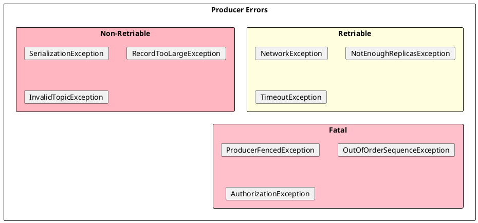

# Kafka Producer Error Handling

Proper error handling ensures reliable message delivery. This document covers error types, timeout configuration, and recovery patterns.

---

## Error Classification



| Type | Producer Behavior | Application Action |
|------|-------------------|-------------------|
| **Retriable** | Automatic retry | Wait or handle timeout |
| **Non-Retriable** | Fail immediately | Fix data or config |
| **Fatal** | Cannot recover | Close producer |

---

## Timeout Configuration

```properties
# Total time to deliver message
delivery.timeout.ms=120000

# Per-request timeout
request.timeout.ms=30000

# Retry backoff
retry.backoff.ms=100
retry.backoff.max.ms=1000
```


---

## Handling Patterns

### Callback-Based

```java
producer.send(record, (metadata, exception) -> {
    if (exception == null) {
        log.info("Sent to {} @ {}", metadata.partition(), metadata.offset());
        return;
    }

    if (exception instanceof RetriableException) {
        // Already retried and failed
        log.error("Retriable error exhausted", exception);
        deadLetterQueue.send(record);
    } else if (exception instanceof SerializationException) {
        // Bad data
        log.error("Serialization failed", exception);
        metrics.increment("serialization_errors");
    } else {
        // Other error
        log.error("Send failed", exception);
        alertService.notify(exception);
    }
});
```

### Synchronous with Retry

```java
int maxRetries = 3;
for (int attempt = 0; attempt < maxRetries; attempt++) {
    try {
        RecordMetadata metadata = producer.send(record).get();
        log.info("Sent to {} @ {}", metadata.partition(), metadata.offset());
        break;
    } catch (ExecutionException e) {
        Throwable cause = e.getCause();
        if (cause instanceof RetriableException && attempt < maxRetries - 1) {
            log.warn("Retry {} of {}", attempt + 1, maxRetries);
            Thread.sleep(100 * (attempt + 1));
        } else {
            throw e;
        }
    }
}
```

---

## Common Errors

| Error | Cause | Solution |
|-------|-------|----------|
| `TimeoutException` | Broker slow or unreachable | Check broker health, increase timeout |
| `NotEnoughReplicasException` | ISR too small | Wait for replicas to catch up |
| `RecordTooLargeException` | Message > max.request.size | Increase limit or reduce message size |
| `SerializationException` | Serializer failure | Fix serialization logic |
| `ProducerFencedException` | Another producer with same txn.id | Ensure single instance |

---

## Dead Letter Queue Pattern

```java
public void sendWithDLQ(ProducerRecord<String, String> record) {
    producer.send(record, (metadata, exception) -> {
        if (exception != null) {
            // Send to DLQ
            ProducerRecord<String, String> dlqRecord = new ProducerRecord<>(
                "dead-letter-queue",
                record.key(),
                record.value()
            );
            dlqRecord.headers()
                .add("original-topic", record.topic().getBytes())
                .add("error", exception.getMessage().getBytes());

            dlqProducer.send(dlqRecord);
        }
    });
}
```

---

## Best Practices

| Practice | Rationale |
|----------|-----------|
| Always handle callbacks | Detect delivery failures |
| Use appropriate timeouts | Balance reliability and latency |
| Log errors with context | Enable debugging |
| Implement DLQ for critical data | Prevent data loss |
| Monitor error rates | Detect systemic issues |

---

## Related Documentation

- [Producer Guide](index.md) - Producer overview
- [Configuration](configuration.md) - Timeout settings
- [Protocol Errors](../../architecture/client-connections/protocol-errors.md) - Error code reference
