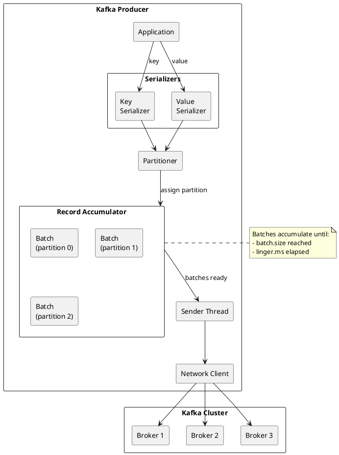
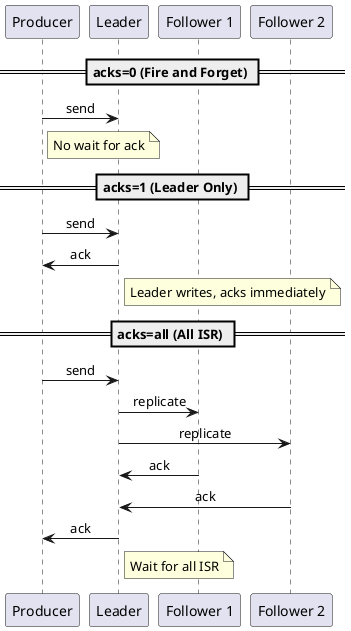
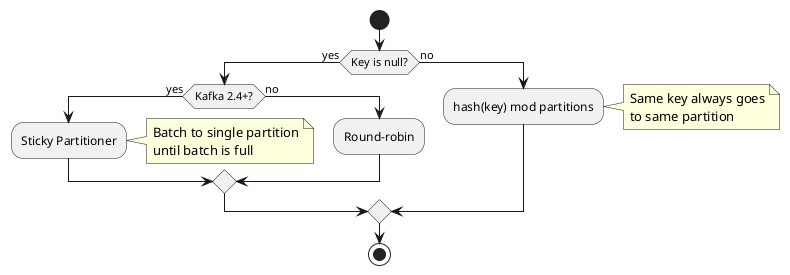
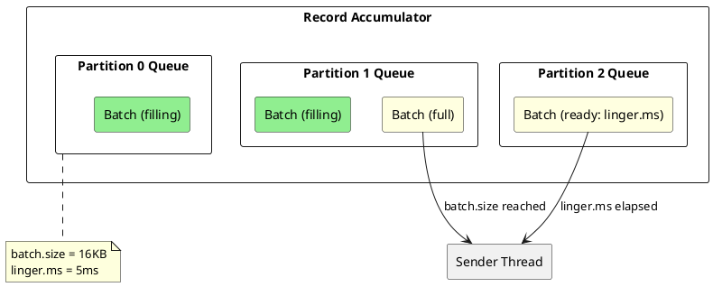
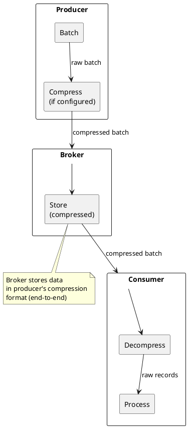
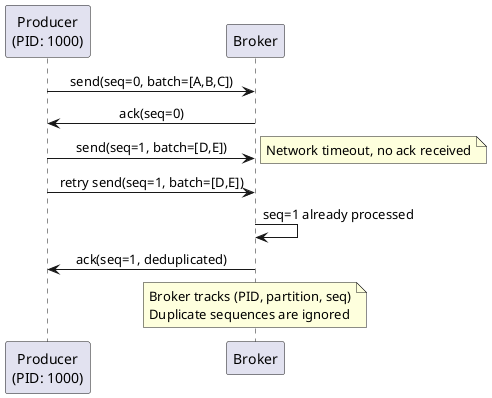
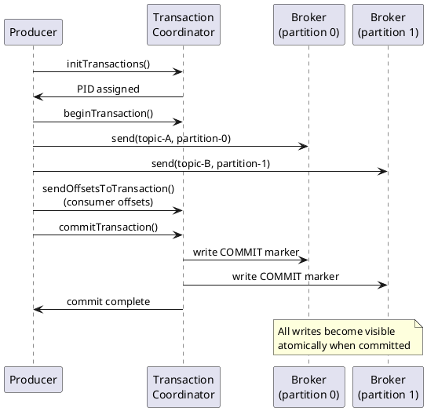

# Kafka Producer Guide

The Kafka producer is the client library responsible for publishing records to Kafka topics.

---

## Producer Architecture

The producer handles serialization, partitioning, batching, and network communication with Kafka brokers.



### Producer Components

| Component | Responsibility |
|-----------|----------------|
| **Serializers** | Convert keys and values to bytes |
| **Partitioner** | Determine target partition for each record |
| **Record Accumulator** | Buffer records into batches per partition |
| **Sender Thread** | Background thread that transmits batches to brokers |
| **Metadata** | Cache of cluster topology and partition leadership |

---

## Basic Producer Example

### Java

```java
Properties props = new Properties();
props.put("bootstrap.servers", "kafka1:9092,kafka2:9092,kafka3:9092");
props.put("key.serializer", "org.apache.kafka.common.serialization.StringSerializer");
props.put("value.serializer", "org.apache.kafka.common.serialization.StringSerializer");
props.put("acks", "all");

try (Producer<String, String> producer = new KafkaProducer<>(props)) {
    ProducerRecord<String, String> record = new ProducerRecord<>(
        "orders",           // topic
        "order-123",        // key
        "{\"amount\": 100}" // value
    );

    // Synchronous send
    RecordMetadata metadata = producer.send(record).get();
    System.out.printf("Sent to partition %d offset %d%n",
        metadata.partition(), metadata.offset());

    // Asynchronous send with callback
    producer.send(record, (meta, exception) -> {
        if (exception != null) {
            exception.printStackTrace();
        } else {
            System.out.printf("Sent to partition %d offset %d%n",
                meta.partition(), meta.offset());
        }
    });
}
```

### Python

```python
from kafka import KafkaProducer
import json

producer = KafkaProducer(
    bootstrap_servers=['kafka1:9092', 'kafka2:9092', 'kafka3:9092'],
    key_serializer=lambda k: k.encode('utf-8'),
    value_serializer=lambda v: json.dumps(v).encode('utf-8'),
    acks='all'
)

# Send record
future = producer.send(
    'orders',
    key='order-123',
    value={'amount': 100}
)

# Block for synchronous send
record_metadata = future.get(timeout=10)
print(f"Sent to partition {record_metadata.partition} offset {record_metadata.offset}")

producer.close()
```

---

## Configuration Reference

### Essential Configuration

| Configuration | Default | Description |
|---------------|---------|-------------|
| `bootstrap.servers` | - | Comma-separated list of broker addresses |
| `key.serializer` | - | Serializer class for record keys |
| `value.serializer` | - | Serializer class for record values |
| `acks` | `all` (3.0+) | Acknowledgment level: 0, 1, or all |
| `retries` | 2147483647 | Number of retry attempts |
| `delivery.timeout.ms` | 120000 | Upper bound on time to report success/failure |

### Batching Configuration

| Configuration | Default | Description |
|---------------|---------|-------------|
| `batch.size` | 16384 | Maximum batch size in bytes |
| `linger.ms` | 0 | Time to wait for additional records |
| `buffer.memory` | 33554432 | Total memory for buffering |
| `max.block.ms` | 60000 | Time to block when buffer is full |

### Reliability Configuration

| Configuration | Default | Description |
|---------------|---------|-------------|
| `enable.idempotence` | true (3.0+) | Enable idempotent producer |
| `max.in.flight.requests.per.connection` | 5 | Max unacknowledged requests per connection |
| `transactional.id` | null | Transaction ID for transactional producer |

### Performance Configuration

| Configuration | Default | Description |
|---------------|---------|-------------|
| `compression.type` | none | Compression: none, gzip, snappy, lz4, zstd |
| `max.request.size` | 1048576 | Maximum request size in bytes |
| `send.buffer.bytes` | 131072 | TCP send buffer size |
| `receive.buffer.bytes` | 32768 | TCP receive buffer size |

→ [Configuration Reference](configuration.md)

---

## Acknowledgments (acks)

The `acks` configuration determines how many replicas must acknowledge a write before the producer considers it successful.



| acks | Durability | Latency | Use Case |
|------|------------|---------|----------|
| `0` | Lowest—may lose data | Lowest | Metrics, logs where loss acceptable |
| `1` | Medium—loses data if leader fails before replication | Medium | Low latency, some durability |
| `all` | Highest—survives broker failures | Highest | Production default for important data |

!!! warning "acks=all Requires min.insync.replicas"
    With `acks=all`, the producer waits for all in-sync replicas. If `min.insync.replicas` is not set, this could mean waiting for only the leader if followers fall out of sync.

---

## Partitioning

The partitioner determines which partition receives each record. Partitioning affects ordering, parallelism, and load distribution.

### Default Partitioning Behavior



| Key | Behavior | Use Case |
|-----|----------|----------|
| **With key** | Consistent hashing—same key → same partition | Ordering by entity (user, order) |
| **Null key (2.4+)** | Sticky partitioning—fills batch before switching | High throughput, no ordering needed |
| **Null key (pre-2.4)** | Round-robin | Legacy behavior |

### Custom Partitioner

```java
public class RegionPartitioner implements Partitioner {
    @Override
    public int partition(String topic, Object key, byte[] keyBytes,
                        Object value, byte[] valueBytes, Cluster cluster) {
        String region = extractRegion(value);
        int numPartitions = cluster.partitionCountForTopic(topic);

        // Partition 0-2 for US, 3-5 for EU, 6-8 for APAC
        switch (region) {
            case "US": return key.hashCode() % 3;
            case "EU": return 3 + (key.hashCode() % 3);
            case "APAC": return 6 + (key.hashCode() % 3);
            default: return Math.abs(key.hashCode() % numPartitions);
        }
    }
}
```

### Partition Assignment Considerations

| Consideration | Guidance |
|---------------|----------|
| **Ordering requirements** | Use consistent keys for records that must be ordered together |
| **Hot partitions** | Avoid keys that create uneven distribution |
| **Partition count** | More partitions enable more parallelism but add overhead |
| **Consumer parallelism** | Maximum consumer parallelism equals partition count |

→ [Partitioning Guide](partitioning.md)

---

## Batching and Buffering

Batching improves throughput by amortizing network and disk I/O overhead across multiple records.

### How Batching Works



### Batching Configuration

| Configuration | Effect of Increasing |
|---------------|---------------------|
| `batch.size` | Larger batches, more compression, higher latency |
| `linger.ms` | More time to fill batches, higher latency |
| `buffer.memory` | More batches can accumulate, handles bursts better |

### Recommended Settings

| Workload | batch.size | linger.ms | Rationale |
|----------|------------|-----------|-----------|
| **Low latency** | 16384 | 0-5 | Send immediately or with minimal wait |
| **High throughput** | 65536+ | 10-100 | Fill larger batches for efficiency |
| **Balanced** | 32768 | 5-20 | Good throughput with acceptable latency |

→ [Batching Guide](../../architecture/client-connections/batching.md)

---

## Compression

Compression reduces network bandwidth and storage at the cost of CPU.

### Compression Types

| Type | Compression Ratio | CPU Cost | Speed |
|------|-------------------|----------|-------|
| `none` | 1.0x | None | Fastest |
| `gzip` | Best (0.3-0.5x) | High | Slowest |
| `snappy` | Good (0.5-0.7x) | Low | Fast |
| `lz4` | Good (0.5-0.7x) | Low | Fastest |
| `zstd` | Better (0.4-0.6x) | Medium | Fast |

### Compression Behavior



### Compression Recommendations

| Scenario | Recommended | Rationale |
|----------|-------------|-----------|
| Network-constrained | `gzip` or `zstd` | Maximum compression |
| CPU-constrained | `lz4` or `snappy` | Low CPU overhead |
| Balanced | `zstd` | Good ratio with reasonable CPU |
| Latency-sensitive | `lz4` | Fastest compression/decompression |

→ [Compression Guide](../../architecture/client-connections/compression.md)

---

## Idempotent Producer

Idempotent producers prevent duplicate messages during retries by assigning sequence numbers to each record.

### How Idempotence Works



### Idempotence Configuration

```properties
# Enable idempotent producer (default in Kafka 3.0+)
enable.idempotence=true

# Implied settings when idempotence is enabled:
# acks=all
# retries=MAX_INT
# max.in.flight.requests.per.connection <= 5
```

### Idempotence Scope

| Scope | Covered |
|-------|---------|
| **Single session** | Duplicates prevented within producer session |
| **Across restarts** | Duplicates possible—use transactions for exactly-once |
| **Across partitions** | Each partition tracked independently |

→ [Idempotence Guide](idempotence.md)

---

## Transactions

Transactions enable atomic writes to multiple partitions and exactly-once semantics when combined with transactional consumers.

### Transaction Flow



### Transaction Configuration

```java
Properties props = new Properties();
props.put("bootstrap.servers", "kafka1:9092,kafka2:9092");
props.put("transactional.id", "my-app-instance-1");  // Required
props.put("enable.idempotence", "true");              // Implied

Producer<String, String> producer = new KafkaProducer<>(props);
producer.initTransactions();

try {
    producer.beginTransaction();

    producer.send(new ProducerRecord<>("topic-a", "key", "value1"));
    producer.send(new ProducerRecord<>("topic-b", "key", "value2"));

    // Commit consumer offsets as part of transaction
    producer.sendOffsetsToTransaction(offsets, consumerGroupMetadata);

    producer.commitTransaction();
} catch (ProducerFencedException | OutOfOrderSequenceException e) {
    producer.close();
} catch (KafkaException e) {
    producer.abortTransaction();
}
```

### Transaction Semantics

| Guarantee | Scope |
|-----------|-------|
| **Atomic writes** | All records in transaction succeed or fail together |
| **Cross-partition** | Atomicity across multiple partitions and topics |
| **Exactly-once with consumer** | When combined with read_committed consumers |

→ [Transactions Guide](transactions.md)

---

## Error Handling

### Retriable vs Non-Retriable Errors

| Error Type | Examples | Producer Behavior |
|------------|----------|-------------------|
| **Retriable** | NetworkException, NotEnoughReplicasException | Automatic retry up to `retries` |
| **Non-retriable** | InvalidTopicException, RecordTooLargeException | Fail immediately |
| **Fatal** | ProducerFencedException, OutOfOrderSequenceException | Must close producer |

### Handling Failures

```java
producer.send(record, (metadata, exception) -> {
    if (exception == null) {
        // Success
        log.info("Sent to {} offset {}", metadata.partition(), metadata.offset());
    } else if (exception instanceof RetriableException) {
        // Retriable error - already retried and failed
        log.error("Retriable error after retries: {}", exception.getMessage());
        // May want to retry at application level or dead-letter
    } else {
        // Non-retriable error
        log.error("Non-retriable error: {}", exception.getMessage());
        // Handle bad data, configuration issues, etc.
    }
});
```

### Timeout Configuration

| Configuration | Description |
|---------------|-------------|
| `delivery.timeout.ms` | Upper bound on total time to report success/failure |
| `request.timeout.ms` | Time to wait for response to a request |
| `retry.backoff.ms` | Time to wait before retrying |
| `retry.backoff.max.ms` | Maximum backoff time |

→ [Error Handling Guide](error-handling.md)

---

## Best Practices

### Performance

| Practice | Rationale |
|----------|-----------|
| Use appropriate `batch.size` and `linger.ms` | Balance throughput and latency |
| Enable compression for large messages | Reduce network and storage |
| Reuse producer instances | Connection and buffer overhead |
| Use async sends with callbacks | Avoid blocking on every send |

### Reliability

| Practice | Rationale |
|----------|-----------|
| Use `acks=all` for important data | Survive broker failures |
| Enable idempotence | Prevent duplicates on retry |
| Set appropriate `delivery.timeout.ms` | Bound total delivery time |
| Handle callbacks/futures properly | Detect and handle failures |

### Operations

| Practice | Rationale |
|----------|-----------|
| Monitor producer metrics | Detect issues early |
| Use meaningful `client.id` | Easier debugging and monitoring |
| Close producers properly | Flush buffers and release resources |
| Size `buffer.memory` appropriately | Handle traffic bursts |

---

## Related Documentation

- [Configuration Reference](configuration.md) - All producer configurations
- [Partitioning](partitioning.md) - Partition strategies
- [Batching](../../architecture/client-connections/batching.md) - Batching mechanics
- [Compression](../../architecture/client-connections/compression.md) - Compression options
- [Idempotence](idempotence.md) - Idempotent producers
- [Transactions](transactions.md) - Transactional producers
- [Error Handling](error-handling.md) - Handling failures
- [Consumer Guide](../consumers/index.md) - Consumer documentation