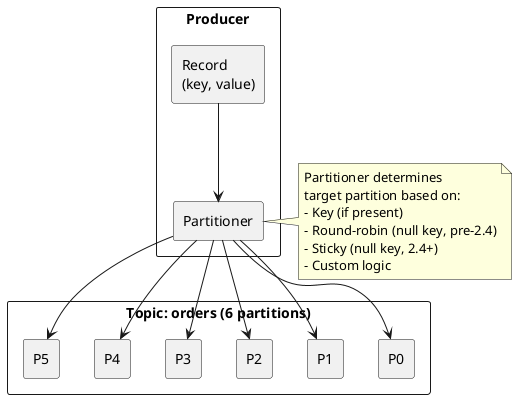
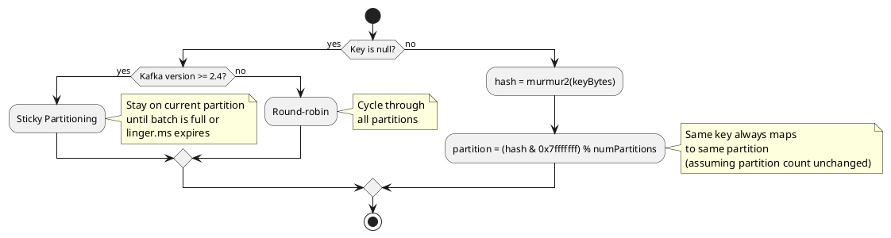
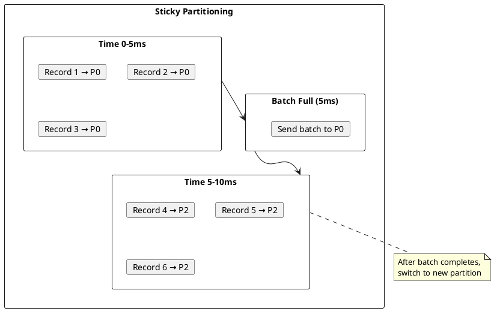
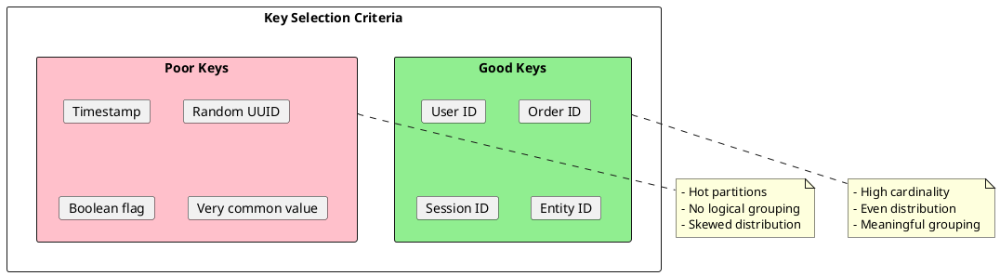
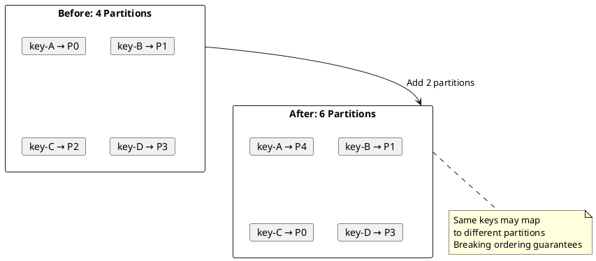

# Kafka Producer Partitioning

Partitioning determines which partition receives each record. The partitioning strategy affects message ordering, load distribution, and consumer parallelism.

---

## Partitioning Overview



### Partitioning Impact

| Aspect | Impact |
|--------|--------|
| **Ordering** | Records with same key go to same partition (ordered) |
| **Parallelism** | More partitions enable more consumers |
| **Load balancing** | Even distribution prevents hot partitions |
| **Locality** | Related records can be co-located |

---

## Default Partitioner

### Algorithm



### Key-Based Partitioning

When a key is provided, the default partitioner uses murmur2 hashing.

```java
// Same key always goes to same partition
producer.send(new ProducerRecord<>("orders", "user-123", order1));  // Partition X
producer.send(new ProducerRecord<>("orders", "user-123", order2));  // Partition X
producer.send(new ProducerRecord<>("orders", "user-456", order3));  // Partition Y
```

**Hash calculation:**
```
partition = (murmur2(keyBytes) & 0x7fffffff) % numPartitions
```

| Property | Guarantee |
|----------|-----------|
| **Deterministic** | Same key → same partition (given same partition count) |
| **Distribution** | Generally uniform across partitions |
| **Ordering** | Records with same key maintain order |

### Sticky Partitioning (Kafka 2.4+)

For null keys, sticky partitioning improves batching efficiency.



| Behavior | Round-Robin (Pre-2.4) | Sticky (2.4+) |
|----------|:---------------------:|:-------------:|
| Record distribution | Even | Bursty per partition |
| Batch efficiency | Poor | Excellent |
| Network utilization | Higher | Lower |
| Latency | Higher (small batches) | Lower (full batches) |

---

## Custom Partitioner

### Implementation Interface

```java
public interface Partitioner extends Configurable, Closeable {
    /**
     * Compute the partition for the given record.
     *
     * @param topic The topic name
     * @param key The key (or null if no key)
     * @param keyBytes Serialized key (or null)
     * @param value The value (or null if no value)
     * @param valueBytes Serialized value (or null)
     * @param cluster Current cluster metadata
     * @return The partition number
     */
    int partition(String topic, Object key, byte[] keyBytes,
                  Object value, byte[] valueBytes, Cluster cluster);
}
```

### Region-Based Partitioner

```java
public class RegionPartitioner implements Partitioner {
    private Map<String, List<Integer>> regionPartitions;

    @Override
    public void configure(Map<String, ?> configs) {
        // US: partitions 0-2, EU: 3-5, APAC: 6-8
        regionPartitions = Map.of(
            "US", List.of(0, 1, 2),
            "EU", List.of(3, 4, 5),
            "APAC", List.of(6, 7, 8)
        );
    }

    @Override
    public int partition(String topic, Object key, byte[] keyBytes,
                        Object value, byte[] valueBytes, Cluster cluster) {
        Order order = (Order) value;
        String region = order.getRegion();

        List<Integer> partitions = regionPartitions.getOrDefault(
            region, List.of(0, 1, 2, 3, 4, 5, 6, 7, 8));

        // Hash within region's partitions
        int hash = Utils.murmur2(keyBytes);
        int index = (hash & 0x7fffffff) % partitions.size();
        return partitions.get(index);
    }

    @Override
    public void close() {}
}
```

### Priority Partitioner

```java
public class PriorityPartitioner implements Partitioner {
    // High priority: partitions 0-1, Normal: 2-7, Low: 8-9

    @Override
    public int partition(String topic, Object key, byte[] keyBytes,
                        Object value, byte[] valueBytes, Cluster cluster) {
        Event event = (Event) value;

        int hash = keyBytes != null ? Utils.murmur2(keyBytes) : 0;
        int hashAbs = hash & 0x7fffffff;

        switch (event.getPriority()) {
            case HIGH:
                return hashAbs % 2;        // Partitions 0-1
            case NORMAL:
                return 2 + (hashAbs % 6);  // Partitions 2-7
            case LOW:
                return 8 + (hashAbs % 2);  // Partitions 8-9
            default:
                return hashAbs % cluster.partitionCountForTopic(topic);
        }
    }
}
```

### Configuration

```properties
partitioner.class=com.example.RegionPartitioner
# Additional partitioner-specific config
region.partition.mapping=US:0-2,EU:3-5,APAC:6-8
```

---

## Explicit Partition Selection

### Direct Partition Specification

```java
// Send to specific partition (bypasses partitioner)
ProducerRecord<String, String> record = new ProducerRecord<>(
    "orders",    // topic
    2,           // partition (explicit)
    "key",       // key
    "value"      // value
);
producer.send(record);
```

### Use Cases for Explicit Partitioning

| Use Case | Rationale |
|----------|-----------|
| **Ordered replay** | Replay events to same partition |
| **Testing** | Control partition for test isolation |
| **Migration** | Maintain partition assignment during migration |
| **Special routing** | Override partitioner for specific records |

---

## Partition Key Design

### Choosing Keys



### Key Design Patterns

| Pattern | Key Format | Use Case |
|---------|------------|----------|
| **Entity key** | `user-123` | Group by entity |
| **Composite key** | `tenant-1:user-123` | Multi-tenant systems |
| **Time-bucketed** | `2024-01:user-123` | Time-series with ordering |
| **Hash key** | `md5(payload)` | Deduplication |

### Avoiding Hot Partitions

```java
// WRONG: All orders from large customer go to one partition
String key = order.getCustomerId();  // Customer "BigCorp" = 80% of orders

// BETTER: Distribute within customer
String key = order.getCustomerId() + ":" + order.getOrderId();

// OR: Use composite key with salt
String key = order.getCustomerId() + ":" + (order.getOrderId().hashCode() % 10);
```

---

## Partition Count Implications

### Changing Partition Count

!!! danger "Partition Count Changes Affect Key Distribution"
    Adding partitions changes the key-to-partition mapping. Records with the same key may go to different partitions before and after the change.



### Mitigation Strategies

| Strategy | Description |
|----------|-------------|
| **Over-provision partitions** | Create more partitions than immediately needed |
| **Use partition-aware keys** | Include partition hint in key |
| **Custom partitioner** | Maintain backward compatibility |
| **Reprocess data** | Rebuild from source after partition change |

---

## Load Balancing

### Measuring Distribution

```java
// Monitor partition distribution
Map<Integer, Long> partitionCounts = new HashMap<>();

producer.send(record, (metadata, exception) -> {
    if (metadata != null) {
        partitionCounts.merge(metadata.partition(), 1L, Long::sum);
    }
});

// Check for skew
long total = partitionCounts.values().stream().mapToLong(Long::longValue).sum();
double expected = total / (double) partitionCounts.size();

partitionCounts.forEach((partition, count) -> {
    double ratio = count / expected;
    if (ratio > 1.5 || ratio < 0.5) {
        log.warn("Partition {} is skewed: {} records (expected ~{})",
            partition, count, (long) expected);
    }
});
```

### Addressing Skew

| Cause | Solution |
|-------|----------|
| **Few high-volume keys** | Add salt to key, use composite key |
| **Poor hash distribution** | Use different key field |
| **Null keys with round-robin** | Upgrade to sticky partitioner |
| **Custom partitioner bug** | Review and fix partitioner logic |

---

## Partition Availability

### Handling Unavailable Partitions

```java
public class AvailabilityAwarePartitioner implements Partitioner {
    @Override
    public int partition(String topic, Object key, byte[] keyBytes,
                        Object value, byte[] valueBytes, Cluster cluster) {
        List<PartitionInfo> partitions = cluster.partitionsForTopic(topic);
        List<PartitionInfo> available = cluster.availablePartitionsForTopic(topic);

        if (available.isEmpty()) {
            // All partitions unavailable; use any partition
            int hash = keyBytes != null ? Utils.murmur2(keyBytes) : 0;
            return (hash & 0x7fffffff) % partitions.size();
        }

        if (keyBytes == null) {
            // Sticky to available partition
            return available.get(ThreadLocalRandom.current().nextInt(available.size()))
                .partition();
        }

        // Hash to available partition
        int hash = Utils.murmur2(keyBytes);
        return available.get((hash & 0x7fffffff) % available.size()).partition();
    }
}
```

### Configuration

```properties
# Wait for partition availability
partitioner.availability.timeout.ms=0  # 0 = don't wait
```

---

## Monitoring Partitioning

### Key Metrics

| Metric | Description |
|--------|-------------|
| `record-send-total` per partition | Records sent to each partition |
| `byte-total` per partition | Bytes sent to each partition |
| `batch-size-avg` per partition | Batch sizes per partition |

### Detecting Issues

| Issue | Symptom | Solution |
|-------|---------|----------|
| Hot partition | One partition with much higher traffic | Improve key distribution |
| Empty partitions | Some partitions receive no traffic | Check key cardinality |
| Ordering violations | Out-of-order processing | Ensure consistent key usage |

---

## Related Documentation

- [Producer Guide](index.md) - Producer overview
- [Configuration](configuration.md) - Producer configuration
- [Batching](../../architecture/client-connections/batching.md) - Batching mechanics
- [Topics](../../concepts/topics/index.md) - Topic configuration
