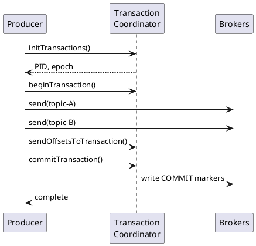

# Kafka Transactional Producer

Transactions enable atomic writes to multiple partitions and exactly-once semantics when combined with transactional consumers.

---

## Overview



All writes within a transaction succeed or fail atomically.

---

## Configuration

### Producer

```properties
# Required for transactions
transactional.id=my-app-instance-1
enable.idempotence=true  # Implied

# Transaction timeout
transaction.timeout.ms=60000
```

### Consumer (for EOS)

```properties
# Read only committed transactions
isolation.level=read_committed
enable.auto.commit=false
```

---

## Transaction API

### Basic Pattern

```java
Properties props = new Properties();
props.put(ProducerConfig.BOOTSTRAP_SERVERS_CONFIG, "kafka:9092");
props.put(ProducerConfig.TRANSACTIONAL_ID_CONFIG, "order-processor-1");

KafkaProducer<String, String> producer = new KafkaProducer<>(props);

// Initialize once on startup
producer.initTransactions();

try {
    producer.beginTransaction();

    producer.send(new ProducerRecord<>("orders", key, value1));
    producer.send(new ProducerRecord<>("audit", key, value2));

    producer.commitTransaction();
} catch (ProducerFencedException | OutOfOrderSequenceException e) {
    // Fatal - must close
    producer.close();
} catch (KafkaException e) {
    // Recoverable - abort and retry
    producer.abortTransaction();
}
```

### Read-Process-Write Pattern

```java
producer.initTransactions();
consumer.subscribe(Collections.singletonList("input"));

while (running) {
    ConsumerRecords<String, String> records = consumer.poll(Duration.ofMillis(100));
    if (records.isEmpty()) continue;

    producer.beginTransaction();
    try {
        for (ConsumerRecord<String, String> record : records) {
            String output = process(record.value());
            producer.send(new ProducerRecord<>("output", record.key(), output));
        }

        // Commit offsets atomically with output
        producer.sendOffsetsToTransaction(
            getOffsets(records),
            consumer.groupMetadata()
        );

        producer.commitTransaction();
    } catch (KafkaException e) {
        producer.abortTransaction();
    }
}
```

---

## Transaction States

| State | Description |
|-------|-------------|
| `Empty` | No active transaction |
| `Ongoing` | Transaction in progress |
| `PrepareCommit` | Committing |
| `PrepareAbort` | Aborting |
| `Complete` | Finished |

---

## Error Handling

| Exception | Severity | Action |
|-----------|----------|--------|
| `ProducerFencedException` | Fatal | Close producer, another instance active |
| `OutOfOrderSequenceException` | Fatal | Close producer, state corruption |
| `KafkaException` | Recoverable | Abort transaction, retry |

---

## Zombie Fencing

When a producer with the same `transactional.id` starts, the old producer is fenced:

```java
try {
    producer.commitTransaction();
} catch (ProducerFencedException e) {
    // Another instance took over
    log.error("Fenced by new producer instance");
    producer.close();
    System.exit(1);
}
```

---

## Performance Considerations

| Aspect | Impact |
|--------|--------|
| Latency | +10-50ms per transaction commit |
| Throughput | 30-50% lower than non-transactional |
| Complexity | Higher error handling requirements |

Batch multiple records per transaction to amortize overhead.

---

## Related Documentation

- [Producer Guide](index.md) - Producer overview
- [Idempotence](idempotence.md) - Idempotent producer
- [Exactly-Once Semantics](../../concepts/delivery-semantics/exactly-once.md) - EOS deep dive
- [Transaction APIs](../../architecture/client-connections/protocol-apis-transaction.md) - Protocol details
