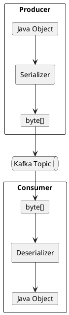
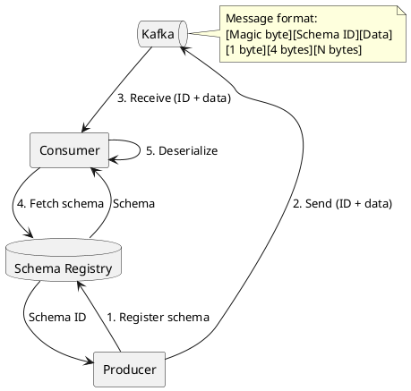

# Kafka Serialization

Kafka transmits messages as byte arrays. Serializers convert objects to bytes for producers, and deserializers convert bytes back to objects for consumers. This guide covers serialization formats, Schema Registry integration, and best practices.

---

## Serialization Overview

### Data Flow



### Serialization Formats

| Format | Schema | Type Safety | Size | Human Readable |
|--------|--------|-------------|------|----------------|
| **String** | None | None | Large | Yes |
| **JSON** | Optional | Runtime | Large | Yes |
| **Avro** | Required | Compile-time | Compact | No |
| **Protobuf** | Required | Compile-time | Compact | No |
| **Byte Array** | None | None | Minimal | No |

---

## Built-in Serializers

### StringSerializer

```java
Properties props = new Properties();
props.put("key.serializer", "org.apache.kafka.common.serialization.StringSerializer");
props.put("value.serializer", "org.apache.kafka.common.serialization.StringSerializer");

Producer<String, String> producer = new KafkaProducer<>(props);
producer.send(new ProducerRecord<>("topic", "key", "value"));
```

### ByteArraySerializer

```java
props.put("key.serializer", "org.apache.kafka.common.serialization.ByteArraySerializer");
props.put("value.serializer", "org.apache.kafka.common.serialization.ByteArraySerializer");

Producer<byte[], byte[]> producer = new KafkaProducer<>(props);
producer.send(new ProducerRecord<>("topic", keyBytes, valueBytes));
```

### Available Serializers

| Type | Serializer | Deserializer |
|------|------------|--------------|
| String | `StringSerializer` | `StringDeserializer` |
| Byte Array | `ByteArraySerializer` | `ByteArrayDeserializer` |
| Integer | `IntegerSerializer` | `IntegerDeserializer` |
| Long | `LongSerializer` | `LongDeserializer` |
| Double | `DoubleSerializer` | `DoubleDeserializer` |
| Float | `FloatSerializer` | `FloatDeserializer` |
| Short | `ShortSerializer` | `ShortDeserializer` |
| UUID | `UUIDSerializer` | `UUIDDeserializer` |
| Void | `VoidSerializer` | `VoidDeserializer` |

---

## JSON Serialization

### Jackson Serializer

```java
public class JsonSerializer<T> implements Serializer<T> {
    private final ObjectMapper objectMapper = new ObjectMapper();

    @Override
    public byte[] serialize(String topic, T data) {
        if (data == null) return null;

        try {
            return objectMapper.writeValueAsBytes(data);
        } catch (JsonProcessingException e) {
            throw new SerializationException("Error serializing JSON message", e);
        }
    }
}

public class JsonDeserializer<T> implements Deserializer<T> {
    private final ObjectMapper objectMapper = new ObjectMapper();
    private Class<T> targetType;

    @Override
    public void configure(Map<String, ?> configs, boolean isKey) {
        targetType = (Class<T>) configs.get("json.value.type");
    }

    @Override
    public T deserialize(String topic, byte[] data) {
        if (data == null) return null;

        try {
            return objectMapper.readValue(data, targetType);
        } catch (IOException e) {
            throw new SerializationException("Error deserializing JSON message", e);
        }
    }
}
```

### Usage

```java
// Producer
props.put("value.serializer", JsonSerializer.class);

// Consumer
props.put("value.deserializer", JsonDeserializer.class);
props.put("json.value.type", Order.class);
```

### Spring Kafka JSON Support

```java
@Configuration
public class KafkaConfig {

    @Bean
    public ProducerFactory<String, Order> producerFactory() {
        Map<String, Object> config = new HashMap<>();
        config.put(ProducerConfig.BOOTSTRAP_SERVERS_CONFIG, "kafka:9092");
        config.put(ProducerConfig.KEY_SERIALIZER_CLASS_CONFIG, StringSerializer.class);
        config.put(ProducerConfig.VALUE_SERIALIZER_CLASS_CONFIG, JsonSerializer.class);
        return new DefaultKafkaProducerFactory<>(config);
    }

    @Bean
    public ConsumerFactory<String, Order> consumerFactory() {
        Map<String, Object> config = new HashMap<>();
        config.put(ConsumerConfig.BOOTSTRAP_SERVERS_CONFIG, "kafka:9092");
        config.put(ConsumerConfig.KEY_DESERIALIZER_CLASS_CONFIG, StringDeserializer.class);
        config.put(ConsumerConfig.VALUE_DESERIALIZER_CLASS_CONFIG, JsonDeserializer.class);
        config.put(JsonDeserializer.VALUE_DEFAULT_TYPE, Order.class);
        config.put(JsonDeserializer.TRUSTED_PACKAGES, "com.example.domain");
        return new DefaultKafkaConsumerFactory<>(config);
    }
}
```

---

## Avro Serialization

### Schema Definition

```json
{
  "type": "record",
  "name": "Order",
  "namespace": "com.example.avro",
  "fields": [
    {"name": "orderId", "type": "string"},
    {"name": "customerId", "type": "string"},
    {"name": "amount", "type": "double"},
    {"name": "currency", "type": "string", "default": "USD"},
    {"name": "createdAt", "type": {"type": "long", "logicalType": "timestamp-millis"}},
    {
      "name": "items",
      "type": {
        "type": "array",
        "items": {
          "type": "record",
          "name": "OrderItem",
          "fields": [
            {"name": "productId", "type": "string"},
            {"name": "quantity", "type": "int"},
            {"name": "price", "type": "double"}
          ]
        }
      }
    }
  ]
}
```

### Avro with Schema Registry

```java
Properties props = new Properties();
props.put("bootstrap.servers", "kafka:9092");
props.put("schema.registry.url", "http://schema-registry:8081");
props.put("key.serializer", StringSerializer.class);
props.put("value.serializer", KafkaAvroSerializer.class);

Producer<String, Order> producer = new KafkaProducer<>(props);

Order order = Order.newBuilder()
    .setOrderId("order-123")
    .setCustomerId("customer-456")
    .setAmount(99.99)
    .setCurrency("USD")
    .setCreatedAt(System.currentTimeMillis())
    .setItems(List.of(
        OrderItem.newBuilder()
            .setProductId("product-789")
            .setQuantity(2)
            .setPrice(49.99)
            .build()
    ))
    .build();

producer.send(new ProducerRecord<>("orders", order.getOrderId(), order));
```

### Consumer with Avro

```java
Properties props = new Properties();
props.put("bootstrap.servers", "kafka:9092");
props.put("schema.registry.url", "http://schema-registry:8081");
props.put("group.id", "order-consumers");
props.put("key.deserializer", StringDeserializer.class);
props.put("value.deserializer", KafkaAvroDeserializer.class);
props.put("specific.avro.reader", "true");  // Use generated classes

Consumer<String, Order> consumer = new KafkaConsumer<>(props);
```

### Generic Avro Records

For dynamic schemas:

```java
props.put("specific.avro.reader", "false");  // Use GenericRecord

Consumer<String, GenericRecord> consumer = new KafkaConsumer<>(props);
consumer.subscribe(List.of("orders"));

while (running) {
    ConsumerRecords<String, GenericRecord> records = consumer.poll(Duration.ofMillis(100));
    for (ConsumerRecord<String, GenericRecord> record : records) {
        GenericRecord order = record.value();
        String orderId = order.get("orderId").toString();
        double amount = (double) order.get("amount");
    }
}
```

---

## Protobuf Serialization

### Proto Definition

```protobuf
syntax = "proto3";

package com.example.proto;

option java_package = "com.example.proto";
option java_outer_classname = "OrderProtos";

message Order {
  string order_id = 1;
  string customer_id = 2;
  double amount = 3;
  string currency = 4;
  int64 created_at = 5;
  repeated OrderItem items = 6;
}

message OrderItem {
  string product_id = 1;
  int32 quantity = 2;
  double price = 3;
}
```

### Protobuf with Schema Registry

```java
Properties props = new Properties();
props.put("bootstrap.servers", "kafka:9092");
props.put("schema.registry.url", "http://schema-registry:8081");
props.put("key.serializer", StringSerializer.class);
props.put("value.serializer", KafkaProtobufSerializer.class);

Producer<String, Order> producer = new KafkaProducer<>(props);

Order order = Order.newBuilder()
    .setOrderId("order-123")
    .setCustomerId("customer-456")
    .setAmount(99.99)
    .setCurrency("USD")
    .setCreatedAt(System.currentTimeMillis())
    .addItems(OrderItem.newBuilder()
        .setProductId("product-789")
        .setQuantity(2)
        .setPrice(49.99)
        .build())
    .build();

producer.send(new ProducerRecord<>("orders", order.getOrderId(), order));
```

---

## Schema Registry Integration

### Schema Registry Architecture



### Configuration

```java
// Producer
props.put("schema.registry.url", "http://schema-registry:8081");
props.put("auto.register.schemas", "true");  // Automatic schema registration
props.put("value.subject.name.strategy",
    "io.confluent.kafka.serializers.subject.TopicRecordNameStrategy");

// Consumer
props.put("schema.registry.url", "http://schema-registry:8081");
props.put("specific.avro.reader", "true");
```

### Subject Naming Strategies

| Strategy | Subject Name | Use Case |
|----------|--------------|----------|
| `TopicNameStrategy` | `{topic}-value` | One schema per topic |
| `RecordNameStrategy` | `{record.name}` | Schema per record type |
| `TopicRecordNameStrategy` | `{topic}-{record.name}` | Multiple schemas per topic |

---

## Schema Evolution

### Compatibility Types

| Type | Allowed Changes |
|------|-----------------|
| **BACKWARD** | Delete fields, add optional fields |
| **FORWARD** | Add fields, delete optional fields |
| **FULL** | Add optional fields, delete optional fields |
| **NONE** | Any change allowed |

### Backward Compatible Evolution

```json
// Version 1
{
  "type": "record",
  "name": "Order",
  "fields": [
    {"name": "orderId", "type": "string"},
    {"name": "amount", "type": "double"}
  ]
}

// Version 2 - Add optional field (BACKWARD compatible)
{
  "type": "record",
  "name": "Order",
  "fields": [
    {"name": "orderId", "type": "string"},
    {"name": "amount", "type": "double"},
    {"name": "currency", "type": "string", "default": "USD"}
  ]
}
```

### Forward Compatible Evolution

```json
// Version 1
{
  "type": "record",
  "name": "Order",
  "fields": [
    {"name": "orderId", "type": "string"},
    {"name": "amount", "type": "double"},
    {"name": "notes", "type": ["null", "string"], "default": null}
  ]
}

// Version 2 - Remove optional field (FORWARD compatible)
{
  "type": "record",
  "name": "Order",
  "fields": [
    {"name": "orderId", "type": "string"},
    {"name": "amount", "type": "double"}
  ]
}
```

### Setting Compatibility

```bash
# Set compatibility for a subject
curl -X PUT -H "Content-Type: application/vnd.schemaregistry.v1+json" \
    --data '{"compatibility": "BACKWARD"}' \
    http://schema-registry:8081/config/orders-value
```

---

## Custom Serializers

### Implementing a Custom Serializer

```java
public class OrderSerializer implements Serializer<Order> {
    private final ObjectMapper mapper = new ObjectMapper();
    private boolean isKey;

    @Override
    public void configure(Map<String, ?> configs, boolean isKey) {
        this.isKey = isKey;
        // Apply any configuration
    }

    @Override
    public byte[] serialize(String topic, Order order) {
        if (order == null) return null;

        try {
            return mapper.writeValueAsBytes(order);
        } catch (JsonProcessingException e) {
            throw new SerializationException("Error serializing Order", e);
        }
    }

    @Override
    public byte[] serialize(String topic, Headers headers, Order order) {
        // Add metadata to headers if needed
        headers.add("serializer.version", "1".getBytes());
        return serialize(topic, order);
    }

    @Override
    public void close() {
        // Cleanup resources if needed
    }
}
```

### Topic-Specific Serialization

```java
public class DelegatingSerializer implements Serializer<Object> {
    private final Map<String, Serializer<?>> serializers = new HashMap<>();

    @Override
    public void configure(Map<String, ?> configs, boolean isKey) {
        // Configure serializers per topic
        serializers.put("orders", new OrderSerializer());
        serializers.put("payments", new PaymentSerializer());
        serializers.put("events", new JsonSerializer<>());
    }

    @Override
    public byte[] serialize(String topic, Object data) {
        Serializer serializer = serializers.getOrDefault(topic, new JsonSerializer<>());
        return serializer.serialize(topic, data);
    }
}
```

---

## Error Handling

### Deserialization Errors

```java
// Use ErrorHandlingDeserializer to catch errors
props.put("value.deserializer", ErrorHandlingDeserializer.class);
props.put(ErrorHandlingDeserializer.VALUE_DESERIALIZER_CLASS, JsonDeserializer.class);
props.put(ErrorHandlingDeserializer.VALUE_FUNCTION, MyFailedDeserializationHandler.class);

public class MyFailedDeserializationHandler implements Function<FailedDeserializationInfo, Order> {
    @Override
    public Order apply(FailedDeserializationInfo info) {
        log.error("Failed to deserialize message from topic {}: {}",
            info.getTopic(), info.getException().getMessage());
        // Return null or a default value
        return null;
    }
}
```

### Schema Mismatch Handling

```java
try {
    Order order = consumer.poll(Duration.ofMillis(100)).iterator().next().value();
} catch (SerializationException e) {
    if (e.getCause() instanceof SchemaException) {
        // Schema incompatibility
        log.error("Schema mismatch: {}", e.getMessage());
        // Update consumer or handle gracefully
    }
}
```

---

## Performance Considerations

### Serialization Overhead

| Format | Serialization Speed | Message Size | CPU Usage |
|--------|-------------------|--------------|-----------|
| Byte Array | Fastest | Smallest | Lowest |
| Protobuf | Fast | Small | Low |
| Avro | Fast | Small | Low |
| JSON | Slow | Large | High |

### Optimization Tips

```java
// Reuse ObjectMapper (thread-safe)
private static final ObjectMapper MAPPER = new ObjectMapper();

// Use byte array buffer pool
props.put("buffer.memory", 67108864);  // 64MB

// Enable compression for large messages
props.put("compression.type", "lz4");
```

---

## Best Practices

### Format Selection

| Scenario | Recommended Format |
|----------|-------------------|
| Strict schema enforcement | Avro or Protobuf |
| Cross-language compatibility | Avro or Protobuf |
| Debugging / human readable | JSON |
| Maximum performance | Protobuf or custom |
| Flexible schema | JSON |

### Schema Management

| Practice | Recommendation |
|----------|----------------|
| Version schemas | Use Schema Registry |
| Enforce compatibility | Set compatibility mode |
| Test evolution | Validate changes before deployment |
| Document schemas | Include field descriptions |

### Error Handling

| Practice | Recommendation |
|----------|----------------|
| Handle null | Check for null before serialization |
| Catch errors | Use ErrorHandlingDeserializer |
| Log failures | Include topic, partition, offset |
| DLQ | Send undeserializable messages to DLQ |

---

## Related Documentation

- [Schema Registry](../../schema-registry/index.md) - Schema management
- [Schema Formats](../../schema-registry/schema-formats/index.md) - Format comparison
- [Producer Development](../producers/index.md) - Producer patterns
- [Consumer Development](../consumers/index.md) - Consumer patterns
