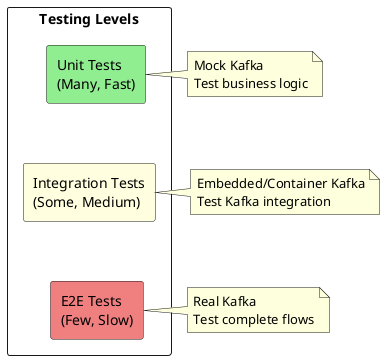

# Kafka Testing Guide

Testing Kafka applications requires strategies for unit testing business logic, integration testing with Kafka, and end-to-end testing of complete flows. This guide covers testing approaches, tools, and best practices.

---

## Testing Pyramid



| Level | Scope | Speed | Kafka |
|-------|-------|-------|-------|
| **Unit** | Business logic | Fast | Mocked |
| **Integration** | Kafka interaction | Medium | Embedded/Container |
| **E2E** | Complete system | Slow | Real cluster |

---

## Unit Testing

### Mock Producer

```java
public class MockProducerExample {

    @Test
    void testOrderProducer() {
        // Create mock producer
        MockProducer<String, Order> mockProducer = new MockProducer<>(
            true,  // autoComplete
            new StringSerializer(),
            new JsonSerializer<Order>()
        );

        // Create service with mock
        OrderService orderService = new OrderService(mockProducer);

        // Execute
        Order order = new Order("order-123", "customer-456", 99.99);
        orderService.publishOrder(order);

        // Verify
        List<ProducerRecord<String, Order>> records = mockProducer.history();
        assertEquals(1, records.size());
        assertEquals("orders", records.get(0).topic());
        assertEquals("order-123", records.get(0).key());
        assertEquals(order, records.get(0).value());
    }

    @Test
    void testProducerWithCallback() {
        MockProducer<String, String> mockProducer = new MockProducer<>(
            false,  // Manual completion
            new StringSerializer(),
            new StringSerializer()
        );

        AtomicBoolean callbackCalled = new AtomicBoolean(false);

        mockProducer.send(
            new ProducerRecord<>("topic", "key", "value"),
            (metadata, exception) -> callbackCalled.set(true)
        );

        // Complete the send
        mockProducer.completeNext();

        assertTrue(callbackCalled.get());
    }

    @Test
    void testProducerFailure() {
        MockProducer<String, String> mockProducer = new MockProducer<>(
            false,
            new StringSerializer(),
            new StringSerializer()
        );

        AtomicReference<Exception> caughtException = new AtomicReference<>();

        mockProducer.send(
            new ProducerRecord<>("topic", "key", "value"),
            (metadata, exception) -> caughtException.set(exception)
        );

        // Simulate failure
        mockProducer.errorNext(new RuntimeException("Broker unavailable"));

        assertNotNull(caughtException.get());
        assertEquals("Broker unavailable", caughtException.get().getMessage());
    }
}
```

### Mock Consumer

```java
public class MockConsumerExample {

    @Test
    void testOrderConsumer() {
        // Create mock consumer
        MockConsumer<String, Order> mockConsumer = new MockConsumer<>(OffsetResetStrategy.EARLIEST);

        // Create service with mock
        OrderProcessor processor = new OrderProcessor(mockConsumer);

        // Setup topic partition
        TopicPartition tp = new TopicPartition("orders", 0);
        mockConsumer.assign(List.of(tp));
        mockConsumer.updateBeginningOffsets(Map.of(tp, 0L));

        // Add test records
        Order order = new Order("order-123", "customer-456", 99.99);
        mockConsumer.addRecord(new ConsumerRecord<>("orders", 0, 0, "order-123", order));

        // Process
        processor.processNextBatch();

        // Verify processing occurred
        verify(orderRepository).save(order);
    }

    @Test
    void testConsumerRebalance() {
        MockConsumer<String, String> mockConsumer = new MockConsumer<>(OffsetResetStrategy.EARLIEST);

        List<TopicPartition> assigned = new ArrayList<>();
        List<TopicPartition> revoked = new ArrayList<>();

        mockConsumer.subscribe(List.of("topic"), new ConsumerRebalanceListener() {
            @Override
            public void onPartitionsRevoked(Collection<TopicPartition> partitions) {
                revoked.addAll(partitions);
            }

            @Override
            public void onPartitionsAssigned(Collection<TopicPartition> partitions) {
                assigned.addAll(partitions);
            }
        });

        // Trigger rebalance
        TopicPartition tp = new TopicPartition("topic", 0);
        mockConsumer.rebalance(List.of(tp));
        mockConsumer.updateBeginningOffsets(Map.of(tp, 0L));

        assertEquals(1, assigned.size());
        assertEquals(tp, assigned.get(0));
    }
}
```

### Testing Business Logic in Isolation

```java
public class OrderProcessingServiceTest {

    @Mock
    private KafkaTemplate<String, OrderEvent> kafkaTemplate;

    @Mock
    private OrderRepository orderRepository;

    @InjectMocks
    private OrderProcessingService service;

    @Test
    void shouldProcessOrderSuccessfully() {
        // Given
        Order order = new Order("order-123", "customer-456", 99.99);
        when(kafkaTemplate.send(anyString(), anyString(), any()))
            .thenReturn(CompletableFuture.completedFuture(null));

        // When
        OrderResult result = service.processOrder(order);

        // Then
        assertTrue(result.isSuccess());
        verify(kafkaTemplate).send("order-events", "order-123", any(OrderCreatedEvent.class));
        verify(orderRepository).save(order);
    }

    @Test
    void shouldHandleKafkaFailure() {
        // Given
        Order order = new Order("order-123", "customer-456", 99.99);
        when(kafkaTemplate.send(anyString(), anyString(), any()))
            .thenReturn(CompletableFuture.failedFuture(new RuntimeException("Kafka error")));

        // When
        OrderResult result = service.processOrder(order);

        // Then
        assertFalse(result.isSuccess());
        verify(orderRepository, never()).save(any());
    }
}
```

---

## Integration Testing

### Embedded Kafka (Spring)

```java
@SpringBootTest
@EmbeddedKafka(
    partitions = 3,
    brokerProperties = {
        "listeners=PLAINTEXT://localhost:9092",
        "auto.create.topics.enable=true"
    },
    topics = {"orders", "order-events"}
)
public class KafkaIntegrationTest {

    @Autowired
    private EmbeddedKafkaBroker embeddedKafka;

    @Autowired
    private KafkaTemplate<String, Order> kafkaTemplate;

    @Autowired
    private OrderService orderService;

    @Test
    void testProduceAndConsume() throws Exception {
        // Given
        Order order = new Order("order-123", "customer-456", 99.99);

        // When
        kafkaTemplate.send("orders", order.getOrderId(), order).get();

        // Then - wait for consumer to process
        await().atMost(Duration.ofSeconds(10))
            .untilAsserted(() -> {
                Order processed = orderService.getOrder("order-123");
                assertNotNull(processed);
                assertEquals(99.99, processed.getAmount());
            });
    }

    @Test
    void testConsumerGroupRebalance() throws Exception {
        // Start second consumer
        Consumer<String, Order> secondConsumer = createConsumer();
        secondConsumer.subscribe(List.of("orders"));

        // Send messages
        for (int i = 0; i < 100; i++) {
            kafkaTemplate.send("orders", "key-" + i, new Order("order-" + i, "cust", 10.0));
        }

        // Verify distribution
        await().atMost(Duration.ofSeconds(30))
            .untilAsserted(() -> {
                // Both consumers should have received messages
                assertTrue(firstConsumerMessageCount.get() > 0);
                assertTrue(secondConsumerMessageCount.get() > 0);
            });
    }
}
```

### Spring Kafka Test Utilities

```java
@SpringBootTest
@EmbeddedKafka
public class ConsumerRecordTest {

    @Autowired
    private EmbeddedKafkaBroker embeddedKafka;

    @Test
    void testWithConsumerRecords() {
        Map<String, Object> consumerProps = KafkaTestUtils.consumerProps(
            "test-group", "true", embeddedKafka);

        DefaultKafkaConsumerFactory<String, String> cf =
            new DefaultKafkaConsumerFactory<>(consumerProps);

        Consumer<String, String> consumer = cf.createConsumer();
        embeddedKafka.consumeFromAnEmbeddedTopic(consumer, "test-topic");

        // Produce
        Map<String, Object> producerProps = KafkaTestUtils.producerProps(embeddedKafka);
        KafkaTemplate<String, String> template = new KafkaTemplate<>(
            new DefaultKafkaProducerFactory<>(producerProps));

        template.send("test-topic", "key", "value");

        // Consume and verify
        ConsumerRecord<String, String> record =
            KafkaTestUtils.getSingleRecord(consumer, "test-topic");

        assertEquals("key", record.key());
        assertEquals("value", record.value());

        consumer.close();
    }
}
```

---

## Testcontainers

### Basic Set up

```java
@Testcontainers
public class KafkaTestcontainersTest {

    @Container
    static KafkaContainer kafka = new KafkaContainer(
        DockerImageName.parse("confluentinc/cp-kafka:7.5.0")
    );

    private Producer<String, String> producer;
    private Consumer<String, String> consumer;

    @BeforeAll
    static void setup() {
        kafka.start();
    }

    @BeforeEach
    void createClients() {
        producer = new KafkaProducer<>(Map.of(
            ProducerConfig.BOOTSTRAP_SERVERS_CONFIG, kafka.getBootstrapServers(),
            ProducerConfig.KEY_SERIALIZER_CLASS_CONFIG, StringSerializer.class,
            ProducerConfig.VALUE_SERIALIZER_CLASS_CONFIG, StringSerializer.class
        ));

        consumer = new KafkaConsumer<>(Map.of(
            ConsumerConfig.BOOTSTRAP_SERVERS_CONFIG, kafka.getBootstrapServers(),
            ConsumerConfig.GROUP_ID_CONFIG, "test-group",
            ConsumerConfig.AUTO_OFFSET_RESET_CONFIG, "earliest",
            ConsumerConfig.KEY_DESERIALIZER_CLASS_CONFIG, StringDeserializer.class,
            ConsumerConfig.VALUE_DESERIALIZER_CLASS_CONFIG, StringDeserializer.class
        ));
    }

    @Test
    void testProduceConsume() throws Exception {
        String topic = "test-topic";

        // Create topic
        try (AdminClient admin = AdminClient.create(Map.of(
                AdminClientConfig.BOOTSTRAP_SERVERS_CONFIG, kafka.getBootstrapServers()))) {
            admin.createTopics(List.of(new NewTopic(topic, 1, (short) 1))).all().get();
        }

        // Produce
        producer.send(new ProducerRecord<>(topic, "key", "value")).get();

        // Consume
        consumer.subscribe(List.of(topic));
        ConsumerRecords<String, String> records = consumer.poll(Duration.ofSeconds(10));

        assertEquals(1, records.count());
        assertEquals("value", records.iterator().next().value());
    }

    @AfterEach
    void closeClients() {
        producer.close();
        consumer.close();
    }
}
```

### With Schema Registry

```java
@Testcontainers
public class SchemaRegistryIntegrationTest {

    @Container
    static KafkaContainer kafka = new KafkaContainer(
        DockerImageName.parse("confluentinc/cp-kafka:7.5.0")
    );

    @Container
    static GenericContainer<?> schemaRegistry = new GenericContainer<>(
        DockerImageName.parse("confluentinc/cp-schema-registry:7.5.0")
    )
        .withExposedPorts(8081)
        .withEnv("SCHEMA_REGISTRY_HOST_NAME", "schema-registry")
        .withEnv("SCHEMA_REGISTRY_KAFKASTORE_BOOTSTRAP_SERVERS",
            "PLAINTEXT://" + kafka.getNetworkAliases().get(0) + ":9092")
        .withNetwork(kafka.getNetwork())
        .dependsOn(kafka);

    @Test
    void testAvroProduceConsume() {
        String schemaRegistryUrl = "http://" + schemaRegistry.getHost() + ":" +
            schemaRegistry.getMappedPort(8081);

        // Producer with Avro
        Producer<String, Order> producer = new KafkaProducer<>(Map.of(
            ProducerConfig.BOOTSTRAP_SERVERS_CONFIG, kafka.getBootstrapServers(),
            "schema.registry.url", schemaRegistryUrl,
            ProducerConfig.KEY_SERIALIZER_CLASS_CONFIG, StringSerializer.class,
            ProducerConfig.VALUE_SERIALIZER_CLASS_CONFIG, KafkaAvroSerializer.class
        ));

        Order order = Order.newBuilder()
            .setOrderId("order-123")
            .setAmount(99.99)
            .build();

        producer.send(new ProducerRecord<>("orders", order.getOrderId(), order));
        producer.flush();

        // Consumer with Avro
        Consumer<String, Order> consumer = new KafkaConsumer<>(Map.of(
            ConsumerConfig.BOOTSTRAP_SERVERS_CONFIG, kafka.getBootstrapServers(),
            "schema.registry.url", schemaRegistryUrl,
            ConsumerConfig.GROUP_ID_CONFIG, "test",
            ConsumerConfig.AUTO_OFFSET_RESET_CONFIG, "earliest",
            ConsumerConfig.KEY_DESERIALIZER_CLASS_CONFIG, StringDeserializer.class,
            ConsumerConfig.VALUE_DESERIALIZER_CLASS_CONFIG, KafkaAvroDeserializer.class,
            "specific.avro.reader", "true"
        ));

        consumer.subscribe(List.of("orders"));
        ConsumerRecords<String, Order> records = consumer.poll(Duration.ofSeconds(10));

        assertEquals(1, records.count());
        assertEquals("order-123", records.iterator().next().value().getOrderId());
    }
}
```

### Reusable Container Module

```java
public class KafkaTestModule {

    private static final Network NETWORK = Network.newNetwork();

    @Container
    public static final KafkaContainer KAFKA = new KafkaContainer(
        DockerImageName.parse("confluentinc/cp-kafka:7.5.0")
    ).withNetwork(NETWORK);

    @Container
    public static final GenericContainer<?> SCHEMA_REGISTRY = new GenericContainer<>(
        DockerImageName.parse("confluentinc/cp-schema-registry:7.5.0")
    )
        .withNetwork(NETWORK)
        .withExposedPorts(8081)
        .dependsOn(KAFKA);

    public static String getBootstrapServers() {
        return KAFKA.getBootstrapServers();
    }

    public static String getSchemaRegistryUrl() {
        return "http://" + SCHEMA_REGISTRY.getHost() + ":" +
            SCHEMA_REGISTRY.getMappedPort(8081);
    }

    public static void createTopic(String topic, int partitions) {
        try (AdminClient admin = AdminClient.create(Map.of(
                AdminClientConfig.BOOTSTRAP_SERVERS_CONFIG, getBootstrapServers()))) {
            admin.createTopics(List.of(new NewTopic(topic, partitions, (short) 1)))
                .all().get(30, TimeUnit.SECONDS);
        } catch (Exception e) {
            throw new RuntimeException("Failed to create topic", e);
        }
    }
}
```

---

## Testing Patterns

### Consumer Test Pattern

```java
@Test
void testConsumerProcessesMessages() {
    // Setup
    String topic = "test-orders";
    createTopic(topic, 3);

    CountDownLatch latch = new CountDownLatch(10);
    List<Order> processedOrders = Collections.synchronizedList(new ArrayList<>());

    // Start consumer
    OrderConsumer orderConsumer = new OrderConsumer(
        kafkaConfig,
        order -> {
            processedOrders.add(order);
            latch.countDown();
        }
    );
    orderConsumer.start();

    // Produce test messages
    try (Producer<String, Order> producer = createProducer()) {
        for (int i = 0; i < 10; i++) {
            Order order = new Order("order-" + i, "customer", 10.0 * i);
            producer.send(new ProducerRecord<>(topic, order.getOrderId(), order));
        }
        producer.flush();
    }

    // Wait for processing
    assertTrue(latch.await(30, TimeUnit.SECONDS));
    assertEquals(10, processedOrders.size());

    // Cleanup
    orderConsumer.stop();
}
```

### Exactly-Once Testing

```java
@Test
void testExactlyOnceSemantics() throws Exception {
    String inputTopic = "input";
    String outputTopic = "output";
    createTopic(inputTopic, 1);
    createTopic(outputTopic, 1);

    // Configure transactional producer
    Properties producerProps = new Properties();
    producerProps.put(ProducerConfig.BOOTSTRAP_SERVERS_CONFIG, kafka.getBootstrapServers());
    producerProps.put(ProducerConfig.TRANSACTIONAL_ID_CONFIG, "test-txn");
    producerProps.put(ProducerConfig.ENABLE_IDEMPOTENCE_CONFIG, true);

    // Configure consumer
    Properties consumerProps = new Properties();
    consumerProps.put(ConsumerConfig.BOOTSTRAP_SERVERS_CONFIG, kafka.getBootstrapServers());
    consumerProps.put(ConsumerConfig.GROUP_ID_CONFIG, "test-group");
    consumerProps.put(ConsumerConfig.ISOLATION_LEVEL_CONFIG, "read_committed");

    try (Producer<String, String> producer = new KafkaProducer<>(producerProps);
         Consumer<String, String> consumer = new KafkaConsumer<>(consumerProps)) {

        producer.initTransactions();

        // Start transaction
        producer.beginTransaction();
        producer.send(new ProducerRecord<>(outputTopic, "key", "value1"));
        producer.send(new ProducerRecord<>(outputTopic, "key", "value2"));
        producer.commitTransaction();

        // Aborted transaction
        producer.beginTransaction();
        producer.send(new ProducerRecord<>(outputTopic, "key", "aborted"));
        producer.abortTransaction();

        // Consumer should only see committed messages
        consumer.subscribe(List.of(outputTopic));
        ConsumerRecords<String, String> records = consumer.poll(Duration.ofSeconds(10));

        assertEquals(2, records.count());
        // Aborted message not visible
    }
}
```

### Error Handling Testing

```java
@Test
void testDeadLetterQueueOnFailure() {
    String mainTopic = "orders";
    String dlqTopic = "orders.dlq";
    createTopic(mainTopic, 1);
    createTopic(dlqTopic, 1);

    // Configure consumer that fails on specific messages
    OrderConsumer consumer = new OrderConsumer(config, order -> {
        if (order.getAmount() < 0) {
            throw new InvalidOrderException("Negative amount");
        }
    });
    consumer.start();

    // Send mix of valid and invalid messages
    try (Producer<String, Order> producer = createProducer()) {
        producer.send(new ProducerRecord<>(mainTopic, "order-1", new Order("order-1", "cust", 100)));
        producer.send(new ProducerRecord<>(mainTopic, "order-2", new Order("order-2", "cust", -50)));  // Invalid
        producer.send(new ProducerRecord<>(mainTopic, "order-3", new Order("order-3", "cust", 200)));
        producer.flush();
    }

    // Wait for processing
    await().atMost(Duration.ofSeconds(30))
        .untilAsserted(() -> {
            // Valid orders processed
            assertEquals(2, processedOrders.size());

            // Invalid order in DLQ
            try (Consumer<String, Order> dlqConsumer = createDlqConsumer()) {
                dlqConsumer.subscribe(List.of(dlqTopic));
                ConsumerRecords<String, Order> dlqRecords = dlqConsumer.poll(Duration.ofSeconds(5));
                assertEquals(1, dlqRecords.count());
                assertEquals("order-2", dlqRecords.iterator().next().value().getOrderId());
            }
        });
}
```

---

## Contract Testing

### Schema Compatibility Testing

```java
@Test
void testSchemaBackwardCompatibility() throws Exception {
    String schemaRegistryUrl = KafkaTestModule.getSchemaRegistryUrl();

    SchemaRegistryClient client = new CachedSchemaRegistryClient(schemaRegistryUrl, 100);

    // Register initial schema
    String subject = "orders-value";
    Schema v1 = new Schema.Parser().parse("""
        {
          "type": "record",
          "name": "Order",
          "fields": [
            {"name": "orderId", "type": "string"},
            {"name": "amount", "type": "double"}
          ]
        }
        """);

    client.register(subject, new AvroSchema(v1));

    // Set backward compatibility
    client.updateCompatibility(subject, "BACKWARD");

    // New schema with optional field (backward compatible)
    Schema v2 = new Schema.Parser().parse("""
        {
          "type": "record",
          "name": "Order",
          "fields": [
            {"name": "orderId", "type": "string"},
            {"name": "amount", "type": "double"},
            {"name": "currency", "type": "string", "default": "USD"}
          ]
        }
        """);

    // Should succeed
    assertDoesNotThrow(() -> client.register(subject, new AvroSchema(v2)));

    // Breaking change (not backward compatible)
    Schema v3Breaking = new Schema.Parser().parse("""
        {
          "type": "record",
          "name": "Order",
          "fields": [
            {"name": "orderId", "type": "string"},
            {"name": "total", "type": "double"}
          ]
        }
        """);

    // Should fail
    assertThrows(RestClientException.class,
        () -> client.register(subject, new AvroSchema(v3Breaking)));
}
```

---

## Best Practices

### Test Configuration

| Practice | Recommendation |
|----------|----------------|
| Isolation | Each test should use unique topics/groups |
| Cleanup | Delete topics after tests or use containers |
| Timeouts | Set reasonable timeouts for async operations |
| Logging | Enable test-level logging for debugging |

### Test Organization

| Practice | Recommendation |
|----------|----------------|
| Unit tests | Test business logic with mocks |
| Integration tests | Test Kafka interaction with containers |
| Contract tests | Validate schema compatibility |
| E2E tests | Full system tests (sparingly) |

### Performance

| Practice | Recommendation |
|----------|----------------|
| Container reuse | Use singleton containers across tests |
| Topic reuse | Avoid creating new topics per test |
| Parallel execution | Be careful with shared resources |

---

## Related Documentation

- [Producer Development](../producers/index.md) - Producer patterns
- [Consumer Development](../consumers/index.md) - Consumer patterns
- [Error Handling](../consumers/error-handling.md) - Error handling strategies
- [Schema Registry](../../schema-registry/index.md) - Schema management