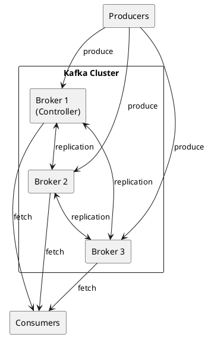
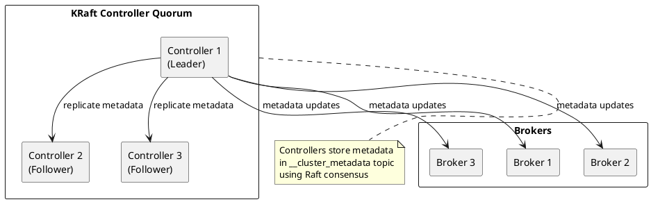
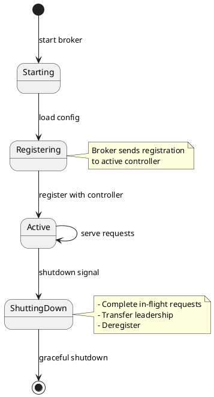
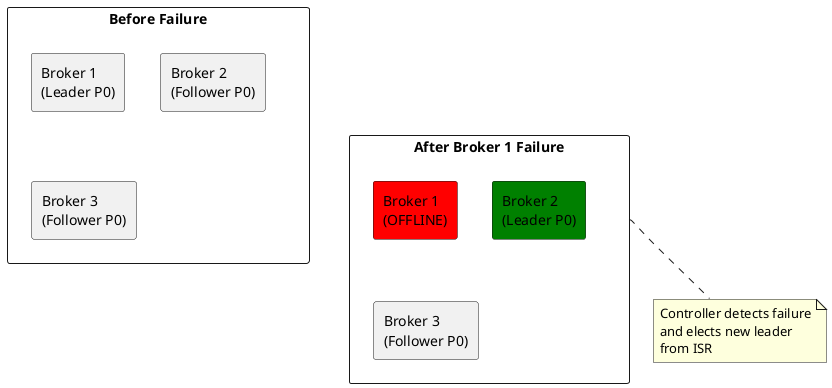

# Kafka Brokers

Broker architecture, roles, and cluster coordination in Apache Kafka.

---

## Broker Overview

A Kafka broker is a server that stores data and serves client requests. Brokers form a cluster that provides fault tolerance and scalability.



---

## KRaft Mode

KRaft (Kafka Raft) eliminates the ZooKeeper dependency by using an internal Raft-based consensus protocol. For complete KRaft internals including Raft consensus mechanics, metadata log structure, and ZooKeeper migration, see [KRaft Deep Dive](../kraft/index.md).

### Controller Quorum



### Process Roles

| Role | Description | Configuration |
|------|-------------|---------------|
| **broker** | Handles produce/consume requests | `process.roles=broker` |
| **controller** | Manages cluster metadata | `process.roles=controller` |
| **combined** | Both broker and controller | `process.roles=broker,controller` |

### Combined vs Dedicated Controllers

| Deployment | Use Case | Pros | Cons |
|------------|----------|------|------|
| **Combined** | Small clusters (< 10 brokers) | Simpler deployment | Resource contention |
| **Dedicated** | Large clusters | Isolation, stability | More servers |

---

## Broker Configuration

### Essential Settings

```properties
# Broker identity
node.id=1
process.roles=broker,controller

# Controller quorum
controller.quorum.voters=1@broker1:9093,2@broker2:9093,3@broker3:9093

# Listeners
listeners=PLAINTEXT://:9092,CONTROLLER://:9093
advertised.listeners=PLAINTEXT://broker1:9092
controller.listener.names=CONTROLLER
inter.broker.listener.name=PLAINTEXT

# Storage
log.dirs=/var/kafka-logs
num.partitions=3
default.replication.factor=3
min.insync.replicas=2

# Log retention
log.retention.hours=168
log.segment.bytes=1073741824
log.retention.check.interval.ms=300000
```

### Performance Settings

```properties
# Network threads
num.network.threads=8
num.io.threads=16

# Socket buffers
socket.send.buffer.bytes=102400
socket.receive.buffer.bytes=102400
socket.request.max.bytes=104857600

# Request handling
queued.max.requests=500
num.replica.fetchers=4
```

---

## Metadata Management

For complete metadata management including record types, broker registration, and leader election coordination, see [Cluster Management](../cluster-management/index.md).

### Cluster Metadata Topic

KRaft stores all cluster metadata in `__cluster_metadata`, a single-partition internal topic.

| Metadata Type | Description |
|---------------|-------------|
| **Topics** | Topic configurations, partitions |
| **Partitions** | Replica assignments, ISR |
| **Brokers** | Broker registrations, endpoints |
| **Configs** | Dynamic broker/topic configs |
| **ACLs** | Access control lists |
| **Features** | Cluster feature flags |

### Metadata Log

```bash
# Inspect metadata log
kafka-metadata.sh --snapshot /var/kafka-logs/__cluster_metadata-0/00000000000000000000.log \
  --command "describe"

# List brokers
kafka-metadata.sh --snapshot /var/kafka-logs/__cluster_metadata-0/00000000000000000000.log \
  --command "brokers"

# Show topic details
kafka-metadata.sh --snapshot /var/kafka-logs/__cluster_metadata-0/00000000000000000000.log \
  --command "topic" --topic-name my-topic
```

---

## Broker Lifecycle

### Startup



### Controlled Shutdown

```properties
# Enable controlled shutdown
controlled.shutdown.enable=true
controlled.shutdown.max.retries=3
controlled.shutdown.retry.backoff.ms=5000
```

During controlled shutdown:

1. Broker notifies controller of shutdown
2. Controller moves partition leaders to other brokers
3. Broker waits for leadership transfers
4. Broker completes shutdown

---

## Broker Metrics

### Key JMX Metrics

| Metric | Description | Alert Threshold |
|--------|-------------|-----------------|
| `kafka.server:type=BrokerTopicMetrics,name=MessagesInPerSec` | Message rate | Baseline deviation |
| `kafka.server:type=BrokerTopicMetrics,name=BytesInPerSec` | Bytes in rate | Capacity |
| `kafka.server:type=BrokerTopicMetrics,name=BytesOutPerSec` | Bytes out rate | Capacity |
| `kafka.server:type=ReplicaManager,name=UnderReplicatedPartitions` | Under-replicated | > 0 |
| `kafka.controller:type=KafkaController,name=ActiveControllerCount` | Active controller | ≠ 1 |
| `kafka.server:type=ReplicaManager,name=PartitionCount` | Partitions on broker | Balance |
| `kafka.network:type=RequestMetrics,name=TotalTimeMs,request=Produce` | Produce latency | P99 threshold |

---

## High Availability

For complete failure scenarios, recovery procedures, and monitoring strategies, see [Fault Tolerance](../fault-tolerance/index.md).

### Broker Failure Handling



### Recommended Settings for HA

| Setting | Value | Rationale |
|---------|-------|-----------|
| `default.replication.factor` | 3 | Survive 2 broker failures |
| `min.insync.replicas` | 2 | Ensure durability |
| `unclean.leader.election.enable` | false | Prevent data loss |

---

## Related Documentation

- [Architecture Overview](../index.md) - Kafka architecture
- [Replication](../replication/index.md) - Replication protocol
- [Fault Tolerance](../fault-tolerance/index.md) - Failure handling
- [Configuration](../../operations/configuration/index.md) - Configuration reference
