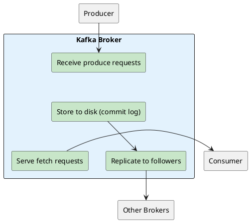
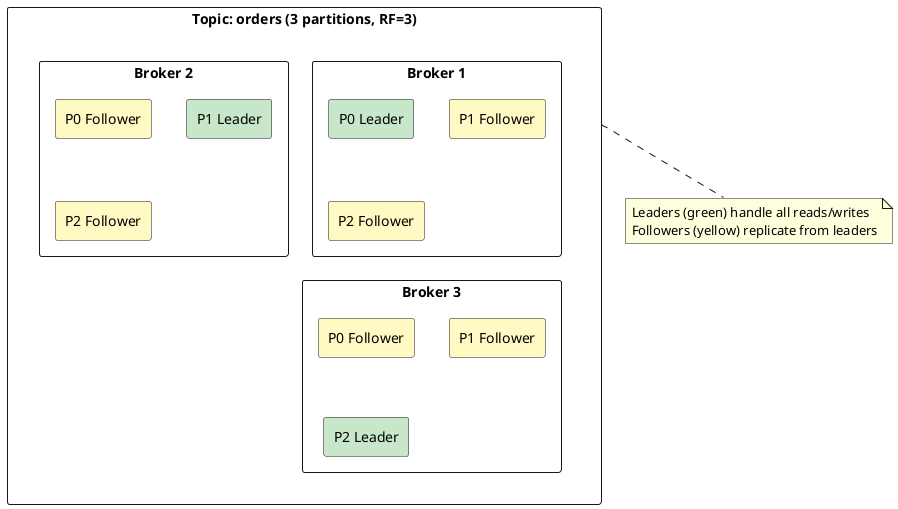
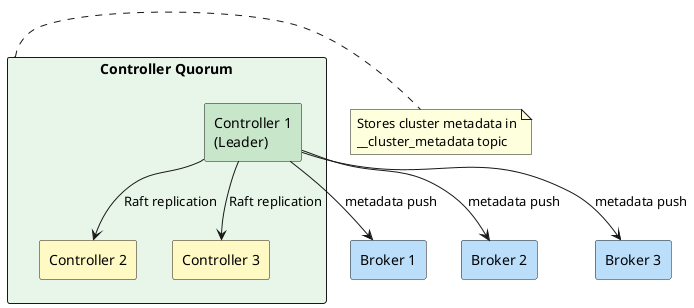
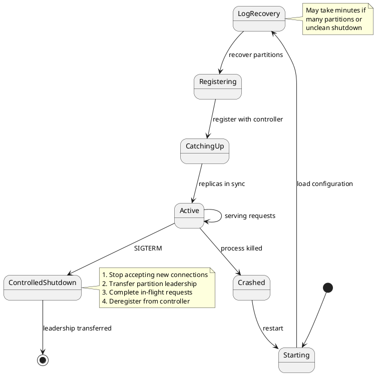

# Kafka Brokers

A Kafka broker is a server process that stores messages and serves client requests. Each broker in a cluster handles a portion of the data, enabling horizontal scaling and fault tolerance.

---

## What a Broker Does



| Responsibility | Description |
|----------------|-------------|
| **Store messages** | Persist records to disk as log segments |
| **Serve producers** | Accept writes, acknowledge based on `acks` setting |
| **Serve consumers** | Return records from requested offsets |
| **Replicate data** | Send records to follower replicas |
| **Receive replicas** | Accept records from leader replicas |
| **Report metadata** | Register with controller, report partition state |

---

## Broker Identity

Each broker has a unique identity within the cluster:

```properties
# Unique broker ID (must be unique across cluster)
node.id=1

# Listeners for client and inter-broker communication
listeners=PLAINTEXT://:9092,CONTROLLER://:9093
advertised.listeners=PLAINTEXT://broker1.example.com:9092

# Data directory
log.dirs=/var/kafka-logs
```

Clients discover brokers through the bootstrap servers, then connect directly to the broker hosting each partition's leader.

---

## Partitions and Leadership

Brokers don't own topics—they own **partition replicas**. Each partition has one leader and zero or more followers:



| Role | Responsibilities |
|------|------------------|
| **Leader** | Handle all produce and fetch requests for the partition |
| **Follower** | Fetch records from leader, ready to become leader if needed |

A single broker typically hosts hundreds or thousands of partition replicas, some as leader, others as follower.

---

## KRaft Mode (Kafka 3.3+)

Modern Kafka clusters use KRaft (Kafka Raft) for metadata management, eliminating the ZooKeeper dependency.



### Process Roles

| Role | Configuration | Description |
|------|---------------|-------------|
| **broker** | `process.roles=broker` | Handles client requests only |
| **controller** | `process.roles=controller` | Manages metadata only |
| **combined** | `process.roles=broker,controller` | Both roles in one process |

| Deployment | Best For | Trade-off |
|------------|----------|-----------|
| **Combined** | Small clusters (≤10 brokers) | Simpler, but resource contention |
| **Dedicated** | Large clusters | More servers, but better isolation |

---

## Broker Lifecycle



### Controlled Shutdown

A controlled shutdown ensures no data loss and minimal disruption:

```bash
# Graceful shutdown (recommended)
kafka-server-stop.sh

# Or send SIGTERM
kill <broker-pid>
```

The broker will:

1. Notify the controller
2. Transfer leadership of all partitions to other brokers
3. Wait for in-flight requests to complete
4. Deregister and exit

!!! warning "Avoid kill -9"
    `kill -9` causes unclean shutdown, requiring full log recovery on restart and potentially causing under-replication.

---

## Key Metrics

| Metric | What It Tells You |
|--------|-------------------|
| `UnderReplicatedPartitions` | Partitions with fewer replicas than expected (should be 0) |
| `OfflinePartitionsCount` | Partitions without a leader (should be 0) |
| `ActiveControllerCount` | Whether this broker is the controller (1 or 0) |
| `MessagesInPerSec` | Throughput of incoming messages |
| `BytesInPerSec` / `BytesOutPerSec` | Network throughput |
| `RequestHandlerAvgIdlePercent` | Handler thread utilization (low = overloaded) |
| `NetworkProcessorAvgIdlePercent` | Network thread utilization |

```bash
# Quick health check via JMX
kafka-run-class.sh kafka.tools.JmxTool \
  --object-name 'kafka.server:type=ReplicaManager,name=UnderReplicatedPartitions' \
  --jmx-url service:jmx:rmi:///jndi/rmi://localhost:9999/jmxrmi
```

---

## Failure Scenarios

| Scenario | Impact | Recovery |
|----------|--------|----------|
| **Single broker failure** | Partitions fail over to other brokers | Automatic leader election |
| **Minority of brokers down** | Cluster continues with reduced capacity | Restart failed brokers |
| **Majority of brokers down** | Some partitions unavailable | Restart brokers, may need manual intervention |
| **Controller failure** | New controller elected | Automatic (KRaft quorum) |
| **Disk failure** | Partitions on that disk unavailable | Replace disk, broker recovers from replicas |

### High Availability Settings

```properties
# Survive 2 broker failures
default.replication.factor=3

# Require 2 replicas to acknowledge writes
min.insync.replicas=2

# Never elect out-of-sync replica as leader
unclean.leader.election.enable=false
```

---

## Configuration Quick Reference

### Identity and Networking

```properties
node.id=1
listeners=PLAINTEXT://:9092
advertised.listeners=PLAINTEXT://broker1.example.com:9092
```

### Storage

```properties
log.dirs=/var/kafka-logs
log.retention.hours=168
log.segment.bytes=1073741824
```

### Threading

```properties
num.network.threads=3
num.io.threads=8
num.replica.fetchers=1
```

### Replication

```properties
default.replication.factor=3
min.insync.replicas=2
replica.lag.time.max.ms=30000
```

For complete configuration reference, see [Broker Configuration](../../operations/configuration/index.md).

---

## Section Contents

### Deep Dives

- **[Broker Internals](internals.md)** - Network layer, request processing, log subsystem, replica manager, purgatory, group coordinator, startup and recovery

### Related Topics

- **[Replication](../replication/index.md)** - How data is replicated between brokers
- **[Fault Tolerance](../fault-tolerance/index.md)** - Failure detection and recovery
- **[KRaft](../kraft/index.md)** - KRaft consensus protocol internals
- **[Cluster Management](../cluster-management/index.md)** - Metadata management and coordination
