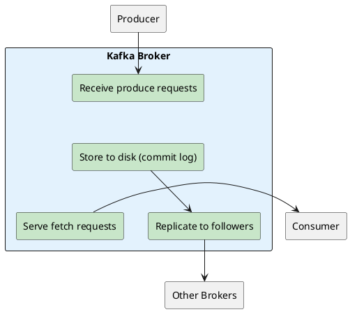
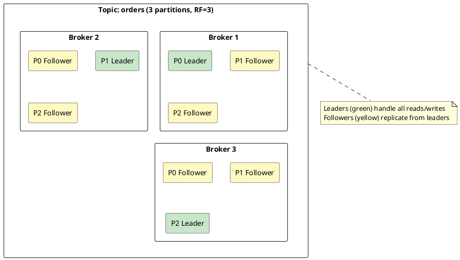
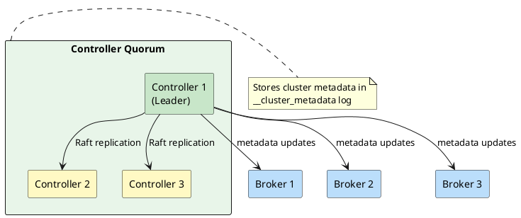
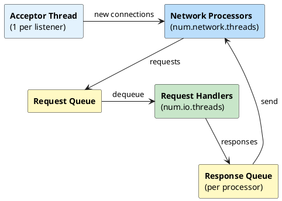
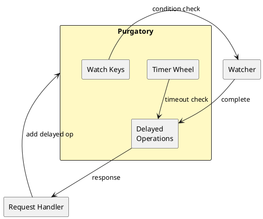
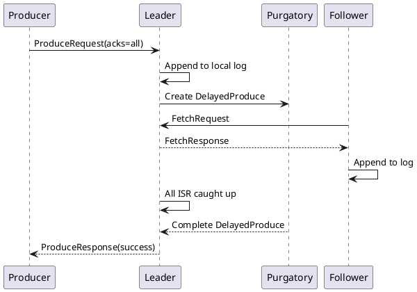
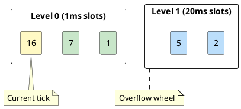
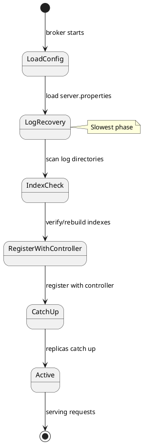
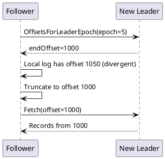

# Kafka Broker Architecture

This section covers the internal architecture of a Kafka broker—the server process that stores messages and serves client requests. Understanding broker internals is essential for capacity planning, performance tuning, and troubleshooting.

A Kafka broker handles a portion of the cluster's data, enabling horizontal scaling and fault tolerance.

---

## What a Broker Does



| Responsibility | Description |
|----------------|-------------|
| **Store messages** | Persist records to disk as log segments |
| **Serve producers** | Accept writes, acknowledge based on `acks` setting |
| **Serve consumers** | Return records from requested offsets |
| **Replicate data** | Send records to follower replicas |
| **Receive replicas** | Accept records from the leader replica |
| **Report metadata** | Register with controller, report partition state |

---

## Broker Identity

Each broker has a unique identity within the cluster:

```properties
# Unique broker ID (must be unique across cluster)
node.id=1

# Listeners for client and inter-broker communication
listeners=PLAINTEXT://:9092,CONTROLLER://:9093
advertised.listeners=PLAINTEXT://broker1.example.com:9092

# Data directory
log.dirs=/var/kafka-logs
```

!!! note "Controller listener only in combined mode"
    Include the `CONTROLLER` listener only when `process.roles=broker,controller`. Broker-only nodes should not expose a controller listener.

Clients discover brokers through the bootstrap servers, then connect directly to the broker hosting each partition's leader.

---

## Partitions and Leadership

Brokers don't own topics—they own **partition replicas**. Each partition has one leader and zero or more followers:



| Role | Responsibilities |
|------|------------------|
| **Leader** | Handle all produce and fetch requests for the partition |
| **Follower** | Fetch records from leader, ready to become leader if needed |

A single broker typically hosts hundreds or thousands of partition replicas, some as leader, others as follower.

For replication protocol details, ISR management, and leader election, see [Replication](../replication/index.md).

---

## KRaft Mode

KRaft (Kafka Raft) is production-ready from Kafka 3.3+ and is the only metadata mode in Kafka 4.0+; ZooKeeper remains supported through 3.9.x.



### Process Roles

| Role | Configuration | Description |
|------|---------------|-------------|
| **broker** | `process.roles=broker` | Handles client requests only |
| **controller** | `process.roles=controller` | Manages metadata only |
| **combined** | `process.roles=broker,controller` | Both roles in one process |

| Deployment | Best For | Trade-off |
|------------|----------|-----------|
| **Combined** | Small clusters (≤10 brokers) | Simpler, but resource contention |
| **Dedicated** | Large clusters | More servers, but better isolation |

For complete KRaft documentation, see [KRaft: Kafka Raft Consensus](../kraft/index.md).

---

## Network Layer

The network layer handles all client and inter-broker communication using a reactor pattern with distinct thread pools.

### Threading Model



| Thread Pool | Default | Configuration | Role |
|-------------|---------|---------------|------|
| **Acceptor** | 1 per listener | Fixed | Accept new TCP connections |
| **Network Processors** | 3 | `num.network.threads` | Read requests, write responses (NIO) |
| **Request Handlers** | 8 | `num.io.threads` | Execute request logic |

### Request Flow

1. **Accept** - Acceptor thread accepts TCP connection
2. **Assign** - Connection assigned to network processor (round-robin)
3. **Read** - Network processor reads request from socket
4. **Queue** - Request placed in shared request queue
5. **Handle** - Request handler dequeues and executes
6. **Response** - Response queued for network processor
7. **Send** - Network processor writes response to socket

### Thread Pool Sizing

| Cluster Size | `num.network.threads` | `num.io.threads` |
|--------------|----------------------|------------------|
| Small (< 10 brokers) | 3 | 8 |
| Medium (10-50 brokers) | 4-6 | 8-16 |
| Large (50+ brokers) | 8+ | 16-32 |

For security configuration, see [Authentication](../../security/authentication/index.md) and [Authorization](../../security/authorization/index.md).

---

## Request Purgatory

The purgatory holds delayed requests waiting for conditions to be satisfied, enabling efficient handling without blocking handler threads.

### Delayed Operations

| Operation | Completion Condition | Timeout |
|-----------|---------------------|---------|
| **DelayedProduce** | All ISR replicas acknowledged | `request.timeout.ms` |
| **DelayedFetch** | `min.bytes` data available | `fetch.max.wait.ms` |
| **DelayedJoin** | Rebalance window ends (join/sync complete or timeout) | `rebalance.timeout.ms` |
| **DelayedHeartbeat** | Session timeout check | `session.timeout.ms` |

### Purgatory Architecture



### Produce with acks=all



### Timer Wheel

Kafka uses a hierarchical timing wheel for O(1) timeout management:



---

## Coordinators

Brokers host two coordinator components based on internal topic partition assignment.

### Group Coordinator

Manages consumer group membership, partition assignment, and offset storage.

```
coordinator_partition = hash(group.id) % offsets.topic.num.partitions
coordinator_broker = leader of __consumer_offsets partition
```

| Function | Description |
|----------|-------------|
| **Membership management** | Track group members via heartbeats |
| **Rebalance coordination** | Orchestrate JoinGroup/SyncGroup protocol |
| **Offset storage** | Persist committed offsets to `__consumer_offsets` |

For consumer group protocol and operations, see [Consumer Groups](../../application-development/consumers/consumer-groups.md).

### Transaction Coordinator

Manages exactly-once semantics for transactional producers.

```
coordinator = hash(transactional.id) % transaction.state.log.num.partitions
coordinator_broker = leader of __transaction_state partition
```

| Function | Description |
|----------|-------------|
| **PID assignment** | Assign producer IDs and epochs |
| **State persistence** | Store transaction state in `__transaction_state` |
| **Commit coordination** | Write transaction markers to partition leaders |

For transaction semantics and protocol, see [Transactions](../transactions/index.md).

### Internal Topics

| Topic | Partitions | Purpose |
|-------|------------|---------|
| `__consumer_offsets` | Default 50 (configurable) | Consumer group offsets |
| `__transaction_state` | Default 50 (configurable) | Transaction coordinator state |
| `__cluster_metadata` | 1 (internal log) | KRaft metadata log |

---

## Startup and Recovery

When a broker starts—especially after a crash—it must recover state before serving requests.

### Startup Sequence



### Clean vs Unclean Shutdown

| Shutdown Type | Detection | Recovery Behavior |
|---------------|-----------|-------------------|
| **Clean** | `.kafka_cleanshutdown` marker | Skip log scanning, fast startup |
| **Unclean** | No marker (crash, kill -9) | Full log recovery, validate segments |

### Log Recovery

On unclean shutdown, each partition's log is validated:

1. Scan log directory for segment files
2. Validate segment CRC checksums
3. Truncate at corruption point if found
4. Rebuild indexes if invalid
5. Truncate incomplete records at end of active segment

### Index Rebuild Cost

| Partition Size | Rebuild Time |
|----------------|--------------|
| 1 GB | 5-15 seconds |
| 10 GB | 30-90 seconds |
| 100 GB | 5-15 minutes |

!!! warning "Many Partitions = Slow Startup"
    A broker with 1000 partitions requiring index rebuild can take 30+ minutes to start.

### Log Truncation

After leader failure, followers may need to truncate divergent entries:



### Controlled Shutdown

```bash
# Graceful shutdown (recommended)
kafka-server-stop.sh

# Or send SIGTERM
kill <broker-pid>
```

The broker will:

1. Notify the controller
2. Transfer leadership to other ISR members
3. Complete in-flight requests
4. Write clean shutdown marker

!!! warning "Avoid kill -9"
    `kill -9` causes unclean shutdown, requiring full log recovery.

---

## High Availability Settings

```properties
# Survive 2 broker failures
default.replication.factor=3

# Require 2 replicas to acknowledge writes
min.insync.replicas=2

# Never elect out-of-sync replica as leader
unclean.leader.election.enable=false
```

For failure scenarios and recovery procedures, see [Fault Tolerance](../fault-tolerance/index.md).

---

## Configuration Quick Reference

### Identity and Networking

```properties
node.id=1
listeners=PLAINTEXT://:9092
advertised.listeners=PLAINTEXT://broker1.example.com:9092
```

### Storage

```properties
log.dirs=/var/kafka-logs
log.retention.hours=168
log.segment.bytes=1073741824
```

For log segment internals, indexes, and compaction, see [Storage Engine](../storage-engine/index.md).

### Threading

```properties
num.network.threads=3
num.io.threads=8
num.replica.fetchers=1

# Request queue
queued.max.requests=500

# Socket settings
socket.send.buffer.bytes=102400
socket.receive.buffer.bytes=102400
socket.request.max.bytes=104857600
```

### Replication

```properties
default.replication.factor=3
min.insync.replicas=2
replica.lag.time.max.ms=30000
```

### Recovery

```properties
# Recovery threads (increase for faster recovery)
num.recovery.threads.per.data.dir=1

# Unclean leader election (data loss risk)
unclean.leader.election.enable=false
```

For complete configuration reference, see [Broker Configuration](../../operations/configuration/index.md).

---

## Key Metrics

| Metric | Alert Threshold |
|--------|-----------------|
| `kafka.network:type=RequestChannel,name=RequestQueueSize` | > 100 sustained |
| `kafka.network:type=SocketServer,name=NetworkProcessorAvgIdlePercent` | < 30% |
| `kafka.server:type=KafkaRequestHandlerPool,name=RequestHandlerAvgIdlePercent` | < 30% |
| `kafka.server:type=DelayedOperationPurgatory,name=PurgatorySize,delayedOperation=Produce` | > 1000 |

---

## Related Architecture Topics

| Topic | Description |
|-------|-------------|
| **[Storage Engine](../storage-engine/index.md)** | Log segments, indexes, compaction, retention |
| **[Replication](../replication/index.md)** | ISR, leader election, high watermark |
| **[Memory Management](../memory-management/index.md)** | JVM heap, page cache, zero-copy |
| **[KRaft](../kraft/index.md)** | Raft consensus, controller quorum, migration |
| **[Fault Tolerance](../fault-tolerance/index.md)** | Failure detection and recovery |
| **[Cluster Management](../cluster-management/index.md)** | Metadata management and coordination |
