# Kafka Broker Internals

This document describes the internal architecture of a Kafka broker—the threading model, request processing pipeline, storage layer, and coordination mechanisms that enable high-throughput, low-latency message handling.

---

## Architecture Overview

A Kafka broker is a multi-threaded server with layered architecture for network handling, security, and request processing:

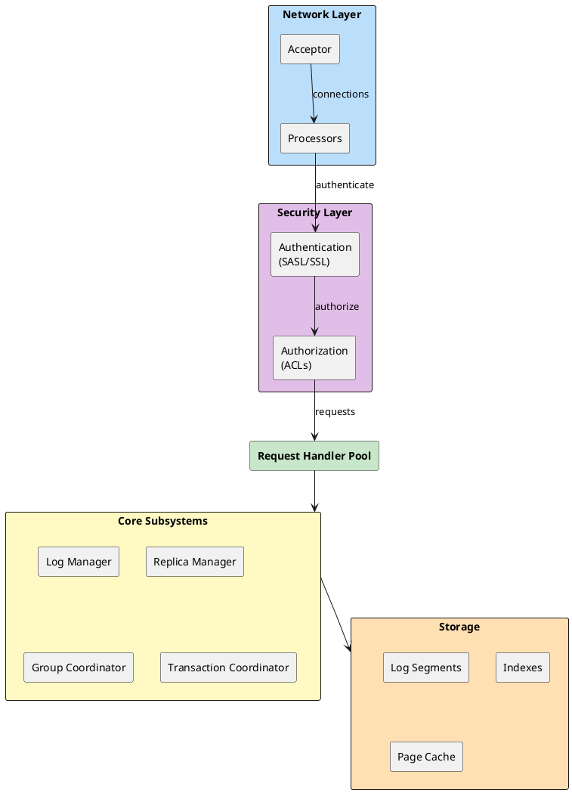

| Subsystem | Responsibility |
|-----------|----------------|
| **Network Layer** | Accept connections, TLS termination, read/write requests |
| **Authentication** | Verify client identity (SASL, mTLS) |
| **Authorization** | Check ACLs for resource access |
| **Request Handler Pool** | Execute request logic (produce, fetch, metadata) |
| **Log Manager** | Manage topic partitions, segments, retention |
| **Replica Manager** | Leader/follower replication, ISR management |
| **Group Coordinator** | Consumer group membership, offset commits |
| **Transaction Coordinator** | Exactly-once semantics, transaction state |

---

## Network Architecture

### Threading Model

Kafka uses a reactor pattern with distinct thread pools for network I/O and request processing:

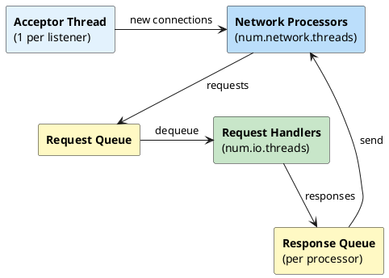

| Thread Pool | Count | Configuration | Role |
|-------------|-------|---------------|------|
| **Acceptor** | 1 per listener | Fixed | Accept new TCP connections |
| **Network Processors** | `num.network.threads` | 3 default | Read requests, write responses (NIO) |
| **Request Handlers** | `num.io.threads` | 8 default | Execute request logic |

### Request Processing Pipeline

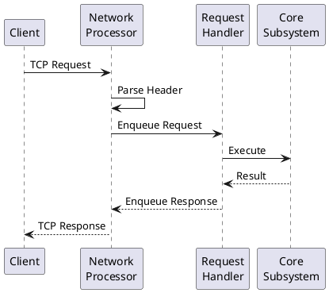

### Request Types

| API Key | Request | Handler |
|---------|---------|---------|
| 0 | Produce | ReplicaManager.appendRecords() |
| 1 | Fetch | ReplicaManager.fetchMessages() |
| 2 | ListOffsets | ReplicaManager.fetchOffsetForTimestamp() |
| 3 | Metadata | MetadataCache.getTopicMetadata() |
| 8 | OffsetCommit | GroupCoordinator.handleCommitOffsets() |
| 9 | OffsetFetch | GroupCoordinator.handleFetchOffsets() |
| 10 | FindCoordinator | Find group/transaction coordinator |
| 11 | JoinGroup | GroupCoordinator.handleJoinGroup() |
| 12 | Heartbeat | GroupCoordinator.handleHeartbeat() |
| 14 | SyncGroup | GroupCoordinator.handleSyncGroup() |
| 19 | CreateTopics | Controller via forwarding |

### Socket Configuration

```properties
# Network processor threads (NIO selectors)
num.network.threads=3

# Request handler threads (business logic)
num.io.threads=8

# Maximum queued requests before blocking
queued.max.requests=500

# Socket buffers
socket.send.buffer.bytes=102400
socket.receive.buffer.bytes=102400

# Maximum request size
socket.request.max.bytes=104857600

# Connection limits
max.connections=2147483647
max.connections.per.ip=2147483647
```

### Connection Handling

Each client connection is assigned to a network processor using round-robin. The processor handles all I/O for that connection using NIO selectors.

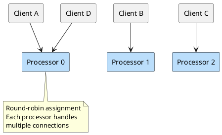

---

## Security Layer

The security layer handles authentication and authorization for all client connections. It sits between the network layer and request handlers.

### Authentication

Authentication occurs during connection establishment, before any Kafka protocol requests are processed:

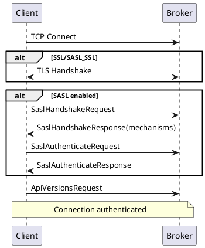

| Protocol | Encryption | Authentication |
|----------|------------|----------------|
| `PLAINTEXT` | None | None |
| `SSL` | TLS | Optional mTLS |
| `SASL_PLAINTEXT` | None | SASL |
| `SASL_SSL` | TLS | SASL |

After authentication, a **principal** is established (e.g., `User:alice`) that is used for authorization decisions.

For complete authentication configuration, see **[Authentication](../../security/authentication/index.md)**.

### Authorization

Every request is checked against Access Control Lists (ACLs) before processing:

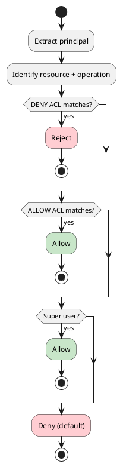

| Resource | Example Operations |
|----------|-------------------|
| **Topic** | Read, Write, Describe, Create, Delete |
| **Group** | Read, Describe, Delete |
| **Cluster** | Create, Alter, ClusterAction |
| **TransactionalId** | Write, Describe |

For complete authorization configuration and ACL management, see **[Authorization](../../security/authorization/index.md)**.

---

## Log Subsystem

The log subsystem manages durable storage of messages. Each partition is an ordered, immutable sequence of records stored as log segments.

### Log Structure

```
/var/kafka-logs/
├── my-topic-0/                        # Partition directory
│   ├── 00000000000000000000.log       # Segment file (messages)
│   ├── 00000000000000000000.index     # Offset index
│   ├── 00000000000000000000.timeindex # Time index
│   ├── 00000000000012345678.log       # Next segment
│   ├── 00000000000012345678.index
│   ├── 00000000000012345678.timeindex
│   ├── leader-epoch-checkpoint        # Leader epoch history
│   └── partition.metadata             # Topic ID mapping
├── my-topic-1/
│   └── ...
└── __consumer_offsets-0/              # Internal topic
    └── ...
```

### Segment Files

Each segment consists of three files:

| File | Extension | Purpose |
|------|-----------|---------|
| **Log** | `.log` | Record batches (actual data) |
| **Offset Index** | `.index` | Sparse offset → file position mapping |
| **Time Index** | `.timeindex` | Sparse timestamp → offset mapping |

Segment naming uses the base offset (first offset in segment) zero-padded to 20 digits.

### Record Batch Format

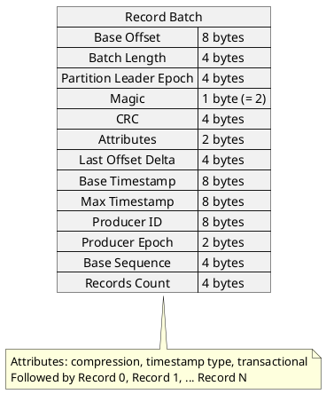

### Offset Index

The offset index is a sparse index mapping offsets to file positions. Not every offset is indexed—entries are added every `index.interval.bytes` (default 4KB).

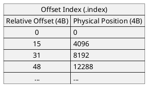

**Lookup algorithm:**

1. Binary search index for largest offset ≤ target
2. Sequential scan from that position in log file
3. Return record at target offset

### Time Index

The time index maps timestamps to offsets, enabling time-based lookups:

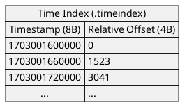

### Segment Lifecycle

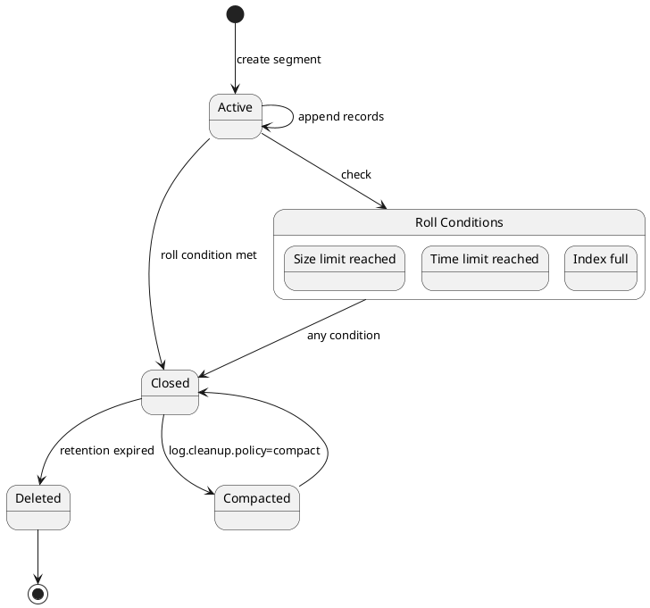

**Roll conditions** (new segment created when any is true):

| Condition | Configuration | Default |
|-----------|---------------|---------|
| Size limit | `log.segment.bytes` | 1 GB |
| Time limit | `log.roll.ms` / `log.roll.hours` | 7 days |
| Index full | `log.index.size.max.bytes` | 10 MB |
| Offset overflow | Relative offset exceeds 32-bit | ~2 billion records |

### Log Retention

| Policy | Configuration | Behavior |
|--------|---------------|----------|
| **Time-based** | `log.retention.hours` (168 default) | Delete segments older than threshold |
| **Size-based** | `log.retention.bytes` (-1 default) | Delete oldest segments when partition exceeds size |
| **Compaction** | `log.cleanup.policy=compact` | Keep only latest value per key |

```properties
# Retention settings
log.retention.hours=168              # 7 days
log.retention.bytes=-1               # No size limit
log.retention.check.interval.ms=300000  # Check every 5 minutes

# Segment settings
log.segment.bytes=1073741824         # 1 GB segments
log.segment.ms=604800000             # Roll after 7 days

# Compaction
log.cleanup.policy=delete            # or compact, or delete,compact
log.cleaner.enable=true
log.cleaner.threads=1
min.cleanable.dirty.ratio=0.5
```

### Log Compaction

Compaction retains only the last value for each key, enabling "table" semantics:

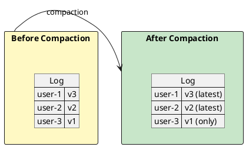

**Tombstones:** A record with null value marks key for deletion. Tombstones are retained for `delete.retention.ms` (24 hours default) before removal.

---

## Replica Manager

The Replica Manager handles partition replication, leader election, and ISR (In-Sync Replicas) management.

### Replica Types

| Type | Role | Responsibilities |
|------|------|------------------|
| **Leader** | Primary | Handle produce/fetch, maintain ISR |
| **Follower** | Secondary | Fetch from leader, catch up |
| **Observer** | Read-only (KIP-392) | Fetch without joining ISR |

### ISR (In-Sync Replicas)

A replica is in the ISR if it:

1. Has fetched up to the leader's log end offset within `replica.lag.time.max.ms` (30 seconds default)
2. Is not offline

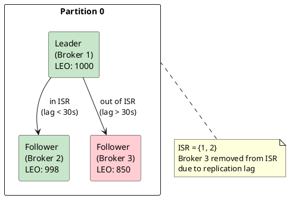

### High Watermark

The high watermark (HW) is the offset up to which all ISR replicas have replicated. Consumers can only read up to the HW.

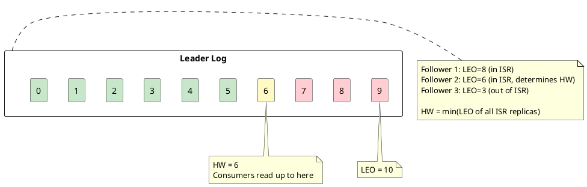

### Leader Epoch

Leader epochs prevent log divergence after leader changes:

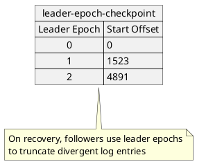

### Fetch Protocol

Followers fetch from leaders using the same Fetch API as consumers:

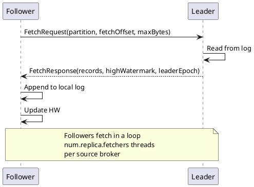

**Configuration:**

```properties
# Replica fetcher threads per source broker
num.replica.fetchers=1

# Wait time for fetch when no data
replica.fetch.wait.max.ms=500

# Maximum bytes per fetch
replica.fetch.max.bytes=1048576

# Minimum bytes before responding
replica.fetch.min.bytes=1

# ISR lag threshold
replica.lag.time.max.ms=30000
```

---

## Request Purgatory

The purgatory holds delayed requests waiting for conditions to be satisfied. This enables efficient handling of requests with timeout semantics.

### Delayed Operations

| Operation | Condition | Example |
|-----------|-----------|---------|
| **DelayedProduce** | `acks=all` waiting for ISR | Produce with acks=all |
| **DelayedFetch** | Not enough data available | Consumer fetch min.bytes |
| **DelayedJoin** | Waiting for all members | Consumer group join |
| **DelayedHeartbeat** | Waiting for session timeout | Member liveness check |

### Purgatory Architecture

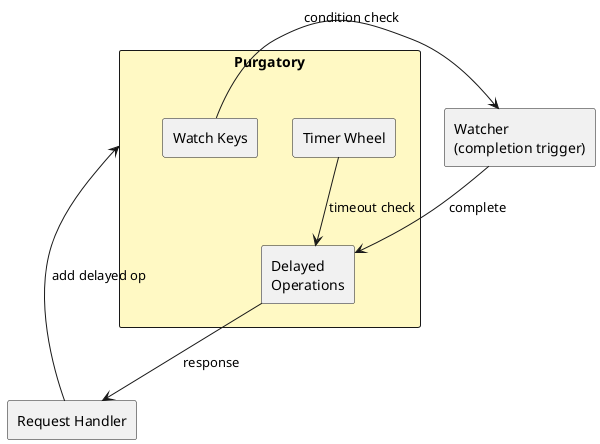

### Produce Acknowledgment Flow (acks=all)

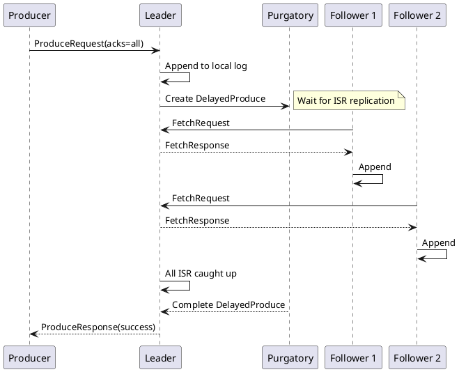

### Fetch Wait Flow

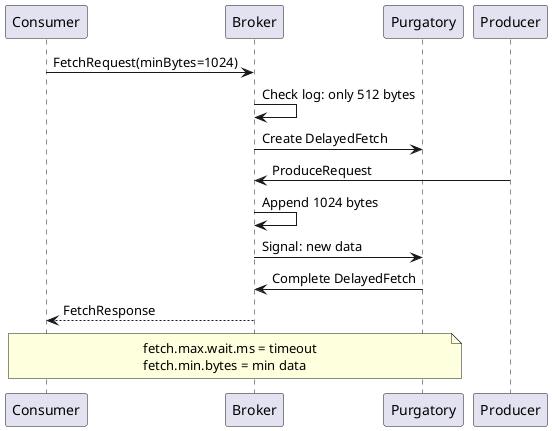

### Timer Wheel

Kafka uses a hierarchical timing wheel for efficient timeout management:

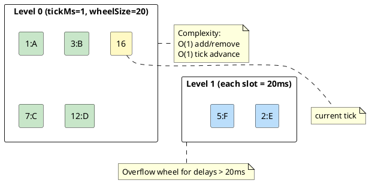

---

## Group Coordinator

Each broker hosts a Group Coordinator responsible for consumer groups whose `__consumer_offsets` partition leader resides on that broker.

### Group Coordinator Assignment

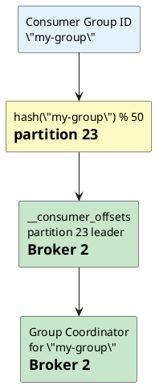

### Consumer Group State Machine

```plantuml
@startuml
skinparam backgroundColor transparent

[*] --> Empty : group created

Empty --> PreparingRebalance : member joins
PreparingRebalance --> CompletingRebalance : all members joined
CompletingRebalance --> Stable : leader synced assignments

Stable --> PreparingRebalance : member joins/leaves
Stable --> Empty : all members leave

PreparingRebalance --> Empty : all members leave
CompletingRebalance --> Empty : all members leave

Dead --> [*] : group deleted

Stable --> Dead : offsets expired\nno members

@enduml
```

| State | Description |
|-------|-------------|
| **Empty** | No active members, may have committed offsets |
| **PreparingRebalance** | Waiting for members to join |
| **CompletingRebalance** | Waiting for leader to sync assignments |
| **Stable** | Normal operation, members consuming |
| **Dead** | No members, offsets expired |

### Rebalance Protocol

```plantuml
@startuml
skinparam backgroundColor transparent

participant "Member 1\n(Leader)" as m1
participant "Member 2" as m2
participant "Coordinator" as gc

m1 -> gc : JoinGroup
m2 -> gc : JoinGroup

gc -> gc : Wait for\nrebalance.timeout.ms

gc --> m1 : JoinResponse(leader, members)
gc --> m2 : JoinResponse(follower)

m1 -> m1 : Compute assignments
m1 -> gc : SyncGroup(assignments)
m2 -> gc : SyncGroup(empty)

gc --> m1 : SyncResponse(assignment)
gc --> m2 : SyncResponse(assignment)

loop Stable
    m1 -> gc : Heartbeat
    gc --> m1 : HeartbeatResponse
    m2 -> gc : Heartbeat
    gc --> m2 : HeartbeatResponse
end

@enduml
```

### Offset Storage

Consumer offsets are stored in `__consumer_offsets` (50 partitions by default):

```
Key: (group_id, topic, partition)
Value: (offset, metadata, commit_timestamp)

Example:
Key:   ("my-group", "orders", 0)
Value: (offset=12345, metadata="", timestamp=1703001600000)
```

**Configuration:**

```properties
# __consumer_offsets topic settings
offsets.topic.num.partitions=50
offsets.topic.replication.factor=3
offsets.retention.minutes=10080  # 7 days

# Group coordinator settings
group.initial.rebalance.delay.ms=3000
group.max.session.timeout.ms=1800000
group.min.session.timeout.ms=6000
```

---

## Transaction Coordinator

The Transaction Coordinator manages exactly-once semantics for transactional producers.

### Transaction State Storage

Transaction state is stored in `__transaction_state` (50 partitions by default):

```
Key: transactional.id
Value: (producer_id, producer_epoch, state, partitions, timeout)
```

### Transaction States

```plantuml
@startuml
skinparam backgroundColor transparent

[*] --> Empty : InitProducerId

Empty --> Ongoing : AddPartitionsToTxn
Ongoing --> Ongoing : AddPartitionsToTxn
Ongoing --> PrepareCommit : EndTxn(commit)
Ongoing --> PrepareAbort : EndTxn(abort)

PrepareCommit --> CompleteCommit : markers written
PrepareAbort --> CompleteAbort : markers written

CompleteCommit --> Empty
CompleteAbort --> Empty

Ongoing --> Dead : timeout

@enduml
```

### Transaction Flow

```plantuml
@startuml
skinparam backgroundColor transparent

participant "Producer" as p
participant "Transaction\nCoordinator" as tc
participant "Partition\nLeaders" as pl

p -> tc : InitProducerId
tc --> p : (producerId, epoch)

p -> tc : AddPartitionsToTxn([topic-0, topic-1])
tc --> p : OK

p -> pl : ProduceRequest(transactional)
pl --> p : OK

p -> tc : EndTxn(COMMIT)
tc -> pl : WriteTxnMarkers(COMMIT)
pl --> tc : OK
tc --> p : OK

@enduml
```

---

## Internal Topics

| Topic | Partitions | Purpose |
|-------|------------|---------|
| `__consumer_offsets` | 50 | Consumer group offsets |
| `__transaction_state` | 50 | Transaction coordinator state |
| `__cluster_metadata` | 1 | KRaft metadata log |

These topics use log compaction and have special retention policies:

```properties
# Consumer offsets
offsets.topic.replication.factor=3
offsets.topic.num.partitions=50
offsets.retention.minutes=10080

# Transaction state
transaction.state.log.replication.factor=3
transaction.state.log.num.partitions=50
transaction.state.log.min.isr=2
```

---

## Fetch Sessions (KIP-227)

Fetch sessions reduce bandwidth by sending only changed partition data:

### Without Fetch Sessions

```
Request:  [partition list + fetch positions] → 100+ bytes per partition
Response: [partition list + data] → repeated metadata
```

### With Fetch Sessions

```
First Request:  [full partition list]
First Response: [sessionId, data]

Subsequent:     [sessionId only, or delta]
Response:       [changed partitions only]
```

**Benefits:**

- 50%+ reduction in fetch request size
- Lower CPU for metadata processing
- Better performance with many partitions

---

## Memory Architecture

Kafka relies heavily on the OS page cache rather than JVM heap:

```plantuml
@startuml
skinparam backgroundColor transparent

rectangle "JVM Heap" as heap #FFCDD2 {
    rectangle "Request\nBuffers" as req
    rectangle "Metadata\nCache" as meta
    rectangle "In-flight\nRequests" as inflight
}

rectangle "OS Page Cache" as cache #C8E6C9 {
    rectangle "Log\nSegments" as logs
    rectangle "Index\nFiles" as idx
}

rectangle "Disk" as disk #E0E0E0 {
    rectangle "Log Files" as files
}

req --> cache : write/read
cache <--> disk : flush/load

note right of cache
  Kafka writes go to page cache
  OS flushes to disk asynchronously
  Reads often served from cache
end note

@enduml
```

### Memory Recommendations

| Component | Memory Source | Sizing |
|-----------|---------------|--------|
| **JVM Heap** | Configured | 4-8 GB typically sufficient |
| **Page Cache** | Remaining RAM | As much as possible |
| **Direct Buffers** | Off-heap | Network I/O buffers |

```properties
# JVM settings (in kafka-server-start.sh)
export KAFKA_HEAP_OPTS="-Xms6g -Xmx6g"

# For a 32 GB server:
# - 6 GB JVM heap
# - 26 GB available for page cache
```

### Zero-Copy Transfer

Kafka uses `sendfile()` syscall for zero-copy transfer from page cache to network:

```plantuml
@startuml
skinparam backgroundColor transparent

rectangle "Traditional Path" as trad {
    rectangle "Disk" as d1 #E0E0E0
    rectangle "Kernel Buffer" as kb1 #FFCDD2
    rectangle "User Buffer" as ub #FFCDD2
    rectangle "Socket Buffer" as sb1 #FFCDD2
    rectangle "NIC" as nic1 #E0E0E0

    d1 -right-> kb1
    kb1 -right-> ub
    ub -right-> sb1
    sb1 -right-> nic1
}

rectangle "Zero-Copy (sendfile)" as zc {
    rectangle "Disk" as d2 #E0E0E0
    rectangle "Page Cache" as pc #C8E6C9
    rectangle "NIC" as nic2 #E0E0E0

    d2 -right-> pc
    pc -right-> nic2 : direct transfer
}

trad -[hidden]down-> zc

note bottom of zc
  2-4x throughput improvement
  for consumer fetches
end note

@enduml
```

---

## Broker Startup and Recovery

When a broker starts—especially after a crash—it must recover its state before serving requests. Understanding this process is critical for capacity planning and incident response.

### Startup Sequence

```plantuml
@startuml
skinparam backgroundColor transparent

[*] --> LoadConfig : broker starts

LoadConfig --> LogRecovery : load server.properties
LogRecovery --> IndexCheck : scan log directories
IndexCheck --> RegisterWithController : verify/rebuild indexes
RegisterWithController --> FetchMetadata : send BrokerRegistration
FetchMetadata --> CatchUp : receive cluster metadata
CatchUp --> Active : replicas catch up to leaders

Active --> [*] : serving requests

note right of LogRecovery
  Slowest phase for
  brokers with many partitions
end note

note right of CatchUp
  Under-replicated until
  followers catch up
end note

@enduml
```

### Log Recovery Process

On startup, each partition's log must be recovered:

```plantuml
@startuml
skinparam backgroundColor transparent

start

:Scan log directory;
:Find all segment files;

if (Clean shutdown marker exists?) then (yes)
  :Skip recovery\n(logs are consistent);
else (no)
  :Recover each segment;

  while (More segments?) is (yes)
    :Validate segment CRC;
    if (CRC valid?) then (yes)
      :Keep segment;
    else (no)
      :Truncate at corruption point;
    endif

    :Check index files;
    if (Index valid?) then (yes)
      :Use existing index;
    else (no)
      :Rebuild index from log;
    endif
  endwhile (no)

  :Truncate incomplete records\nat end of active segment;
endif

:Load leader epoch checkpoint;
:Partition ready;

stop

@enduml
```

### Clean vs Unclean Shutdown

| Shutdown Type | Detection | Recovery Behavior |
|---------------|-----------|-------------------|
| **Clean** | `.kafka_cleanshutdown` marker exists | Skip log scanning, fast startup |
| **Unclean** | No marker (crash, kill -9, power loss) | Full log recovery, validate all segments |

The clean shutdown marker is written during controlled shutdown and deleted on startup.

### Index Recovery

Indexes (`.index` and `.timeindex`) can become corrupted or out of sync:

| Scenario | Detection | Action |
|----------|-----------|--------|
| Missing index file | File not found | Rebuild from log |
| Truncated index | Size mismatch | Rebuild from log |
| Corrupted entries | Validation failure | Rebuild from log |
| Index ahead of log | Offset beyond log end | Truncate index |

**Index rebuild cost:**

| Partition Size | Approximate Rebuild Time |
|----------------|-------------------------|
| 1 GB | 5-15 seconds |
| 10 GB | 30-90 seconds |
| 100 GB | 5-15 minutes |

!!! warning "Many Partitions = Slow Startup"
    Index rebuilding happens sequentially per partition. A broker with 1000 partitions requiring index rebuild can take 30+ minutes to start.

### Log Truncation

After a leader failure, the new leader may have a different log end. Followers must truncate divergent entries:

```plantuml
@startuml
skinparam backgroundColor transparent

participant "Follower" as f
participant "New Leader" as l

f -> l : OffsetsForLeaderEpoch(epoch=5)
l --> f : endOffset=1000 for epoch 5

f -> f : Check local log

note over f
  Local log has offset 1050
  for epoch 5 (divergent!)
end note

f -> f : Truncate to offset 1000

f -> l : Fetch(offset=1000)
l --> f : Records from 1000

note over f
  Now in sync with leader
end note

@enduml
```

**Why truncation happens:**

1. Old leader accepted writes that weren't fully replicated
2. Old leader crashed before replicating to new leader
3. New leader was elected with fewer records
4. Followers must match new leader's log

!!! danger "Data Loss During Truncation"
    Records truncated from followers were never fully committed (not in ISR). With `acks=all`, producers would have received errors. With `acks=1`, producers may believe these records were committed.

### Corrupted Segment Handling

| Corruption Type | Location | Recovery Action |
|-----------------|----------|-----------------|
| Invalid magic byte | Segment header | Truncate segment, lose subsequent data |
| CRC mismatch | Record batch | Truncate at corruption point |
| Incomplete record | End of segment | Truncate incomplete bytes |
| Invalid offset sequence | Mid-segment | Truncate at invalid offset |

**Corruption indicators in logs:**

```
WARN  Found invalid message ... Truncating log
ERROR Corrupt index found ... rebuilding
WARN  Log recovery ... truncated X bytes from segment
```

### Recovery Configuration

```properties
# Skip recovery for clean shutdown (default: true)
# Set to false to always validate on startup
log.recovery.per.partition.enabled=true

# Number of threads for log recovery
num.recovery.threads.per.data.dir=1

# Increase for faster recovery (uses more CPU/IO)
# num.recovery.threads.per.data.dir=4

# Unclean leader election (data loss risk)
unclean.leader.election.enable=false
```

### Startup Time Factors

| Factor | Impact | Mitigation |
|--------|--------|------------|
| **Partition count** | Linear increase | Fewer partitions per broker |
| **Unclean shutdown** | Full log scan required | Graceful shutdown procedures |
| **Corrupted indexes** | Rebuild time per partition | Fast storage, monitoring |
| **Log segment size** | Larger = slower scan | Smaller segments (trade-off: more files) |
| **Storage type** | HDD much slower than SSD | Use SSDs |
| **Recovery threads** | More threads = faster | Increase `num.recovery.threads.per.data.dir` |

### Monitoring Recovery

```bash
# Watch broker logs during startup
tail -f /var/log/kafka/server.log | grep -E "(Loading|Loaded|recovery|truncat)"

# Expected log sequence:
# Loading logs
# Recovering segment ...
# Loaded log for partition ...
# Recovery complete
```

**JMX metrics during startup:**

| Metric | Meaning |
|--------|---------|
| `kafka.log:type=LogManager,name=LogsLoadedPerSec` | Partitions loaded per second |
| `kafka.server:type=BrokerTopicMetrics,name=UnderReplicatedPartitions` | Partitions still catching up |

### Best Practices for Fast Recovery

1. **Use controlled shutdown** - Always prefer graceful shutdown over kill -9
2. **Monitor disk health** - Corrupted sectors cause segment corruption
3. **Size partitions appropriately** - Smaller partitions = faster recovery
4. **Use SSDs** - 10x+ faster recovery than HDDs
5. **Increase recovery threads** - For brokers with many partitions
6. **Regular restarts** - Validates recovery process works before emergencies

---

## Metrics Reference

### Network Metrics

| Metric | Description |
|--------|-------------|
| `kafka.network:type=RequestChannel,name=RequestQueueSize` | Pending requests |
| `kafka.network:type=RequestChannel,name=ResponseQueueSize` | Pending responses |
| `kafka.network:type=Processor,name=IdlePercent` | Processor utilization |
| `kafka.network:type=SocketServer,name=NetworkProcessorAvgIdlePercent` | Average processor idle |

### Log Metrics

| Metric | Description |
|--------|-------------|
| `kafka.log:type=LogFlushStats,name=LogFlushRateAndTimeMs` | Flush rate |
| `kafka.log:type=Log,name=Size` | Partition size |
| `kafka.log:type=Log,name=NumLogSegments` | Segment count |

### Replica Metrics

| Metric | Description |
|--------|-------------|
| `kafka.server:type=ReplicaManager,name=UnderReplicatedPartitions` | Partitions below RF |
| `kafka.server:type=ReplicaManager,name=UnderMinIsrPartitionCount` | Partitions below min ISR |
| `kafka.server:type=ReplicaManager,name=IsrShrinksPerSec` | ISR shrink rate |
| `kafka.server:type=ReplicaManager,name=IsrExpandsPerSec` | ISR expand rate |

### Purgatory Metrics

| Metric | Description |
|--------|-------------|
| `kafka.server:type=DelayedOperationPurgatory,name=PurgatorySize,delayedOperation=Produce` | Delayed produces |
| `kafka.server:type=DelayedOperationPurgatory,name=PurgatorySize,delayedOperation=Fetch` | Delayed fetches |

---

## Related Documentation

- **[Broker Overview](index.md)** - KRaft, configuration, lifecycle
- **[Replication](../replication/index.md)** - Replication protocol details
- **[Storage Engine](../storage-engine/index.md)** - Log segment internals
- **[Performance Internals](../performance-internals/index.md)** - Optimization
