# Kafka KRaft Mode

KRaft (Kafka Raft) is Kafka's built-in consensus protocol that eliminates the ZooKeeper dependency. This document covers KRaft architecture, the Raft consensus implementation, metadata management, and operational procedures.

---

## KRaft Overview

### Architecture Comparison

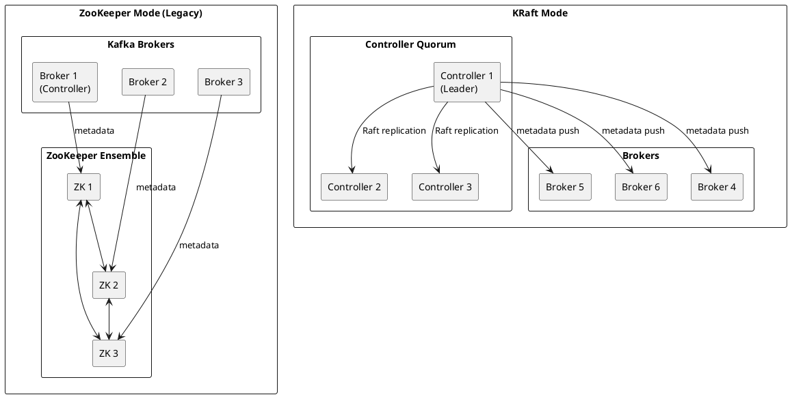

### Key Benefits

| Aspect | ZooKeeper Mode | KRaft Mode |
|--------|----------------|------------|
| **Dependencies** | External ZooKeeper cluster | Self-contained |
| **Metadata storage** | ZooKeeper znodes | Internal `__cluster_metadata` topic |
| **Scalability** | Limited by ZK watches | Scales to millions of partitions |
| **Recovery time** | Minutes (full metadata read) | Seconds (incremental) |
| **Operational complexity** | Two systems to manage | Single system |
| **Metadata propagation** | Push-based via controller | Pull-based with caching |

---

## Raft Consensus Protocol

### Protocol Fundamentals

KRaft implements the Raft consensus algorithm with Kafka-specific optimizations.

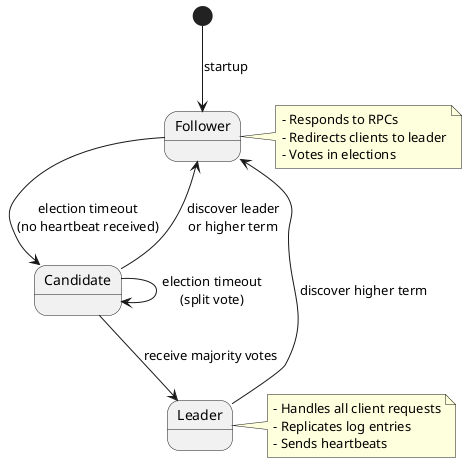

### Raft Properties

| Property | Guarantee |
|----------|-----------|
| **Election safety** | At most one leader per term |
| **Leader append-only** | Leader never overwrites or deletes entries |
| **Log matching** | If logs contain entry with same index/term, logs are identical up to that point |
| **Leader completeness** | Committed entries appear in all future leaders' logs |
| **State machine safety** | All servers apply same log entries in same order |

### Term and Epoch

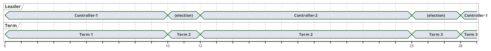

| Concept | Description |
|---------|-------------|
| **Term** | Monotonically increasing logical clock |
| **Leader epoch** | Term in which current leader was elected |
| **High watermark** | Highest committed offset in metadata log |
| **End offset** | Highest offset in local log (may be uncommitted) |

---

## Controller Quorum

### Quorum Configuration

```properties
# Controller quorum voters
# Format: {node.id}@{host}:{port}
controller.quorum.voters=1@controller1:9093,2@controller2:9093,3@controller3:9093

# Controller listener
controller.listener.names=CONTROLLER
listeners=CONTROLLER://:9093

# Node identity
node.id=1
process.roles=controller
```

### Quorum Size Recommendations

| Cluster Size | Controller Count | Fault Tolerance |
|:------------:|:----------------:|:---------------:|
| Development | 1 | 0 failures |
| Small (< 10 brokers) | 3 | 1 failure |
| Medium (10-50 brokers) | 3 | 1 failure |
| Large (50+ brokers) | 5 | 2 failures |

!!! warning "Quorum Sizing"
    Controller quorum must have an odd number of voters. Even numbers provide no additional fault tolerance but increase coordination overhead.

### Leader Election Process

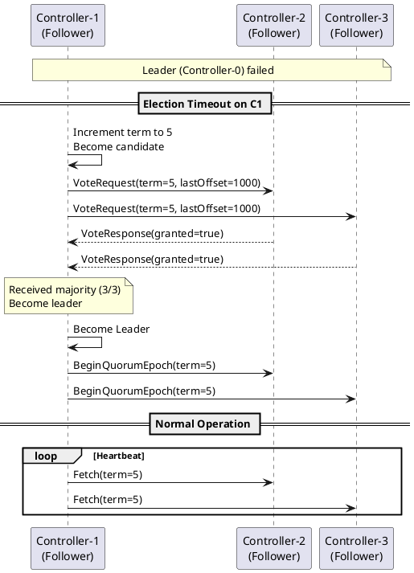

### Vote Request Criteria

A controller must grant a vote if:

| Criterion | Requirement |
|-----------|-------------|
| **Term** | Candidate's term ≥ voter's current term |
| **Log completeness** | Candidate's log is at least as up-to-date |
| **Vote status** | Voter has not voted for another candidate this term |

Log comparison (up-to-date check):

```
candidate_log_up_to_date =
    (candidate.lastLogTerm > voter.lastLogTerm) OR
    (candidate.lastLogTerm == voter.lastLogTerm AND
     candidate.lastLogOffset >= voter.lastLogOffset)
```

---

## Metadata Log

### `__cluster_metadata` Topic

The controller quorum stores all cluster metadata in a single-partition internal topic.

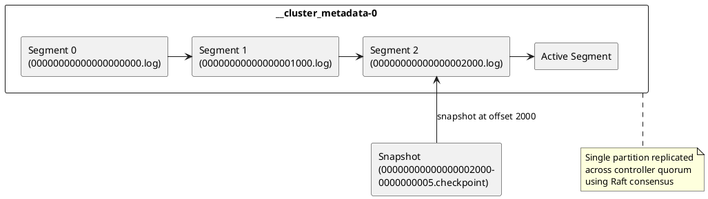

### Metadata Record Types

| Record Type | Description |
|-------------|-------------|
| `TopicRecord` | Topic creation with UUID |
| `PartitionRecord` | Partition assignment and replicas |
| `PartitionChangeRecord` | ISR and leader changes |
| `BrokerRegistrationChangeRecord` | Broker registration updates |
| `ConfigRecord` | Dynamic configuration changes |
| `ClientQuotaRecord` | Client quota settings |
| `ProducerIdsRecord` | Producer ID allocation |
| `AccessControlEntryRecord` | ACL entries |
| `RemoveTopicRecord` | Topic deletion |
| `FeatureLevelRecord` | Cluster feature flags |
| `NoOpRecord` | Leader election marker |

### Metadata Log Format

```
MetadataRecordBatch =>
    BaseOffset => INT64
    BatchLength => INT32
    PartitionLeaderEpoch => INT32
    Magic => INT8 (2)
    CRC => INT32
    Attributes => INT16
    LastOffsetDelta => INT32
    BaseTimestamp => INT64
    MaxTimestamp => INT64
    ProducerId => INT64 (-1)
    ProducerEpoch => INT16 (-1)
    BaseSequence => INT32 (-1)
    Records => [Record]

Record =>
    Length => VARINT
    Attributes => INT8
    TimestampDelta => VARLONG
    OffsetDelta => VARINT
    KeyLength => VARINT
    Key => BYTES
    ValueLength => VARINT
    Value => BYTES  # Serialized metadata record
```

---

## Metadata Snapshots

### Snapshot Purpose

Snapshots compact the metadata log by capturing the full cluster state at a point in time.

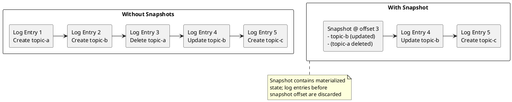

### Snapshot Configuration

```properties
# Snapshot generation interval (bytes of log since last snapshot)
metadata.log.max.record.bytes.between.snapshots=20971520

# Maximum metadata log size before forcing snapshot
metadata.log.max.snapshot.interval.ms=3600000

# Snapshot directory
metadata.log.dir=/var/kafka-logs/__cluster_metadata-0
```

### Snapshot Operations

```bash
# List metadata snapshots
ls -la /var/kafka-logs/__cluster_metadata-0/*.checkpoint

# Describe snapshot contents
kafka-metadata.sh --snapshot /var/kafka-logs/__cluster_metadata-0/00000000000000001000-0000000003.checkpoint \
  --command describe

# Read specific records from snapshot
kafka-metadata.sh --snapshot /var/kafka-logs/__cluster_metadata-0/00000000000000001000-0000000003.checkpoint \
  --command topics
```

---

## Broker Registration

### Registration Flow

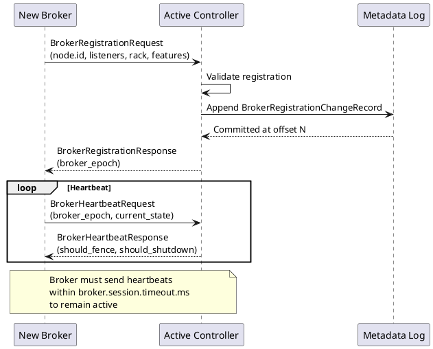

### Broker States

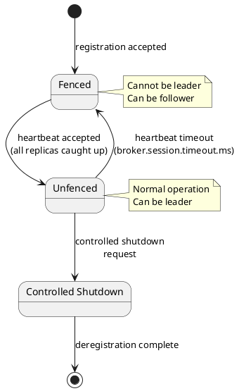

### Registration Configuration

```properties
# Broker heartbeat interval
broker.heartbeat.interval.ms=2000

# Session timeout (broker considered dead)
broker.session.timeout.ms=18000

# Initial broker registration timeout
initial.broker.registration.timeout.ms=60000
```

---

## Metadata Propagation

### Push-Based Propagation

The active controller pushes metadata updates to all brokers.

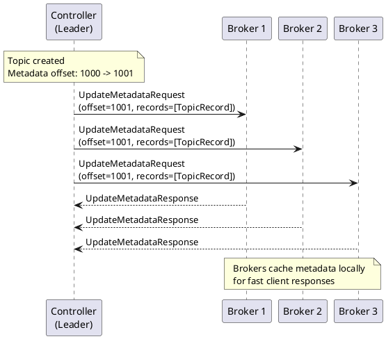

### Metadata Caching

| Cache Component | Description |
|-----------------|-------------|
| **Topic metadata** | Topic IDs, partition counts, configs |
| **Partition metadata** | Leaders, ISR, replicas |
| **Broker metadata** | Endpoints, rack, features |
| **Controller metadata** | Active controller location |

### Broker Fetch Optimization

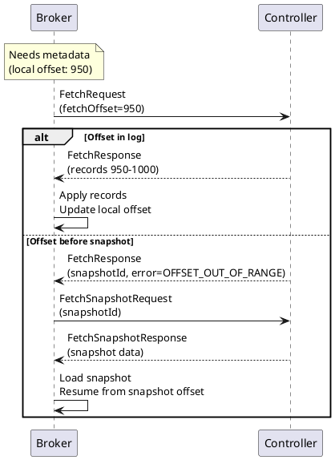

---

## KRaft Operations

### Cluster Initialization

```bash
# Generate cluster ID
CLUSTER_ID=$(kafka-storage.sh random-uuid)
echo $CLUSTER_ID

# Format storage on each controller/broker
kafka-storage.sh format \
  --config /etc/kafka/kraft/server.properties \
  --cluster-id $CLUSTER_ID

# Start controllers first, then brokers
kafka-server-start.sh /etc/kafka/kraft/controller.properties
kafka-server-start.sh /etc/kafka/kraft/broker.properties
```

### Describe Quorum

```bash
# Check quorum status
kafka-metadata.sh --snapshot /var/kafka-logs/__cluster_metadata-0/00000000000000000000.log \
  --command "describe"

# Or use admin client
kafka-metadata-quorum.sh --bootstrap-controller controller1:9093 describe

# Output includes:
# - Current leader
# - Current term/epoch
# - High watermark
# - Voter states and lag
```

### Controller Failover

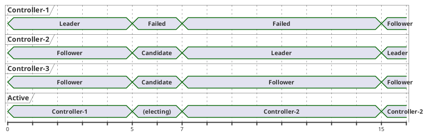

### Metadata Recovery

```bash
# If metadata is corrupted, recover from other controllers
# Stop the affected controller
kafka-server-stop.sh

# Clear metadata directory
rm -rf /var/kafka-logs/__cluster_metadata-0/*

# Restart - will fetch from leader
kafka-server-start.sh /etc/kafka/kraft/controller.properties
```

---

## ZooKeeper Migration

### Migration Overview

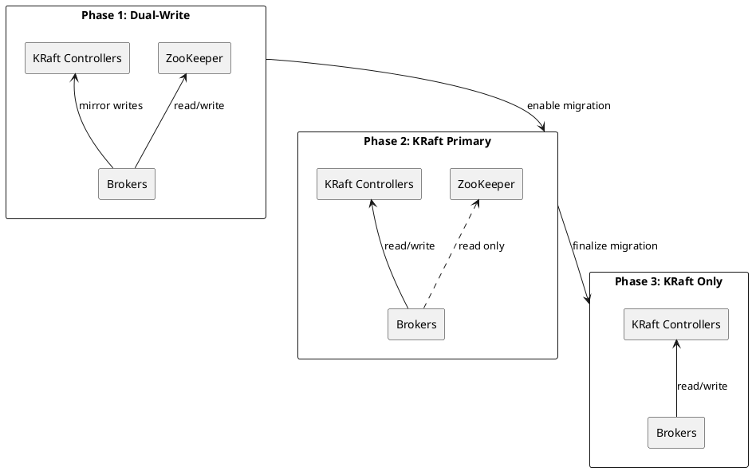

### Migration Steps

1. **Deploy controller quorum**
   ```bash
   # On each controller node
   kafka-storage.sh format \
     --config /etc/kafka/kraft/controller.properties \
     --cluster-id $(kafka-cluster.sh cluster-id --bootstrap-server broker:9092)

   kafka-server-start.sh /etc/kafka/kraft/controller.properties
   ```

2. **Enable migration mode on brokers**
   ```properties
   # Add to existing broker config
   controller.quorum.voters=1@controller1:9093,2@controller2:9093,3@controller3:9093
   zookeeper.metadata.migration.enable=true
   ```

3. **Rolling restart brokers**
   ```bash
   # Restart each broker with new config
   kafka-server-stop.sh
   kafka-server-start.sh /etc/kafka/server.properties
   ```

4. **Verify migration readiness**
   ```bash
   kafka-metadata.sh --snapshot /var/kafka-logs/__cluster_metadata-0/00000000000000000000.log \
     --command migration-state
   ```

5. **Finalize migration**
   ```bash
   # Trigger final migration (irreversible)
   kafka-metadata-quorum.sh --bootstrap-controller controller1:9093 \
     finalize-migration
   ```

### Migration Validation

| Check | Command | Expected |
|-------|---------|----------|
| Broker migration state | `kafka-metadata.sh ... --command brokers` | All in KRAFT mode |
| Controller quorum | `kafka-metadata-quorum.sh describe` | Leader elected, voters healthy |
| Topic metadata | `kafka-topics.sh --describe` | All topics visible |
| Consumer groups | `kafka-consumer-groups.sh --list` | All groups visible |

!!! danger "Migration is One-Way"
    Once migration is finalized, rollback to ZooKeeper mode is not supported. Ensure thorough testing in non-production environments before production migration.

---

## KRaft Configuration Reference

### Controller Settings

| Configuration | Default | Description |
|---------------|:-------:|-------------|
| `process.roles` | - | Must include `controller` |
| `node.id` | - | Unique controller identifier |
| `controller.quorum.voters` | - | Voter list: `id@host:port,...` |
| `controller.listener.names` | - | Controller listener name |

### Metadata Settings

| Configuration | Default | Description |
|---------------|:-------:|-------------|
| `metadata.log.dir` | log.dirs | Metadata log directory |
| `metadata.log.segment.bytes` | 1073741824 | Segment size |
| `metadata.log.max.record.bytes.between.snapshots` | 20971520 | Bytes before snapshot |
| `metadata.max.retention.bytes` | 104857600 | Max metadata log size |

### Quorum Settings

| Configuration | Default | Description |
|---------------|:-------:|-------------|
| `controller.quorum.election.timeout.ms` | 1000 | Election timeout |
| `controller.quorum.fetch.timeout.ms` | 2000 | Fetch timeout |
| `controller.quorum.election.backoff.max.ms` | 1000 | Max election backoff |
| `controller.quorum.retry.backoff.ms` | 20 | Retry backoff |

---

## Monitoring KRaft

### Key Metrics

| Metric | Description | Alert Threshold |
|--------|-------------|-----------------|
| `kafka.controller:type=KafkaController,name=ActiveControllerCount` | Active controllers | ≠ 1 |
| `kafka.controller:type=QuorumController,name=LastAppliedRecordOffset` | Applied metadata offset | Lag |
| `kafka.controller:type=QuorumController,name=LastAppliedRecordTimestamp` | Last apply time | Stale |
| `kafka.controller:type=QuorumController,name=MetadataErrorCount` | Metadata errors | > 0 |
| `kafka.raft:type=RaftManager,name=CurrentLeader` | Current leader ID | Changes |
| `kafka.raft:type=RaftManager,name=HighWatermark` | Committed offset | Lag |

### Health Checks

```bash
# Check controller is active
kafka-metadata-quorum.sh --bootstrap-controller controller1:9093 describe --status

# Verify all voters are online
kafka-metadata-quorum.sh --bootstrap-controller controller1:9093 describe --replication

# Check metadata lag across brokers
kafka-metadata.sh --snapshot /var/kafka-logs/__cluster_metadata-0/*.log \
  --command "broker-state"
```

---

## Version Compatibility

| Feature | Kafka Version |
|---------|---------------|
| KRaft preview | 2.8.0 |
| KRaft production-ready | 3.3.0 |
| ZooKeeper migration | 3.4.0 |
| Migration finalization | 3.5.0 |
| ZooKeeper removal | 4.0 (planned) |

---

## Related Documentation

- [Brokers Overview](index.md) - Broker architecture
- [Cluster Management](../cluster-management/index.md) - Cluster operations
- [Fault Tolerance](../fault-tolerance/index.md) - Failure handling
- [Replication](../replication/index.md) - Replication protocol
