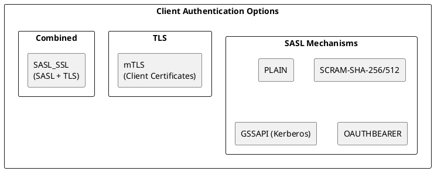
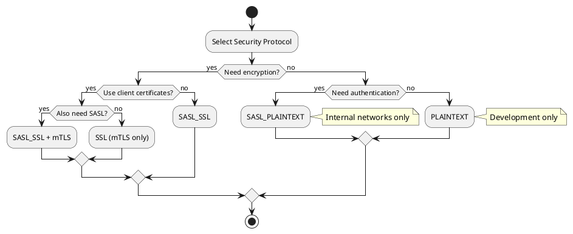
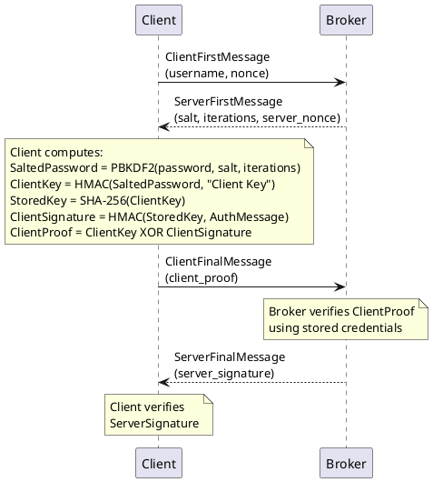
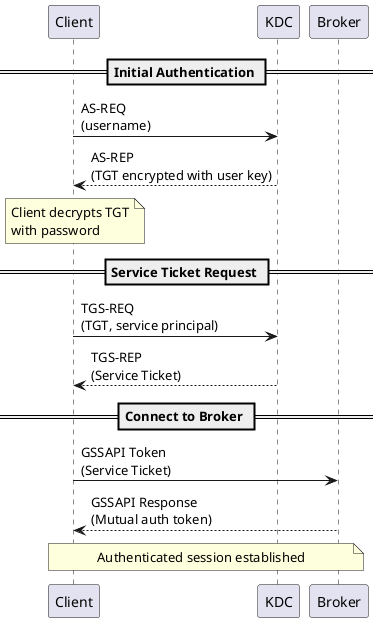
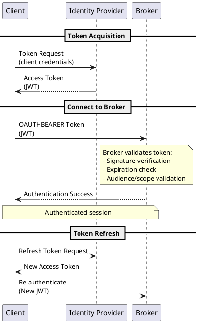
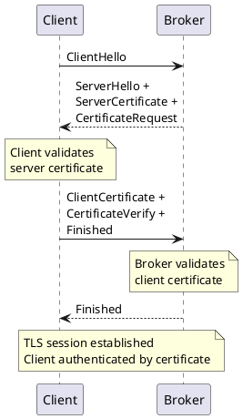
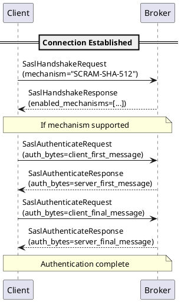
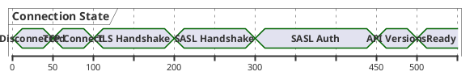
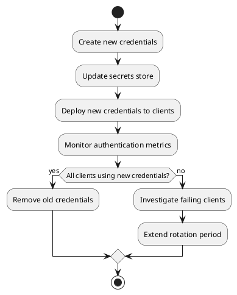

# Kafka Client Authentication

Kafka supports multiple authentication mechanisms to verify client identity before allowing access to cluster resources. This guide covers authentication protocols, configuration, and best practices for secure client connections.

## Authentication Overview



---

## Security Protocols

### Protocol Options

| Protocol | Authentication | Encryption | Use Case |
|----------|---------------|------------|----------|
| `PLAINTEXT` | None | None | Development only |
| `SSL` | mTLS (optional) | TLS | Certificate-based |
| `SASL_PLAINTEXT` | SASL | None | Internal networks |
| `SASL_SSL` | SASL | TLS | Production recommended |

### Protocol Selection Flow



---

## SASL/PLAIN

Simple username/password authentication. Credentials are sent in cleartext, so TLS encryption is required for production.

### Configuration

**Client (Producer/Consumer):**

```properties
security.protocol=SASL_SSL
sasl.mechanism=PLAIN
sasl.jaas.config=org.apache.kafka.common.security.plain.PlainLoginModule required \
    username="alice" \
    password="alice-secret";
```

**Programmatic Configuration (Java):**

```java
Properties props = new Properties();
props.put("security.protocol", "SASL_SSL");
props.put("sasl.mechanism", "PLAIN");
props.put("sasl.jaas.config",
    "org.apache.kafka.common.security.plain.PlainLoginModule required " +
    "username=\"alice\" " +
    "password=\"alice-secret\";");
```

### JAAS File Configuration

Alternative to inline configuration:

```
// kafka_client_jaas.conf
KafkaClient {
    org.apache.kafka.common.security.plain.PlainLoginModule required
    username="alice"
    password="alice-secret";
};
```

```bash
# Set JVM option
export KAFKA_OPTS="-Djava.security.auth.login.config=/path/to/kafka_client_jaas.conf"
```

!!! danger "Security Warning"
    SASL/PLAIN transmits credentials in base64 encoding (not encryption). Always use with TLS (`SASL_SSL`) in production. Never use `SASL_PLAINTEXT` with PLAIN mechanism in production.

---

## SASL/SCRAM

Salted Challenge Response Authentication Mechanism provides secure password-based authentication without transmitting passwords.

### How SCRAM Works



### Configuration

**Client:**

```properties
security.protocol=SASL_SSL
sasl.mechanism=SCRAM-SHA-512
sasl.jaas.config=org.apache.kafka.common.security.scram.ScramLoginModule required \
    username="alice" \
    password="alice-secret";
```

### SCRAM Variants

| Mechanism | Hash | Security Level |
|-----------|------|----------------|
| SCRAM-SHA-256 | SHA-256 | Good |
| SCRAM-SHA-512 | SHA-512 | Better |

!!! tip "Recommendation"
    Use SCRAM-SHA-512 for new deployments. It provides stronger security with minimal performance overhead compared to SCRAM-SHA-256.

### Creating SCRAM Credentials

```bash
# Create user credentials (run on broker)
kafka-configs.sh --bootstrap-server localhost:9092 \
    --alter --add-config 'SCRAM-SHA-512=[password=alice-secret]' \
    --entity-type users --entity-name alice

# List users
kafka-configs.sh --bootstrap-server localhost:9092 \
    --describe --entity-type users

# Delete user
kafka-configs.sh --bootstrap-server localhost:9092 \
    --alter --delete-config 'SCRAM-SHA-512' \
    --entity-type users --entity-name alice
```

---

## SASL/GSSAPI (Kerberos)

Enterprise-grade authentication using Kerberos. Provides strong authentication, mutual authentication, and integration with enterprise identity systems.

### Kerberos Authentication Flow



### Configuration

**Client:**

```properties
security.protocol=SASL_SSL
sasl.mechanism=GSSAPI
sasl.kerberos.service.name=kafka
sasl.jaas.config=com.sun.security.auth.module.Krb5LoginModule required \
    useKeyTab=true \
    storeKey=true \
    keyTab="/path/to/client.keytab" \
    principal="alice@EXAMPLE.COM";
```

**JAAS File Alternative:**

```
// kafka_client_jaas.conf
KafkaClient {
    com.sun.security.auth.module.Krb5LoginModule required
    useKeyTab=true
    storeKey=true
    keyTab="/path/to/client.keytab"
    principal="alice@EXAMPLE.COM";
};
```

### Kerberos Configuration (krb5.conf)

```ini
[libdefaults]
    default_realm = EXAMPLE.COM
    dns_lookup_realm = false
    dns_lookup_kdc = false
    ticket_lifetime = 24h
    forwardable = true

[realms]
    EXAMPLE.COM = {
        kdc = kdc.example.com
        admin_server = kdc.example.com
    }

[domain_realm]
    .example.com = EXAMPLE.COM
    example.com = EXAMPLE.COM
```

### Kerberos Troubleshooting

| Issue | Symptom | Resolution |
|-------|---------|------------|
| Clock skew | `Clock skew too great` | Sync clocks with NTP |
| Wrong principal | `Server not found in Kerberos database` | Verify service principal |
| Keytab issues | `Cannot find key` | Regenerate keytab |
| Ticket expired | `Ticket expired` | Kinit or refresh keytab |

```bash
# Debug Kerberos
export JAVA_OPTS="-Dsun.security.krb5.debug=true"

# Test keytab
klist -kt /path/to/client.keytab

# Initialize credentials
kinit -kt /path/to/client.keytab alice@EXAMPLE.COM
```

---

## SASL/OAUTHBEARER

Token-based authentication using OAuth 2.0 / OpenID Connect. Ideal for cloud-native deployments and integration with identity providers.

### OAuth Authentication Flow



### Configuration

**Client with Custom Callback:**

```properties
security.protocol=SASL_SSL
sasl.mechanism=OAUTHBEARER
sasl.login.callback.handler.class=com.example.OAuthBearerLoginCallbackHandler
sasl.jaas.config=org.apache.kafka.common.security.oauthbearer.OAuthBearerLoginModule required;
```

**Client with Built-in OIDC (Kafka 3.1+):**

```properties
security.protocol=SASL_SSL
sasl.mechanism=OAUTHBEARER
sasl.oauthbearer.token.endpoint.url=https://idp.example.com/oauth/token
sasl.login.callback.handler.class=org.apache.kafka.common.security.oauthbearer.secured.OAuthBearerLoginCallbackHandler
sasl.jaas.config=org.apache.kafka.common.security.oauthbearer.OAuthBearerLoginModule required \
    clientId="kafka-client" \
    clientSecret="client-secret" \
    scope="kafka";
```

### Custom OAuth Handler

```java
public class OAuthBearerLoginCallbackHandler implements AuthenticateCallbackHandler {

    @Override
    public void handle(Callback[] callbacks) throws IOException {
        for (Callback callback : callbacks) {
            if (callback instanceof OAuthBearerTokenCallback) {
                OAuthBearerTokenCallback tokenCallback = (OAuthBearerTokenCallback) callback;
                String token = fetchTokenFromIdP();
                tokenCallback.token(createOAuthBearerToken(token));
            }
        }
    }

    private OAuthBearerToken createOAuthBearerToken(String tokenValue) {
        // Parse JWT and create token object
        return new OAuthBearerToken() {
            @Override
            public String value() { return tokenValue; }
            @Override
            public Long startTimeMs() { return System.currentTimeMillis(); }
            @Override
            public long lifetimeMs() { return 3600000L; } // 1 hour
            @Override
            public String principalName() { return "client-id"; }
            // ... other methods
        };
    }
}
```

---

## mTLS (Mutual TLS)

Certificate-based authentication where both client and server present certificates.

### mTLS Authentication Flow



### Configuration

**Client:**

```properties
security.protocol=SSL
ssl.truststore.location=/path/to/truststore.jks
ssl.truststore.password=truststore-password
ssl.keystore.location=/path/to/client-keystore.jks
ssl.keystore.password=keystore-password
ssl.key.password=key-password
```

### Certificate Setup

```bash
# Generate client key pair
keytool -genkeypair -alias client -keyalg RSA -keysize 2048 \
    -validity 365 -keystore client-keystore.jks \
    -dname "CN=client.example.com,O=Example,C=US"

# Generate CSR
keytool -certreq -alias client -keystore client-keystore.jks \
    -file client.csr

# Import signed certificate
keytool -importcert -alias client -keystore client-keystore.jks \
    -file client-signed.crt

# Import CA certificate to truststore
keytool -importcert -alias ca -keystore truststore.jks \
    -file ca.crt
```

### Principal Extraction

Configure how the broker extracts the principal from client certificates:

| Rule | Example DN | Extracted Principal |
|------|-----------|---------------------|
| `DEFAULT` | `CN=client,O=Org` | `CN=client,O=Org` |
| `RULE:^CN=(.*?),.*$/$1/` | `CN=client,O=Org` | `client` |

---

## Authentication Handshake

### SASL Handshake Protocol



### Connection Establishment Timeline



---

## Credential Management

### Secure Credential Storage

| Method | Security | Use Case |
|--------|----------|----------|
| Environment variables | Medium | Containers |
| Secrets manager | High | Production |
| Keytab files | High | Kerberos |
| Hardware security module | Highest | Financial |

### Environment Variable Configuration

```bash
export KAFKA_SASL_USERNAME="alice"
export KAFKA_SASL_PASSWORD="alice-secret"
```

```java
String jaasConfig = String.format(
    "org.apache.kafka.common.security.scram.ScramLoginModule required " +
    "username=\"%s\" password=\"%s\";",
    System.getenv("KAFKA_SASL_USERNAME"),
    System.getenv("KAFKA_SASL_PASSWORD")
);
props.put("sasl.jaas.config", jaasConfig);
```

### Credential Rotation



---

## Authentication Metrics

### Key Metrics

| Metric | Description | Alert Condition |
|--------|-------------|-----------------|
| `successful-authentication-rate` | Successful auths/sec | Below baseline |
| `failed-authentication-rate` | Failed auths/sec | > 0 |
| `successful-authentication-total` | Total successful auths | - |
| `failed-authentication-total` | Total failed auths | Increasing |
| `reauthentication-latency-avg` | Avg reauth time | > 1000ms |

### Monitoring Authentication

```bash
# Check authentication errors in broker logs
grep -i "authentication" /var/log/kafka/server.log

# JMX metrics
kafka-run-class.sh kafka.tools.JmxTool \
    --jmx-url service:jmx:rmi:///jndi/rmi://localhost:9999/jmxrmi \
    --object-name kafka.server:type=BrokerTopicMetrics,name=FailedAuthenticationRate
```

---

## Best Practices

### Production Recommendations

| Practice | Rationale |
|----------|-----------|
| Use SASL_SSL | Encrypt credentials in transit |
| Prefer SCRAM over PLAIN | Password not transmitted |
| Rotate credentials regularly | Limit exposure window |
| Use short-lived tokens (OAuth) | Automatic expiration |
| Monitor auth failures | Detect attacks |

### Common Mistakes

| Mistake | Risk | Solution |
|---------|------|----------|
| PLAIN over PLAINTEXT | Credential theft | Use SASL_SSL |
| Hardcoded credentials | Credential exposure | Use secrets manager |
| No credential rotation | Extended exposure | Implement rotation |
| Ignoring auth failures | Undetected attacks | Monitor and alert |

---

## Version Compatibility

| Feature | Minimum Kafka Version |
|---------|----------------------|
| SASL/PLAIN | 0.10.0 |
| SASL/SCRAM | 0.10.2 |
| SASL/OAUTHBEARER | 2.0.0 |
| OIDC built-in | 3.1.0 |
| Re-authentication | 2.2.0 |

---

## Related Documentation

- [Kafka Protocol](kafka-protocol.md) - Wire protocol
- [Connection Pooling](connection-pooling.md) - Connection management
- [Encryption (TLS)](../../security/encryption/index.md) - TLS configuration
- [Authorization](../../security/authorization/index.md) - ACL configuration
