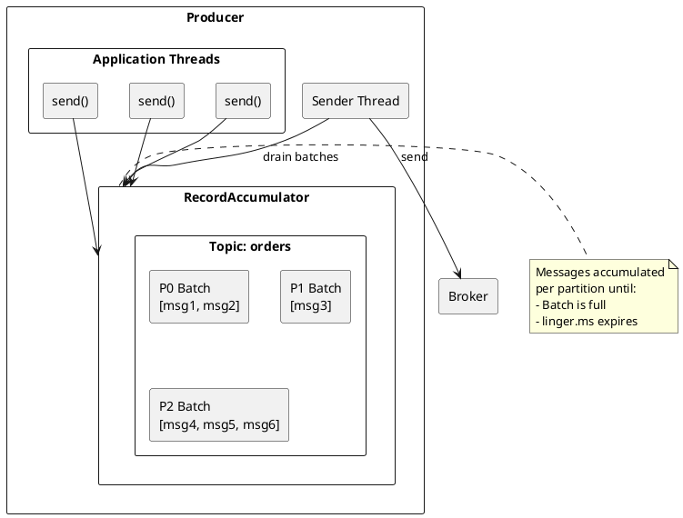
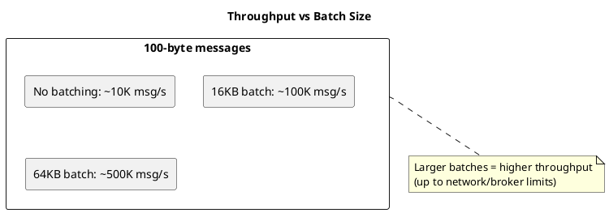
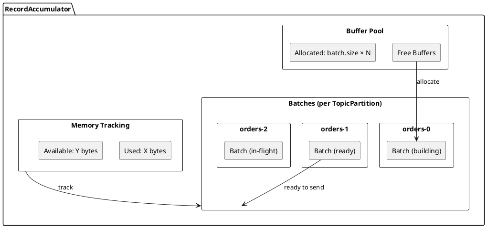
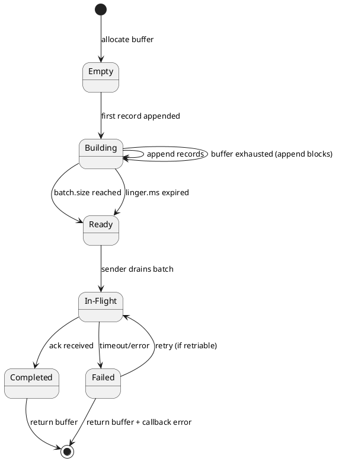
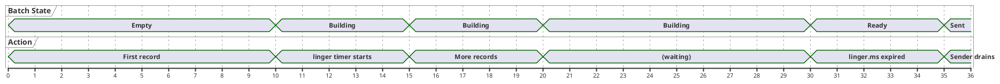
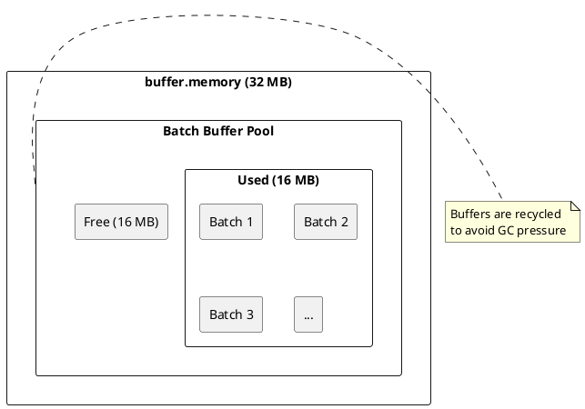
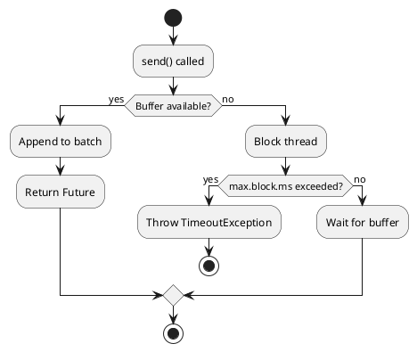
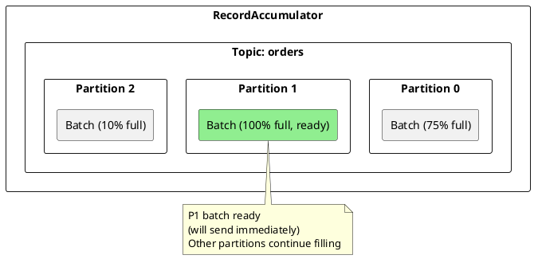
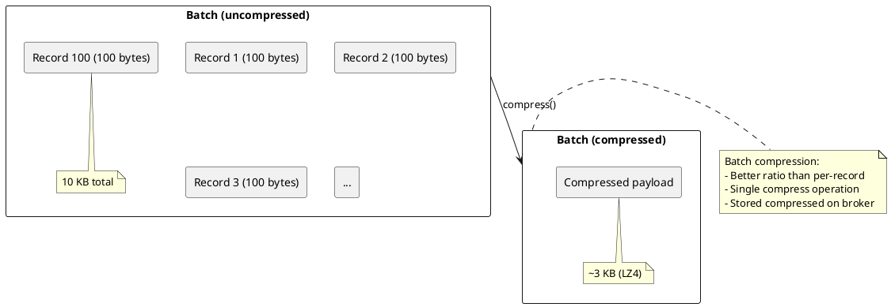
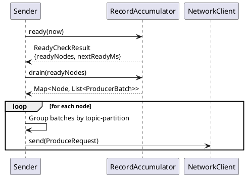

# Kafka Producer Batching

Kafka producers batch multiple messages together before sending to brokers, significantly improving throughput and efficiency. Understanding batching is essential for optimizing producer performance and balancing latency versus throughput trade-offs.

## Batching Overview



---

## Batching Benefits

### Efficiency Gains

| Aspect | Without Batching | With Batching |
|--------|-----------------|---------------|
| **Network requests** | 1 per message | 1 per batch |
| **Header overhead** | High (repeated headers) | Amortized |
| **Compression** | Per-message | Per-batch (better ratio) |
| **Broker I/O** | Many small writes | Fewer large writes |

### Throughput Impact



!!! note "Illustrative throughput"
    The throughput figures above are illustrative; actual results vary with message size, hardware, compression, and broker configuration.

---

## Record Accumulator

The `RecordAccumulator` is the internal component that manages message batching.

### Structure



### Batch Lifecycle



---

## Batch Configuration

### Core Settings

```properties
# Maximum batch size in bytes
batch.size=16384  # 16 KB (default)

# Time to wait for batch to fill
linger.ms=0  # No wait (default)

# Total memory for buffering
buffer.memory=33554432  # 32 MB (default)

# Maximum time to block on send() when buffer full
max.block.ms=60000  # 60 seconds (default)
```

### Configuration Trade-offs

| Setting | Low Value | High Value |
|---------|-----------|------------|
| `batch.size` | Lower latency, lower throughput | Higher throughput, more memory |
| `linger.ms` | Immediate send, small batches | Larger batches, added latency |
| `buffer.memory` | Less memory, more blocking | Higher throughput, more memory |

---

## Linger Time

### How linger.ms Works



### linger.ms Examples

| linger.ms | Behavior | Use Case |
|:---------:|----------|----------|
| 0 | Send immediately (default) | Latency-sensitive |
| 5 | Wait up to 5ms | Low-latency with some batching |
| 20 | Wait up to 20ms | Balanced throughput/latency |
| 100+ | Wait up to 100ms+ | Maximum throughput |

### Batch Triggers

A batch is sent when ANY condition is met:

1. **Batch full**: `batch.size` reached
2. **Linger expired**: `linger.ms` elapsed since first record
3. **Explicit flush**: `producer.flush()` called
4. **Close**: `producer.close()` called

When the buffer is exhausted, `send()` blocks until memory is freed; it does not force a batch to send.

---

## Memory Management

### Buffer Pool



### Memory Exhaustion



### Monitoring Memory

```java
// Get producer metrics
Map<MetricName, ? extends Metric> metrics = producer.metrics();

// Key metrics
// - buffer-total-bytes: Total buffer memory
// - buffer-available-bytes: Available buffer memory
// - bufferpool-wait-time: Time blocked waiting for buffer
```

---

## Per-Partition Batching

### Partition Isolation

Each partition has its own batch queue:



### Implications

| Behavior | Description |
|----------|-------------|
| **Independent batching** | Each partition fills independently |
| **Parallel sends** | Ready batches sent to different brokers in parallel |
| **Uneven filling** | Hot partitions batch faster |

---

## Batch Compression

### Compression at Batch Level



### Compression + Batching

```properties
# Enable compression for better efficiency
compression.type=lz4

# Larger batches compress better
batch.size=65536  # 64 KB

# Allow time for batch accumulation
linger.ms=20
```

---

## Request Building

### From Batches to Requests



### Produce Request Structure

```
ProduceRequest {
    transactional_id: string (nullable)
    acks: int16
    timeout_ms: int32
    topic_data: [{
        topic: string
        partition_data: [{
            partition: int32
            records: RecordBatch  // Compressed batch
        }]
    }]
}
```

---

## Performance Tuning

### High Throughput Configuration

```properties
# Large batches
batch.size=131072  # 128 KB

# Wait for batch to fill
linger.ms=50

# Plenty of buffer memory
buffer.memory=134217728  # 128 MB

# Compression for network efficiency
compression.type=lz4

# Multiple in-flight for pipelining
max.in.flight.requests.per.connection=5
```

### Low Latency Configuration

```properties
# Smaller batches
batch.size=16384  # 16 KB

# Minimal wait
linger.ms=0

# Standard buffer
buffer.memory=33554432  # 32 MB

# No compression (fastest)
compression.type=none

# Still use multiple in-flight
max.in.flight.requests.per.connection=5
```

### Balanced Configuration

```properties
# Moderate batch size
batch.size=32768  # 32 KB

# Small wait for accumulation
linger.ms=10

# Adequate buffer
buffer.memory=67108864  # 64 MB

# Light compression
compression.type=lz4

max.in.flight.requests.per.connection=5
```

---

## Batching Metrics

### Key Metrics

| Metric | Description | Target |
|--------|-------------|--------|
| `batch-size-avg` | Average batch size | Close to `batch.size` |
| `batch-size-max` | Maximum batch size | ≤ `batch.size` |
| `record-queue-time-avg` | Time in accumulator | Close to `linger.ms` |
| `records-per-request-avg` | Records per request | Higher = better batching |
| `bufferpool-wait-time` | Time waiting for buffer | Should be 0 |

### Diagnosing Poor Batching

| Symptom | Likely Cause | Solution |
|---------|--------------|----------|
| Small `batch-size-avg` | Too many partitions | Consolidate or increase `linger.ms` |
| Small `batch-size-avg` | Low message rate | Increase `linger.ms` |
| High `bufferpool-wait-time` | Buffer exhaustion | Increase `buffer.memory` |
| High `record-queue-time-avg` | Slow broker response | Check broker health |

---

## Async vs Sync Behavior

### Asynchronous (Default)

```java
// Non-blocking - returns immediately
Future<RecordMetadata> future = producer.send(record);

// Optional callback
producer.send(record, (metadata, exception) -> {
    if (exception != null) {
        handleError(exception);
    }
});
```

### Synchronous Pattern

```java
// Blocking - waits for broker ack
try {
    RecordMetadata metadata = producer.send(record).get();
} catch (ExecutionException e) {
    handleError(e.getCause());
}
```

!!! warning "Synchronous Impact"
    Synchronous sends defeat batching benefits. Each send waits for response before next send can proceed. Use async with callbacks for production.

### Flush Behavior

```java
// Send accumulated batches immediately
producer.flush();  // Blocks until all batches sent

// Flush before close
producer.flush();
producer.close();
```

---

## Version Compatibility

| Feature | Minimum Version |
|---------|-----------------|
| Record batching | 0.8.0 |
| Compression per batch | 0.8.0 |
| Sticky partitioner | 2.4.0 |
| Idempotent batching | 0.11.0 |
| Transactional batching | 0.11.0 |

---

## Related Documentation

- [Kafka Protocol](kafka-protocol.md) - Wire protocol and record format
- [Compression](compression.md) - Batch compression
- [Producer Guide](../../application-development/producers/index.md) - Full producer configuration
- [Performance Internals](../performance-internals/index.md) - Throughput optimization