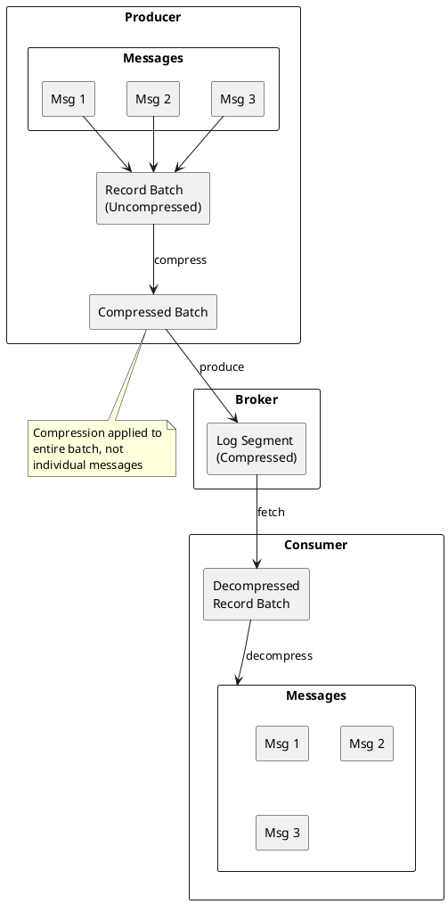
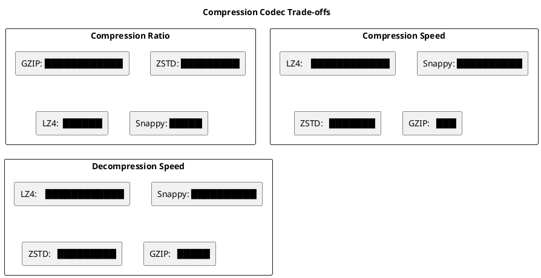
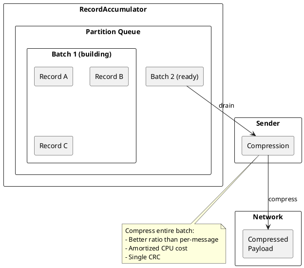
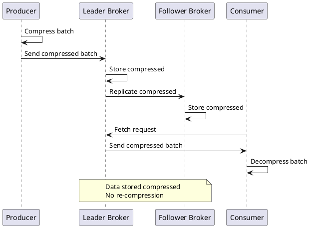
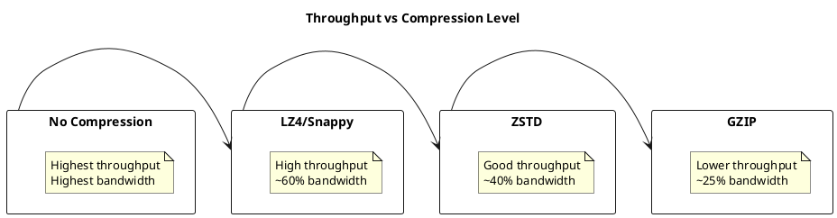
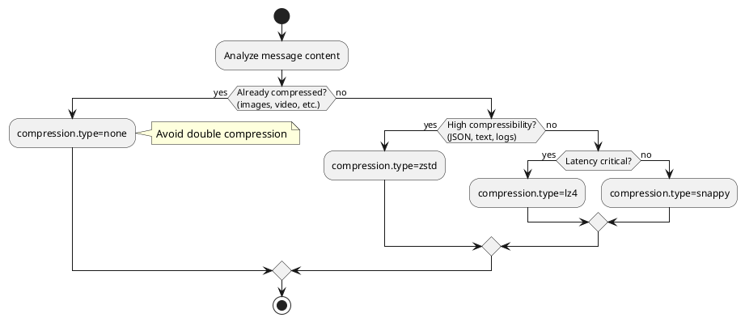

# Kafka Message Compression

Kafka supports message compression to reduce network bandwidth and storage requirements. Compression operates at the batch level, providing efficient encoding of multiple messages. This guide covers compression codecs, configuration, and performance trade-offs.

## Compression Overview



---

## Compression Codecs

### Available Codecs

| Codec | ID | CPU Cost | Ratio | Latency | Use Case |
|-------|:--:|:--------:|:-----:|:-------:|----------|
| None | 0 | None | 1:1 | Lowest | Low latency required |
| GZIP | 1 | High | 4-8:1 | Higher | Maximum compression |
| Snappy | 2 | Low | 2-3:1 | Low | Balanced default |
| LZ4 | 3 | Low | 2-4:1 | Lowest | High throughput |
| ZSTD | 4 | Medium | 3-6:1 | Medium | Best ratio/speed |

### Codec Comparison



---

## Configuration

### Producer Compression

```properties
# Enable compression
compression.type=lz4

# Batch settings affect compression efficiency
batch.size=65536
linger.ms=10
```

### Broker Compression

```properties
# Broker-level compression policy
compression.type=producer  # Use producer's codec (default)
# compression.type=lz4     # Force specific codec
# compression.type=uncompressed  # Decompress all

# Per-topic override
# kafka-configs.sh --alter --topic my-topic \
#   --add-config compression.type=zstd
```

### Consumer Decompression

Consumers automatically decompress messages. No configuration required:

```java
// Decompression is transparent to consumer
ConsumerRecords<String, String> records = consumer.poll(Duration.ofMillis(100));
for (ConsumerRecord<String, String> record : records) {
    // record.value() is already decompressed
    String value = record.value();
}
```

---

## Batch Compression

### How Batch Compression Works



### Batch Size Impact on Compression

Larger batches compress more efficiently:

| Batch Size | Compression Ratio (LZ4) | CPU per Message |
|------------|:----------------------:|:---------------:|
| 1 KB | 1.5:1 | High |
| 16 KB | 2.5:1 | Medium |
| 64 KB | 3.5:1 | Low |
| 256 KB | 4.0:1 | Very Low |

### Optimal Batch Configuration

```properties
# Larger batches = better compression
batch.size=131072  # 128 KB

# Allow time for batch accumulation
linger.ms=20

# Limit memory for batching
buffer.memory=67108864  # 64 MB
```

---

## Codec Details

### GZIP

Best compression ratio but highest CPU cost.

```properties
compression.type=gzip
```

**Characteristics:**

- Compression ratio: 4-8:1
- Algorithm: DEFLATE (LZ77 + Huffman)
- Java implementation: `java.util.zip.GZIPOutputStream`
- Best for: Archival, bandwidth-constrained networks

### Snappy

Fast compression with moderate ratio. Google-developed.

```properties
compression.type=snappy
```

**Characteristics:**

- Compression ratio: 2-3:1
- Algorithm: LZ77 variant
- Library: `org.xerial.snappy`
- Best for: General purpose, legacy compatibility

### LZ4

Fastest compression and decompression.

```properties
compression.type=lz4
```

**Characteristics:**

- Compression ratio: 2-4:1
- Algorithm: LZ77 variant optimized for speed
- Library: `net.jpountz.lz4`
- Best for: High-throughput, latency-sensitive

### ZSTD (Zstandard)

Best balance of ratio and speed. Facebook-developed.

```properties
compression.type=zstd
```

**Characteristics:**

- Compression ratio: 3-6:1
- Algorithm: FSE + Huffman + LZ77
- Library: `com.github.luben.zstd-jni`
- Available: Kafka 2.1.0+
- Best for: New deployments, optimal trade-off

**ZSTD Compression Levels (Kafka 2.4+):**

```properties
# ZSTD compression level (1-22, default 3)
# Higher = better ratio, more CPU
compression.zstd.level=3
```

| Level | Ratio | Speed | Use Case |
|:-----:|:-----:|:-----:|----------|
| 1 | Lower | Fastest | Real-time |
| 3 | Balanced | Fast | Default |
| 9 | Higher | Slower | Batch processing |
| 19+ | Highest | Slowest | Archival |

---

## End-to-End Compression

### Compression Flow



### Broker Compression Policy

| `compression.type` | Behavior |
|--------------------|----------|
| `producer` | Store as-is (default) |
| `uncompressed` | Decompress before storing |
| `gzip/snappy/lz4/zstd` | Re-compress with specified codec |

!!! warning "Re-compression Overhead"
    Setting broker `compression.type` to a different codec than producer causes re-compression, significantly increasing broker CPU usage.

---

## Performance Optimization

### Compression vs Throughput



### CPU Utilization

| Scenario | Producer CPU | Broker CPU | Consumer CPU |
|----------|:------------:|:----------:|:------------:|
| No compression | Low | Low | Low |
| LZ4 | +10-15% | 0% | +10-15% |
| ZSTD | +20-30% | 0% | +15-25% |
| GZIP | +50-100% | 0% | +30-50% |

### Network Bandwidth Savings

Example with JSON log data:

| Codec | Original Size | Compressed | Savings |
|-------|:-------------:|:----------:|:-------:|
| None | 100 MB | 100 MB | 0% |
| Snappy | 100 MB | 45 MB | 55% |
| LZ4 | 100 MB | 40 MB | 60% |
| ZSTD | 100 MB | 30 MB | 70% |
| GZIP | 100 MB | 25 MB | 75% |

---

## Data Type Considerations

### Compression Effectiveness by Data Type

| Data Type | Compressibility | Recommended Codec |
|-----------|:---------------:|-------------------|
| JSON | High | ZSTD or LZ4 |
| Avro | Medium-High | LZ4 or ZSTD |
| Protobuf | Medium | LZ4 |
| Already compressed (images, video) | Very Low | None |
| Random/encrypted data | None | None |

### Pre-Compressed Data



---

## Monitoring Compression

### Producer Metrics

| Metric | Description |
|--------|-------------|
| `compression-rate-avg` | Average compression ratio |
| `record-size-avg` | Average uncompressed record size |
| `batch-size-avg` | Average compressed batch size |
| `produce-throttle-time-avg` | Throttle time (may indicate CPU saturation) |

### Consumer Metrics

| Metric | Description |
|--------|-------------|
| `fetch-size-avg` | Average compressed fetch size |
| `records-consumed-rate` | Records per second (after decompression) |

### JMX Example

```bash
# Check compression ratio
kafka-run-class.sh kafka.tools.JmxTool \
    --jmx-url service:jmx:rmi:///jndi/rmi://localhost:9999/jmxrmi \
    --object-name kafka.producer:type=producer-metrics,client-id=* \
    --attributes compression-rate-avg
```

---

## Troubleshooting

### High CPU Usage

| Symptom | Cause | Solution |
|---------|-------|----------|
| Producer CPU spike | High compression level | Use LZ4 or lower ZSTD level |
| Consumer CPU spike | Decompression overhead | Scale consumers |
| Broker CPU spike | Re-compression | Set `compression.type=producer` |

### Poor Compression Ratio

| Symptom | Cause | Solution |
|---------|-------|----------|
| Ratio near 1:1 | Already compressed data | Disable compression |
| Ratio near 1:1 | Small batch size | Increase `batch.size` |
| Ratio near 1:1 | Random/encrypted data | Disable compression |

### Decompression Errors

```
org.apache.kafka.common.errors.CorruptRecordException:
    Record is corrupt (stored crc = X, computed crc = Y)
```

**Causes:**

- Network corruption
- Disk corruption
- Mismatched compression codec
- Bug in compression library

**Resolution:**

1. Check network health
2. Verify disk integrity
3. Ensure consistent codec across clients
4. Update Kafka client version

---

## Version Compatibility

| Feature | Minimum Version |
|---------|-----------------|
| GZIP, Snappy | 0.8.0 |
| LZ4 | 0.8.2 |
| ZSTD | 2.1.0 |
| ZSTD compression level | 2.4.0 |
| Broker-side compression | 0.10.0 |

---

## Best Practices

### General Recommendations

| Practice | Rationale |
|----------|-----------|
| Use ZSTD for new deployments | Best ratio/speed trade-off |
| Use LZ4 for latency-sensitive | Fastest compression |
| Increase batch size | Better compression efficiency |
| Match producer and broker codec | Avoid re-compression |
| Monitor compression metrics | Detect issues early |

### Configuration Template

```properties
# High-throughput, good compression
compression.type=lz4
batch.size=131072
linger.ms=10

# Maximum compression
compression.type=zstd
compression.zstd.level=6
batch.size=262144
linger.ms=50

# Minimum latency
compression.type=none
batch.size=16384
linger.ms=0
```

---

## Related Documentation

- [Kafka Protocol](kafka-protocol.md) - Compression in wire protocol
- [Batching](batching.md) - Batch configuration
- [Performance Internals](../performance-internals/index.md) - Throughput optimization
- [Producers](../../application-development/producers/index.md) - Producer configuration
