# Kafka Connection Pooling

Kafka clients maintain a pool of TCP connections to brokers, with sophisticated management for connection lifecycle, multiplexing, and failure recovery. Understanding connection pooling is essential for optimizing client performance and resource utilization.

## Connection Architecture

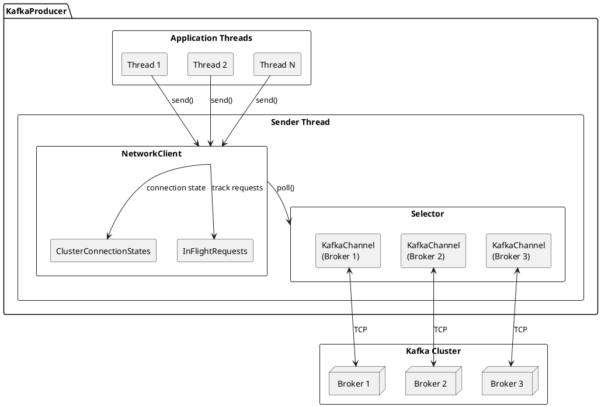

---

## Connection Model

### One Connection Per Broker

Kafka clients maintain exactly one TCP connection per broker they need to communicate with. This differs from connection pooling in databases:

| Aspect | Kafka | Traditional DB Pools |
|--------|-------|---------------------|
| **Connections per server** | 1 | Multiple |
| **Connection reuse** | Multiplexed | Sequential |
| **Request ordering** | Maintained | Not guaranteed |
| **Resource scaling** | Linear with brokers | Configurable |

### Connection Multiplexing

Multiple requests share a single connection through stream multiplexing:

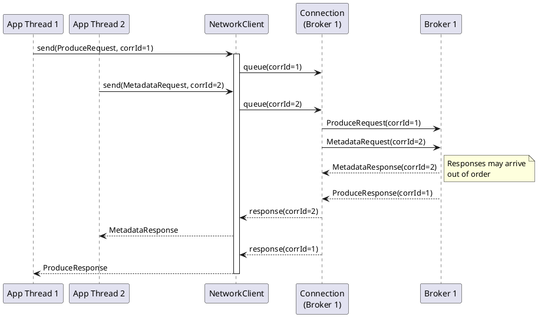

---

## NetworkClient Component

The `NetworkClient` is the core connection management component in Kafka clients.

### Responsibilities

| Function | Description |
|----------|-------------|
| **Connection Management** | Establish, maintain, and close connections |
| **Request Dispatch** | Route requests to appropriate broker connections |
| **Response Correlation** | Match responses to pending requests |
| **Metadata Management** | Track cluster topology changes |
| **Backpressure** | Limit in-flight requests per connection |

### Internal Structure

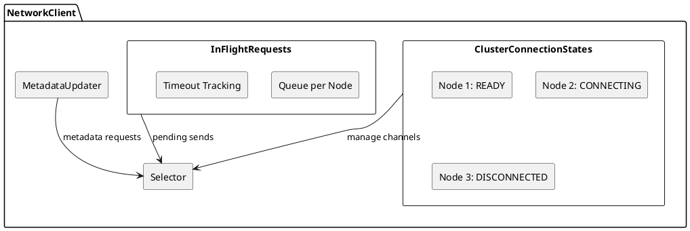

### Connection States

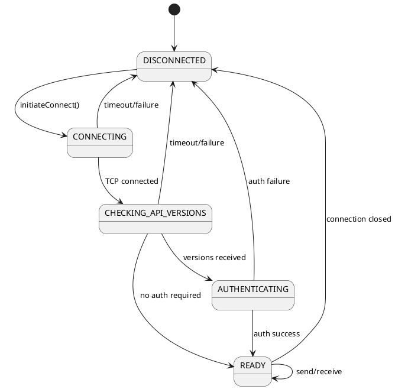

---

## Selector and KafkaChannel

### Java NIO Selector

Kafka uses Java NIO for non-blocking I/O:

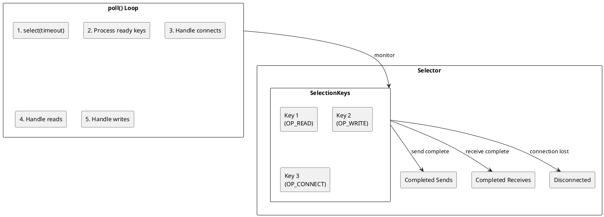

### KafkaChannel Structure

Each broker connection is wrapped in a `KafkaChannel`:

```java
// Conceptual KafkaChannel structure
public class KafkaChannel {
    private final String id;                    // Node ID
    private final TransportLayer transportLayer; // TCP/SSL
    private final Authenticator authenticator;   // SASL auth
    private final int maxReceiveSize;           // Max message size

    private NetworkReceive receive;             // Current incoming message
    private NetworkSend send;                   // Current outgoing message
    private ChannelState state;                 // Connection state

    // Buffered operations
    private final Deque<NetworkSend> sendQueue;
}
```

### Transport Layers

| Layer | Class | Protocol |
|-------|-------|----------|
| **Plaintext** | `PlaintextTransportLayer` | TCP |
| **SSL** | `SslTransportLayer` | TLS |
| **SASL Plaintext** | `SaslChannelBuilder` | TCP + SASL |
| **SASL SSL** | `SaslChannelBuilder` | TLS + SASL |

---

## Connection Configuration

### Connection Timing

| Configuration | Default | Description |
|--------------|---------|-------------|
| `reconnect.backoff.ms` | 50 | Initial reconnection backoff |
| `reconnect.backoff.max.ms` | 1000 | Maximum reconnection backoff |
| `socket.connection.setup.timeout.ms` | 10000 | TCP connection timeout |
| `socket.connection.setup.timeout.max.ms` | 30000 | Maximum connection timeout |
| `connections.max.idle.ms` | 540000 (9 min) | Close idle connections |

### Backoff Strategy

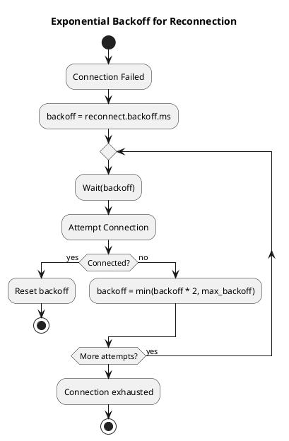

### Buffer Configuration

| Configuration | Default | Description |
|--------------|---------|-------------|
| `send.buffer.bytes` | 131072 (128KB) | TCP send buffer (SO_SNDBUF) |
| `receive.buffer.bytes` | 65536 (64KB) | TCP receive buffer (SO_RCVBUF) |
| `request.timeout.ms` | 30000 | Request completion timeout |

!!! tip "Buffer Sizing"
    For high-latency networks, increase buffer sizes to allow more data in flight. The bandwidth-delay product formula can guide sizing: `buffer_size = bandwidth × RTT`.

---

## In-Flight Request Management

### Request Tracking

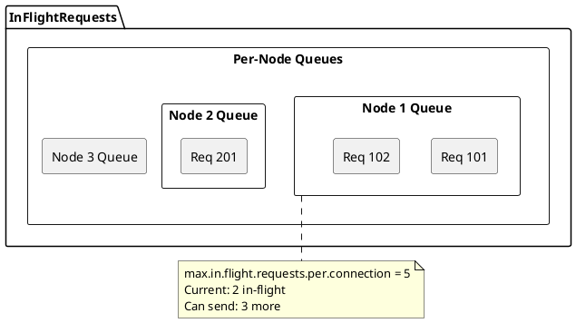

### Configuration

```properties
# Maximum concurrent requests per connection
max.in.flight.requests.per.connection=5

# For idempotent producers (ordering guaranteed)
max.in.flight.requests.per.connection=5
enable.idempotence=true

# For strict ordering without idempotence (legacy)
max.in.flight.requests.per.connection=1
```

### Ordering Guarantees

| Configuration | Ordering | Throughput |
|--------------|----------|------------|
| `max.in.flight=1` | Strict | Lower |
| `max.in.flight=5, idempotent=true` | Guaranteed | Higher |
| `max.in.flight=5, idempotent=false` | May reorder on retry | Highest |

---

## Connection Lifecycle

### Producer Connection Flow

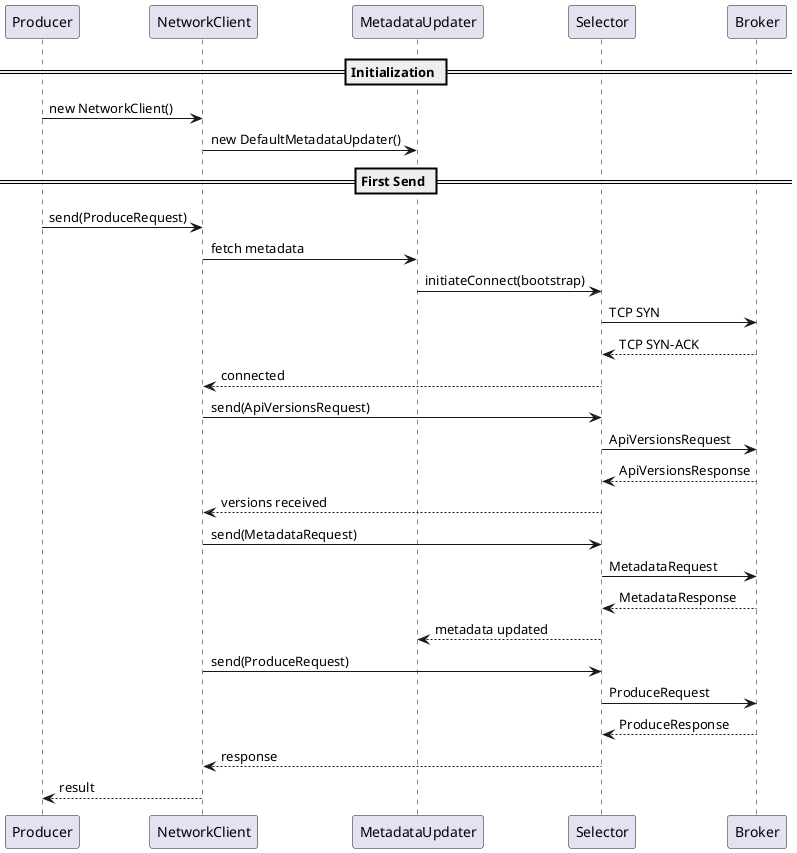

### Consumer Connection Flow

```plantuml
@startuml

skinparam backgroundColor transparent

participant "Consumer" as C
participant "ConsumerNetworkClient" as CNC
participant "Coordinator" as Coord
participant "Fetcher" as F
participant "Broker" as B
participant "Group Coordinator" as GC

== Group Join ==
C -> CNC : subscribe(topics)
CNC -> B : FindCoordinatorRequest
B --> CNC : coordinator = GC

CNC -> GC : JoinGroupRequest
GC --> CNC : JoinGroupResponse (leader/follower)

CNC -> GC : SyncGroupRequest
GC --> CNC : SyncGroupResponse (assignment)

== Steady State ==
loop poll()
    C -> CNC : poll()

    par Heartbeat
        CNC -> GC : HeartbeatRequest
        GC --> CNC : HeartbeatResponse
    and Fetch
        CNC -> F : fetch()
        F -> B : FetchRequest
        B --> F : FetchResponse
        F --> CNC : records
    end

    CNC --> C : ConsumerRecords
end

@enduml
```

---

## Connection Health Monitoring

### Health Check Mechanisms

| Mechanism | Frequency | Purpose |
|-----------|-----------|---------|
| **TCP Keepalive** | OS-dependent | Detect dead connections |
| **Heartbeat** | `heartbeat.interval.ms` | Consumer liveness |
| **Metadata Refresh** | `metadata.max.age.ms` | Topology freshness |
| **Request Timeout** | Per-request | Detect hung requests |

### Connection Metrics

| Metric | Description | Alert Threshold |
|--------|-------------|-----------------|
| `connection-count` | Active connections | Unexpected changes |
| `connection-creation-rate` | New connections/sec | > 10/min |
| `connection-close-rate` | Closed connections/sec | > 10/min |
| `failed-connection-rate` | Failed connections/sec | > 0 |
| `successful-authentication-rate` | Auth success/sec | < expected |
| `failed-authentication-rate` | Auth failures/sec | > 0 |

### Diagnosing Connection Issues

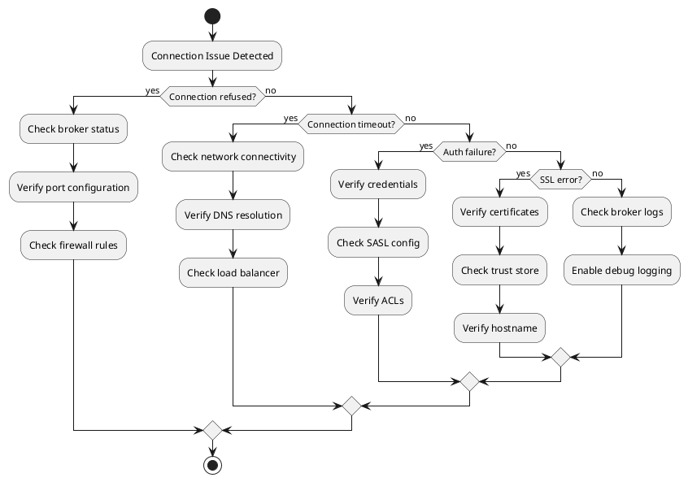

---

## Multi-Threaded Considerations

### Thread Safety

| Component | Thread Safe | Notes |
|-----------|:-----------:|-------|
| `KafkaProducer` | ✅ | Safe to share across threads |
| `KafkaConsumer` | ❌ | One consumer per thread |
| `NetworkClient` | ❌ | Used by single I/O thread |
| `Selector` | ❌ | Used by single I/O thread |

### Producer Threading Model

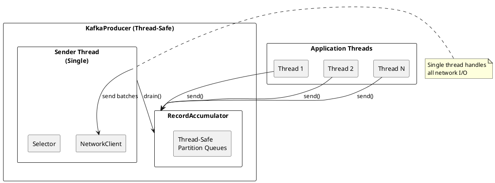

### Consumer Threading Model

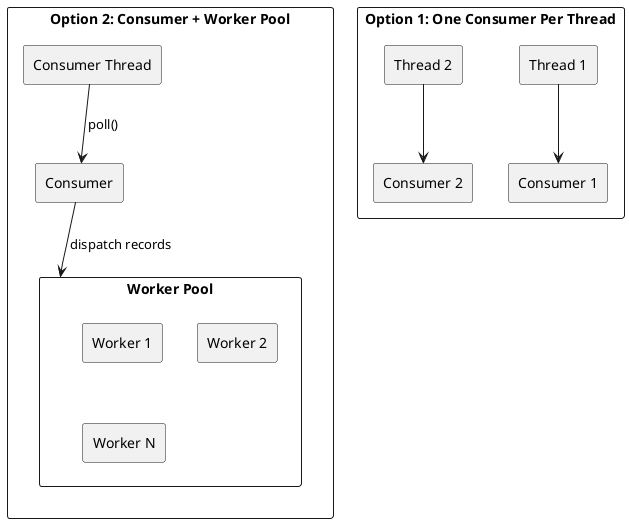

---

## Resource Management

### Connection Cleanup

```java
// Proper producer cleanup
try {
    producer.flush();  // Send pending records
    producer.close(Duration.ofSeconds(30));  // Graceful shutdown
} catch (Exception e) {
    producer.close(Duration.ZERO);  // Force close on error
}

// Proper consumer cleanup
try {
    consumer.commitSync();  // Commit final offsets
    consumer.close(Duration.ofSeconds(30));
} catch (WakeupException e) {
    // Expected on shutdown
} finally {
    consumer.close();
}
```

### File Descriptor Limits

Each connection consumes file descriptors:

| Resource | FDs per Connection | Typical Client |
|----------|-------------------|----------------|
| TCP Socket | 1 | - |
| SSL Context | 1-2 | If TLS enabled |
| Total per Broker | 1-3 | - |
| 10-Broker Cluster | 10-30 | Per client |

!!! warning "FD Limits"
    Monitor file descriptor usage with `lsof` or `/proc/<pid>/fd`. The default Linux limit of 1024 FDs per process may be insufficient for applications with many Kafka clients.

---

## Performance Optimization

### Connection Reuse

Maximize connection efficiency:

```properties
# Keep connections alive longer
connections.max.idle.ms=900000  # 15 minutes

# Increase in-flight for throughput
max.in.flight.requests.per.connection=5

# Larger buffers for high-bandwidth
send.buffer.bytes=262144
receive.buffer.bytes=262144
```

### Reducing Connection Churn

| Issue | Solution |
|-------|----------|
| Frequent reconnects | Increase `connections.max.idle.ms` |
| Auth failures | Verify credentials, check token expiry |
| Broker restarts | Implement graceful client handling |
| Load balancer timeouts | Configure LB to match idle timeout |

---

## Related Documentation

- [Kafka Protocol](kafka-protocol.md) - Wire protocol details
- [Authentication](authentication.md) - Security protocols
- [Metadata Management](metadata-management.md) - Cluster discovery
- [Failure Handling](failure-handling.md) - Error recovery
