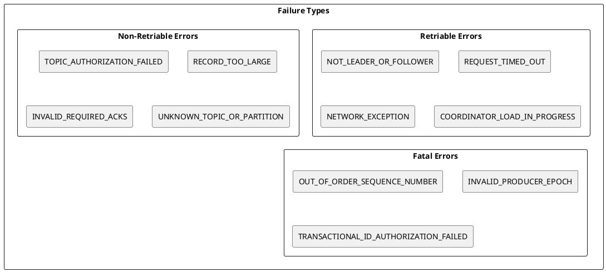
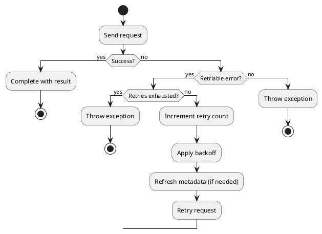
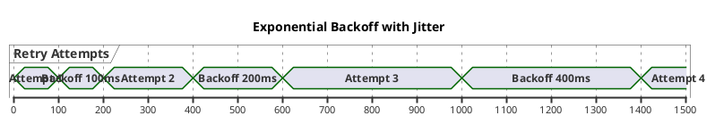
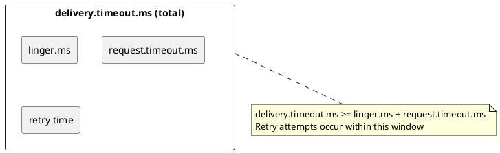
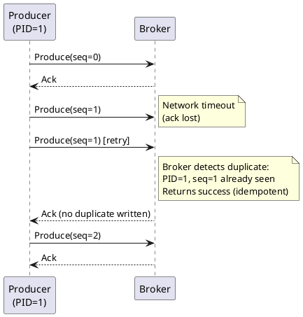
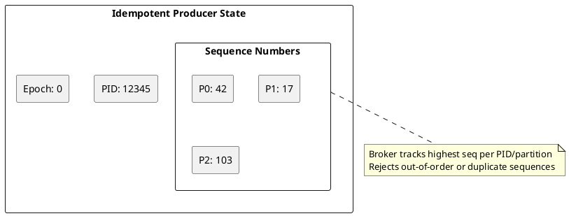
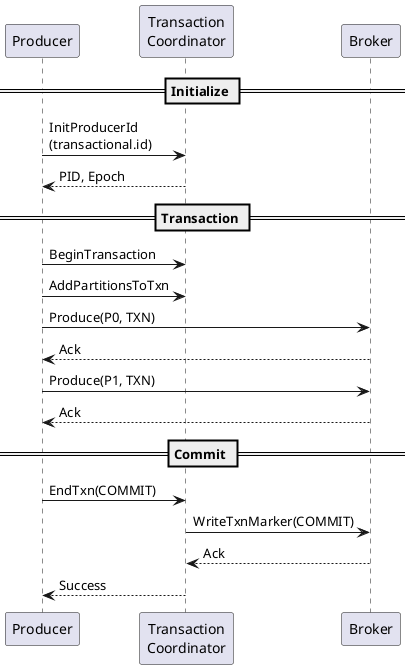
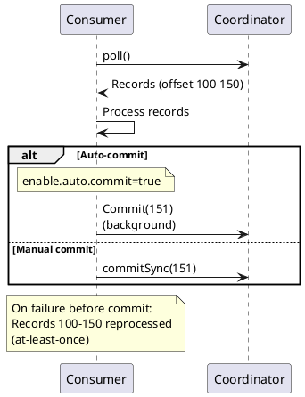
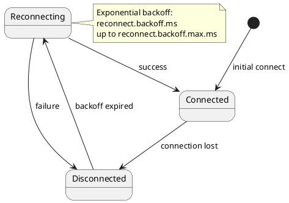
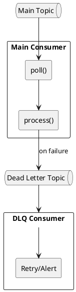

# Kafka Client Failure Handling

Kafka clients must handle various failure scenarios including network errors, broker failures, and timeout conditions. This guide covers retry mechanisms, idempotent producers, transactional semantics, and error recovery strategies.

## Failure Categories



---

## Error Classification

### Retriable Errors

| Error Code | Name | Cause | Client Action |
|:----------:|------|-------|---------------|
| 3 | `UNKNOWN_TOPIC_OR_PARTITION` | Topic missing or metadata stale | Refresh metadata; retry only if topic is expected to exist |
| 5 | `LEADER_NOT_AVAILABLE` | Election in progress | Wait and retry |
| 6 | `NOT_LEADER_OR_FOLLOWER` | Stale metadata | Refresh metadata, retry |
| 7 | `REQUEST_TIMED_OUT` | Broker too slow | Retry |
| 15 | `NETWORK_EXCEPTION` | Connection failed | Reconnect, retry |

### Non-Retriable Errors

| Error Code | Name | Cause | Client Action |
|:----------:|------|-------|---------------|
| 13 | `RECORD_TOO_LARGE` | Message > `max.message.bytes` | Reduce message size |
| 17 | `INVALID_REQUIRED_ACKS` | Invalid `acks` setting | Fix configuration |
| 29 | `TOPIC_AUTHORIZATION_FAILED` | No permission | Check ACLs |
| 74 | `INVALID_TXN_STATE` | Transaction state error | Abort transaction |

---

## Retry Mechanism

### Retry Flow



### Retry Configuration

```properties
# Number of retries
retries=2147483647  # Max int (default, Kafka 2.1+)

# Backoff between retries
retry.backoff.ms=100  # 100ms (default)

# Maximum retry backoff (Kafka 2.6+)
retry.backoff.max.ms=1000  # 1 second

# Total time for retries
delivery.timeout.ms=120000  # 2 minutes (default)
```

### Backoff Strategy



---

## Delivery Timeout

### Timeout Relationship



### Configuration

```properties
# Total delivery time budget
delivery.timeout.ms=120000  # 2 minutes

# Time for batch accumulation
linger.ms=10

# Time for single request
request.timeout.ms=30000  # 30 seconds

# Retries happen within delivery.timeout.ms
retries=2147483647
```

---

## Idempotent Producer

Idempotent producers enable exactly-once semantics within a single partition, preventing duplicate messages from retries.

### How Idempotence Works



### Configuration

```properties
# Enable idempotence
enable.idempotence=true

# Required settings (set automatically when idempotence enabled)
acks=all
retries=2147483647
max.in.flight.requests.per.connection=5  # or less
```

### Producer ID (PID) and Sequence Numbers

| Component | Description |
|-----------|-------------|
| **Producer ID (PID)** | Unique ID assigned by broker |
| **Epoch** | Increments on producer restart |
| **Sequence Number** | Per-partition, monotonically increasing |



---

## Transactional Producer

Transactions enable exactly-once semantics across multiple partitions and consumer groups.

### Transaction Flow



### Configuration

```properties
# Required for transactions
transactional.id=my-transactional-producer

# Automatically enabled with transactional.id
enable.idempotence=true
acks=all

# Transaction timeout
transaction.timeout.ms=60000  # 1 minute
```

### Transaction API

```java
producer.initTransactions();

try {
    producer.beginTransaction();

    producer.send(new ProducerRecord<>("orders", key, value));
    producer.send(new ProducerRecord<>("inventory", key, update));

    // Send consumer offsets as part of transaction
    producer.sendOffsetsToTransaction(offsets, consumerGroupId);

    producer.commitTransaction();
} catch (ProducerFencedException | OutOfOrderSequenceException e) {
    // Fatal - close producer
    producer.close();
} catch (KafkaException e) {
    // Abort and retry
    producer.abortTransaction();
}
```

### Transaction Isolation

| Setting | Consumer Behavior |
|---------|------------------|
| `isolation.level=read_uncommitted` | Sees all messages (including uncommitted) |
| `isolation.level=read_committed` | Only sees committed messages |

---

## Consumer Failure Handling

### Offset Management



### Rebalance Handling

```java
consumer.subscribe(topics, new ConsumerRebalanceListener() {
    @Override
    public void onPartitionsRevoked(Collection<TopicPartition> partitions) {
        // Commit pending offsets before losing partitions
        try {
            consumer.commitSync(currentOffsets);
        } catch (CommitFailedException e) {
            log.warn("Commit failed on revoke", e);
        }
    }

    @Override
    public void onPartitionsAssigned(Collection<TopicPartition> partitions) {
        // Initialize state for new partitions
        for (TopicPartition partition : partitions) {
            initializePartitionState(partition);
        }
    }
});
```

### Consumer Failure Scenarios

| Scenario | Impact | Mitigation |
|----------|--------|------------|
| Consumer crash | Uncommitted messages reprocessed | Idempotent processing |
| Long processing | Rebalance triggered | Increase `max.poll.interval.ms` |
| Commit failure | Duplicate processing | Retry commit |
| Deserialization error | Poison pill | Dead letter queue |

---

## Connection Failure Recovery

### Automatic Reconnection



### Configuration

```properties
# Initial reconnection backoff
reconnect.backoff.ms=50

# Maximum reconnection backoff
reconnect.backoff.max.ms=1000

# Connection timeout
socket.connection.setup.timeout.ms=10000
socket.connection.setup.timeout.max.ms=30000
```

---

## Error Handling Patterns

### Producer Error Handling

```java
producer.send(record, (metadata, exception) -> {
    if (exception == null) {
        // Success
        log.info("Sent to partition {} offset {}",
            metadata.partition(), metadata.offset());
    } else if (exception instanceof RetriableException) {
        // Retriable - will be retried automatically
        log.warn("Retriable error, will retry: {}", exception.getMessage());
    } else {
        // Non-retriable - handle or dead-letter
        log.error("Non-retriable error: {}", exception.getMessage());
        sendToDeadLetter(record, exception);
    }
});
```

### Consumer Error Handling

```java
while (running) {
    try {
        ConsumerRecords<String, String> records = consumer.poll(Duration.ofMillis(100));

        for (ConsumerRecord<String, String> record : records) {
            try {
                processRecord(record);
            } catch (ProcessingException e) {
                // Send to dead letter queue
                sendToDeadLetter(record, e);
            }
        }

        consumer.commitSync();

    } catch (WakeupException e) {
        // Shutdown signal
        if (running) throw e;
    } catch (CommitFailedException e) {
        // Rebalance during commit - records will be redelivered
        log.warn("Commit failed due to rebalance", e);
    }
}
```

### Dead Letter Queue Pattern



---

## Delivery Guarantees

### Producer Guarantees

| Configuration | Guarantee | Duplicates | Loss |
|--------------|-----------|:----------:|:----:|
| `acks=0` | Fire and forget | Possible | Possible |
| `acks=1` | Leader ack | Possible | Possible |
| `acks=all` | Full ISR ack | Possible | No* |
| `acks=all` + idempotence | Exactly-once (partition) | No | No |
| Transactions | Exactly-once (cross-partition) | No | No |

*With `min.insync.replicas` configured

### Consumer Guarantees

| Pattern | Guarantee | Duplicates | Loss |
|---------|-----------|:----------:|:----:|
| Auto-commit | Not guaranteed (can be at-most-once) | Possible | Possible |
| Commit before process | At-most-once | No | Possible |
| Commit after process | At-least-once | Possible | No |
| Transactional | Exactly-once | No | No |

---

## Metrics for Failure Monitoring

### Producer Metrics

| Metric | Description | Alert Condition |
|--------|-------------|-----------------|
| `record-error-rate` | Errors per second | > 0 sustained |
| `record-retry-rate` | Retries per second | Unusually high |
| `record-send-rate` | Successful sends | Drop from baseline |
| `request-latency-avg` | Request latency | > threshold |

### Consumer Metrics

| Metric | Description | Alert Condition |
|--------|-------------|-----------------|
| `failed-rebalance-rate` | Failed rebalances | > 0 |
| `last-poll-seconds-ago` | Time since poll | > max.poll.interval.ms |
| `commit-latency-avg` | Commit latency | > threshold |
| `records-lag` | Consumer lag | Increasing |

---

## Best Practices

### Producer Best Practices

| Practice | Rationale |
|----------|-----------|
| Enable idempotence | Prevent duplicates from retries |
| Set reasonable `delivery.timeout.ms` | Bound total retry time |
| Use callbacks for error handling | Non-blocking error handling |
| Implement dead letter queue | Handle persistent failures |

### Consumer Best Practices

| Practice | Rationale |
|----------|-----------|
| Commit after processing | At-least-once guarantee |
| Implement idempotent processing | Handle duplicates |
| Use `read_committed` with transactions | See only committed data |
| Handle rebalance callbacks | Clean state management |

---

## Version Compatibility

| Feature | Minimum Version |
|---------|-----------------|
| Basic retries | 0.8.0 |
| Idempotent producer | 0.11.0 |
| Transactions | 0.11.0 |
| `delivery.timeout.ms` | 2.1.0 |
| Cooperative rebalancing | 2.4.0 |

---

## Related Documentation

- [Kafka Protocol](kafka-protocol.md) - Error codes
- [Delivery Semantics](../../concepts/delivery-semantics/index.md) - Guarantees
- [Producer Guide](../../application-development/producers/index.md) - Producer configuration
- [Consumer Guide](../../application-development/consumers/index.md) - Consumer configuration