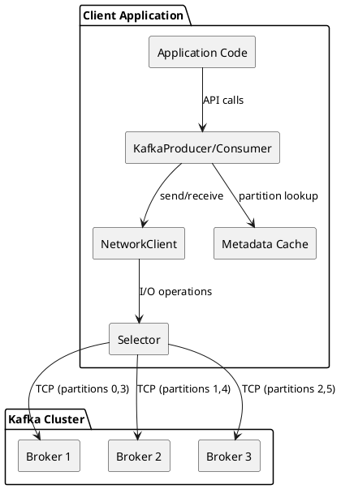
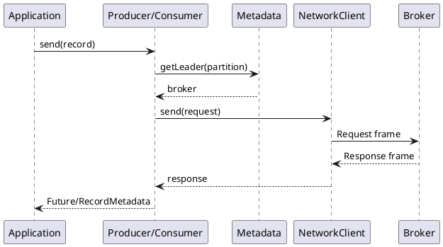

# Client Connection Architecture

Kafka clients communicate with brokers through a custom binary protocol over TCP. Unlike traditional databases where a load balancer routes requests, Kafka clients are topology-aware and route requests directly to the appropriate broker based on partition leadership. Understanding this architecture is essential for building performant applications and diagnosing connection-related issues.

## Architecture Overview



## Connection Model

Kafka clients maintain persistent TCP connections to brokers. This connection model provides:

- **Direct routing** - Clients connect directly to partition leaders
- **Multiplexing** - Multiple concurrent requests per connection
- **Automatic failover** - Transparent reconnection on broker failures
- **Topology awareness** - Routing based on partition leadership

### Connection Lifecycle

```
1. Bootstrap
   └── Client connects to bootstrap.servers
       └── Fetches cluster metadata
           └── Discovers all brokers and partition leaders

2. Steady State
   └── Maintains one connection per broker needed
       └── Refreshes metadata periodically
           └── Routes requests to partition leaders

3. Failure Handling
   └── Detects connection failures
       └── Refreshes metadata for new leaders
           └── Retries requests per retry policy
               └── Reconnects with exponential backoff
```

## Key Components

| Component | Purpose | Documentation |
|-----------|---------|---------------|
| Kafka Protocol | Binary wire protocol for client-server communication | [Kafka Protocol](kafka-protocol.md) |
| Connection Pooling | Manages TCP connections to brokers | [Connection Pooling](connection-pooling.md) |
| Authentication | Verifies client identity (SASL, mTLS) | [Authentication](authentication.md) |
| Metadata Management | Tracks cluster topology and partition leaders | [Metadata Management](metadata-management.md) |
| Load Balancing | Routes requests based on partitioning | [Load Balancing](load-balancing.md) |
| Batching | Accumulates messages for efficient transmission | [Batching](batching.md) |
| Compression | Reduces network bandwidth at batch level | [Compression](compression.md) |
| Failure Handling | Retries, idempotence, and transactions | [Failure Handling](failure-handling.md) |
| Throttling | Quotas and rate limiting | [Throttling](throttling.md) |

---

## Request Flow

A typical request flows through several layers before reaching the broker:



### Request Processing Steps

1. **Request Submission** - Application calls producer send() or consumer poll()
2. **Partition Determination** - Producer calculates partition from key or uses partitioner
3. **Leader Lookup** - Client looks up partition leader from metadata cache
4. **Request Encoding** - Request is encoded into binary protocol frame
5. **Batching** (Producer) - Messages are accumulated into batches
6. **Network Transmission** - Frame sent over TCP with optional compression
7. **Response Handling** - Response decoded and returned to application

---

## Protocol Characteristics

The Kafka protocol has several important characteristics:

### Binary and Length-Prefixed

The protocol uses a compact binary format with a 4-byte length prefix:

- Efficient serialization/deserialization
- Zero-copy buffer management
- Predictable memory allocation

### Asynchronous and Multiplexed

Multiple requests can be in flight simultaneously on a single connection:

- Each request tagged with correlation ID
- Responses can arrive out of order
- Maximizes connection utilization

### Version Negotiated

API versions are negotiated per-request:

- Backward compatibility with older servers
- Access to newer features when available
- Graceful feature degradation

---

## Connection Configuration

!!! warning "Bootstrap Servers Required"
    The `bootstrap.servers` configuration is required. Include at least 3 brokers for redundancy during broker failures or maintenance.

### Essential Parameters

| Parameter | Description | Typical Value |
|-----------|-------------|---------------|
| `bootstrap.servers` | Initial brokers for discovery | 3+ brokers |
| `client.id` | Client identifier for logging | Meaningful name |
| `request.timeout.ms` | Request completion timeout | 30000 |
| `connections.max.idle.ms` | Close idle connections | 540000 (9 min) |

### Connection Timing

| Parameter | Description | Default |
|-----------|-------------|---------|
| `reconnect.backoff.ms` | Initial reconnection backoff | 50 |
| `reconnect.backoff.max.ms` | Maximum reconnection backoff | 1000 |
| `socket.connection.setup.timeout.ms` | TCP connection timeout | 10000 |

### Buffer Configuration

| Parameter | Description | Default |
|-----------|-------------|---------|
| `send.buffer.bytes` | TCP send buffer size | 131072 (128KB) |
| `receive.buffer.bytes` | TCP receive buffer size | 65536 (64KB) |
| `max.in.flight.requests.per.connection` | Concurrent requests per broker | 5 |

---

## Topology Awareness

Kafka clients maintain awareness of cluster topology through metadata management.

### Metadata Contents

- **Cluster ID** - Unique cluster identifier
- **Brokers** - All broker addresses, IDs, and racks
- **Topics** - Topic names and partition counts
- **Partition Leaders** - Current leader broker for each partition
- **ISR** - In-sync replicas for durability guarantees

### Metadata Refresh

Metadata is refreshed:

- On initial connection
- When `metadata.max.age.ms` expires (default 5 minutes)
- On `NOT_LEADER_OR_FOLLOWER` errors
- On `UNKNOWN_TOPIC_OR_PARTITION` errors
- When accessing a new topic

!!! note "Metadata Refresh on Errors"
    When a client receives a `NOT_LEADER_OR_FOLLOWER` error, it automatically refreshes metadata to discover the new partition leader before retrying the request.

---

## Performance Considerations

### Connection Efficiency

Each TCP connection has overhead:

- Memory for send/receive buffers
- File descriptors on client and broker
- TCP keepalive traffic

Kafka minimizes connections by:

- Using one connection per broker (not per partition)
- Multiplexing requests on each connection
- Maintaining connections only to needed brokers

### Latency Components

| Component | Typical Range | Optimization |
|-----------|---------------|--------------|
| Metadata lookup | < 1 μs | Cache partition info |
| Batch accumulation | 0-`linger.ms` | Tune linger.ms |
| Network RTT | 0.1-2 ms (same DC) | Co-locate clients |
| Broker processing | 1-50 ms | Tune broker resources |
| Serialization | 1-100 μs | Use efficient serializers |

### Throughput Factors

Maximum throughput depends on:

- Batch size and linger time
- Number of partitions (parallelism)
- Compression efficiency
- Network bandwidth
- Broker disk I/O capacity

---

## Documentation Structure

### Protocol Details

- **[Kafka Protocol](kafka-protocol.md)** - Wire protocol, frame format, API keys, versioning

### Connection Management

- **[Connection Pooling](connection-pooling.md)** - NetworkClient, Selector, connection lifecycle
- **[Metadata Management](metadata-management.md)** - Cluster discovery, leader tracking, refresh

### Data Transfer

- **[Batching](batching.md)** - Record accumulator, batch configuration, memory management
- **[Compression](compression.md)** - Codecs (GZIP, Snappy, LZ4, ZSTD), batch compression

### Routing and Load

- **[Load Balancing](load-balancing.md)** - Partitioning strategies, consumer assignment, rack awareness

### Security

- **[Authentication](authentication.md)** - SASL (PLAIN, SCRAM, GSSAPI, OAUTHBEARER), mTLS

### Reliability

- **[Failure Handling](failure-handling.md)** - Retries, idempotence, transactions, error recovery
- **[Throttling](throttling.md)** - Quotas, rate limiting, backpressure

---

## Version Compatibility

| Feature | Minimum Kafka Version |
|---------|----------------------|
| Basic protocol | 0.8.0 |
| SASL authentication | 0.9.0 |
| Idempotent producer | 0.11.0 |
| Transactions | 0.11.0 |
| Flexible protocol versions | 2.4.0 |
| KRaft mode | 3.3.0 |

---

## Next Steps

- **[Kafka Protocol](kafka-protocol.md)** - Deep dive into the wire protocol
- **[Connection Pooling](connection-pooling.md)** - Understanding connection management
- **[Metadata Management](metadata-management.md)** - How clients discover the cluster
- **[Failure Handling](failure-handling.md)** - Building reliable applications
