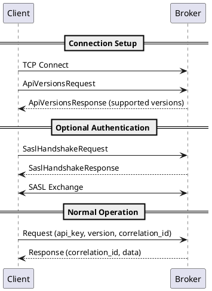
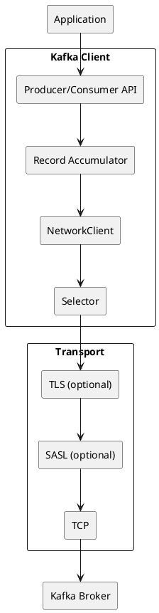

# Kafka Wire Protocol Specification

This documentation provides a comprehensive specification of the Apache Kafka binary wire protocol. The protocol defines how clients communicate with brokers over TCP connections using a request-response model with explicit versioning.

---

## Specification Scope

This specification covers Kafka protocol versions for Kafka 2.8 through 4.1. For the authoritative grammar reference and exhaustive API schemas, the [Apache Kafka Protocol Documentation](https://kafka.apache.org/protocol) provides additional detail. This documentation provides:

- Behavioral contracts and guarantees
- Failure semantics and error handling
- Implementation guidance and constraints
- Version-specific behavioral differences
- Complete error code reference with recovery actions

---

## Protocol Documentation

### Core Specifications

| Document | Description |
|----------|-------------|
| [Protocol Primitives](protocol-primitives.md) | Data types: integers, varints, strings, bytes, arrays, tagged fields |
| [Protocol Messages](protocol-messages.md) | Message framing, request/response headers, correlation IDs |
| [Protocol Records](protocol-records.md) | Record batch format, compression, timestamps, transactions |
| [Protocol Errors](protocol-errors.md) | Complete error code reference (count varies by version) |

### API References

| Document | APIs Covered |
|----------|--------------|
| [Core APIs](protocol-apis-core.md) | Produce, Fetch, Metadata, ListOffsets, ApiVersions |
| [Consumer APIs](protocol-apis-consumer.md) | FindCoordinator, JoinGroup, Heartbeat, SyncGroup, OffsetCommit |
| [Admin APIs](protocol-apis-admin.md) | CreateTopics, DeleteTopics, ACLs, Configs, ElectLeaders |
| [Transaction APIs](protocol-apis-transaction.md) | InitProducerId, AddPartitionsToTxn, EndTxn, TxnOffsetCommit |

---

## Protocol Overview

### Design Principles

The Kafka protocol is a binary, request-response protocol with the following characteristics:

| Principle | Description |
|-----------|-------------|
| **Binary encoding** | All messages use binary encoding for efficiency |
| **Length-prefixed** | Messages are prefixed with a 4-byte size field |
| **Explicit versioning** | Each API request specifies its version |
| **Correlation-based** | Requests and responses matched by correlation ID |
| **Multiplexed** | Multiple requests may be in-flight per connection |

### Message Flow

### Behavioral Contract

!!! note "Request Processing Guarantee"
    Brokers process requests from a single connection in the order received and return responses in the same order. The broker processes one in-flight request per connection; clients may still pipeline requests in the TCP buffer.

---

## Protocol Layers

### Layer Architecture

| Layer | Responsibility |
|-------|----------------|
| **Application** | Business logic, data serialization |
| **Client API** | Producer/Consumer abstractions |
| **NetworkClient** | Connection management, request dispatch |
| **Selector** | Non-blocking I/O, channel management |
| **Transport** | TCP, TLS encryption, SASL authentication |

---

## API Key Summary

### All Protocol APIs

| Key | Name | Category | Description |
|:---:|------|----------|-------------|
| 0 | Produce | Core | Send records to partitions |
| 1 | Fetch | Core | Retrieve records from partitions |
| 2 | ListOffsets | Core | Query offset by timestamp |
| 3 | Metadata | Core | Discover cluster topology |
| 4-7 | Controller APIs | Internal | Broker coordination |
| 8-9 | OffsetCommit/Fetch | Consumer | Offset management |
| 10-16 | Group APIs | Consumer | Consumer group protocol |
| 17-18 | ApiVersions/SASL | Core | Version negotiation, auth |
| 19-21 | Topic Management | Admin | Create, delete, modify topics |
| 22-28 | Transaction APIs | Transaction | Exactly-once semantics |
| 29-31 | ACL APIs | Admin | Authorization management |
| 32-51 | Config/Admin | Admin | Cluster administration |
| 52+ | KRaft/Advanced | Internal | KRaft consensus, features (range evolves by version) |

See individual API documentation for complete details.

---

## Version Compatibility

### Client/Broker Forward Compatibility (Kafka 4.0+ brokers)

| Client Version | Compatibility | Notes |
|---------------|:-------------:|-------|
| 0.x, 1.x, 2.0 | ❌ Not compatible | Pre-0.10 protocols removed in Kafka 4.0 (KIP-896) |
| 2.1 - 2.8 | ⚠️ Partially compatible | See Kafka 4.0 upgrade notes for client-specific limitations |
| 3.x | ✅ Fully compatible | No protocol-level limitations |

### Flexible Versions

Kafka 2.4 introduced "flexible versions" (KIP-482):

| Feature | Non-Flexible | Flexible |
|---------|--------------|----------|
| Strings | STRING (INT16 length) | COMPACT_STRING (VARINT) |
| Arrays | ARRAY (INT32 count) | COMPACT_ARRAY (VARINT) |
| Tagged fields | ❌ | ✅ |
| Forward compatibility | Limited | Improved |

---

## Implementation Requirements

### Client Requirements

| Requirement | Level | Reference |
|-------------|-------|-----------|
| Negotiate API versions before requests | should | [Protocol Messages](protocol-messages.md) |
| Track correlation IDs for response matching | must | [Protocol Messages](protocol-messages.md) |
| Handle all error codes appropriately | must | [Protocol Errors](protocol-errors.md) |
| Refresh metadata on leader change errors | should | [Core APIs](protocol-apis-core.md) |
| Use exponential backoff on retries | should | [Protocol Errors](protocol-errors.md) |
| Ignore unknown tagged fields | must | [Protocol Primitives](protocol-primitives.md) |

!!! note "ApiVersions"
    Legacy clients may skip ApiVersions; brokers still support older request versions where available.

### Broker Requirements

| Requirement | Level | Reference |
|-------------|-------|-----------|
| Process requests in order per connection | must | [Protocol Messages](protocol-messages.md) |
| Echo correlation ID exactly in response | must | [Protocol Messages](protocol-messages.md) |
| Support advertised API version ranges | must | [Core APIs](protocol-apis-core.md) |
| Respond to ApiVersions pre-authentication | must | [Core APIs](protocol-apis-core.md) |

---

## Quick Reference

### Common Error Codes

| Code | Name | Retriable | Action |
|:----:|------|:---------:|--------|
| 0 | NONE | N/A | Success |
| 6 | NOT_LEADER_OR_FOLLOWER | ✅ | Refresh metadata |
| 7 | REQUEST_TIMED_OUT | ✅ | Retry with backoff |
| 25 | UNKNOWN_MEMBER_ID | ❌ | Rejoin group |
| 27 | REBALANCE_IN_PROGRESS | ✅ | Rejoin group |
| 47 | INVALID_PRODUCER_EPOCH | ❌ | Close producer |

See [Protocol Errors](protocol-errors.md) for complete reference.

### Key Configurations

| Setting | Default | Purpose |
|---------|:-------:|---------|
| `request.timeout.ms` | 30000 | Request timeout |
| `retry.backoff.ms` | 100 | Retry backoff |
| `metadata.max.age.ms` | 300000 | Metadata refresh interval |
| `max.in.flight.requests.per.connection` | 5 | Request pipelining |

---

## Related Documentation

### Protocol Specifications

- [Protocol Primitives](protocol-primitives.md) - Data type encodings
- [Protocol Messages](protocol-messages.md) - Message framing
- [Protocol Records](protocol-records.md) - Record batch format
- [Protocol Errors](protocol-errors.md) - Error code reference

### API References

- [Core APIs](protocol-apis-core.md) - Produce, Fetch, Metadata
- [Consumer APIs](protocol-apis-consumer.md) - Consumer groups
- [Admin APIs](protocol-apis-admin.md) - Administration
- [Transaction APIs](protocol-apis-transaction.md) - Transactions

### Client Architecture

- [Connection Pooling](connection-pooling.md) - Connection management
- [Authentication](authentication.md) - SASL and TLS
- [Failure Handling](failure-handling.md) - Error recovery
- [Compression](compression.md) - Compression codecs