# Kafka Client Load Balancing

Unlike traditional databases where a load balancer routes requests, Kafka clients perform their own load balancing. The client determines which broker to contact based on partition ownership. This guide covers partition-based routing, producer partitioning strategies, and consumer load distribution.

## Load Balancing Model

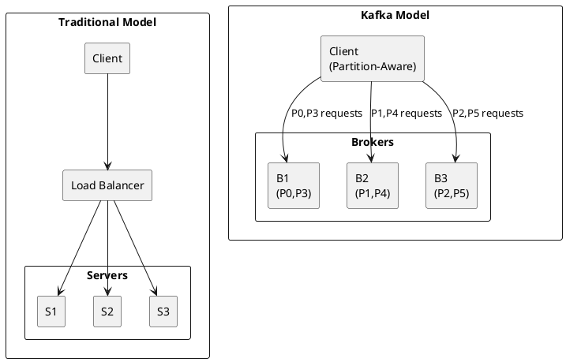

---

## Producer Load Balancing

### Partitioner Role

Producers distribute messages across partitions using a partitioner. This determines which broker receives each message.

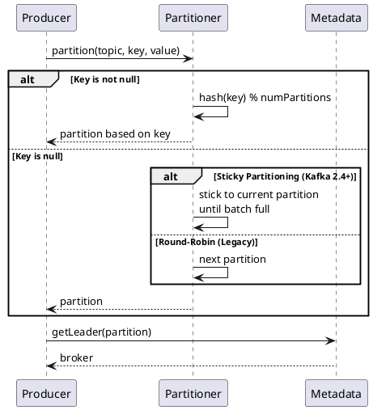

### Partitioning Strategies

| Strategy | When Used | Distribution | Ordering |
|----------|-----------|--------------|----------|
| **Key-based** | Key provided | By key hash | Per-key ordering |
| **Sticky** | No key (Kafka 2.4+) | Batch-based | None |
| **Round-robin** | No key (legacy) | Even | None |
| **Custom** | Custom partitioner | User-defined | User-defined |

### Key-Based Partitioning

```java
// Messages with same key go to same partition
producer.send(new ProducerRecord<>("orders", "customer-123", orderJson));
producer.send(new ProducerRecord<>("orders", "customer-123", anotherOrder));
// Both go to same partition → ordering guaranteed for customer-123
```

**Hash Function:**

```java
// Default partitioner (murmur2)
partition = Utils.toPositive(Utils.murmur2(keyBytes)) % numPartitions;
```

!!! warning "Key Distribution"
    Poorly distributed keys cause hot partitions. Avoid using boolean values, enum values with few options, or timestamps as keys.

### Sticky Partitioning (Kafka 2.4+)

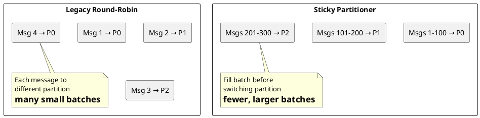

**Benefits of sticky partitioning:**

- Larger batches → better compression
- Fewer requests → lower overhead
- Higher throughput

### Custom Partitioner

```java
public class GeoPartitioner implements Partitioner {

    @Override
    public int partition(String topic, Object key, byte[] keyBytes,
                        Object value, byte[] valueBytes, Cluster cluster) {
        List<PartitionInfo> partitions = cluster.partitionsForTopic(topic);
        int numPartitions = partitions.size();

        // Route by geographic region
        String region = extractRegion(value);
        switch (region) {
            case "US": return 0;
            case "EU": return 1;
            case "APAC": return 2;
            default: return Math.abs(region.hashCode()) % numPartitions;
        }
    }
}
```

```properties
partitioner.class=com.example.GeoPartitioner
```

---

## Consumer Load Balancing

### Consumer Group Distribution

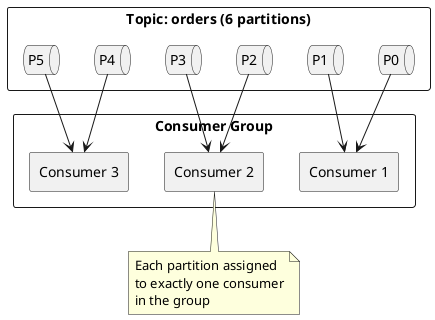

### Assignment Strategies

| Strategy | Class | Distribution | Rebalance Impact |
|----------|-------|--------------|------------------|
| **Range** | `RangeAssignor` | Consecutive per topic | May unbalance |
| **RoundRobin** | `RoundRobinAssignor` | Even distribution | Moderate movement |
| **Sticky** | `StickyAssignor` | Even + minimize movement | Minimal movement |
| **CooperativeSticky** | `CooperativeStickyAssignor` | Same + incremental | Lowest impact |

```properties
# Recommended for production
partition.assignment.strategy=org.apache.kafka.clients.consumer.CooperativeStickyAssignor
```

### Range Assignment

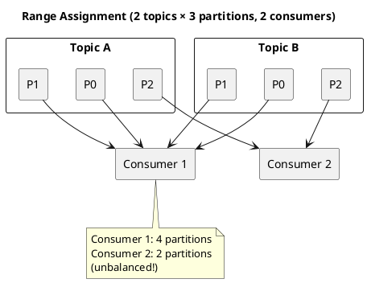

### RoundRobin Assignment

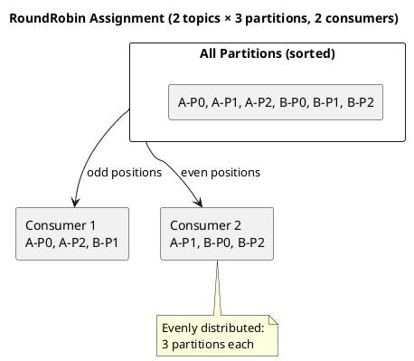

### Sticky Assignment

Minimizes partition movement during rebalance:

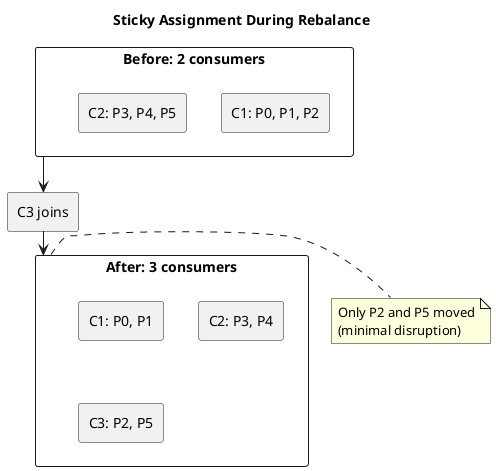

---

## Broker Load Distribution

### Partition Leader Distribution

Well-distributed leadership ensures even broker load:

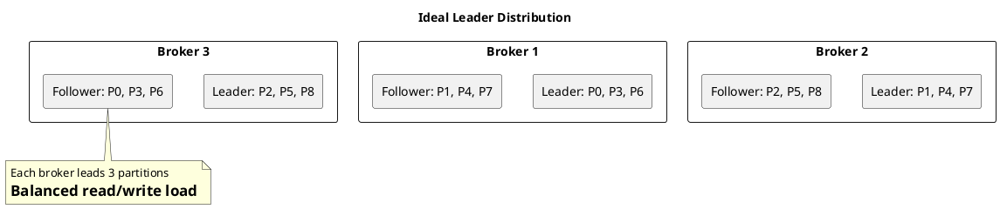

### Monitoring Broker Load

```bash
# Check partition distribution (leaders per broker)
kafka-topics.sh --describe --topic orders \
    --bootstrap-server localhost:9092

# Trigger preferred leader election
kafka-leader-election.sh --bootstrap-server localhost:9092 \
    --election-type PREFERRED --all-topic-partitions
```

---

## Rack-Aware Load Balancing

### Rack-Aware Consumer Fetching (Kafka 2.4+)

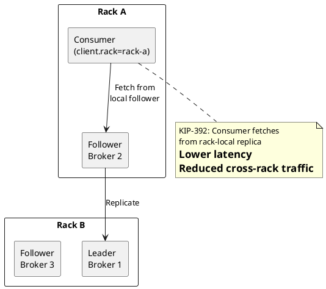

### Configuration

**Consumer:**

```properties
# Consumer's rack identity
client.rack=rack-a
```

**Broker:**

```properties
# Broker's rack identity
broker.rack=rack-a

# Allow follower fetching
replica.selector.class=org.apache.kafka.common.replica.RackAwareReplicaSelector
```

---

## Connection Load Balancing

### Connection Distribution

Kafka clients don't use connection load balancing in the traditional sense. Instead:

| Aspect | Behavior |
|--------|----------|
| **Connection target** | Determined by partition leader |
| **Number of connections** | One per broker needed (per client instance) |
| **Request routing** | Client routes to correct broker |

### Avoiding External Load Balancers

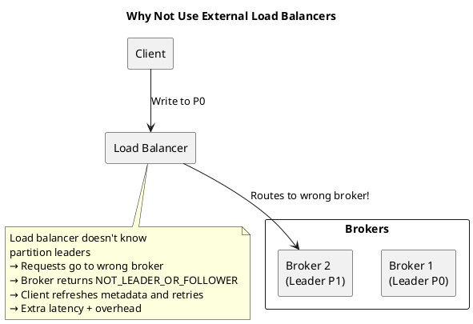

**When load balancers may be needed:**

- Security boundary crossing
- Service discovery in Kubernetes
- Must be TCP (layer 4), not HTTP

---

## Hot Partition Handling

### Detecting Hot Partitions

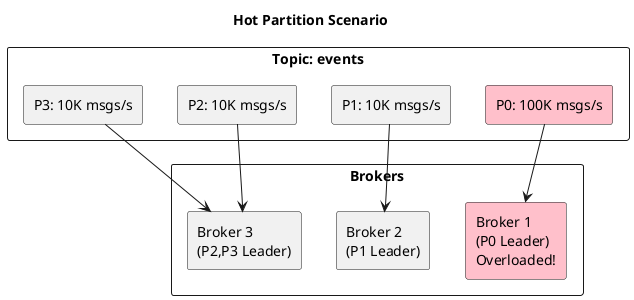

### Causes and Solutions

| Cause | Solution |
|-------|----------|
| Single popular key | Add secondary key component |
| Timestamp as key | Use business key instead |
| Too few partitions | Increase partition count |
| Uneven custom partitioner | Fix partitioner logic |

### Key Salting

```java
// Problem: Single customer generates massive traffic
producer.send(new ProducerRecord<>("orders", "big-customer", order));

// Solution: Add salt to distribute load
int salt = random.nextInt(10); // 0-9
String saltedKey = "big-customer-" + salt;
producer.send(new ProducerRecord<>("orders", saltedKey, order));

// Note: Ordering now spread across 10 partitions
// May need aggregation on consumer side
```

---

## Metrics for Load Monitoring

### Producer Metrics

| Metric | Description | Imbalance Indicator |
|--------|-------------|---------------------|
| `record-send-rate` | Records sent/sec | By broker comparison |
| `byte-rate` | Bytes sent/sec | By broker comparison |
| `request-rate` | Requests/sec | By broker comparison |
| `batch-size-avg` | Average batch size | Low = partitioning issue |

### Consumer Metrics

| Metric | Description | Imbalance Indicator |
|--------|-------------|---------------------|
| `records-consumed-rate` | Records/sec | By partition comparison |
| `fetch-rate` | Fetches/sec | By broker comparison |
| `records-lag` | Messages behind | High on single partition |

### Broker Metrics

```bash
# Check messages per partition
kafka-run-class.sh kafka.tools.GetOffsetShell \
    --broker-list localhost:9092 \
    --topic orders

# Per-broker request rate
kafka-run-class.sh kafka.tools.JmxTool \
    --object-name kafka.network:type=RequestMetrics,name=RequestsPerSec,request=Produce
```

---

## Best Practices

### Producer Best Practices

| Practice | Rationale |
|----------|-----------|
| Choose meaningful keys | Enable key-based routing |
| Avoid low-cardinality keys | Prevent hot partitions |
| Use sticky partitioner for keyless | Better batching |
| Monitor partition distribution | Detect imbalances early |

### Consumer Best Practices

| Practice | Rationale |
|----------|-----------|
| Use CooperativeStickyAssignor | Minimize rebalance impact |
| Match consumers to partitions | Full parallelism |
| Configure `client.rack` | Enable local fetching |
| Monitor lag per partition | Detect bottlenecks |

### Partition Count Guidelines

| Throughput | Partitions per Topic |
|------------|---------------------|
| < 10 MB/s | 6-12 |
| 10-100 MB/s | 12-50 |
| > 100 MB/s | 50+ (consider multiple topics) |

---

## Related Documentation

- [Metadata Management](metadata-management.md) - Partition leader discovery
- [Consumer Guide](../../application-development/consumers/index.md) - Consumer group details
- [Producer Guide](../../application-development/producers/index.md) - Producer configuration
- [Replication](../replication/index.md) - Leader election