# Kafka Metadata Management

Kafka clients maintain metadata about the cluster topology, including broker addresses, topic partitions, and partition leaders. Proper metadata management is essential for efficient request routing and handling topology changes.

## Metadata Overview

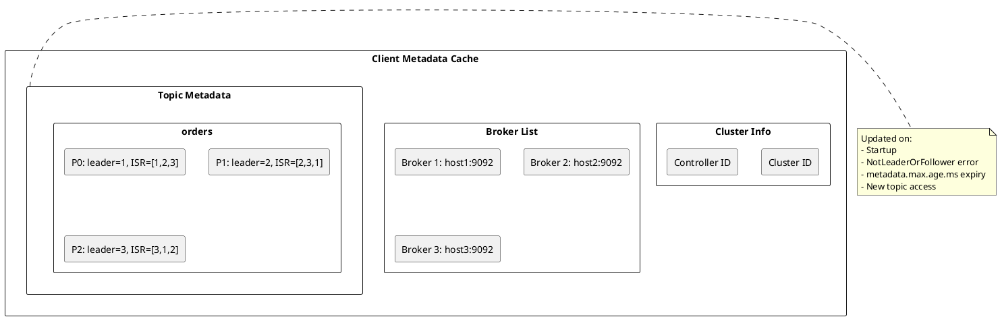

---

## Metadata Contents

### Cluster Metadata

| Field | Description |
|-------|-------------|
| `cluster_id` | Unique cluster identifier |
| `controller_id` | Current controller broker ID |
| `brokers` | List of all brokers with host/port/rack |

### Broker Information

| Field | Description |
|-------|-------------|
| `node_id` | Unique broker identifier |
| `host` | Broker hostname or IP |
| `port` | Broker port (default 9092) |
| `rack` | Rack identifier (optional) |

### Topic Metadata

| Field | Description |
|-------|-------------|
| `name` | Topic name |
| `partitions` | Number of partitions |
| `is_internal` | Internal topic flag |

Replication factor is derived from the partition replica lists, not returned directly in the metadata response.

### Partition Metadata

| Field | Description |
|-------|-------------|
| `partition` | Partition index |
| `leader` | Current leader broker ID |
| `leader_epoch` | Leader election epoch |
| `replicas` | All replica broker IDs |
| `isr` | In-sync replica broker IDs |
| `offline_replicas` | Offline replica broker IDs |

---

## Bootstrap Process

### Initial Discovery

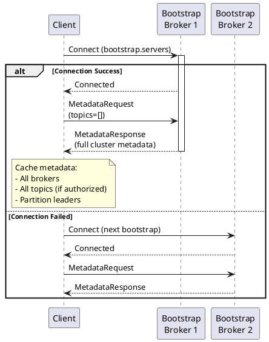

### Bootstrap Configuration

```properties
# Multiple brokers for redundancy
bootstrap.servers=kafka1:9092,kafka2:9092,kafka3:9092

# Client will try brokers in random order
# Only needs ONE successful connection for discovery
```

**Best Practices:**

| Guideline | Rationale |
|-----------|-----------|
| List 3+ brokers | Redundancy during broker failures |
| Use DNS names | Easier maintenance than IPs |
| Include brokers from different racks | Survive rack failures |
| Don't list all brokers | Unnecessary, any broker returns full metadata |

---

## Metadata Requests

### MetadataRequest Structure

```
MetadataRequest {
    topics: [TopicName]       // Empty for all topics
    allow_auto_topic_creation: bool
    include_cluster_authorized_operations: bool
    include_topic_authorized_operations: bool
}
```

### MetadataResponse Structure

```
MetadataResponse {
    throttle_time_ms: int32
    brokers: [Broker]
    cluster_id: string
    controller_id: int32
    topics: [TopicMetadata]
}

Broker {
    node_id: int32
    host: string
    port: int32
    rack: string (nullable)
}

TopicMetadata {
    error_code: int16
    name: string
    is_internal: bool
    partitions: [PartitionMetadata]
}

PartitionMetadata {
    error_code: int16
    partition_index: int32
    leader_id: int32
    leader_epoch: int32
    replica_nodes: [int32]
    isr_nodes: [int32]
    offline_replicas: [int32]
}
```

---

## Metadata Refresh

### Refresh Triggers

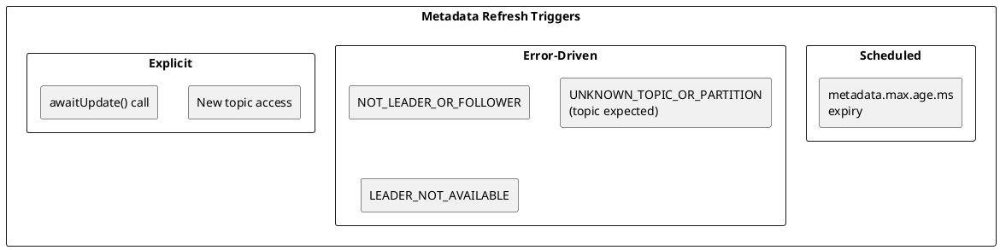

### Configuration

```properties
# Maximum age before forced refresh
metadata.max.age.ms=300000  # 5 minutes (default)
```

### Refresh Flow

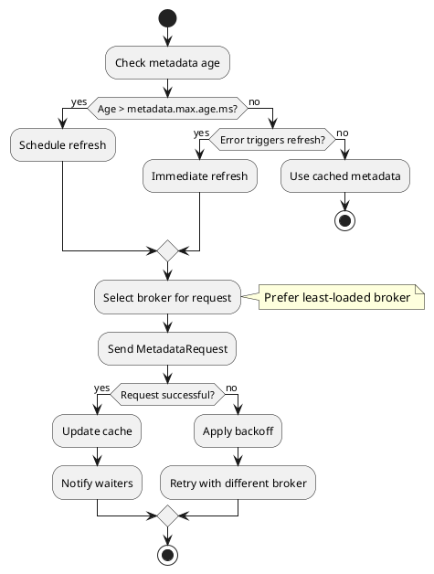

---

## Metadata Caching

### Cache Structure

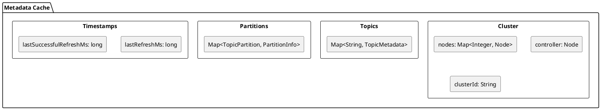

### Cache Invalidation

| Event | Action |
|-------|--------|
| `metadata.max.age.ms` expiry | Mark stale, refresh |
| `NOT_LEADER_OR_FOLLOWER` | Invalidate partition |
| `UNKNOWN_TOPIC_OR_PARTITION` | Invalidate topic |
| Node disconnect | Invalidate node |

### Partition Leader Lookup

```java
// Find leader for partition
public Node leader(TopicPartition partition) {
    PartitionInfo info = partitionsByTopicPartition.get(partition);
    if (info == null) {
        return null;
    }
    return info.leader();
}

// Find all partitions for topic
public List<PartitionInfo> partitionsForTopic(String topic) {
    return partitionsByTopic.get(topic);
}
```

---

## Handling Metadata Errors

### Common Metadata Errors

| Error Code | Name | Cause | Client Action |
|:----------:|------|-------|---------------|
| 3 | `UNKNOWN_TOPIC_OR_PARTITION` | Topic/partition doesn't exist | Refresh only if the topic is expected to exist |
| 5 | `LEADER_NOT_AVAILABLE` | Leader election in progress | Wait and retry |
| 6 | `NOT_LEADER_OR_FOLLOWER` | Stale leader info | Refresh metadata |
| 29 | `COORDINATOR_NOT_AVAILABLE` | Group coordinator unavailable | Retry FindCoordinator |

### Error Handling Flow

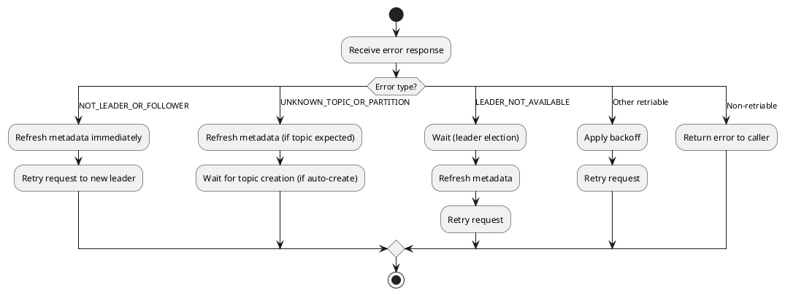

---

## Leader Epoch

### What is Leader Epoch?

Leader epoch is a monotonically increasing number that identifies the term of a partition leader. It prevents issues from stale leadership information.

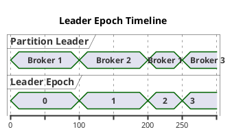

### Epoch Validation

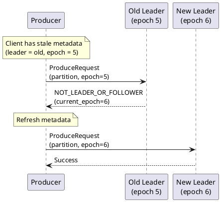

---

## Rack-Aware Metadata

### Rack Information

```properties
# Client rack (for follower fetching)
client.rack=rack-a

# Enables rack-aware replica selection
```

### Rack-Aware Consumption

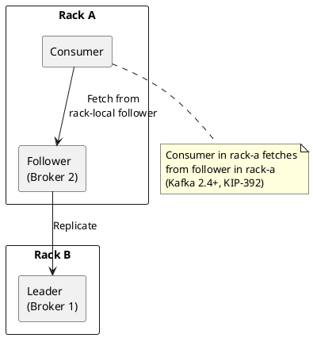

---

## Metadata for Specific Use Cases

### Producer Metadata Usage

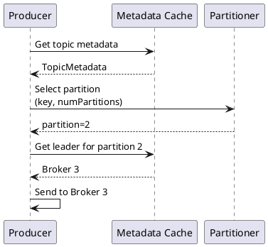

### Consumer Metadata Usage

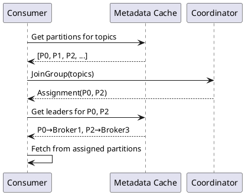

---

## Performance Optimization

### Reducing Metadata Overhead

| Optimization | Configuration |
|-------------|---------------|
| Increase refresh interval | `metadata.max.age.ms=600000` |
| Request specific topics | Don't request all topics |
| Cache locally | Avoid redundant lookups |

### Metadata Request Batching

Kafka batches metadata requests when multiple threads need updates:

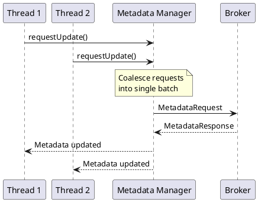

---

## Monitoring Metadata

### Key Metrics

Producer client metrics are reported under the `producer-metrics` group.

| Metric | Description | Alert Threshold |
|--------|-------------|-----------------|
| `metadata-age` | Age in seconds of the current producer metadata | > 2 × metadata.max.age.ms / 1000 |
| `metadata-wait-time-ns-total` | Cumulative time spent waiting for metadata (ns) | Sustained increase in rate |

### Debugging Metadata Issues

```properties
# Enable metadata debug logging
log4j.logger.org.apache.kafka.clients.Metadata=DEBUG
log4j.logger.org.apache.kafka.clients.NetworkClient=DEBUG
```

Common issues:

| Symptom | Cause | Solution |
|---------|-------|----------|
| Frequent refreshes | Many `NOT_LEADER` errors | Check cluster stability |
| Stale metadata | Long `metadata.max.age.ms` | Reduce refresh interval |
| Missing topics | Authorization issues | Check ACLs |
| Wrong broker count | Partial visibility | Check bootstrap servers |

---

## Version Compatibility

| Feature | Minimum Version |
|---------|-----------------|
| Basic metadata | 0.8.0 |
| Rack information | 0.10.0 |
| Leader epoch | 0.11.0 |
| Offline replicas | 1.0.0 |
| Authorized operations | 2.3.0 |

---

## Related Documentation

- [Kafka Protocol](kafka-protocol.md) - Wire protocol details
- [Connection Pooling](connection-pooling.md) - Connection management
- [Load Balancing](load-balancing.md) - Request routing
- [Topology](../topology/index.md) - Cluster topology
