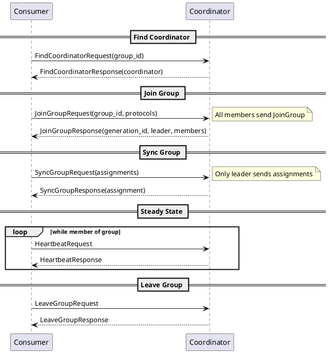
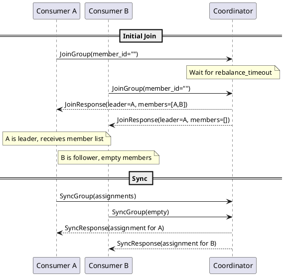
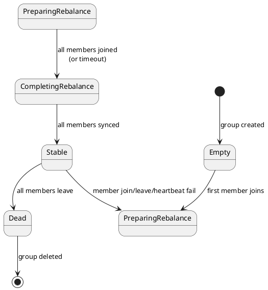

# Kafka Consumer Group Protocol APIs

This document specifies the Kafka protocol APIs used for consumer group management, coordination, and offset tracking. These APIs implement the consumer group protocol that enables dynamic partition assignment and coordinated consumption.

---

## Consumer Group API Reference

| API Key | Name | Purpose |
|:-------:|------|---------|
| 8 | OffsetCommit | Commit consumer offsets |
| 9 | OffsetFetch | Retrieve committed offsets |
| 10 | FindCoordinator | Locate group coordinator |
| 11 | JoinGroup | Join or create consumer group |
| 12 | Heartbeat | Maintain group membership |
| 13 | LeaveGroup | Leave consumer group |
| 14 | SyncGroup | Synchronize partition assignments |
| 15 | DescribeGroups | Describe group state |
| 16 | ListGroups | List all groups |
| 42 | DeleteGroups | Delete consumer groups |
| 47 | OffsetDelete | Delete committed offsets |

---

## Group Membership Protocol

### Protocol Overview



---

## FindCoordinator API (Key 10)

### Overview

The FindCoordinator API locates the broker serving as coordinator for a consumer group or transaction.

### Version History

| Version | Kafka | Key Changes |
|:-------:|-------|-------------|
| 0 | 0.8.2 | Initial version (group only) |
| 1 | 0.10.0 | Throttle time |
| 2 | 0.11.0 | Key type (transaction support) |
| 3 | 2.4.0 | Flexible versions |
| 4 | 3.0.0 | Batched requests |
| 5 | 3.6.0 | KIP-699 |

### Request Schema

```
FindCoordinatorRequest =>
    key: STRING
    key_type: INT8
    coordinator_keys: [STRING]
```

| Field | Type | Description |
|-------|------|-------------|
| `key` | STRING | Group ID or transactional ID |
| `key_type` | INT8 | 0=GROUP, 1=TRANSACTION |
| `coordinator_keys` | ARRAY | Multiple keys (v4+) |

### Response Schema

```
FindCoordinatorResponse =>
    throttle_time_ms: INT32
    error_code: INT16
    error_message: NULLABLE_STRING
    node_id: INT32
    host: STRING
    port: INT32
    coordinators: [Coordinator]

Coordinator =>
    key: STRING
    node_id: INT32
    host: STRING
    port: INT32
    error_code: INT16
    error_message: NULLABLE_STRING
```

| Field | Type | Description |
|-------|------|-------------|
| `node_id` | INT32 | Coordinator broker ID |
| `host` | STRING | Coordinator hostname |
| `port` | INT32 | Coordinator port |

### Coordinator Selection

The coordinator is deterministically selected based on the group ID hash:

```
partition = abs(hash(group_id)) % __consumer_offsets.partitions
coordinator = leader(__consumer_offsets, partition)
```

### Behavioral Contract

| Aspect | Guarantee |
|--------|-----------|
| **Determinism** | Same group ID always maps to same partition |
| **Consistency** | Coordinator stable unless broker fails |
| **Failover** | On coordinator failure, new leader elected |

### Error Handling

| Error Code | Retriable | Cause | Recovery |
|:----------:|:---------:|-------|----------|
| COORDINATOR_NOT_AVAILABLE | ✅ | Coordinator initializing | Wait, retry |
| NOT_COORDINATOR | ✅ | Coordinator moved | Retry FindCoordinator |
| GROUP_AUTHORIZATION_FAILED | ❌ | No Describe permission | Check ACLs |

---

## JoinGroup API (Key 11)

### Overview

The JoinGroup API joins a consumer to a group, triggering rebalancing if necessary. The first member to join becomes the group leader.

### Version History

| Version | Kafka | Key Changes |
|:-------:|-------|-------------|
| 0 | 0.9.0 | Initial version |
| 1 | 0.10.1 | Rebalance timeout |
| 2 | 0.11.0 | Response member data |
| 3 | 2.0.0 | KIP-345 |
| 4 | 2.2.0 | KIP-394 group instance ID |
| 5 | 2.3.0 | Group instance ID support |
| 6 | 2.4.0 | Flexible versions |
| 7 | 2.7.0 | KIP-559 protocol type |
| 8 | 3.0.0 | KIP-848 |
| 9 | 3.5.0 | KIP-848 improvements |

### Request Schema

```
JoinGroupRequest =>
    group_id: STRING
    session_timeout_ms: INT32
    rebalance_timeout_ms: INT32
    member_id: STRING
    group_instance_id: NULLABLE_STRING
    protocol_type: STRING
    protocols: [Protocol]
    reason: NULLABLE_STRING

Protocol =>
    name: STRING
    metadata: BYTES
```

| Field | Type | Description |
|-------|------|-------------|
| `group_id` | STRING | Consumer group identifier |
| `session_timeout_ms` | INT32 | Session timeout for heartbeats |
| `rebalance_timeout_ms` | INT32 | Maximum time to join |
| `member_id` | STRING | Member ID (empty for new members) |
| `group_instance_id` | NULLABLE_STRING | Static membership ID |
| `protocol_type` | STRING | Protocol type (e.g., "consumer") |
| `protocols` | ARRAY | Supported assignment protocols |

### Response Schema

```
JoinGroupResponse =>
    throttle_time_ms: INT32
    error_code: INT16
    generation_id: INT32
    protocol_type: NULLABLE_STRING
    protocol_name: NULLABLE_STRING
    leader: STRING
    skip_assignment: BOOLEAN
    member_id: STRING
    members: [Member]

Member =>
    member_id: STRING
    group_instance_id: NULLABLE_STRING
    metadata: BYTES
```

| Field | Type | Description |
|-------|------|-------------|
| `generation_id` | INT32 | Group generation (increments per rebalance) |
| `protocol_name` | NULLABLE_STRING | Selected assignment protocol |
| `leader` | STRING | Group leader member ID |
| `member_id` | STRING | Assigned member ID |
| `members` | ARRAY | Member list (leader only) |

### Rebalance Process



### Member Assignment



### Behavioral Contract

| Aspect | Guarantee |
|--------|-----------|
| **Leader election** | First member to join becomes leader |
| **Generation ID** | Increments on each successful rebalance |
| **Member ID** | Assigned by coordinator, must be used in subsequent requests |
| **Timeout** | Members not completing join within rebalance_timeout are removed |

### Static Group Membership

With `group.instance.id`:

| Behavior | Static Membership |
|----------|-------------------|
| Rejoin after restart | Preserves member ID |
| Session timeout | Longer grace period |
| Rebalance avoidance | No rebalance on transient failures |

---

## Heartbeat API (Key 12)

### Overview

The Heartbeat API maintains consumer group membership and detects failures.

### Version History

| Version | Kafka | Key Changes |
|:-------:|-------|-------------|
| 0 | 0.9.0 | Initial version |
| 1 | 0.10.1 | Throttle time |
| 2 | 0.11.0 | Response error |
| 3 | 2.3.0 | Group instance ID |
| 4 | 2.4.0 | Flexible versions |

### Request Schema

```
HeartbeatRequest =>
    group_id: STRING
    generation_id: INT32
    member_id: STRING
    group_instance_id: NULLABLE_STRING
```

| Field | Type | Description |
|-------|------|-------------|
| `group_id` | STRING | Consumer group ID |
| `generation_id` | INT32 | Current group generation |
| `member_id` | STRING | Member's assigned ID |
| `group_instance_id` | NULLABLE_STRING | Static membership ID |

### Response Schema

```
HeartbeatResponse =>
    throttle_time_ms: INT32
    error_code: INT16
```

### Behavioral Contract

| Aspect | Guarantee |
|--------|-----------|
| **Frequency** | Must send within session.timeout.ms |
| **Failure detection** | Missing heartbeats trigger rebalance |
| **Rebalance signal** | REBALANCE_IN_PROGRESS indicates pending rebalance |

### Error Handling

| Error Code | Meaning | Recovery |
|:----------:|---------|----------|
| NONE | Success | Continue heartbeating |
| REBALANCE_IN_PROGRESS | Rebalance started | Rejoin group |
| ILLEGAL_GENERATION | Stale generation | Rejoin group |
| UNKNOWN_MEMBER_ID | Member removed | Rejoin group |
| FENCED_INSTANCE_ID | Static member fenced | Exit or rejoin |

---

## SyncGroup API (Key 14)

### Overview

The SyncGroup API distributes partition assignments after a successful rebalance.

### Version History

| Version | Kafka | Key Changes |
|:-------:|-------|-------------|
| 0 | 0.9.0 | Initial version |
| 1 | 0.10.1 | Throttle time |
| 2 | 0.11.0 | Response improvements |
| 3 | 2.3.0 | Group instance ID |
| 4 | 2.4.0 | Flexible versions |
| 5 | 2.7.0 | Protocol type/name |

### Request Schema

```
SyncGroupRequest =>
    group_id: STRING
    generation_id: INT32
    member_id: STRING
    group_instance_id: NULLABLE_STRING
    protocol_type: NULLABLE_STRING
    protocol_name: NULLABLE_STRING
    assignments: [Assignment]

Assignment =>
    member_id: STRING
    assignment: BYTES
```

| Field | Type | Description |
|-------|------|-------------|
| `assignments` | ARRAY | Partition assignments (leader only) |

### Response Schema

```
SyncGroupResponse =>
    throttle_time_ms: INT32
    error_code: INT16
    protocol_type: NULLABLE_STRING
    protocol_name: NULLABLE_STRING
    assignment: BYTES
```

| Field | Type | Description |
|-------|------|-------------|
| `assignment` | BYTES | Member's partition assignment |

### Assignment Format

The assignment bytes follow a protocol-specific format. For the "consumer" protocol:

```
ConsumerProtocolAssignment =>
    assigned_partitions: [TopicPartition]
    user_data: BYTES

TopicPartition =>
    topic: STRING
    partitions: [INT32]
```

### Behavioral Contract

| Aspect | Guarantee |
|--------|-----------|
| **Leader responsibility** | Only leader must include assignments |
| **Follower behavior** | Non-leaders must send empty assignments |
| **Atomicity** | All members receive assignments when coordinator responds |
| **Consistency** | Same assignment for same generation |

---

## LeaveGroup API (Key 13)

### Overview

The LeaveGroup API gracefully removes members from a consumer group.

### Version History

| Version | Kafka | Key Changes |
|:-------:|-------|-------------|
| 0 | 0.9.0 | Initial version |
| 1 | 0.10.1 | Throttle time |
| 2 | 0.11.0 | Response improvements |
| 3 | 2.3.0 | Batch member removal |
| 4 | 2.4.0 | Flexible versions |
| 5 | 2.7.0 | KIP-345 |
| 6 | 3.5.0 | KIP-848 |

### Request Schema

```
LeaveGroupRequest =>
    group_id: STRING
    member_id: STRING
    members: [MemberIdentity]

MemberIdentity =>
    member_id: STRING
    group_instance_id: NULLABLE_STRING
    reason: NULLABLE_STRING
```

### Response Schema

```
LeaveGroupResponse =>
    throttle_time_ms: INT32
    error_code: INT16
    members: [MemberResponse]

MemberResponse =>
    member_id: STRING
    group_instance_id: NULLABLE_STRING
    error_code: INT16
```

### Behavioral Contract

| Aspect | Guarantee |
|--------|-----------|
| **Immediate effect** | Member removed immediately |
| **Rebalance trigger** | Remaining members notified via heartbeat |
| **Static members** | May leave without triggering immediate rebalance |

---

## OffsetCommit API (Key 8)

### Overview

The OffsetCommit API stores consumer offsets in the `__consumer_offsets` topic.

### Version History

| Version | Kafka | Key Changes |
|:-------:|-------|-------------|
| 0 | 0.8.1 | Initial version (Zookeeper) |
| 1 | 0.8.2 | Timestamp, Kafka storage |
| 2 | 0.9.0 | Retention time |
| 3 | 0.11.0 | Throttle time |
| 4 | 2.0.0 | KIP-98 |
| 5 | 2.1.0 | KIP-211 |
| 6 | 2.3.0 | Group instance ID |
| 7 | 2.3.0 | KIP-345 leader epoch |
| 8 | 2.4.0 | Flexible versions |
| 9 | 2.8.0 | KIP-709 |

### Request Schema

```
OffsetCommitRequest =>
    group_id: STRING
    generation_id_or_member_epoch: INT32
    member_id: STRING
    group_instance_id: NULLABLE_STRING
    topics: [Topic]

Topic =>
    name: STRING
    partitions: [Partition]

Partition =>
    partition_index: INT32
    committed_offset: INT64
    committed_leader_epoch: INT32
    commit_timestamp: INT64
    committed_metadata: NULLABLE_STRING
```

| Field | Type | Description |
|-------|------|-------------|
| `generation_id_or_member_epoch` | INT32 | Group generation or member epoch |
| `committed_offset` | INT64 | Offset to commit |
| `committed_leader_epoch` | INT32 | Leader epoch of committed offset |
| `committed_metadata` | NULLABLE_STRING | Application metadata |

### Response Schema

```
OffsetCommitResponse =>
    throttle_time_ms: INT32
    topics: [Topic]

Topic =>
    name: STRING
    partitions: [Partition]

Partition =>
    partition_index: INT32
    error_code: INT16
```

### Behavioral Contract

| Aspect | Guarantee |
|--------|-----------|
| **Durability** | Committed to replicated `__consumer_offsets` topic |
| **Visibility** | Available immediately after successful commit |
| **Generation check** | Must match current generation (if group member) |
| **Retention** | Subject to `offsets.retention.minutes` |

### Error Handling

| Error Code | Retriable | Cause | Recovery |
|:----------:|:---------:|-------|----------|
| ILLEGAL_GENERATION | ❌ | Stale generation | Rejoin group |
| UNKNOWN_MEMBER_ID | ❌ | Not a group member | Rejoin group |
| OFFSET_METADATA_TOO_LARGE | ❌ | Metadata too large | Reduce metadata |
| GROUP_AUTHORIZATION_FAILED | ❌ | No Read permission | Check ACLs |

---

## OffsetFetch API (Key 9)

### Overview

The OffsetFetch API retrieves committed offsets for a consumer group.

### Version History

| Version | Kafka | Key Changes |
|:-------:|-------|-------------|
| 0 | 0.8.1 | Initial version |
| 1 | 0.8.2 | Kafka-stored offsets |
| 2 | 0.10.2 | All partitions |
| 3 | 0.11.0 | Throttle time |
| 4 | 2.0.0 | KIP-98 |
| 5 | 2.1.0 | KIP-211 |
| 6 | 2.4.0 | Flexible versions |
| 7 | 2.5.0 | Require stable |
| 8 | 3.0.0 | Multiple groups |
| 9 | 3.7.0 | KIP-848 |

### Request Schema

```
OffsetFetchRequest =>
    group_id: STRING
    topics: [Topic]
    groups: [Group]
    require_stable: BOOLEAN

Topic =>
    name: STRING
    partition_indexes: [INT32]

Group =>
    group_id: STRING
    member_id: NULLABLE_STRING
    member_epoch: INT32
    topics: [Topic]
```

| Field | Type | Description |
|-------|------|-------------|
| `topics` | ARRAY | Topics/partitions to fetch (null for all) |
| `require_stable` | BOOLEAN | Require stable offsets (no pending transactions) |

### Response Schema

```
OffsetFetchResponse =>
    throttle_time_ms: INT32
    topics: [Topic]
    error_code: INT16
    groups: [Group]

Topic =>
    name: STRING
    partitions: [Partition]

Partition =>
    partition_index: INT32
    committed_offset: INT64
    committed_leader_epoch: INT32
    metadata: NULLABLE_STRING
    error_code: INT16
```

| Field | Type | Description |
|-------|------|-------------|
| `committed_offset` | INT64 | Last committed offset (-1 if none) |
| `committed_leader_epoch` | INT32 | Leader epoch of committed offset |
| `metadata` | NULLABLE_STRING | Application metadata |

### Behavioral Contract

| Aspect | Guarantee |
|--------|-----------|
| **Consistency** | Returns latest committed offset |
| **No offset** | Returns -1 if no offset committed |
| **require_stable** | With true, waits for pending transactions |

---

## DescribeGroups API (Key 15)

### Overview

The DescribeGroups API retrieves detailed information about consumer groups.

### Version History

| Version | Kafka | Key Changes |
|:-------:|-------|-------------|
| 0 | 0.9.0 | Initial version |
| 1 | 0.10.1 | Throttle time |
| 2 | 0.11.0 | Response improvements |
| 3 | 2.3.0 | Authorized operations |
| 4 | 2.4.0 | KIP-345 |
| 5 | 2.4.0 | Flexible versions |
| 6 | 3.9.0 | KIP-848 |

### Request Schema

```
DescribeGroupsRequest =>
    groups: [STRING]
    include_authorized_operations: BOOLEAN
```

### Response Schema

```
DescribeGroupsResponse =>
    throttle_time_ms: INT32
    groups: [Group]

Group =>
    error_code: INT16
    group_id: STRING
    group_state: STRING
    protocol_type: STRING
    protocol_data: STRING
    members: [Member]
    authorized_operations: INT32

Member =>
    member_id: STRING
    group_instance_id: NULLABLE_STRING
    client_id: STRING
    client_host: STRING
    member_metadata: BYTES
    member_assignment: BYTES
```

| Field | Type | Description |
|-------|------|-------------|
| `group_state` | STRING | Current group state |
| `protocol_type` | STRING | Protocol type (e.g., "consumer") |
| `protocol_data` | STRING | Selected protocol name |
| `member_assignment` | BYTES | Current partition assignment |

### Group States

| State | Description |
|-------|-------------|
| `Empty` | No active members |
| `PreparingRebalance` | Rebalance in progress |
| `CompletingRebalance` | Waiting for SyncGroup |
| `Stable` | Active and stable |
| `Dead` | Group being deleted |

---

## ListGroups API (Key 16)

### Overview

The ListGroups API lists all consumer groups on a broker.

### Version History

| Version | Kafka | Key Changes |
|:-------:|-------|-------------|
| 0 | 0.9.0 | Initial version |
| 1 | 0.10.1 | Throttle time |
| 2 | 2.0.0 | Response improvements |
| 3 | 2.6.0 | States filter |
| 4 | 2.4.0 | Flexible versions |
| 5 | 3.5.0 | KIP-848 types filter |

### Request Schema

```
ListGroupsRequest =>
    states_filter: [STRING]
    types_filter: [STRING]
```

| Field | Type | Description |
|-------|------|-------------|
| `states_filter` | ARRAY | Filter by group states |
| `types_filter` | ARRAY | Filter by group types |

### Response Schema

```
ListGroupsResponse =>
    throttle_time_ms: INT32
    error_code: INT16
    groups: [Group]

Group =>
    group_id: STRING
    protocol_type: STRING
    group_state: STRING
    group_type: STRING
```

---

## DeleteGroups API (Key 42)

### Overview

The DeleteGroups API deletes consumer groups.

### Version History

| Version | Kafka | Key Changes |
|:-------:|-------|-------------|
| 0 | 1.1.0 | Initial version |
| 1 | 2.0.0 | Response improvements |
| 2 | 2.4.0 | Flexible versions |

### Request Schema

```
DeleteGroupsRequest =>
    groups_names: [STRING]
```

### Response Schema

```
DeleteGroupsResponse =>
    throttle_time_ms: INT32
    results: [Result]

Result =>
    group_id: STRING
    error_code: INT16
```

### Behavioral Contract

| Aspect | Guarantee |
|--------|-----------|
| **Precondition** | Group must be Empty or Dead |
| **Atomicity** | Each group deletion is independent |
| **Effect** | Removes group and all committed offsets |

---

## Consumer Group Protocol Summary

### Complete Flow

```plantuml
@startuml

skinparam backgroundColor transparent

actor "Application" as App
participant "Consumer" as C
participant "Any Broker" as AB
participant "Coordinator" as Coord
participant "Partition Leader" as PL

== Startup ==
App -> C : new KafkaConsumer()
C -> AB : MetadataRequest
AB --> C : MetadataResponse

C -> AB : FindCoordinatorRequest(group_id)
AB --> C : FindCoordinatorResponse(coordinator)

== Join Group ==
C -> Coord : JoinGroupRequest
Coord --> C : JoinGroupResponse(generation, leader)

C -> Coord : SyncGroupRequest
Coord --> C : SyncGroupResponse(assignment)

== Fetch Offsets ==
C -> Coord : OffsetFetchRequest
Coord --> C : OffsetFetchResponse(offsets)

== Consume Loop ==
loop poll()
    par Heartbeat
        C -> Coord : HeartbeatRequest
        Coord --> C : HeartbeatResponse
    and Fetch
        C -> PL : FetchRequest
        PL --> C : FetchResponse(records)
    end

    C -> Coord : OffsetCommitRequest
    Coord --> C : OffsetCommitResponse
end

== Shutdown ==
C -> Coord : LeaveGroupRequest
Coord --> C : LeaveGroupResponse

@enduml
```

---

## Related Documentation

- [Protocol Core APIs](protocol-apis-core.md) - Core APIs
- [Protocol Admin APIs](protocol-apis-admin.md) - Administrative APIs
- [Protocol Transaction APIs](protocol-apis-transaction.md) - Transaction APIs
- [Protocol Errors](protocol-errors.md) - Error code reference
