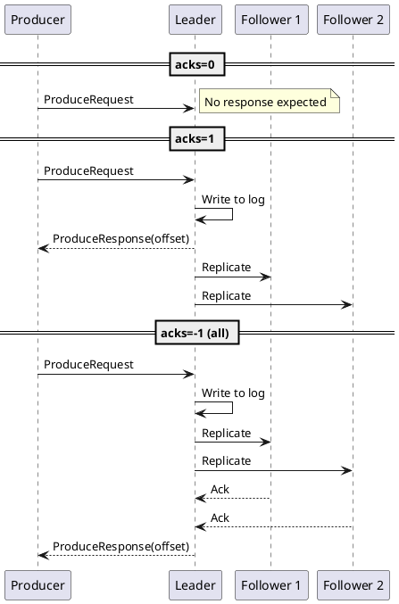
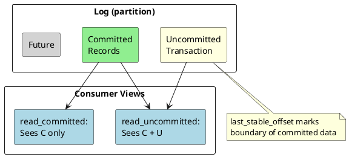
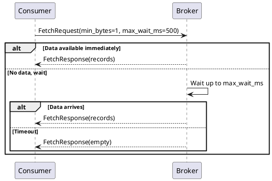
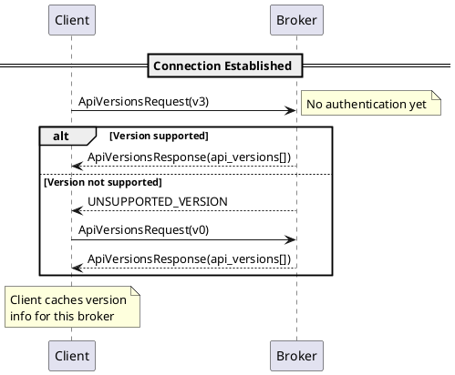

# Kafka Core Protocol APIs

This document specifies the core Kafka protocol APIs used for message production, consumption, and cluster metadata. These APIs form the foundation of all Kafka client operations.

---

## API Key Reference

### Core APIs

| API Key | Name | Purpose |
|:-------:|------|---------|
| 0 | Produce | Send records to partitions |
| 1 | Fetch | Retrieve records from partitions |
| 2 | ListOffsets | Query offset by timestamp |
| 3 | Metadata | Discover cluster topology |
| 18 | ApiVersions | Query supported API versions |

---

## Produce API (Key 0)

### Overview

The Produce API sends record batches to topic partitions. It is the primary API for message production.

### Version History

| Version | Kafka | Key Changes |
|:-------:|-------|-------------|
| 0 | 0.8.0 | Initial version |
| 1 | 0.9.0 | Throttle time in response |
| 2 | 0.10.0 | Timestamp in response |
| 3 | 0.11.0 | Transactional support |
| 4 | 1.0.0 | KIP-112 |
| 5 | 1.0.0 | KIP-219 log_start_offset |
| 6 | 2.0.0 | KIP-279 error improvements |
| 7 | 2.1.0 | KIP-227 leader epoch |
| 8 | 2.3.0 | KIP-467 record errors |
| 9 | 2.4.0 | Flexible versions |
| 10 | 3.0.0 | KIP-700 current_leader |
| 11 | 3.7.0 | KIP-951 async produce |

### Request Schema

```
ProduceRequest =>
    transactional_id: NULLABLE_STRING
    acks: INT16
    timeout_ms: INT32
    topic_data: [TopicData]

TopicData =>
    name: STRING
    partition_data: [PartitionData]

PartitionData =>
    index: INT32
    records: RECORDS
```

| Field | Type | Description |
|-------|------|-------------|
| `transactional_id` | NULLABLE_STRING | Transaction ID (null for non-transactional) |
| `acks` | INT16 | Required acknowledgments (-1, 0, 1) |
| `timeout_ms` | INT32 | Request timeout in milliseconds |
| `topic_data` | ARRAY | Per-topic record data |
| `partition_data` | ARRAY | Per-partition record batches |
| `records` | RECORDS | Record batch data |

### Response Schema

```
ProduceResponse =>
    responses: [TopicResponse]
    throttle_time_ms: INT32

TopicResponse =>
    name: STRING
    partition_responses: [PartitionResponse]

PartitionResponse =>
    index: INT32
    error_code: INT16
    base_offset: INT64
    log_append_time_ms: INT64
    log_start_offset: INT64
    record_errors: [RecordError]
    error_message: NULLABLE_STRING
```

| Field | Type | Description |
|-------|------|-------------|
| `error_code` | INT16 | Partition-level error |
| `base_offset` | INT64 | Offset of first record in batch |
| `log_append_time_ms` | INT64 | Timestamp (-1 if CreateTime) |
| `log_start_offset` | INT64 | Log start offset |
| `record_errors` | ARRAY | Per-record errors (v8+) |
| `throttle_time_ms` | INT32 | Quota throttle time |

### acks Semantics

| acks | Name | Guarantee | Response |
|:----:|------|-----------|----------|
| 0 | Fire-and-forget | None | No response sent |
| 1 | Leader | Leader wrote to local log | After leader persist |
| -1 | All | All ISR replicas wrote | After ISR persist |



### Behavioral Contract

| Aspect | Guarantee |
|--------|-----------|
| **Ordering** | Records within a batch must be written in batch order |
| **Atomicity** | Batch to single partition must succeed or fail atomically |
| **Durability** | Depends on `acks` setting and `min.insync.replicas` |
| **Idempotence** | With `enable.idempotence`, duplicates are prevented |

!!! warning "acks=0 No Response"
    With `acks=0`, the broker must not send a response. The client must not wait for a response. Delivery is not confirmed.

### Error Handling

| Error Code | Retriable | Cause | Recovery |
|:----------:|:---------:|-------|----------|
| NOT_LEADER_OR_FOLLOWER | ✅ | Stale leader | Refresh metadata, retry |
| REQUEST_TIMED_OUT | ✅ | Broker timeout | Retry with backoff |
| NOT_ENOUGH_REPLICAS | ✅ | ISR too small | Wait, retry |
| MESSAGE_TOO_LARGE | ❌ | Record exceeds limit | Reduce message size |
| TOPIC_AUTHORIZATION_FAILED | ❌ | No Write permission | Check ACLs |
| OUT_OF_ORDER_SEQUENCE_NUMBER | ❌ | Sequence gap | Fatal for idempotent |

---

## Fetch API (Key 1)

### Overview

The Fetch API retrieves record batches from topic partitions. It supports long-polling, session-based fetching, and transactional isolation.

### Version History

| Version | Kafka | Key Changes |
|:-------:|-------|-------------|
| 0 | 0.8.0 | Initial version |
| 1 | 0.9.0 | Throttle time |
| 2 | 0.10.0 | Small improvements |
| 3 | 0.10.1 | Max bytes limit |
| 4 | 0.11.0 | Isolation level |
| 5 | 1.0.0 | Log truncation detection |
| 6 | 1.1.0 | KIP-226 |
| 7 | 1.1.0 | Fetch sessions |
| 8 | 2.0.0 | KIP-227 leader epoch |
| 9 | 2.1.0 | Current leader |
| 10 | 2.1.0 | KIP-320 |
| 11 | 2.3.0 | Rack ID |
| 12 | 2.4.0 | Flexible versions |
| 13 | 2.7.0 | Topic IDs |
| 14 | 3.1.0 | KIP-516 |
| 15 | 3.5.0 | KIP-632 |
| 16 | 3.5.0 | KIP-903 |

### Request Schema

```
FetchRequest =>
    replica_id: INT32
    max_wait_ms: INT32
    min_bytes: INT32
    max_bytes: INT32
    isolation_level: INT8
    session_id: INT32
    session_epoch: INT32
    topics: [TopicRequest]
    forgotten_topics_data: [ForgottenTopic]
    rack_id: STRING

TopicRequest =>
    topic: STRING
    partitions: [PartitionRequest]

PartitionRequest =>
    partition: INT32
    current_leader_epoch: INT32
    fetch_offset: INT64
    last_fetched_epoch: INT32
    log_start_offset: INT64
    partition_max_bytes: INT32
```

| Field | Type | Description |
|-------|------|-------------|
| `replica_id` | INT32 | Replica ID (-1 for consumers) |
| `max_wait_ms` | INT32 | Maximum wait time for data |
| `min_bytes` | INT32 | Minimum bytes to return |
| `max_bytes` | INT32 | Maximum bytes to return |
| `isolation_level` | INT8 | 0=read_uncommitted, 1=read_committed |
| `session_id` | INT32 | Fetch session ID (0 for new) |
| `fetch_offset` | INT64 | Offset to fetch from |
| `partition_max_bytes` | INT32 | Maximum bytes per partition |

### Response Schema

```
FetchResponse =>
    throttle_time_ms: INT32
    error_code: INT16
    session_id: INT32
    responses: [TopicResponse]

TopicResponse =>
    topic: STRING
    partitions: [PartitionResponse]

PartitionResponse =>
    partition: INT32
    error_code: INT16
    high_watermark: INT64
    last_stable_offset: INT64
    log_start_offset: INT64
    aborted_transactions: [AbortedTransaction]
    preferred_read_replica: INT32
    records: RECORDS
```

| Field | Type | Description |
|-------|------|-------------|
| `high_watermark` | INT64 | End offset of committed data |
| `last_stable_offset` | INT64 | End of non-transactional or committed data |
| `log_start_offset` | INT64 | Log start offset |
| `aborted_transactions` | ARRAY | Aborted transaction markers |
| `preferred_read_replica` | INT32 | Suggested follower for reads |
| `records` | RECORDS | Fetched record batches |

### Isolation Levels

| Level | Value | Behavior |
|-------|:-----:|----------|
| `read_uncommitted` | 0 | Returns all records up to high watermark |
| `read_committed` | 1 | Returns only committed records (filters aborted transactions) |



### Long Polling

The Fetch API supports long polling via `min_bytes` and `max_wait_ms`:



### Behavioral Contract

| Aspect | Guarantee |
|--------|-----------|
| **Ordering** | Records returned in offset order per partition |
| **Completeness** | All records in requested range (up to size limits) |
| **Isolation** | With read_committed, no uncommitted transactional records |
| **Freshness** | May return slightly stale data after leader change |

### Error Handling

| Error Code | Retriable | Cause | Recovery |
|:----------:|:---------:|-------|----------|
| OFFSET_OUT_OF_RANGE | ❌ | Invalid fetch offset | Reset to valid offset |
| NOT_LEADER_OR_FOLLOWER | ✅ | Stale leader | Refresh metadata, retry |
| UNKNOWN_TOPIC_OR_PARTITION | ✅ | Topic not found | Wait, retry |
| KAFKA_STORAGE_ERROR | ✅ | Disk error | Wait, retry different replica |

---

## ListOffsets API (Key 2)

### Overview

The ListOffsets API retrieves offsets by timestamp or special offset positions (earliest, latest).

### Version History

| Version | Kafka | Key Changes |
|:-------:|-------|-------------|
| 0 | 0.8.0 | Initial version |
| 1 | 0.10.1 | Timestamp-based lookup |
| 2 | 0.11.0 | Isolation level |
| 3 | 2.0.0 | KIP-279 |
| 4 | 2.1.0 | Leader epoch |
| 5 | 2.2.0 | KIP-320 |
| 6 | 2.4.0 | Flexible versions |
| 7 | 2.8.0 | KIP-734 |
| 8 | 3.4.0 | KIP-405 |

### Request Schema

```
ListOffsetsRequest =>
    replica_id: INT32
    isolation_level: INT8
    topics: [TopicRequest]

TopicRequest =>
    name: STRING
    partitions: [PartitionRequest]

PartitionRequest =>
    partition_index: INT32
    current_leader_epoch: INT32
    timestamp: INT64
```

| Field | Type | Description |
|-------|------|-------------|
| `replica_id` | INT32 | Replica ID (-1 for consumers) |
| `isolation_level` | INT8 | 0=read_uncommitted, 1=read_committed |
| `timestamp` | INT64 | Target timestamp or special value |

### Special Timestamp Values

| Value | Name | Meaning |
|------:|------|---------|
| -1 | LATEST | Latest offset (log end offset) |
| -2 | EARLIEST | Earliest offset (log start offset) |
| -3 | MAX_TIMESTAMP | Offset of record with max timestamp (v7+) |
| ≥0 | Timestamp | First offset with timestamp ≥ value |

### Response Schema

```
ListOffsetsResponse =>
    throttle_time_ms: INT32
    topics: [TopicResponse]

TopicResponse =>
    name: STRING
    partitions: [PartitionResponse]

PartitionResponse =>
    partition_index: INT32
    error_code: INT16
    timestamp: INT64
    offset: INT64
    leader_epoch: INT32
```

| Field | Type | Description |
|-------|------|-------------|
| `timestamp` | INT64 | Timestamp of returned offset (-1 if none) |
| `offset` | INT64 | Found offset |
| `leader_epoch` | INT32 | Leader epoch of returned offset |

### Behavioral Contract

| Aspect | Guarantee |
|--------|-----------|
| **Timestamp lookup** | Returns first offset where record timestamp ≥ requested |
| **EARLIEST** | Returns log start offset |
| **LATEST** | Returns high watermark (read_uncommitted) or LSO (read_committed) |
| **Not found** | Returns -1 for offset if no matching record |

---

## Metadata API (Key 3)

### Overview

The Metadata API retrieves cluster topology, broker information, and topic/partition metadata.

### Version History

| Version | Kafka | Key Changes |
|:-------:|-------|-------------|
| 0 | 0.8.0 | Initial version |
| 1 | 0.10.0 | Rack ID support |
| 2 | 0.10.1 | Cluster ID |
| 3 | 0.10.2 | Throttle time |
| 4 | 0.11.0 | Topic-level errors |
| 5 | 1.0.0 | Offline replicas |
| 6 | 1.0.0 | KIP-226 |
| 7 | 2.0.0 | KIP-226 leader epoch |
| 8 | 2.1.0 | Allow topic auto-create control |
| 9 | 2.4.0 | Flexible versions |
| 10 | 2.8.0 | KIP-516 topic IDs |
| 11 | 3.0.0 | KIP-516 improvements |
| 12 | 3.4.0 | KIP-866 |

### Request Schema

```
MetadataRequest =>
    topics: [TopicRequest]
    allow_auto_topic_creation: BOOLEAN
    include_cluster_authorized_operations: BOOLEAN
    include_topic_authorized_operations: BOOLEAN

TopicRequest =>
    topic_id: UUID
    name: NULLABLE_STRING
```

| Field | Type | Description |
|-------|------|-------------|
| `topics` | ARRAY | Topics to fetch (null for all topics) |
| `allow_auto_topic_creation` | BOOLEAN | Allow auto-creation of missing topics |
| `include_cluster_authorized_operations` | BOOLEAN | Include cluster ACL info |
| `include_topic_authorized_operations` | BOOLEAN | Include topic ACL info |

### Response Schema

```
MetadataResponse =>
    throttle_time_ms: INT32
    brokers: [BrokerMetadata]
    cluster_id: NULLABLE_STRING
    controller_id: INT32
    topics: [TopicMetadata]
    cluster_authorized_operations: INT32

BrokerMetadata =>
    node_id: INT32
    host: STRING
    port: INT32
    rack: NULLABLE_STRING

TopicMetadata =>
    error_code: INT16
    name: STRING
    topic_id: UUID
    is_internal: BOOLEAN
    partitions: [PartitionMetadata]
    topic_authorized_operations: INT32

PartitionMetadata =>
    error_code: INT16
    partition_index: INT32
    leader_id: INT32
    leader_epoch: INT32
    replica_nodes: [INT32]
    isr_nodes: [INT32]
    offline_replicas: [INT32]
```

| Field | Type | Description |
|-------|------|-------------|
| `controller_id` | INT32 | Current controller broker ID |
| `cluster_id` | NULLABLE_STRING | Cluster identifier |
| `leader_id` | INT32 | Partition leader broker ID (-1 if none) |
| `replica_nodes` | ARRAY | All replica broker IDs |
| `isr_nodes` | ARRAY | In-sync replica broker IDs |
| `offline_replicas` | ARRAY | Offline replica broker IDs |

### Behavioral Contract

| Aspect | Guarantee |
|--------|-----------|
| **Completeness** | All brokers the client may need to contact |
| **Freshness** | May be slightly stale after topology changes |
| **Auto-creation** | May create topics if enabled and requested |
| **Leader info** | Leader may have changed since response |

!!! warning "Metadata Staleness"
    Metadata responses may be stale. Clients must handle `NOT_LEADER_OR_FOLLOWER` errors by refreshing metadata and retrying.

### Client Caching

| Behavior | Recommendation |
|----------|----------------|
| Cache metadata per cluster | should |
| Refresh on NOT_LEADER errors | must |
| Periodic refresh interval | `metadata.max.age.ms` |
| Minimum refresh interval | `metadata.min.age.ms` (internal) |

---

## ApiVersions API (Key 18)

### Overview

The ApiVersions API queries the broker for supported API versions. It is the first API called during connection setup.

### Version History

| Version | Kafka | Key Changes |
|:-------:|-------|-------------|
| 0 | 0.10.0 | Initial version |
| 1 | 0.10.1 | Throttle time |
| 2 | 2.1.0 | KIP-359 |
| 3 | 2.4.0 | Flexible versions |

### Request Schema

```
ApiVersionsRequest =>
    client_software_name: COMPACT_STRING
    client_software_version: COMPACT_STRING
```

| Field | Type | Description |
|-------|------|-------------|
| `client_software_name` | COMPACT_STRING | Client library name (v3+) |
| `client_software_version` | COMPACT_STRING | Client library version (v3+) |

### Response Schema

```
ApiVersionsResponse =>
    error_code: INT16
    api_versions: [ApiVersion]
    throttle_time_ms: INT32
    supported_features: [SupportedFeature]
    finalized_features_epoch: INT64
    finalized_features: [FinalizedFeature]
    zk_migration_ready: BOOLEAN

ApiVersion =>
    api_key: INT16
    min_version: INT16
    max_version: INT16
```

| Field | Type | Description |
|-------|------|-------------|
| `api_key` | INT16 | API identifier |
| `min_version` | INT16 | Minimum supported version |
| `max_version` | INT16 | Maximum supported version |

### Special Handling

| Behavior | Description |
|----------|-------------|
| **Pre-authentication** | Broker must respond before SASL authentication |
| **Version tolerance** | Broker should accept any valid request version |
| **Error fallback** | On UNSUPPORTED_VERSION, client may try older version |



### Behavioral Contract

| Aspect | Guarantee |
|--------|-----------|
| **Availability** | Must be available before authentication |
| **Accuracy** | Version ranges must reflect actual capabilities |
| **Completeness** | Must include all supported APIs |
| **Consistency** | Should not change during connection lifetime |

---

## Complete API Key Table

### All Kafka Protocol APIs

| Key | Name | Category | First Version |
|:---:|------|----------|:-------------:|
| 0 | Produce | Core | 0.8.0 |
| 1 | Fetch | Core | 0.8.0 |
| 2 | ListOffsets | Core | 0.8.0 |
| 3 | Metadata | Core | 0.8.0 |
| 4 | LeaderAndIsr | Controller | 0.8.0 |
| 5 | StopReplica | Controller | 0.8.0 |
| 6 | UpdateMetadata | Controller | 0.8.0 |
| 7 | ControlledShutdown | Controller | 0.8.0 |
| 8 | OffsetCommit | Consumer | 0.8.1 |
| 9 | OffsetFetch | Consumer | 0.8.1 |
| 10 | FindCoordinator | Consumer | 0.8.2 |
| 11 | JoinGroup | Consumer | 0.9.0 |
| 12 | Heartbeat | Consumer | 0.9.0 |
| 13 | LeaveGroup | Consumer | 0.9.0 |
| 14 | SyncGroup | Consumer | 0.9.0 |
| 15 | DescribeGroups | Consumer | 0.9.0 |
| 16 | ListGroups | Consumer | 0.9.0 |
| 17 | SaslHandshake | Auth | 0.10.0 |
| 18 | ApiVersions | Core | 0.10.0 |
| 19 | CreateTopics | Admin | 0.10.1 |
| 20 | DeleteTopics | Admin | 0.10.1 |
| 21 | DeleteRecords | Admin | 0.11.0 |
| 22 | InitProducerId | Transaction | 0.11.0 |
| 23 | OffsetForLeaderEpoch | Replication | 0.11.0 |
| 24 | AddPartitionsToTxn | Transaction | 0.11.0 |
| 25 | AddOffsetsToTxn | Transaction | 0.11.0 |
| 26 | EndTxn | Transaction | 0.11.0 |
| 27 | WriteTxnMarkers | Transaction | 0.11.0 |
| 28 | TxnOffsetCommit | Transaction | 0.11.0 |
| 29 | DescribeAcls | Admin | 0.11.0 |
| 30 | CreateAcls | Admin | 0.11.0 |
| 31 | DeleteAcls | Admin | 0.11.0 |
| 32 | DescribeConfigs | Admin | 0.11.0 |
| 33 | AlterConfigs | Admin | 0.11.0 |
| 34 | AlterReplicaLogDirs | Admin | 0.11.0 |
| 35 | DescribeLogDirs | Admin | 0.11.0 |
| 36 | SaslAuthenticate | Auth | 1.0.0 |
| 37 | CreatePartitions | Admin | 1.0.0 |
| 38 | CreateDelegationToken | Auth | 1.1.0 |
| 39 | RenewDelegationToken | Auth | 1.1.0 |
| 40 | ExpireDelegationToken | Auth | 1.1.0 |
| 41 | DescribeDelegationToken | Auth | 1.1.0 |
| 42 | DeleteGroups | Consumer | 1.1.0 |
| 43 | ElectLeaders | Admin | 2.2.0 |
| 44 | IncrementalAlterConfigs | Admin | 2.3.0 |
| 45 | AlterPartitionReassignments | Admin | 2.4.0 |
| 46 | ListPartitionReassignments | Admin | 2.4.0 |
| 47 | OffsetDelete | Consumer | 2.4.0 |
| 48 | DescribeClientQuotas | Admin | 2.6.0 |
| 49 | AlterClientQuotas | Admin | 2.6.0 |
| 50 | DescribeUserScramCredentials | Auth | 2.7.0 |
| 51 | AlterUserScramCredentials | Auth | 2.7.0 |
| 52 | Vote | KRaft | 2.7.0 |
| 53 | BeginQuorumEpoch | KRaft | 2.7.0 |
| 54 | EndQuorumEpoch | KRaft | 2.7.0 |
| 55 | DescribeQuorum | KRaft | 2.7.0 |
| 56 | AlterPartition | Controller | 2.7.0 |
| 57 | UpdateFeatures | Admin | 2.7.0 |
| 58 | Envelope | KRaft | 2.7.0 |
| 59 | FetchSnapshot | KRaft | 3.0.0 |
| 60 | DescribeCluster | Admin | 3.0.0 |
| 61 | DescribeProducers | Admin | 3.0.0 |
| 62 | BrokerRegistration | KRaft | 3.0.0 |
| 63 | BrokerHeartbeat | KRaft | 3.0.0 |
| 64 | UnregisterBroker | KRaft | 3.0.0 |
| 65 | DescribeTransactions | Transaction | 3.0.0 |
| 66 | ListTransactions | Transaction | 3.0.0 |
| 67 | AllocateProducerIds | KRaft | 3.0.0 |
| 68 | ConsumerGroupHeartbeat | Consumer | 3.5.0 |
| 69 | ConsumerGroupDescribe | Consumer | 3.5.0 |
| 70 | ControllerRegistration | KRaft | 3.5.0 |
| 71 | GetTelemetrySubscriptions | Telemetry | 3.5.0 |
| 72 | PushTelemetry | Telemetry | 3.5.0 |
| 73 | AssignReplicasToDirs | KRaft | 3.6.0 |
| 74 | ListClientMetricsResources | Telemetry | 3.6.0 |
| 75 | DescribeTopicPartitions | Admin | 3.7.0 |

---

## Related Documentation

- [Protocol Consumer APIs](protocol-apis-consumer.md) - Consumer group APIs
- [Protocol Admin APIs](protocol-apis-admin.md) - Administrative APIs
- [Protocol Transaction APIs](protocol-apis-transaction.md) - Transaction APIs
- [Protocol Errors](protocol-errors.md) - Error code reference
- [Protocol Messages](protocol-messages.md) - Message framing
