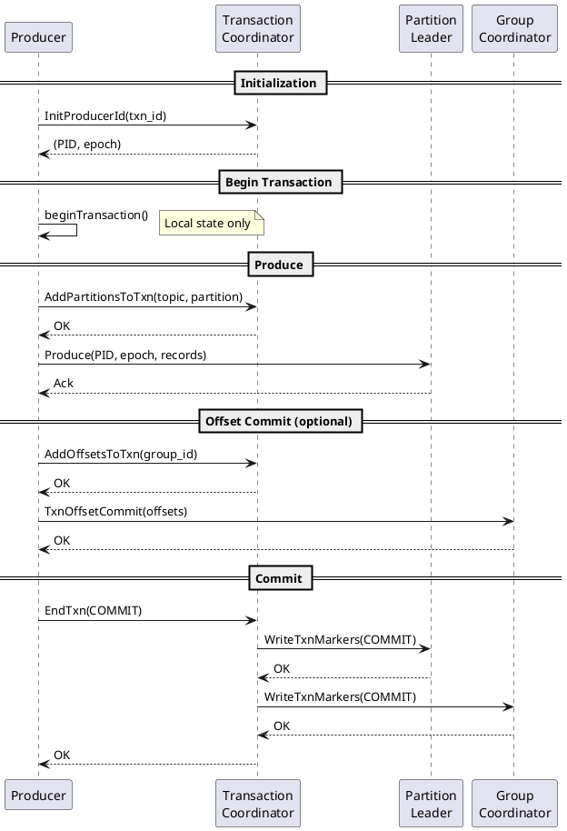
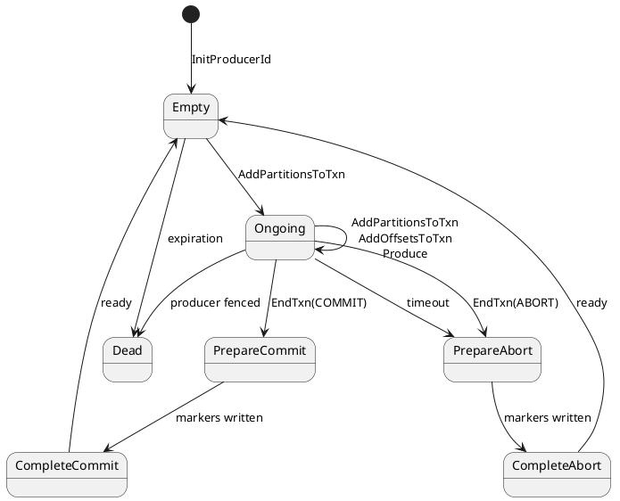
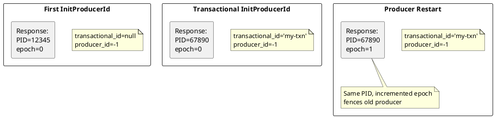
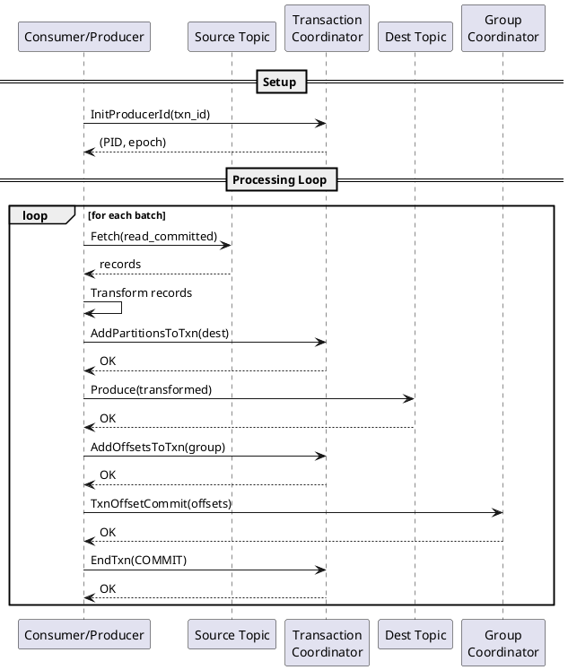
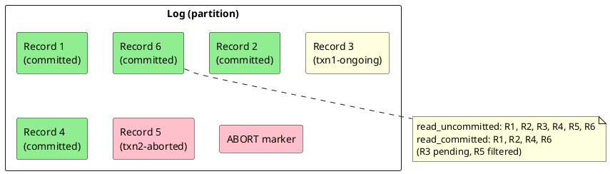
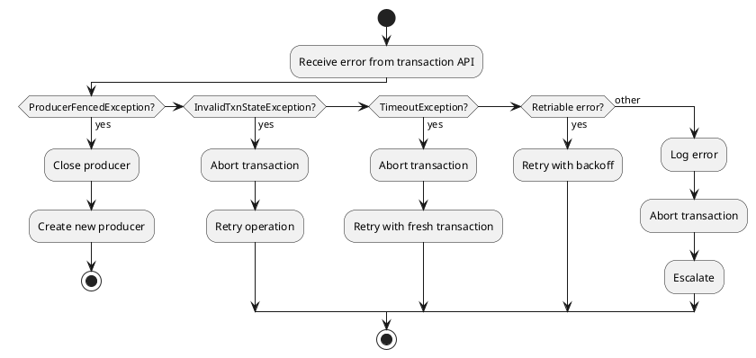

# Kafka Transaction Protocol APIs

This document specifies the Kafka protocol APIs used for transactions and exactly-once semantics. These APIs enable atomic writes across multiple partitions and exactly-once processing guarantees.

---

## Transaction API Reference

| API Key | Name | Purpose |
|:-------:|------|---------|
| 22 | InitProducerId | Initialize producer for idempotence/transactions |
| 24 | AddPartitionsToTxn | Add partitions to active transaction |
| 25 | AddOffsetsToTxn | Add consumer offsets to transaction |
| 26 | EndTxn | Commit or abort transaction |
| 27 | WriteTxnMarkers | Write transaction markers (internal) |
| 28 | TxnOffsetCommit | Commit offsets within transaction |
| 65 | DescribeTransactions | Describe active transactions |
| 66 | ListTransactions | List transactions on broker |

---

## Transaction Protocol Overview

### Transaction Lifecycle



### Transaction States



---

## InitProducerId API (Key 22)

### Overview

The InitProducerId API initializes a producer for idempotent or transactional operation by assigning a unique Producer ID (PID) and epoch.

### Version History

| Version | Kafka | Key Changes |
|:-------:|-------|-------------|
| 0 | 0.11.0 | Initial version |
| 1 | 2.0.0 | Transaction timeout validation |
| 2 | 2.4.0 | Flexible versions |
| 3 | 2.5.0 | KIP-360 producer ID recovery |
| 4 | 2.6.0 | KIP-588 |
| 5 | 3.9.0 | KIP-890 |

### Request Schema

```
InitProducerIdRequest =>
    transactional_id: NULLABLE_STRING
    transaction_timeout_ms: INT32
    producer_id: INT64
    producer_epoch: INT16
```

| Field | Type | Description |
|-------|------|-------------|
| `transactional_id` | NULLABLE_STRING | Transaction ID (null for idempotent only) |
| `transaction_timeout_ms` | INT32 | Transaction timeout |
| `producer_id` | INT64 | Existing PID to recover (-1 for new) |
| `producer_epoch` | INT16 | Existing epoch to recover (-1 for new) |

### Response Schema

```
InitProducerIdResponse =>
    throttle_time_ms: INT32
    error_code: INT16
    producer_id: INT64
    producer_epoch: INT16
```

| Field | Type | Description |
|-------|------|-------------|
| `producer_id` | INT64 | Assigned Producer ID |
| `producer_epoch` | INT16 | Producer epoch |

### Producer ID Semantics



### Behavioral Contract

| Aspect | Guarantee |
|--------|-----------|
| **PID uniqueness** | PID is globally unique per broker lifetime |
| **Epoch increment** | Epoch increments on each init with same transactional_id |
| **Fencing** | Old producers with same transactional_id are fenced |
| **Timeout** | Transaction must complete within transaction_timeout_ms |

### Error Handling

| Error Code | Retriable | Cause | Recovery |
|:----------:|:---------:|-------|----------|
| COORDINATOR_NOT_AVAILABLE | ✅ | Coordinator unavailable | Retry |
| NOT_COORDINATOR | ✅ | Wrong coordinator | FindCoordinator, retry |
| CONCURRENT_TRANSACTIONS | ✅ | Another init in progress | Wait, retry |
| INVALID_TRANSACTION_TIMEOUT | ❌ | Timeout out of range | Fix timeout |
| TRANSACTIONAL_ID_AUTHORIZATION_FAILED | ❌ | No permission | Check ACLs |

---

## AddPartitionsToTxn API (Key 24)

### Overview

The AddPartitionsToTxn API adds topic partitions to an active transaction before producing to them.

### Version History

| Version | Kafka | Key Changes |
|:-------:|-------|-------------|
| 0 | 0.11.0 | Initial version |
| 1 | 2.0.0 | Response improvements |
| 2 | 2.4.0 | Flexible versions |
| 3 | 2.7.0 | KIP-679 |
| 4 | 3.0.0 | KIP-679 batch support |
| 5 | 3.9.0 | KIP-890 |

### Request Schema

```
AddPartitionsToTxnRequest =>
    v3_and_below_transactional_id: STRING
    v3_and_below_producer_id: INT64
    v3_and_below_producer_epoch: INT16
    v3_and_below_topics: [Topic]
    transactions: [Transaction]

Topic =>
    name: STRING
    partitions: [INT32]

Transaction =>
    transactional_id: STRING
    producer_id: INT64
    producer_epoch: INT16
    verify_only: BOOLEAN
    topics: [Topic]
```

| Field | Type | Description |
|-------|------|-------------|
| `transactional_id` | STRING | Transaction identifier |
| `producer_id` | INT64 | Producer ID from InitProducerId |
| `producer_epoch` | INT16 | Producer epoch |
| `topics` | ARRAY | Partitions to add |

### Response Schema

```
AddPartitionsToTxnResponse =>
    throttle_time_ms: INT32
    error_code: INT16
    results_by_transaction: [TransactionResult]
    results_by_topic_v3_and_below: [TopicResult]

TopicResult =>
    name: STRING
    results_by_partition: [PartitionResult]

PartitionResult =>
    partition_index: INT32
    partition_error_code: INT16
```

### Behavioral Contract

| Aspect | Guarantee |
|--------|-----------|
| **Precondition** | Transaction must be ongoing (after InitProducerId) |
| **Idempotence** | Adding same partition multiple times is safe |
| **Order** | Must add partition before producing to it |

!!! warning "Produce Before Add"
    Producing to a partition before adding it to the transaction results in `INVALID_PRODUCER_EPOCH` or `UNKNOWN_PRODUCER_ID` error.

---

## AddOffsetsToTxn API (Key 25)

### Overview

The AddOffsetsToTxn API adds a consumer group's offsets to an active transaction, enabling exactly-once consume-transform-produce patterns.

### Version History

| Version | Kafka | Key Changes |
|:-------:|-------|-------------|
| 0 | 0.11.0 | Initial version |
| 1 | 2.0.0 | Response improvements |
| 2 | 2.4.0 | Flexible versions |
| 3 | 3.0.0 | KIP-679 |
| 4 | 3.9.0 | KIP-890 |

### Request Schema

```
AddOffsetsToTxnRequest =>
    transactional_id: STRING
    producer_id: INT64
    producer_epoch: INT16
    group_id: STRING
```

| Field | Type | Description |
|-------|------|-------------|
| `group_id` | STRING | Consumer group for offset commit |

### Response Schema

```
AddOffsetsToTxnResponse =>
    throttle_time_ms: INT32
    error_code: INT16
```

### Behavioral Contract

| Aspect | Guarantee |
|--------|-----------|
| **Coordination** | Offsets committed atomically with transaction |
| **Group ownership** | Does not require group membership |
| **Prerequisite** | Must call before TxnOffsetCommit |

---

## TxnOffsetCommit API (Key 28)

### Overview

The TxnOffsetCommit API commits consumer offsets as part of a transaction.

### Version History

| Version | Kafka | Key Changes |
|:-------:|-------|-------------|
| 0 | 0.11.0 | Initial version |
| 1 | 2.0.0 | Response improvements |
| 2 | 2.1.0 | KIP-98 |
| 3 | 2.4.0 | Flexible versions |
| 4 | 3.9.0 | KIP-890 |

### Request Schema

```
TxnOffsetCommitRequest =>
    transactional_id: STRING
    group_id: STRING
    producer_id: INT64
    producer_epoch: INT16
    generation_id: INT32
    member_id: STRING
    group_instance_id: NULLABLE_STRING
    topics: [Topic]

Topic =>
    name: STRING
    partitions: [Partition]

Partition =>
    partition_index: INT32
    committed_offset: INT64
    committed_leader_epoch: INT32
    committed_metadata: NULLABLE_STRING
```

| Field | Type | Description |
|-------|------|-------------|
| `generation_id` | INT32 | Consumer group generation (-1 if not member) |
| `member_id` | STRING | Consumer member ID (empty if not member) |
| `committed_offset` | INT64 | Offset to commit |

### Response Schema

```
TxnOffsetCommitResponse =>
    throttle_time_ms: INT32
    topics: [Topic]

Topic =>
    name: STRING
    partitions: [Partition]

Partition =>
    partition_index: INT32
    error_code: INT16
```

### Behavioral Contract

| Aspect | Guarantee |
|--------|-----------|
| **Atomicity** | Offsets committed/aborted with transaction |
| **Visibility** | Offsets visible after transaction commit |
| **Prerequisite** | Must call AddOffsetsToTxn first |

---

## EndTxn API (Key 26)

### Overview

The EndTxn API commits or aborts an active transaction.

### Version History

| Version | Kafka | Key Changes |
|:-------:|-------|-------------|
| 0 | 0.11.0 | Initial version |
| 1 | 2.0.0 | Response improvements |
| 2 | 2.4.0 | Flexible versions |
| 3 | 2.7.0 | KIP-360 |
| 4 | 3.9.0 | KIP-890 |

### Request Schema

```
EndTxnRequest =>
    transactional_id: STRING
    producer_id: INT64
    producer_epoch: INT16
    committed: BOOLEAN
```

| Field | Type | Description |
|-------|------|-------------|
| `committed` | BOOLEAN | true=COMMIT, false=ABORT |

### Response Schema

```
EndTxnResponse =>
    throttle_time_ms: INT32
    error_code: INT16
```

### Commit Process

```plantuml
@startuml

skinparam backgroundColor transparent

participant "Producer" as P
participant "Transaction\nCoordinator" as TC
participant "Partition\nLeaders" as PL
participant "__consumer_offsets\nLeader" as CO

P -> TC : EndTxn(COMMIT)
activate TC

TC -> TC : Move to PrepareCommit

par Write markers to partitions
    TC -> PL : WriteTxnMarkers(COMMIT)
    PL --> TC : OK
and Write markers to __consumer_offsets
    TC -> CO : WriteTxnMarkers(COMMIT)
    CO --> TC : OK
end

TC -> TC : Move to CompleteCommit
TC --> P : OK
deactivate TC

@enduml
```

### Behavioral Contract

| Aspect | Guarantee |
|--------|-----------|
| **Atomicity** | All partitions commit or abort together |
| **Durability** | Committed transactions survive broker failures |
| **Visibility** | After COMMIT, records visible to read_committed consumers |
| **Abort cleanup** | Aborted records filtered by read_committed consumers |

### Error Handling

| Error Code | Retriable | Cause | Recovery |
|:----------:|:---------:|-------|----------|
| INVALID_PRODUCER_ID_MAPPING | ❌ | PID not found | Reinitialize |
| INVALID_PRODUCER_EPOCH | ❌ | Producer fenced | Close producer |
| INVALID_TXN_STATE | ❌ | No active transaction | Start new transaction |
| COORDINATOR_NOT_AVAILABLE | ✅ | Coordinator down | Retry |
| CONCURRENT_TRANSACTIONS | ✅ | Another end in progress | Wait, retry |

---

## WriteTxnMarkers API (Key 27)

### Overview

The WriteTxnMarkers API is an internal API used by transaction coordinators to write commit/abort markers to partitions.

!!! note "Internal API"
    This API is used internally by the Kafka transaction protocol. Clients should not call this API directly.

### Version History

| Version | Kafka | Key Changes |
|:-------:|-------|-------------|
| 0 | 0.11.0 | Initial version |
| 1 | 2.4.0 | Flexible versions |

### Request Schema

```
WriteTxnMarkersRequest =>
    markers: [Marker]

Marker =>
    producer_id: INT64
    producer_epoch: INT16
    transaction_result: BOOLEAN
    topics: [Topic]
    coordinator_epoch: INT32

Topic =>
    name: STRING
    partition_indexes: [INT32]
```

| Field | Type | Description |
|-------|------|-------------|
| `transaction_result` | BOOLEAN | true=COMMIT, false=ABORT |
| `coordinator_epoch` | INT32 | Coordinator epoch for fencing |

### Response Schema

```
WriteTxnMarkersResponse =>
    markers: [Marker]

Marker =>
    producer_id: INT64
    topics: [Topic]

Topic =>
    name: STRING
    partitions: [Partition]

Partition =>
    partition_index: INT32
    error_code: INT16
```

---

## DescribeTransactions API (Key 65)

### Overview

The DescribeTransactions API retrieves information about active transactions.

### Version History

| Version | Kafka | Key Changes |
|:-------:|-------|-------------|
| 0 | 3.0.0 | Initial version |

### Request Schema

```
DescribeTransactionsRequest =>
    transactional_ids: [STRING]
```

### Response Schema

```
DescribeTransactionsResponse =>
    throttle_time_ms: INT32
    transaction_states: [TransactionState]

TransactionState =>
    error_code: INT16
    transactional_id: STRING
    transaction_state: STRING
    transaction_timeout_ms: INT32
    transaction_start_time_ms: INT64
    producer_id: INT64
    producer_epoch: INT16
    topics: [Topic]

Topic =>
    topic: STRING
    partitions: [INT32]
```

| Field | Type | Description |
|-------|------|-------------|
| `transaction_state` | STRING | Current state (Empty, Ongoing, etc.) |
| `transaction_start_time_ms` | INT64 | Transaction start timestamp |
| `topics` | ARRAY | Partitions in transaction |

---

## ListTransactions API (Key 66)

### Overview

The ListTransactions API lists transactions on a broker with optional filtering.

### Version History

| Version | Kafka | Key Changes |
|:-------:|-------|-------------|
| 0 | 3.0.0 | Initial version |
| 1 | 3.9.0 | KIP-890 |

### Request Schema

```
ListTransactionsRequest =>
    state_filters: [STRING]
    producer_id_filters: [INT64]
    duration_filter: INT64
```

| Field | Type | Description |
|-------|------|-------------|
| `state_filters` | ARRAY | Filter by state (empty for all) |
| `producer_id_filters` | ARRAY | Filter by PID (empty for all) |
| `duration_filter` | INT64 | Minimum transaction duration (ms) |

### Response Schema

```
ListTransactionsResponse =>
    throttle_time_ms: INT32
    error_code: INT16
    unknown_state_filters: [STRING]
    transaction_states: [TransactionState]

TransactionState =>
    transactional_id: STRING
    producer_id: INT64
    transaction_state: STRING
```

---

## Exactly-Once Processing Pattern

### Consume-Transform-Produce



### Isolation Level Interaction

| Consumer Isolation | Behavior |
|--------------------|----------|
| `read_uncommitted` | Sees all records including uncommitted |
| `read_committed` | Only sees committed records, filters aborted |



---

## Transaction Configuration

### Producer Configuration

| Setting | Default | Description |
|---------|:-------:|-------------|
| `transactional.id` | null | Unique transaction identifier |
| `transaction.timeout.ms` | 60000 | Maximum transaction duration |
| `enable.idempotence` | true | Required for transactions |

### Broker Configuration

| Setting | Default | Description |
|---------|:-------:|-------------|
| `transaction.state.log.replication.factor` | 3 | Replication for transaction log |
| `transaction.state.log.min.isr` | 2 | Min ISR for transaction log |
| `transactional.id.expiration.ms` | 604800000 | Transaction ID expiration |
| `transaction.max.timeout.ms` | 900000 | Maximum allowed timeout |

### Consumer Configuration

| Setting | Default | Description |
|---------|:-------:|-------------|
| `isolation.level` | read_uncommitted | Transaction isolation |

---

## Transaction Best Practices

### Producer Guidelines

| Practice | Rationale |
|----------|-----------|
| Use unique transactional.id per producer instance | Prevents conflicts |
| Keep transactions short | Avoid timeout and resource pressure |
| Handle ProducerFencedException | Indicates another producer took over |
| Abort on any error | Clean up partial transactions |

### Consumer Guidelines

| Practice | Rationale |
|----------|-----------|
| Use read_committed for exactly-once | Filter uncommitted and aborted |
| Process in batches within transactions | Amortize transaction overhead |
| Store offsets in transaction | Atomic offset updates |

### Error Recovery



---

## Related Documentation

- [Protocol Core APIs](protocol-apis-core.md) - Core APIs
- [Protocol Consumer APIs](protocol-apis-consumer.md) - Consumer group APIs
- [Protocol Admin APIs](protocol-apis-admin.md) - Administrative APIs
- [Protocol Errors](protocol-errors.md) - Error code reference
- [Failure Handling](failure-handling.md) - Idempotent producers
