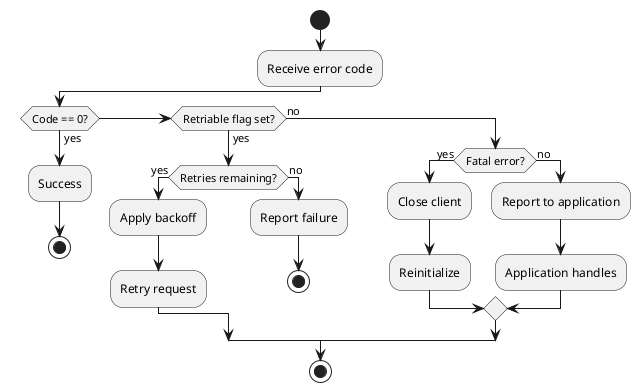
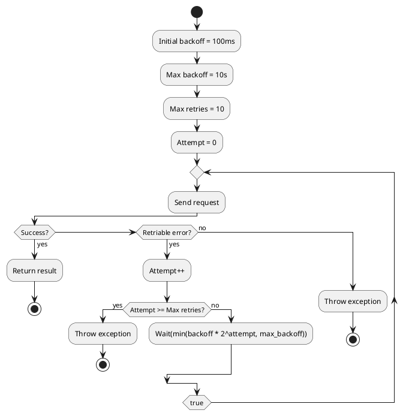
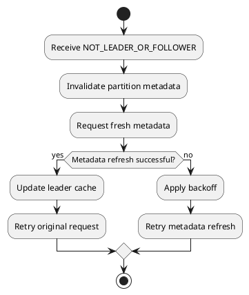
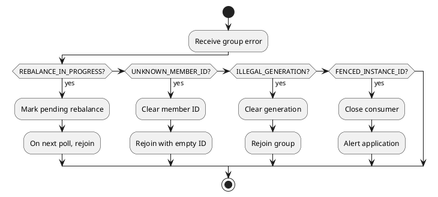

# Kafka Protocol Error Codes

This document provides a complete reference of all Kafka protocol error codes, including retriability classification, the introduced version, and default error messages.

---

## Error Code Classification

### Categories

| Category | Description | Client Action |
|----------|-------------|---------------|
| **Success** | Operation completed | Continue normally |
| **Retriable** | Temporary failure | Retry with backoff |
| **Non-Retriable** | Client error | Fix request and retry |
| **Fatal** | Unrecoverable | Close and reinitialize |

### Retriability Determination



---

## Complete Error Code Reference

The `Message` column is the default error message defined in Kafka source. Client handling decisions should be based on the error code and retriable status; patterns below outline typical handling flows.

### Success (0)

| Code | Name | Retriable | Introduced | Message |
| :----: | ------ | :---------: | :---------: | ------------- |
| 0 | NONE | N/A | 0.8.0 | null |

NONE has no default error message (null).

---

### Unknown and Generic Errors (-1 to 2)

| Code | Name | Retriable | Introduced | Message |
| :----: | ------ | :---------: | :---------: | ------------- |
| -1 | UNKNOWN_SERVER_ERROR | ❌ | 0.8.0 | The server experienced an unexpected error when processing the request. |
| 1 | OFFSET_OUT_OF_RANGE | ❌ | 0.8.0 | The requested offset is not within the range of offsets maintained by the server. |
| 2 | CORRUPT_MESSAGE | ✅ | 0.8.0 | This message has failed its CRC checksum, exceeds the valid size, has a null key for a compacted topic, or is otherwise corrupt. |

---

### Topic and Partition Errors (3-6)

| Code | Name | Retriable | Introduced | Message |
| :----: | ------ | :---------: | :---------: | ------------- |
| 3 | UNKNOWN_TOPIC_OR_PARTITION | ✅ | 0.8.0 | This server does not host this topic-partition. |
| 4 | INVALID_FETCH_SIZE | ❌ | 0.8.0 | The requested fetch size is invalid. |
| 5 | LEADER_NOT_AVAILABLE | ✅ | 0.8.0 | There is no leader for this topic-partition as we are in the middle of a leadership election. |
| 6 | NOT_LEADER_OR_FOLLOWER | ✅ | 0.8.0 | For requests intended only for the leader, this error indicates that the broker is not the current leader. For requests intended for any replica, this error indicates that the broker is not a replica of the topic partition. |

---

### Request Errors (7-15)

| Code | Name | Retriable | Introduced | Message |
| :----: | ------ | :---------: | :---------: | ------------- |
| 7 | REQUEST_TIMED_OUT | ✅ | 0.8.0 | The request timed out. |
| 8 | BROKER_NOT_AVAILABLE | ❌ | 0.8.0 | The broker is not available. |
| 9 | REPLICA_NOT_AVAILABLE | ✅ | 0.8.0 | The replica is not available for the requested topic-partition. Produce/Fetch requests and other requests intended only for the leader or follower return NOT_LEADER_OR_FOLLOWER if the broker is not a replica of the topic-partition. |
| 10 | MESSAGE_TOO_LARGE | ❌ | 0.8.0 | The request included a message larger than the max message size the server will accept. |
| 11 | STALE_CONTROLLER_EPOCH | ❌ | 0.8.0 | The controller moved to another broker. |
| 12 | OFFSET_METADATA_TOO_LARGE | ❌ | 0.8.1 | The metadata field of the offset request was too large. |
| 13 | NETWORK_EXCEPTION | ✅ | 0.8.1 | The server disconnected before a response was received. |
| 14 | COORDINATOR_LOAD_IN_PROGRESS | ✅ | 0.9.0.0 | The coordinator is loading and hence can't process requests. |
| 15 | COORDINATOR_NOT_AVAILABLE | ✅ | 0.9.0.0 | The coordinator is not available. |

---

### Coordinator Errors (16-19)

| Code | Name | Retriable | Introduced | Message |
| :----: | ------ | :---------: | :---------: | ------------- |
| 16 | NOT_COORDINATOR | ✅ | 0.9.0.0 | This is not the correct coordinator. |
| 17 | INVALID_TOPIC_EXCEPTION | ❌ | 0.8.2.0 | The request attempted to perform an operation on an invalid topic. |
| 18 | RECORD_LIST_TOO_LARGE | ❌ | 0.8.2.0 | The request included message batch larger than the configured segment size on the server. |
| 19 | NOT_ENOUGH_REPLICAS | ✅ | 0.8.2.0 | Messages are rejected since there are fewer in-sync replicas than required. |

---

### Replication Errors (20-23)

| Code | Name | Retriable | Introduced | Message |
| :----: | ------ | :---------: | :---------: | ------------- |
| 20 | NOT_ENOUGH_REPLICAS_AFTER_APPEND | ✅ | 0.8.2.0 | Messages are written to the log, but to fewer in-sync replicas than required. |
| 21 | INVALID_REQUIRED_ACKS | ❌ | 0.9.0.0 | Produce request specified an invalid value for required acks. |
| 22 | ILLEGAL_GENERATION | ❌ | 0.9.0.0 | Specified group generation id is not valid. |
| 23 | INCONSISTENT_GROUP_PROTOCOL | ❌ | 0.9.0.0 | The group member's supported protocols are incompatible with those of existing members or first group member tried to join with empty protocol type or empty protocol list. |

---

### Consumer Group Errors (24-28)

| Code | Name | Retriable | Introduced | Message |
| :----: | ------ | :---------: | :---------: | ------------- |
| 24 | INVALID_GROUP_ID | ❌ | 0.9.0.0 | The group id is invalid. |
| 25 | UNKNOWN_MEMBER_ID | ❌ | 0.9.0.0 | The coordinator is not aware of this member. |
| 26 | INVALID_SESSION_TIMEOUT | ❌ | 0.9.0.0 | The session timeout is not within the range allowed by the broker (as configured by group.min.session.timeout.ms and group.max.session.timeout.ms). |
| 27 | REBALANCE_IN_PROGRESS | ❌ | 0.9.0.0 | The group is rebalancing, so a rejoin is needed. |
| 28 | INVALID_COMMIT_OFFSET_SIZE | ❌ | 0.9.0.0 | The committing offset data size is not valid. |

---

### Authorization Errors (29-31)

| Code | Name | Retriable | Introduced | Message |
| :----: | ------ | :---------: | :---------: | ------------- |
| 29 | TOPIC_AUTHORIZATION_FAILED | ❌ | 0.9.0.0 | Topic authorization failed. |
| 30 | GROUP_AUTHORIZATION_FAILED | ❌ | 0.9.0.0 | Group authorization failed. |
| 31 | CLUSTER_AUTHORIZATION_FAILED | ❌ | 0.9.0.0 | Cluster authorization failed. |

---

### Configuration and State Errors (32-40)

| Code | Name | Retriable | Introduced | Message |
| :----: | ------ | :---------: | :---------: | ------------- |
| 32 | INVALID_TIMESTAMP | ❌ | 0.10.0.0 | The timestamp of the message is out of acceptable range. |
| 33 | UNSUPPORTED_SASL_MECHANISM | ❌ | 0.10.0.0 | The broker does not support the requested SASL mechanism. |
| 34 | ILLEGAL_SASL_STATE | ❌ | 0.10.0.0 | Request is not valid given the current SASL state. |
| 35 | UNSUPPORTED_VERSION | ❌ | 0.10.0.0 | The version of API is not supported. |
| 36 | TOPIC_ALREADY_EXISTS | ❌ | 0.10.1.0 | Topic with this name already exists. |
| 37 | INVALID_PARTITIONS | ❌ | 0.10.1.0 | Number of partitions is below 1. |
| 38 | INVALID_REPLICATION_FACTOR | ❌ | 0.10.1.0 | Replication factor is below 1 or larger than the number of available brokers. |
| 39 | INVALID_REPLICA_ASSIGNMENT | ❌ | 0.10.1.0 | Replica assignment is invalid. |
| 40 | INVALID_CONFIG | ❌ | 0.10.1.0 | Configuration is invalid. |

---

### Controller Errors (41-46)

| Code | Name | Retriable | Introduced | Message |
| :----: | ------ | :---------: | :---------: | ------------- |
| 41 | NOT_CONTROLLER | ✅ | 0.10.1.0 | This is not the correct controller for this cluster. |
| 42 | INVALID_REQUEST | ❌ | 0.10.1.0 | This most likely occurs because of a request being malformed by the client library or the message was sent to an incompatible broker. See the broker logs for more details. |
| 43 | UNSUPPORTED_FOR_MESSAGE_FORMAT | ❌ | 0.10.1.0 | The message format version on the broker does not support the request. |
| 44 | POLICY_VIOLATION | ❌ | 0.10.2.0 | Request parameters do not satisfy the configured policy. |
| 45 | OUT_OF_ORDER_SEQUENCE_NUMBER | ❌ | 0.11.0.0 | The broker received an out of order sequence number. |
| 46 | DUPLICATE_SEQUENCE_NUMBER | ❌ | 0.11.0.0 | The broker received a duplicate sequence number. |

---

### Transaction Errors (47-57)

| Code | Name | Retriable | Introduced | Message |
| :----: | ------ | :---------: | :---------: | ------------- |
| 47 | INVALID_PRODUCER_EPOCH | ❌ | 0.11.0.0 | Producer attempted to produce with an old epoch. |
| 48 | INVALID_TXN_STATE | ❌ | 0.11.0.0 | The producer attempted a transactional operation in an invalid state. |
| 49 | INVALID_PRODUCER_ID_MAPPING | ❌ | 0.11.0.0 | The producer attempted to use a producer id which is not currently assigned to its transactional id. |
| 50 | INVALID_TRANSACTION_TIMEOUT | ❌ | 0.11.0.0 | The transaction timeout is larger than the maximum value allowed by the broker (as configured by transaction.max.timeout.ms). |
| 51 | CONCURRENT_TRANSACTIONS | ✅ | 0.11.0.0 | The producer attempted to update a transaction while another concurrent operation on the same transaction was ongoing. |
| 52 | TRANSACTION_COORDINATOR_FENCED | ❌ | 0.11.0.0 | Indicates that the transaction coordinator sending a WriteTxnMarker is no longer the current coordinator for a given producer. |
| 53 | TRANSACTIONAL_ID_AUTHORIZATION_FAILED | ❌ | 0.11.0.0 | Transactional Id authorization failed. |
| 54 | SECURITY_DISABLED | ❌ | 0.11.0.0 | Security features are disabled. |
| 55 | OPERATION_NOT_ATTEMPTED | ❌ | 0.11.0.0 | The broker did not attempt to execute this operation. This may happen for batched RPCs where some operations in the batch failed, causing the broker to respond without trying the rest. |
| 56 | KAFKA_STORAGE_ERROR | ✅ | 1.0.0 | Disk error when trying to access log file on the disk. |
| 57 | LOG_DIR_NOT_FOUND | ❌ | 1.0.0 | The user-specified log directory is not found in the broker config. |

---

### Additional Errors (58-75)

| Code | Name | Retriable | Introduced | Message |
| :----: | ------ | :---------: | :---------: | ------------- |
| 58 | SASL_AUTHENTICATION_FAILED | ❌ | 1.0.0 | SASL Authentication failed. |
| 59 | UNKNOWN_PRODUCER_ID | ❌ | 1.0.0 | This exception is raised by the broker if it could not locate the producer metadata associated with the producerId in question. This could happen if, for instance, the producer's records were deleted because their retention time had elapsed. Once the last records of the producerId are removed, the producer's metadata is removed from the broker, and future appends by the producer will return this exception. |
| 60 | REASSIGNMENT_IN_PROGRESS | ❌ | 1.0.0 | A partition reassignment is in progress. |
| 61 | DELEGATION_TOKEN_AUTH_DISABLED | ❌ | 1.1.0 | Delegation Token feature is not enabled. |
| 62 | DELEGATION_TOKEN_NOT_FOUND | ❌ | 1.1.0 | Delegation Token is not found on server. |
| 63 | DELEGATION_TOKEN_OWNER_MISMATCH | ❌ | 1.1.0 | Specified Principal is not valid Owner/Renewer. |
| 64 | DELEGATION_TOKEN_REQUEST_NOT_ALLOWED | ❌ | 1.1.0 | Delegation Token requests are not allowed on PLAINTEXT/1-way SSL channels and on delegation token authenticated channels. |
| 65 | DELEGATION_TOKEN_AUTHORIZATION_FAILED | ❌ | 1.1.0 | Delegation Token authorization failed. |
| 66 | DELEGATION_TOKEN_EXPIRED | ❌ | 1.1.0 | Delegation Token is expired. |
| 67 | INVALID_PRINCIPAL_TYPE | ❌ | 1.1.0 | Supplied principalType is not supported. |
| 68 | NON_EMPTY_GROUP | ❌ | 1.1.0 | The group is not empty. |
| 69 | GROUP_ID_NOT_FOUND | ❌ | 1.1.0 | The group id does not exist. |
| 70 | FETCH_SESSION_ID_NOT_FOUND | ✅ | 1.1.0 | The fetch session ID was not found. |
| 71 | INVALID_FETCH_SESSION_EPOCH | ✅ | 1.1.0 | The fetch session epoch is invalid. |
| 72 | LISTENER_NOT_FOUND | ✅ | 2.0.0 | There is no listener on the leader broker that matches the listener on which metadata request was processed. |
| 73 | TOPIC_DELETION_DISABLED | ❌ | 2.1.0 | Topic deletion is disabled. |
| 74 | FENCED_LEADER_EPOCH | ✅ | 2.1.0 | The leader epoch in the request is older than the epoch on the broker. |
| 75 | UNKNOWN_LEADER_EPOCH | ✅ | 2.1.0 | The leader epoch in the request is newer than the epoch on the broker. |

---

### Extended Errors (76-100)

| Code | Name | Retriable | Introduced | Message |
| :----: | ------ | :---------: | :---------: | ------------- |
| 76 | UNSUPPORTED_COMPRESSION_TYPE | ❌ | 2.1.0 | The requesting client does not support the compression type of given partition. |
| 77 | STALE_BROKER_EPOCH | ❌ | 2.2.0 | Broker epoch has changed. |
| 78 | OFFSET_NOT_AVAILABLE | ✅ | 2.2.0 | The leader high watermark has not caught up from a recent leader election so the offsets cannot be guaranteed to be monotonically increasing. |
| 79 | MEMBER_ID_REQUIRED | ❌ | 2.2.0 | The group member needs to have a valid member id before actually entering a consumer group. |
| 80 | PREFERRED_LEADER_NOT_AVAILABLE | ✅ | 2.2.0 | The preferred leader was not available. |
| 81 | GROUP_MAX_SIZE_REACHED | ❌ | 2.2.0 | The group has reached its maximum size. |
| 82 | FENCED_INSTANCE_ID | ❌ | 2.3.0 | The broker rejected this static consumer since another consumer with the same group.instance.id has registered with a different member.id. |
| 83 | ELIGIBLE_LEADERS_NOT_AVAILABLE | ✅ | 2.4.0 | Eligible topic partition leaders are not available. |
| 84 | ELECTION_NOT_NEEDED | ✅ | 2.4.0 | Leader election not needed for topic partition. |
| 85 | NO_REASSIGNMENT_IN_PROGRESS | ❌ | 2.4.0 | No partition reassignment is in progress. |
| 86 | GROUP_SUBSCRIBED_TO_TOPIC | ❌ | 2.4.0 | Deleting offsets of a topic is forbidden while the consumer group is actively subscribed to it. |
| 87 | INVALID_RECORD | ❌ | 2.4.0 | This record has failed the validation on broker and hence will be rejected. |
| 88 | UNSTABLE_OFFSET_COMMIT | ✅ | 2.5.0 | There are unstable offsets that need to be cleared. |
| 89 | THROTTLING_QUOTA_EXCEEDED | ✅ | 2.7.0 | The throttling quota has been exceeded. |
| 90 | PRODUCER_FENCED | ❌ | 2.7.0 | There is a newer producer with the same transactionalId which fences the current one. |
| 91 | RESOURCE_NOT_FOUND | ❌ | 2.7.0 | A request illegally referred to a resource that does not exist. |
| 92 | DUPLICATE_RESOURCE | ❌ | 2.7.0 | A request illegally referred to the same resource twice. |
| 93 | UNACCEPTABLE_CREDENTIAL | ❌ | 2.7.0 | Requested credential would not meet criteria for acceptability. |
| 94 | INCONSISTENT_VOTER_SET | ❌ | 2.7.0 | Indicates that the either the sender or recipient of a voter-only request is not one of the expected voters. |
| 95 | INVALID_UPDATE_VERSION | ❌ | 2.7.0 | The given update version was invalid. |
| 96 | FEATURE_UPDATE_FAILED | ❌ | 2.7.0 | Unable to update finalized features due to an unexpected server error. |
| 97 | PRINCIPAL_DESERIALIZATION_FAILURE | ❌ | 2.8.0 | Request principal deserialization failed during forwarding. This indicates an internal error on the broker cluster security setup. |
| 98 | SNAPSHOT_NOT_FOUND | ❌ | 2.8.0 | Requested snapshot was not found. |
| 99 | POSITION_OUT_OF_RANGE | ❌ | 4.1.0 | Requested position is not greater than or equal to zero, and less than the size of the snapshot. |
| 100 | UNKNOWN_TOPIC_ID | ✅ | 2.8.0 | This server does not host this topic ID. |

---

### Recent Errors (101-120)

| Code | Name | Retriable | Introduced | Message |
| :----: | ------ | :---------: | :---------: | ------------- |
| 101 | DUPLICATE_BROKER_REGISTRATION | ❌ | 2.8.0 | This broker ID is already in use. |
| 102 | BROKER_ID_NOT_REGISTERED | ❌ | 2.8.0 | The given broker ID was not registered. |
| 103 | INCONSISTENT_TOPIC_ID | ✅ | 2.8.0 | The log's topic ID did not match the topic ID in the request. |
| 104 | INCONSISTENT_CLUSTER_ID | ❌ | 2.8.0 | The clusterId in the request does not match that found on the server. |
| 105 | TRANSACTIONAL_ID_NOT_FOUND | ❌ | 3.0.0 | The transactionalId could not be found. |
| 106 | FETCH_SESSION_TOPIC_ID_ERROR | ✅ | 3.1.0 | The fetch session encountered inconsistent topic ID usage. |
| 107 | INELIGIBLE_REPLICA | ❌ | 3.3.0 | The new ISR contains at least one ineligible replica. |
| 108 | NEW_LEADER_ELECTED | ❌ | 3.3.0 | The AlterPartition request successfully updated the partition state but the leader has changed. |
| 109 | OFFSET_MOVED_TO_TIERED_STORAGE | ❌ | 3.5.0 | The requested offset is moved to tiered storage. |
| 110 | FENCED_MEMBER_EPOCH | ❌ | 3.5.0 | The member epoch is fenced by the group coordinator. The member must abandon all its partitions and rejoin. |
| 111 | UNRELEASED_INSTANCE_ID | ❌ | 3.5.0 | The instance ID is still used by another member in the consumer group. That member must leave first. |
| 112 | UNSUPPORTED_ASSIGNOR | ❌ | 3.5.0 | The assignor or its version range is not supported by the consumer group. |
| 113 | STALE_MEMBER_EPOCH | ❌ | 3.6.0 | The member epoch is stale. The member must retry after receiving its updated member epoch via the ConsumerGroupHeartbeat API. |
| 114 | MISMATCHED_ENDPOINT_TYPE | ❌ | 3.7.0 | The request was sent to an endpoint of the wrong type. |
| 115 | UNSUPPORTED_ENDPOINT_TYPE | ❌ | 3.7.0 | This endpoint type is not supported yet. |
| 116 | UNKNOWN_CONTROLLER_ID | ❌ | 3.7.0 | This controller ID is not known. |
| 117 | UNKNOWN_SUBSCRIPTION_ID | ❌ | 3.7.0 | Client sent a push telemetry request with an invalid or outdated subscription ID. |
| 118 | TELEMETRY_TOO_LARGE | ❌ | 3.7.0 | Client sent a push telemetry request larger than the maximum size the broker will accept. |
| 119 | INVALID_REGISTRATION | ❌ | 3.7.0 | The controller has considered the broker registration to be invalid. |
| 120 | TRANSACTION_ABORTABLE | ❌ | 3.8.0 | The server encountered an error with the transaction. The client can abort the transaction to continue using this transactional ID. |

---

### Share Group Errors (121-133)

| Code | Name | Retriable | Introduced | Message |
| :----: | ------ | :---------: | :---------: | ------------- |
| 121 | INVALID_RECORD_STATE | ❌ | 3.9.0 | The record state is invalid. The acknowledgement of delivery could not be completed. |
| 122 | SHARE_SESSION_NOT_FOUND | ✅ | 3.9.0 | The share session was not found. |
| 123 | INVALID_SHARE_SESSION_EPOCH | ✅ | 3.9.0 | The share session epoch is invalid. |
| 124 | FENCED_STATE_EPOCH | ❌ | 3.9.0 | The share coordinator rejected the request because the share-group state epoch did not match. |
| 125 | INVALID_VOTER_KEY | ❌ | 3.9.0 | The voter key doesn't match the receiving replica's key. |
| 126 | DUPLICATE_VOTER | ❌ | 3.9.0 | The voter is already part of the set of voters. |
| 127 | VOTER_NOT_FOUND | ❌ | 3.9.0 | The voter is not part of the set of voters. |
| 128 | INVALID_REGULAR_EXPRESSION | ❌ | 4.0.0 | The regular expression is not valid. |
| 129 | REBOOTSTRAP_REQUIRED | ❌ | 4.0.0 | Client metadata is stale. The client should rebootstrap to obtain new metadata. |
| 130 | STREAMS_INVALID_TOPOLOGY | ❌ | 4.1.0 | The supplied topology is invalid. |
| 131 | STREAMS_INVALID_TOPOLOGY_EPOCH | ❌ | 4.1.0 | The supplied topology epoch is invalid. |
| 132 | STREAMS_TOPOLOGY_FENCED | ❌ | 4.1.0 | The supplied topology epoch is outdated. |
| 133 | SHARE_SESSION_LIMIT_REACHED | ✅ | 4.1.0 | The limit of share sessions has been reached. |

---

## Error Handling Patterns

### Retry with Exponential Backoff



### Metadata Refresh Pattern

For errors 3, 5, 6, 74, 75, 100, 103:



### Consumer Group Handling Pattern

For errors 22, 25, 27, 82, 110:



---

## Error Response Format

### Standard Error Response Fields

Many Kafka response schemas include error information:

```
Response =>
    throttle_time_ms: INT32
    error_code: INT16
    error_message: NULLABLE_STRING  (when present)
```

| Field | Description |
|-------|-------------|
| `throttle_time_ms` | Client should delay by this amount when present |
| `error_code` | Error code (0 = success) when present |
| `error_message` | Human-readable error description when present |

### Per-Partition Errors

Many APIs return per-partition errors:

```
PartitionResponse =>
    partition_index: INT32
    error_code: INT16
    ...
```

Clients must check error_code for each partition independently, even if a top-level error is not present.

---

## Throttling

### Throttle Response Handling

When `throttle_time_ms > 0`:

| Requirement | Level |
|-------------|-------|
| Client should delay next request by throttle_time_ms | should |
| Client may ignore throttle_time_ms | may |
| Broker may reject requests during throttle | may |

### Quota Error (89)

`THROTTLING_QUOTA_EXCEEDED` indicates the client has exceeded its quota:

| Quota Type | Scope |
|------------|-------|
| Produce | Bytes/second (scope depends on quota configuration) |
| Fetch | Bytes/second (scope depends on quota configuration) |
| Request | Requests/second (scope depends on quota configuration) |

---

## Version Compatibility

Each row includes an `Introduced` version derived from the first Kafka release tag where the error code appears in source. For 0.8.x this comes from `core/src/main/scala/kafka/common/ErrorMapping.scala`; for 0.9.0+ it comes from `clients/src/main/java/org/apache/kafka/common/protocol/Errors.java`.

### Handling Unknown Errors

Clients should handle unknown error codes gracefully:

```
if (error_code not recognized) {
    treat as non-retriable
    log error_code and error_message
    report to application
}
```

---

## Related Documentation

- [Protocol APIs Core](protocol-apis-core.md) - Core API reference
- [Protocol APIs Consumer](protocol-apis-consumer.md) - Consumer APIs
- [Protocol APIs Transaction](protocol-apis-transaction.md) - Transaction APIs
- [Failure Handling](failure-handling.md) - Error recovery patterns
