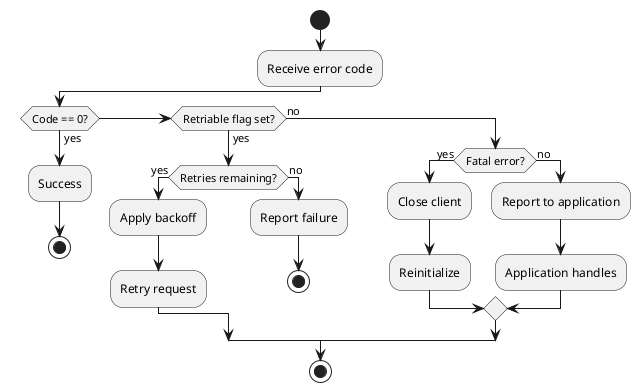
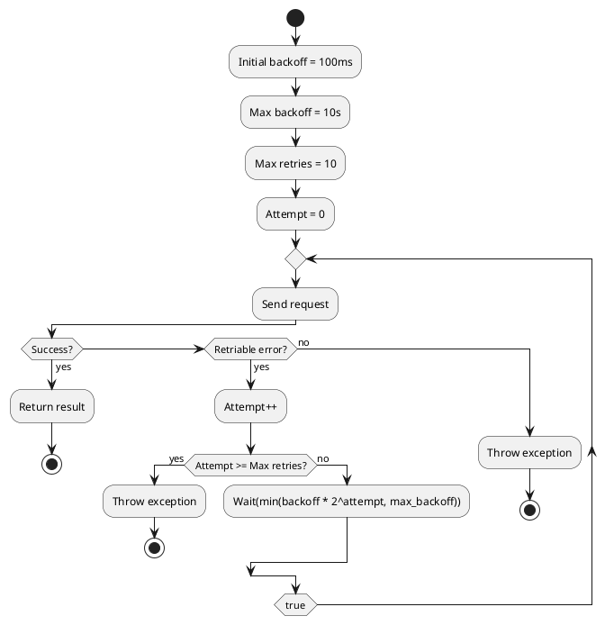
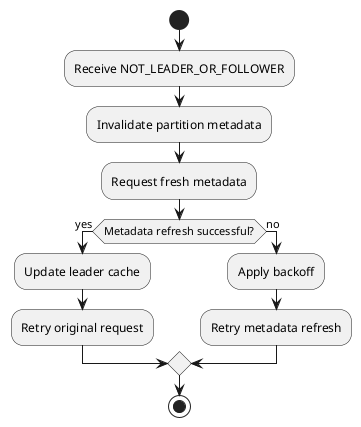
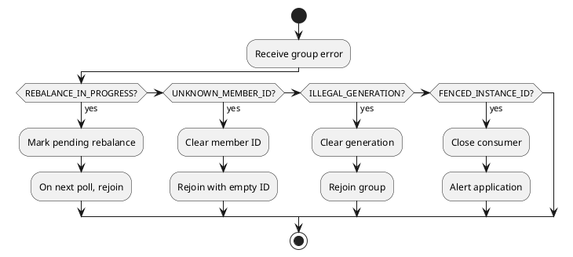

# Kafka Protocol Error Codes

This document provides a complete reference of all Kafka protocol error codes, including their retriability classification, common causes, and recommended recovery actions.

---

## Error Code Classification

### Categories

| Category | Description | Client Action |
|----------|-------------|---------------|
| **Success** | Operation completed | Continue normally |
| **Retriable** | Temporary failure | Retry with backoff |
| **Non-Retriable** | Client error | Fix request and retry |
| **Fatal** | Unrecoverable | Close and reinitialize |

### Retriability Determination



---

## Complete Error Code Reference

### Success (0)

| Code | Name | Retriable | Description |
|:----:|------|:---------:|-------------|
| 0 | NONE | N/A | Operation successful |

---

### Unknown and Generic Errors (-1 to 2)

| Code | Name | Retriable | Description | Recovery |
|:----:|------|:---------:|-------------|----------|
| -1 | UNKNOWN_SERVER_ERROR | ❌ | Unexpected server error | Check broker logs |
| 1 | OFFSET_OUT_OF_RANGE | ❌ | Requested offset invalid | Reset offset position |
| 2 | CORRUPT_MESSAGE | ❌ | Message CRC check failed | Check data integrity |

---

### Topic and Partition Errors (3-6)

| Code | Name | Retriable | Description | Recovery |
|:----:|------|:---------:|-------------|----------|
| 3 | UNKNOWN_TOPIC_OR_PARTITION | ✅ | Topic/partition not found | Refresh metadata, retry |
| 4 | INVALID_FETCH_SIZE | ❌ | Fetch size invalid | Fix fetch configuration |
| 5 | LEADER_NOT_AVAILABLE | ✅ | Leader election in progress | Wait, refresh metadata |
| 6 | NOT_LEADER_OR_FOLLOWER | ✅ | Request sent to non-leader | Refresh metadata, retry |

---

### Request Errors (7-15)

| Code | Name | Retriable | Description | Recovery |
|:----:|------|:---------:|-------------|----------|
| 7 | REQUEST_TIMED_OUT | ✅ | Broker timeout | Retry with backoff |
| 8 | BROKER_NOT_AVAILABLE | ✅ | Broker shutting down | Retry different broker |
| 9 | REPLICA_NOT_AVAILABLE | ✅ | Replica unavailable | Retry |
| 10 | MESSAGE_TOO_LARGE | ❌ | Message exceeds max size | Reduce message size |
| 11 | STALE_CONTROLLER_EPOCH | ❌ | Controller epoch stale | Internal error |
| 12 | OFFSET_METADATA_TOO_LARGE | ❌ | Offset metadata too large | Reduce metadata size |
| 13 | NETWORK_EXCEPTION | ✅ | Network error | Reconnect, retry |
| 14 | COORDINATOR_LOAD_IN_PROGRESS | ✅ | Coordinator loading | Wait, retry |
| 15 | COORDINATOR_NOT_AVAILABLE | ✅ | Coordinator unavailable | FindCoordinator, retry |

---

### Coordinator Errors (16-19)

| Code | Name | Retriable | Description | Recovery |
|:----:|------|:---------:|-------------|----------|
| 16 | NOT_COORDINATOR | ✅ | Wrong coordinator | FindCoordinator, retry |
| 17 | INVALID_TOPIC_EXCEPTION | ❌ | Invalid topic name | Fix topic name |
| 18 | RECORD_LIST_TOO_LARGE | ❌ | Batch too large | Reduce batch size |
| 19 | NOT_ENOUGH_REPLICAS | ✅ | ISR below min.insync.replicas | Wait, retry |

---

### Replication Errors (20-23)

| Code | Name | Retriable | Description | Recovery |
|:----:|------|:---------:|-------------|----------|
| 20 | NOT_ENOUGH_REPLICAS_AFTER_APPEND | ✅ | ISR shrunk during write | Retry |
| 21 | INVALID_REQUIRED_ACKS | ❌ | Invalid acks value | Fix acks configuration |
| 22 | ILLEGAL_GENERATION | ❌ | Consumer generation invalid | Rejoin group |
| 23 | INCONSISTENT_GROUP_PROTOCOL | ❌ | Protocol mismatch in group | Fix protocol configuration |

---

### Consumer Group Errors (24-28)

| Code | Name | Retriable | Description | Recovery |
|:----:|------|:---------:|-------------|----------|
| 24 | INVALID_GROUP_ID | ❌ | Invalid group ID | Fix group ID |
| 25 | UNKNOWN_MEMBER_ID | ❌ | Unknown consumer member | Rejoin group |
| 26 | INVALID_SESSION_TIMEOUT | ❌ | Session timeout invalid | Fix timeout |
| 27 | REBALANCE_IN_PROGRESS | ✅ | Group rebalancing | Rejoin group |
| 28 | INVALID_COMMIT_OFFSET_SIZE | ❌ | Offset commit too large | Reduce commit size |

---

### Authorization Errors (29-31)

| Code | Name | Retriable | Description | Recovery |
|:----:|------|:---------:|-------------|----------|
| 29 | TOPIC_AUTHORIZATION_FAILED | ❌ | No topic permission | Check ACLs |
| 30 | GROUP_AUTHORIZATION_FAILED | ❌ | No group permission | Check ACLs |
| 31 | CLUSTER_AUTHORIZATION_FAILED | ❌ | No cluster permission | Check ACLs |

---

### Configuration and State Errors (32-40)

| Code | Name | Retriable | Description | Recovery |
|:----:|------|:---------:|-------------|----------|
| 32 | INVALID_TIMESTAMP | ❌ | Invalid record timestamp | Fix timestamp |
| 33 | UNSUPPORTED_SASL_MECHANISM | ❌ | SASL mechanism not supported | Use supported mechanism |
| 34 | ILLEGAL_SASL_STATE | ❌ | Invalid SASL state | Reconnect |
| 35 | UNSUPPORTED_VERSION | ❌ | API version not supported | Use supported version |
| 36 | TOPIC_ALREADY_EXISTS | ❌ | Topic exists | Skip or use existing |
| 37 | INVALID_PARTITIONS | ❌ | Invalid partition count | Fix partition count |
| 38 | INVALID_REPLICATION_FACTOR | ❌ | Invalid replication factor | Fix RF |
| 39 | INVALID_REPLICA_ASSIGNMENT | ❌ | Invalid replica assignment | Fix assignment |
| 40 | INVALID_CONFIG | ❌ | Invalid configuration | Fix config value |

---

### Controller Errors (41-46)

| Code | Name | Retriable | Description | Recovery |
|:----:|------|:---------:|-------------|----------|
| 41 | NOT_CONTROLLER | ✅ | Broker not controller | Find controller, retry |
| 42 | INVALID_REQUEST | ❌ | Malformed request | Fix request |
| 43 | UNSUPPORTED_FOR_MESSAGE_FORMAT | ❌ | Feature unsupported for format | Upgrade message format |
| 44 | POLICY_VIOLATION | ❌ | Policy check failed | Check policies |
| 45 | OUT_OF_ORDER_SEQUENCE_NUMBER | ❌ | Sequence number gap | Fatal for idempotent |
| 46 | DUPLICATE_SEQUENCE_NUMBER | ❌ | Duplicate sequence (idempotent dedup) | Success (deduped) |

---

### Transaction Errors (47-57)

| Code | Name | Retriable | Description | Recovery |
|:----:|------|:---------:|-------------|----------|
| 47 | INVALID_PRODUCER_EPOCH | ❌ | Producer fenced | Close producer |
| 48 | INVALID_TXN_STATE | ❌ | Invalid transaction state | Abort transaction |
| 49 | INVALID_PRODUCER_ID_MAPPING | ❌ | PID mapping not found | Reinitialize |
| 50 | INVALID_TRANSACTION_TIMEOUT | ❌ | Transaction timeout invalid | Fix timeout |
| 51 | CONCURRENT_TRANSACTIONS | ✅ | Another txn in progress | Wait, retry |
| 52 | TRANSACTION_COORDINATOR_FENCED | ❌ | Coordinator fenced | Reinitialize |
| 53 | TRANSACTIONAL_ID_AUTHORIZATION_FAILED | ❌ | No txn permission | Check ACLs |
| 54 | SECURITY_DISABLED | ❌ | Security not enabled | Enable security |
| 55 | OPERATION_NOT_ATTEMPTED | ❌ | Operation skipped | Check other errors |
| 56 | KAFKA_STORAGE_ERROR | ✅ | Disk error | Retry different broker |
| 57 | LOG_DIR_NOT_FOUND | ❌ | Log directory missing | Check broker config |

---

### Additional Errors (58-75)

| Code | Name | Retriable | Description | Recovery |
|:----:|------|:---------:|-------------|----------|
| 58 | SASL_AUTHENTICATION_FAILED | ❌ | SASL auth failed | Check credentials |
| 59 | UNKNOWN_PRODUCER_ID | ❌ | PID expired or unknown | Reinitialize |
| 60 | REASSIGNMENT_IN_PROGRESS | ❌ | Partition reassigning | Wait for completion |
| 61 | DELEGATION_TOKEN_AUTH_DISABLED | ❌ | Delegation tokens disabled | Enable or use other auth |
| 62 | DELEGATION_TOKEN_NOT_FOUND | ❌ | Token not found | Create new token |
| 63 | DELEGATION_TOKEN_OWNER_MISMATCH | ❌ | Wrong token owner | Use correct token |
| 64 | DELEGATION_TOKEN_REQUEST_NOT_ALLOWED | ❌ | Token request not allowed | Check permissions |
| 65 | DELEGATION_TOKEN_AUTHORIZATION_FAILED | ❌ | No token permission | Check ACLs |
| 66 | DELEGATION_TOKEN_EXPIRED | ❌ | Token expired | Renew or create new |
| 67 | INVALID_PRINCIPAL_TYPE | ❌ | Invalid principal | Fix principal |
| 68 | NON_EMPTY_GROUP | ❌ | Group has members | Remove members first |
| 69 | GROUP_ID_NOT_FOUND | ❌ | Group not found | Create group |
| 70 | FETCH_SESSION_ID_NOT_FOUND | ✅ | Session expired | Start new session |
| 71 | INVALID_FETCH_SESSION_EPOCH | ✅ | Session epoch invalid | Start new session |
| 72 | LISTENER_NOT_FOUND | ❌ | Listener not configured | Check broker config |
| 73 | TOPIC_DELETION_DISABLED | ❌ | Deletion disabled | Enable deletion |
| 74 | FENCED_LEADER_EPOCH | ✅ | Leader epoch stale | Refresh metadata |
| 75 | UNKNOWN_LEADER_EPOCH | ✅ | Leader epoch unknown | Refresh metadata |

---

### Extended Errors (76-100)

| Code | Name | Retriable | Description | Recovery |
|:----:|------|:---------:|-------------|----------|
| 76 | UNSUPPORTED_COMPRESSION_TYPE | ❌ | Compression not supported | Use supported codec |
| 77 | STALE_BROKER_EPOCH | ❌ | Broker epoch stale | Internal error |
| 78 | OFFSET_NOT_AVAILABLE | ✅ | Offset not yet available | Wait, retry |
| 79 | MEMBER_ID_REQUIRED | ❌ | Member ID required | Include member ID |
| 80 | PREFERRED_LEADER_NOT_AVAILABLE | ✅ | Preferred leader offline | Wait or trigger election |
| 81 | GROUP_MAX_SIZE_REACHED | ❌ | Group at capacity | Increase max or use different group |
| 82 | FENCED_INSTANCE_ID | ❌ | Static member fenced | Reconnect with new instance |
| 83 | ELIGIBLE_LEADERS_NOT_AVAILABLE | ✅ | No eligible leaders | Wait for ISR recovery |
| 84 | ELECTION_NOT_NEEDED | ❌ | Election unnecessary | Skip election |
| 85 | NO_REASSIGNMENT_IN_PROGRESS | ❌ | No reassignment active | Skip cancellation |
| 86 | GROUP_SUBSCRIBED_TO_TOPIC | ❌ | Group subscribed to topic | Remove subscription first |
| 87 | INVALID_RECORD | ❌ | Record validation failed | Fix record |
| 88 | UNSTABLE_OFFSET_COMMIT | ✅ | Offset commit unstable | Retry |
| 89 | THROTTLING_QUOTA_EXCEEDED | ✅ | Rate limit exceeded | Wait throttle_time_ms |
| 90 | PRODUCER_FENCED | ❌ | Producer fenced | Close producer |
| 91 | RESOURCE_NOT_FOUND | ❌ | Resource not found | Check resource name |
| 92 | DUPLICATE_RESOURCE | ❌ | Resource already exists | Use existing |
| 93 | UNACCEPTABLE_CREDENTIAL | ❌ | Credential rejected | Fix credentials |
| 94 | INCONSISTENT_VOTER_SET | ❌ | Voter set mismatch | KRaft internal |
| 95 | INVALID_UPDATE_VERSION | ❌ | Update version invalid | Fix version |
| 96 | FEATURE_UPDATE_FAILED | ❌ | Feature update failed | Check feature state |
| 97 | PRINCIPAL_DESERIALIZATION_FAILURE | ❌ | Principal parsing failed | Fix principal format |
| 98 | SNAPSHOT_NOT_FOUND | ❌ | Snapshot not found | KRaft internal |
| 99 | POSITION_OUT_OF_RANGE | ❌ | Position invalid | Fix position |
| 100 | UNKNOWN_TOPIC_ID | ✅ | Topic ID unknown | Refresh metadata |

---

### Recent Errors (101-133+)

| Code | Name | Retriable | Description | Recovery |
|:----:|------|:---------:|-------------|----------|
| 101 | DUPLICATE_BROKER_REGISTRATION | ❌ | Broker already registered | KRaft internal |
| 102 | BROKER_ID_NOT_REGISTERED | ❌ | Broker not registered | KRaft internal |
| 103 | INCONSISTENT_TOPIC_ID | ✅ | Topic ID mismatch | Refresh metadata |
| 104 | INCONSISTENT_CLUSTER_ID | ❌ | Cluster ID mismatch | Check cluster config |
| 105 | TRANSACTIONAL_ID_NOT_FOUND | ❌ | Transactional ID not found | Initialize producer |
| 106 | FETCH_SESSION_TOPIC_ID_ERROR | ✅ | Session topic ID error | Reset session |
| 107 | INELIGIBLE_REPLICA | ❌ | Replica ineligible | Check replica state |
| 108 | NEW_LEADER_ELECTED | ✅ | New leader elected | Refresh metadata |
| 109 | OFFSET_MOVED_TO_TIERED_STORAGE | ❌ | Offset in tiered storage | Use tiered storage API |
| 110 | FENCED_MEMBER_EPOCH | ❌ | Member epoch fenced | Rejoin with new epoch |
| 111 | UNRELEASED_INSTANCE_ID | ❌ | Instance ID not released | Wait or force release |
| 112 | UNSUPPORTED_ASSIGNOR | ❌ | Assignor not supported | Use supported assignor |
| 113 | STALE_MEMBER_EPOCH | ✅ | Member epoch stale | Update epoch |
| 114 | MISMATCHED_ENDPOINT_TYPE | ❌ | Endpoint type mismatch | Fix endpoint config |
| 115 | UNSUPPORTED_ENDPOINT_TYPE | ❌ | Endpoint type unsupported | Use supported type |
| 116 | UNKNOWN_CONTROLLER_ID | ❌ | Controller ID unknown | KRaft internal |
| 117 | UNKNOWN_SUBSCRIPTION_ID | ❌ | Subscription ID unknown | Check subscription |
| 118 | TELEMETRY_TOO_LARGE | ❌ | Telemetry data too large | Reduce telemetry size |
| 119 | INVALID_REGISTRATION | ❌ | Invalid broker registration | KRaft internal |
| 120 | TRANSACTION_ABORTABLE | ❌ | Transaction must abort | Abort transaction |

---

## Error Handling Patterns

### Retry with Exponential Backoff



### Metadata Refresh Pattern

For errors 3, 5, 6, 74, 75, 100, 103:



### Consumer Group Recovery Pattern

For errors 22, 25, 27, 82, 110:



---

## Error Response Format

### Standard Error Response Fields

All Kafka response schemas include error information:

```
Response =>
    throttle_time_ms: INT32
    error_code: INT16
    error_message: NULLABLE_STRING  (when available)
```

| Field | Description |
|-------|-------------|
| `throttle_time_ms` | Client should delay by this amount |
| `error_code` | Error code (0 = success) |
| `error_message` | Human-readable error description |

### Per-Partition Errors

Many APIs return per-partition errors:

```
PartitionResponse =>
    partition_index: INT32
    error_code: INT16
    ...
```

Clients must check error_code for each partition independently.

---

## Throttling

### Throttle Response Handling

When `throttle_time_ms > 0`:

| Requirement | Level |
|-------------|-------|
| Client should delay next request by throttle_time_ms | should |
| Client may ignore throttle_time_ms | may |
| Broker may reject requests during throttle | may |

### Quota Error (89)

`THROTTLING_QUOTA_EXCEEDED` indicates the client has exceeded its quota:

| Quota Type | Scope |
|------------|-------|
| Produce | Bytes/second per client ID |
| Fetch | Bytes/second per client ID |
| Request | Requests/second per client ID |

---

## Version Compatibility

### Error Code Introduction

| Error Code Range | Kafka Version |
|------------------|---------------|
| -1 to 40 | 0.8.x - 0.10.x |
| 41 to 57 | 0.11.0 |
| 58 to 75 | 1.0.0 - 2.4.0 |
| 76 to 100 | 2.4.0 - 3.0.0 |
| 101 to 120+ | 3.0.0+ |

### Handling Unknown Errors

Clients should handle unknown error codes gracefully:

```
if (error_code not recognized) {
    treat as non-retriable
    log error_code and error_message
    report to application
}
```

---

## Related Documentation

- [Protocol APIs Core](protocol-apis-core.md) - Core API reference
- [Protocol APIs Consumer](protocol-apis-consumer.md) - Consumer APIs
- [Protocol APIs Transaction](protocol-apis-transaction.md) - Transaction APIs
- [Failure Handling](failure-handling.md) - Error recovery patterns
