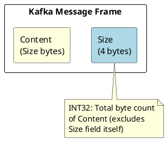
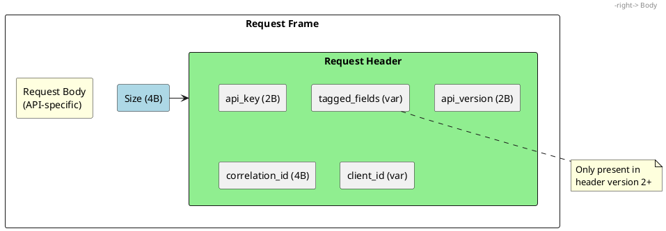
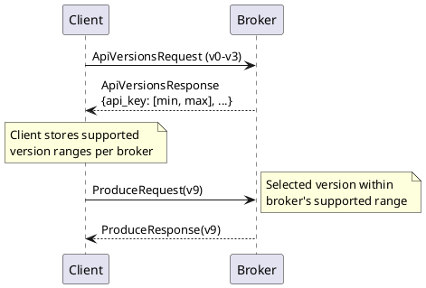
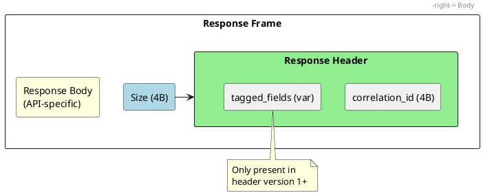
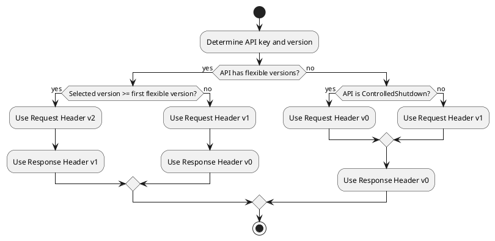
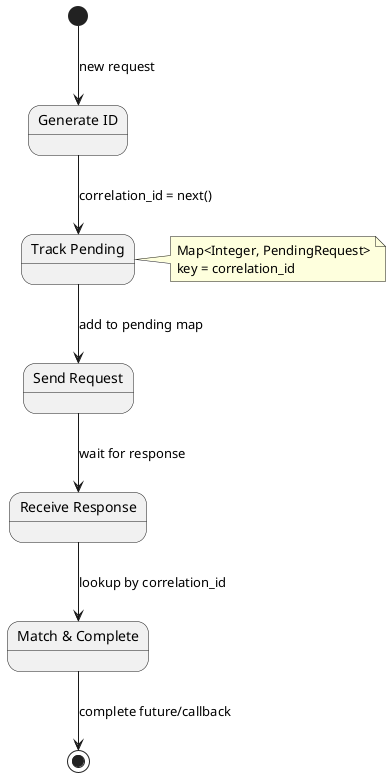
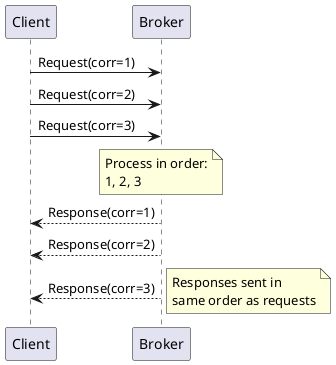
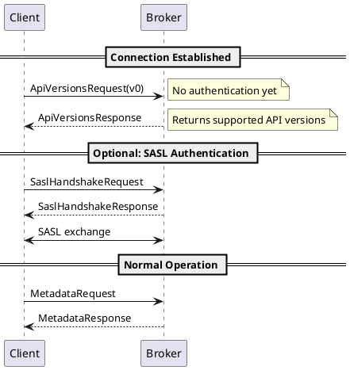

# Kafka Protocol Message Format

This document specifies the message framing, request/response structure, and header formats used in the Apache Kafka binary wire protocol. All communication between clients and brokers uses this message format over TCP connections.

---

## Message Framing

### Frame Structure

Every Kafka protocol message is length-prefixed:

```
Message => Size:INT32 Content:BYTES[Size]
```



| Field | Type | Description |
|-------|------|-------------|
| `Size` | INT32 | Byte length of Content (does not include the Size field itself) |
| `Content` | BYTES | Header + Body (request or response) |

### Size Constraints

| Constraint | Default | Configuration |
|------------|:-------:|---------------|
| Maximum request size | 100 MB | `socket.request.max.bytes` (broker) |
| Maximum response size | Request-bounded | `fetch.max.bytes` and `max.partition.fetch.bytes` (client), `message.max.bytes` (broker) |
| Minimum frame size | Header-only | 4 bytes (response header v0), 10 bytes (request header v1), 11 bytes (request header v2) |

!!! warning "Size Validation"
    Implementations must validate the Size field before allocating buffers. A Size value exceeding configured limits must result in connection termination.

---

## Request Structure

### Complete Request Format

```
Request => Size RequestHeader RequestBody

Size => INT32

RequestHeader => api_key api_version correlation_id client_id [tagged_fields]
  api_key => INT16
  api_version => INT16
  correlation_id => INT32
  client_id => NULLABLE_STRING
  tagged_fields => TaggedFields  (header v2+ only)

RequestBody => (API-specific fields)
```



### Request Header Versions

| Header Version | Kafka Version | Tagged Fields | Usage |
|:--------------:|---------------|:-------------:|-------|
| 0 | 0.8.x - 3.x | ❌ | ControlledShutdownRequest v0 only (removed in 4.0) |
| 1 | 0.9.0+ | ❌ | Most non-flexible APIs |
| 2 | 2.4.0+ | ✅ | Flexible API versions |

### Header Field Specifications

#### api_key (INT16)

Identifies the API being invoked.

| Requirement | Level |
|-------------|-------|
| Must be a valid API key recognized by the broker | must |
| Must correspond to an implemented API | must |

See [Protocol APIs](protocol-apis-core.md) for the complete API key reference.

#### api_version (INT16)

Specifies the version of the API schema to use.

| Requirement | Level |
|-------------|-------|
| Must be within broker's supported range for the API | must |
| Should be the highest mutually supported version | should |
| Must not be negative | must |

**Version Negotiation:**



#### correlation_id (INT32)

A client-generated identifier for matching responses to requests.

| Requirement | Level |
|-------------|-------|
| Must be unique among in-flight requests on the connection | must |
| Should increase monotonically | should |
| May wrap around after reaching INT32 maximum | may |

**Behavioral Contract:**

- The broker must echo the exact correlation_id in the response
- The client must use correlation_id to match responses to pending requests
- Duplicate correlation IDs among in-flight requests result in undefined behavior

#### client_id (NULLABLE_STRING)

An optional identifier for the client application.

| Requirement | Level |
|-------------|-------|
| Should identify the client application | should |
| May be null | may |
| Used for logging, metrics, and quota enforcement | - |

**Common Patterns:**

| Pattern | Example | Purpose |
|---------|---------|---------|
| Application name | `order-service` | Service identification |
| Instance ID | `order-service-pod-1` | Instance tracking |
| Consumer group | `order-processor-group` | Group correlation |

#### tagged_fields (TaggedFields)

Optional tagged fields for forward compatibility (header v2+ only).

Currently defined request header tags: None

---

## Response Structure

### Complete Response Format

```
Response => Size ResponseHeader ResponseBody

Size => INT32

ResponseHeader => correlation_id [tagged_fields]
  correlation_id => INT32
  tagged_fields => TaggedFields  (header v1+ only)

ResponseBody => (API-specific fields)
```



### Response Header Versions

| Header Version | Kafka Version | Tagged Fields | Usage |
|:--------------:|---------------|:-------------:|-------|
| 0 | 0.8.0+ | ❌ | Non-flexible APIs |
| 1 | 2.4.0+ | ✅ | Flexible API versions |

### Header Field Specifications

#### correlation_id (INT32)

Echo of the correlation_id from the request.

| Requirement | Level |
|-------------|-------|
| Must exactly match the request's correlation_id | must |
| Must not be modified by the broker | must |

#### tagged_fields (TaggedFields)

Optional tagged fields for forward compatibility (header v1+ only).

Currently defined response header tags: None

---

## Header Version Selection

The request header version is determined by the API and its version:



### Flexible Version Mapping

Each API defines which versions are "flexible" (use compact encodings and tagged fields):

| API | First Flexible Version | Current Max Version |
|-----|:----------------------:|:-------------------:|
| Produce | 9 | 13 |
| Fetch | 12 | 18 |
| ListOffsets | 6 | 11 |
| Metadata | 9 | 13 |
| OffsetCommit | 8 | 10 |
| OffsetFetch | 6 | 10 |
| FindCoordinator | 3 | 6 |
| JoinGroup | 6 | 9 |
| Heartbeat | 4 | 4 |
| LeaveGroup | 4 | 5 |
| SyncGroup | 4 | 5 |
| DescribeGroups | 5 | 6 |
| ListGroups | 3 | 5 |
| CreateTopics | 5 | 7 |
| DeleteTopics | 4 | 6 |
| ApiVersions | 3 | 4 |

---

## Correlation ID Management

### Client-Side Requirements



### ID Generation Strategies

| Strategy | Pros | Cons |
|----------|------|------|
| Monotonic counter | Simple, predictable | Requires synchronization |
| AtomicInteger | Thread-safe | Wraps at INT32_MAX |
| Per-connection counter | No global sync | Simpler debugging |

**Implementation Example:**

```java
// Thread-safe correlation ID generator
private final AtomicInteger correlationIdCounter = new AtomicInteger(0);

public int nextCorrelationId() {
    return correlationIdCounter.getAndIncrement();
}
```

### Timeout Handling

| Scenario | Client Action |
|----------|---------------|
| Response received | Remove from pending, complete request |
| Timeout exceeded | Remove from pending, fail request |
| Connection closed | Fail all pending requests |
| Duplicate correlation_id received | Log warning, ignore duplicate |

---

## Request Processing Order

### Broker Guarantees

| Guarantee | Level |
|-----------|-------|
| Requests from a single connection must be processed in order | must |
| Responses must be sent in request order | must |
| Responses may not be reordered | must not |



### Pipelining

Clients may send multiple requests without waiting for responses (pipelining):

| Configuration | Description |
|---------------|-------------|
| `max.in.flight.requests.per.connection` | Maximum concurrent requests |
| Default value | 5 |
| Ordering guarantee with idempotence | Preserved (Kafka 0.11+) |

!!! warning "Ordering Without Idempotence"
    Without idempotent producers (`enable.idempotence=false`), retry of a failed request may cause message reordering if `max.in.flight.requests.per.connection > 1`.

---

## Special Cases

### ApiVersions Request

The ApiVersions API has special handling for bootstrap:

| Behavior | Description |
|----------|-------------|
| Pre-authentication | Broker must respond before SASL authentication |
| Version tolerance | Broker should accept any version (0-4) |
| Header version | Uses request header v1 (or v2 for v3+) |



### acks=0 Produce Requests

Produce requests with `acks=0` have special response handling:

| Behavior | Description |
|----------|-------------|
| No response sent | Broker must not send a response |
| No correlation tracking | Client must not wait for response |
| Fire-and-forget | Delivery not confirmed |

!!! warning "acks=0 Semantics"
    With `acks=0`, the client must not allocate a pending request entry or wait for a response. Message delivery is not guaranteed and cannot be verified.

---

## Wire Format Examples

### Minimal Request (Metadata v0)

```
Request: Metadata, version 0, correlation_id=1, client_id="test"

Hex dump:
00 00 00 12        // Size: 18 bytes
00 03              // api_key: 3 (Metadata)
00 00              // api_version: 0
00 00 00 01        // correlation_id: 1
00 04              // client_id length: 4
74 65 73 74        // client_id: "test"
FF FF FF FF        // topics: null (all topics)
```

### Minimal Response (Metadata v0)

```
Response: Metadata v0, correlation_id=1

Hex dump:
00 00 00 0C        // Size: 12 bytes
00 00 00 01        // correlation_id: 1
00 00 00 00        // brokers: empty array
00 00 00 00        // topics: empty array
```

### Flexible Request (Produce v9)

```
Request: Produce, version 9, correlation_id=42

Hex dump:
00 00 00 XX        // Size
00 00              // api_key: 0 (Produce)
00 09              // api_version: 9
00 00 00 2A        // correlation_id: 42
00 05              // client_id length: 5
70 72 6F 64 31     // client_id: "prod1"
00                 // tagged_fields: none (header v2)
...                // request body (flexible encoding)
```

---

## Error Handling

### Malformed Request Detection

| Error Condition | Broker Response |
|-----------------|-----------------|
| Size exceeds maximum | Close connection (no response) |
| Unknown API key | Close connection (invalid request) |
| Unsupported API version | UNSUPPORTED_VERSION error |
| Truncated message | Close connection |
| Invalid encoding | Close connection |

### Connection Termination

Brokers must close connections without response for:

- Size field exceeds `socket.request.max.bytes`
- Incomplete frame (connection closed mid-message)
- Malformed header preventing response construction

---

## Implementation Requirements

### Client Requirements

| Requirement | Level |
|-------------|-------|
| Generate unique correlation IDs per connection | must |
| Track pending requests with timeout | must |
| Handle out-of-order response (should not occur) | should |
| Support pipelining | should |
| Respect max.in.flight configuration | must |

### Broker Requirements

| Requirement | Level |
|-------------|-------|
| Validate Size field before allocation | must |
| Process requests in order | must |
| Send responses in request order | must |
| Echo correlation_id exactly | must |
| Support ApiVersions pre-authentication | must |

---

## Related Documentation

- [Protocol Primitives](protocol-primitives.md) - Data type encodings
- [Protocol Records](protocol-records.md) - Record batch format
- [Protocol APIs](protocol-apis-core.md) - API reference
- [Protocol Errors](protocol-errors.md) - Error codes
- [Authentication](authentication.md) - SASL authentication flow
